## 1.数组的拓展

### 1.1冒泡排序

时间复杂度：o(n$^2$)

<!--more-->

```java
import java.util.Arrays;

public class Demo{
	public static void main(String[] args){
		int[] a = {1,34,5673,3,456,124,4562,23};
		int[] sort = sorted(a);
		System.out.println(Arrays.toString(sort));
	}
	// 冒泡排序
	// 核心思路：1.比较相邻的两个元素，如果左边大于右边就交换顺序
	// 2.每一次比较都会产生一个最大或最小的数
	// 3.下一轮可以减少一次排序
	public static int[] sorted(int[] a){
		for (int i = 0;i < a.length-1;i++){
			for (int j = 0;j < a.length-1-i;j++){
				if (a[j+1] < a[j]){
					int temp = a[j];
					a[j] = a[j+1];
					a[j+1] = temp;
				}
			}
		}
		return a;
	}
}
```

### 1.2稀疏数组

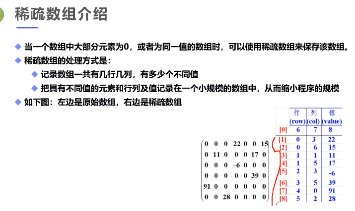

```java
public class Demo{
	public static void main(String[] args){
		int[][] array1 = new int[11][11];
		array1[1][2] = 1;
		array1[2][3] = 2;
		System.out.println("输出原始数组：");
		for (int[] x:array1){
			for (int y:x){
				System.out.print(y + "\t");
			}
			System.out.println();
		}

		// 转换为稀疏数组保存
		int sum = 0;
		for (int i = 0;i < 11;i ++){
			for (int j = 0;j < 11;j ++){
				if (array1[i][j] != 0){
					sum ++;
				}
			}
		}
		System.out.println("有效数字的个数是："+sum);
		
		int[][] array2 = new int[sum+1][3];
		array2[0][0] = 11;
		array2[0][1] = 11;
		array2[0][2] = sum;
		
		int count = 1;
		// 对于多维数组a，a.length返回a的第一维长度
		for (int i = 0;i < array1.length;i ++){
			for (int j = 0;j < array1[i].length;j ++){
				if (array1[i][j] != 0){
					array2[count][0] = i;
					array2[count][1] = j;
					array2[count][2] = array1[i][j];
					count ++;
				}
			}
		}
		// 输出稀疏数组
		for (int[] x:array2){// 注意"\t"不要写成单引号，否则会相加
			System.out.println(x[0]+"\t"+x[1]+"\t"+x[2]);
		}
		// 读取稀疏数组
		int[][] array3 = new int[array2[0][0]][array2[0][1]];
		for (int i = 1;i < array2.length;i++){
			array3[array2[i][0]][array2[i][1]] = array2[i][2];
		}
		for (int[] x:array3){
			for (int y:x){
				System.out.print(y+" ");
			}
			System.out.println();
		}
	}
	
}
```

## 2.面向对象编程（OOP）

**Java的核心思想就是OOP。**

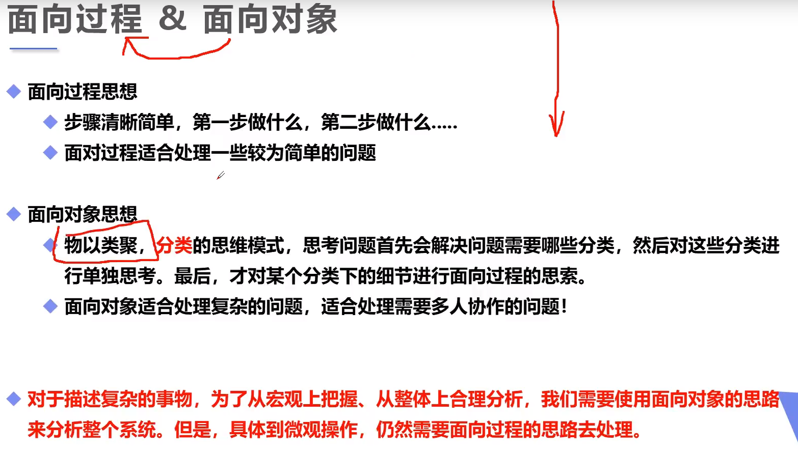

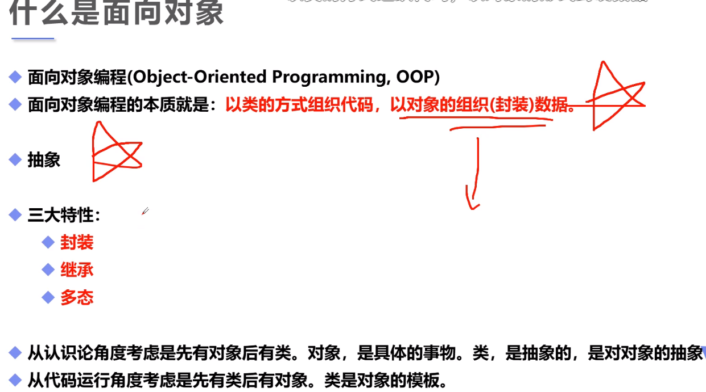

## 3.静态方法与非静态方法

静态方法（类方法）的特点：只能使用参数和静态变量（包括自己类的和别的类的允许访问的），没有this自引用，但是可以通过new的对象或传入的参数对象来引用。

Demo1：new一个对象来调用非静态方法（随对象创建进行加载）。

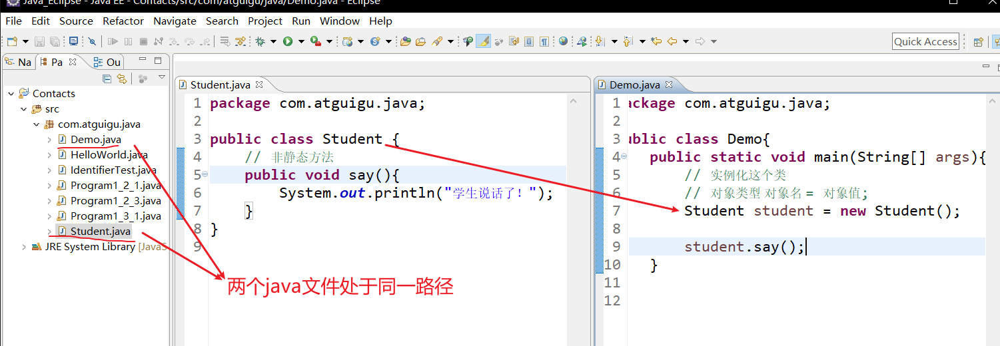

Demo2：用类名来调用静态方法（随类进行加载）。

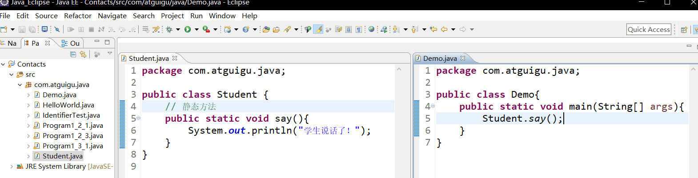

```java
public class Demo3{
	public static void main(String[] args){}		
	// 两个非静态方法之间可以直接调用
	public void a(){
		b();
	}
	public void b(){
		
	}
}
```

```java
public class Demo4{
	public static void main(String[] args){}
	// 静态方法a不能直接调用非静态方法b
    // 因为静态方法a随class一起加载，而非静态方法b在对象创建(类实例化)时才存在
	public static void a(){
		b();// 非法的调用
	}
	public void b(){
		
	}
}
```

```java
public class Demo5{
	public static void main(String[] args){}
	// 非静态方法a可以直接调用静态方法b
    // 因为静态方法a随class一起加载，而非静态方法b在对象创建(类实例化)时才存在
	public void a(){
		b();// 合法的调用
	}
	public static void b(){		
	}
}
```

总结：非静态方法可以调用非静态方法以及静态方法；静态方法不能调用非静态方法。

## 4.java中的方法都是值传递

```java
public class Demo1{
    // 值传递
	public static void main(String[] args){
		int a = 1;
		Demo.change(a);
		System.out.println(a);// a的值还是1
	}
	
	public static void change(int a){
		a = 10;
	}
}
```

```java
public class Demo2{
	// 引用传递：对象，本质还是值传递
	public static void main(String[] args){
		Person person = new Person();
		System.out.println(person.name);// null
		Demo.change(person);
		System.out.println(person.name);
	}
	public static void change(Person person){
        //person是一个对象
        // 指向--> Person person = new Person();它是一个具体的人，可以改变属性
		person.name = "java";
	}
}
// 定义Person类，有一个属性：name
class Person{
	String name;
}
```

## 5.类与对象的创建

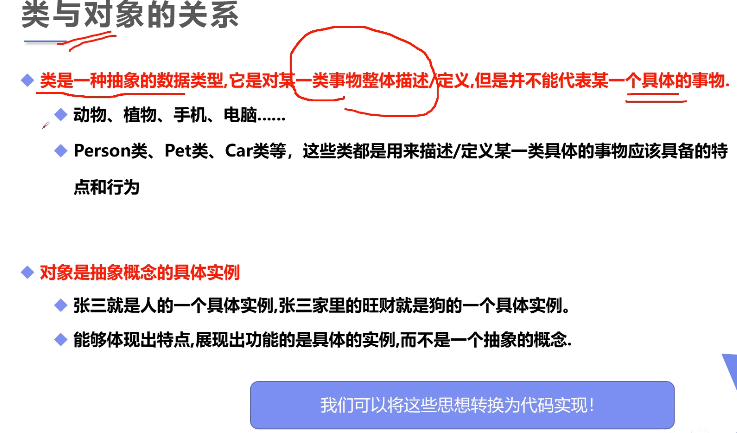

养成习惯，专门在一个主程序中写main方法，用于测试。在别的类中不要加上main方法。

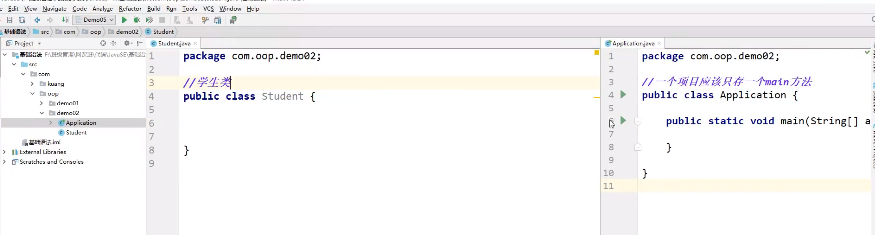

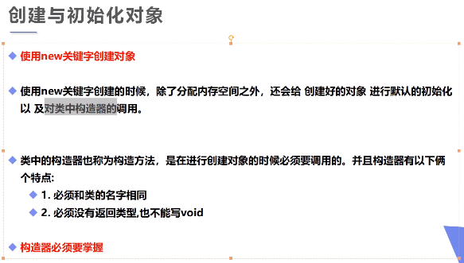

```java
// Student.java
public class Student {
	// 属性：字段
	String name;
	int age;
	
	// 方法
	public void study(){
		System.out.println(this.name+"在学习");
	}
}
// Demo.java
public class Demo{
	public static void main(String[] args){
		// 类实例化后会返回一个自己的对象！
		// 类是抽象的，对象是类的具体实例
		Student xiaoming = new Student();
		Student xiaohong = new Student();
		
		xiaoming.name = "小明";
		xiaoming.age = 18;
		System.out.println(xiaoming.name);
		System.out.println(xiaoming.age);
		xiaoming.study();
	}
}
/*小明
18
小明在学习*/
```

## 6.类的构造器（构造方法）

类中的构造方法是在进行创建对象时必须调用的。它只能在创建对象时被间接调用。

它有以下两个特点：

- 必须和类的名字相同
- 必须没有返回类型，也不能写void

如果类中什么都不写，它会存在默认构造方法。

1.使用new关键字本质上是在调用构造器

2.用来初始化值

```java
public class Person {
	String name;
	
	// 构造器实例化初始值
	public Person(){
		this.name = "wang";
	}  
```

```java
public class Person {
	String name;
	int age;
	// 构造器实例化初始值
	public Person(){
	}
	// 有参构造
	//一旦定义有参构造，无参构造必须显式定义，否则报错
	public Person(String name,int age){
		this.name = name;
        this.age = age;
	}
}
// Person person = new Person("wang",23);
// 根据方法重载进行有参构造
```

```java
public class Person {
    String name;
    int age;
    // 构造器实例化初始值
    public Person(String name){
        this.name = name;
    }
    // 构造器的重载与相互调用
    //在构造器里调用重载的构造器时，必须是方法的第一行
    public Person(String name,int age){
        this(name);
        this.age = age;
    }
}
public class Application {
    public static void main(String[] args) {
        Person person = new Person("xiaoming",18);
        System.out.println(person.name);
    }
}
```

## 7.创建对象内存分析

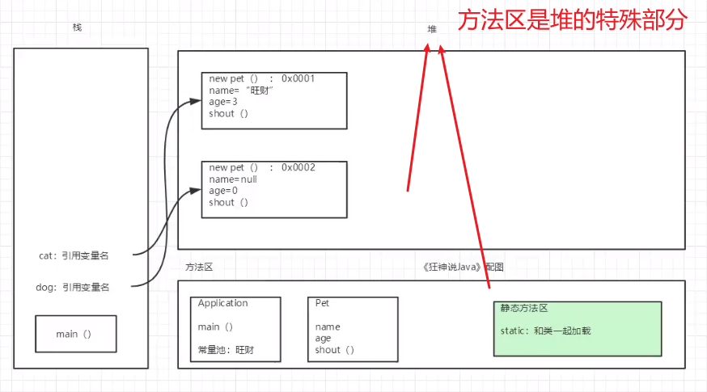

## 8.小结类与对象

**对象的引用**

引用类型：除8种基本类型之外的都是引用类型。

对象是通过引用来操作的（如上图）：栈 ---> 堆（地址）。

**属性**

也即字段Field，成员变量

会进行默认初始化（缺省值）：

- 数字：0  0.0
- char：`\u0000`
- boolean：false
- 引用类型：null

**类**

1.属性：静态的属性

2.方法：动态的行为

## 9.OOP三大特性之封装

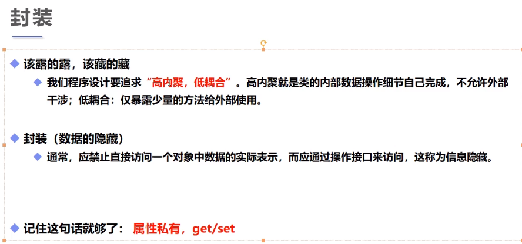

1.提高程序的安全性，保护数据

2.隐藏代码的实现细节

3.统一接口get/set

4.系统可维护性增加

```java
public class Student {
	// private:属性私有
	private String name;
	private int id;
	private char gender;
	private int age;
	// 提供一些可以操作这些属性的方法
	// 提供一些public的get、set方法，自己实现
	// get获得这个数据
	public String getName(){
		return this.name;
	}
	public int getAge(){
		return this.age;
	}
	// set给数据设置值
	public void setName(String name){
		this.name = name;
	}
	public void setAge(int age){
		// 合法性验证
		if (age >= 130 || age <= 0){
			this.age = 3;
		}else{
			this.age = age;
		}
	}
}
```

```java
public class Demo{
	public static void main(String[] args){
		Student s1 = new Student();
		s1.setName("student1");
		System.out.println(s1.getName());
		s1.setAge(999);// 不合法的
		System.out.println(s1.getAge());
		s1.setAge(75);
		System.out.println(s1.getAge());
	}
}
/*student1
3
75*/
```

## 10.OOP三大特性之继承

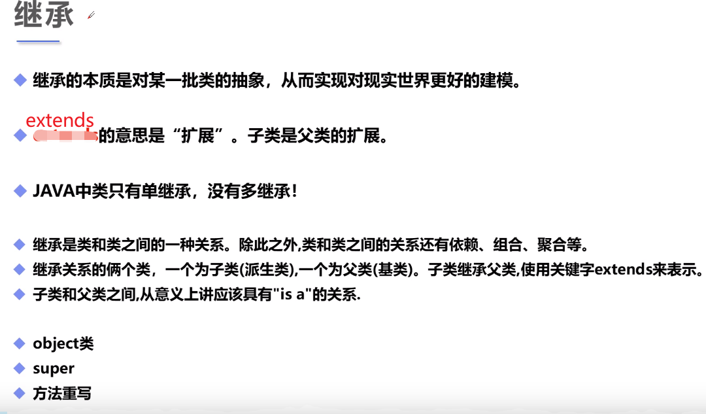

- 在Java中，所有的类都默认直接或者间接继承Object类
- Java中类只有单继承，没有多继承！一个儿子只能有一个爸爸，而一个爸爸可以有多个儿子
- 私有的东西无法被继承
- 子类拥有父类对象所有的属性和方法（包括私有属性和私有方法），但是父类中的私有属性和方法子类是无法访问，**只是拥有**
- 被final修饰的class不能被继承
- 子类可以通过this访问公共继承自父类的属性，相当于子类对象里藏着一个父类对象
- 就好像子类的引用可以一物二用，既可以当作父类的引用使用，又可以当作子类的引用
  使用

```java
// 父类
public class Person {
	// 如果是private就不能继承到子类
	// 使用public子类就能继承父类的属性，方法
	private int money = 10_000;
	public void say(){
		System.out.println("hello");
	}
	public int getMoney(){
		return this.money;
	}
	public void setMoney(int money){
		this.money = money;
	}
}

// Student继承Person，派生类，子类
public class Student extends Person {
	
}
//Teacher继承Person，派生类，子类
public class Teacher extends Person{
	
}

public class Demo{
	public static void main(String[] args){
		Student student = new Student();
		student.say();
		System.out.println(student.getMoney());
	}
}
/*hello
10000*/
```

**super演示（重要）**

```java
// 父类
public class Person {
	protected String name = "kuangshen";
    public void print(){
		System.out.println("Person");
	}
}

// Student继承Person，派生类，子类
public class Student extends Person {
	private String name = "qingjiang";
	public void test(String name){
		System.out.println(name);
		System.out.println(this.name);
		System.out.println(super.name);//kuangshen
	}
    public void print(){
		System.out.println("Student");
	}
	public void test1(){
		print();// Student
		this.print();// Student
		super.print();// Person
	}
}

public class Demo{
	public static void main(String[] args){
		Student student = new Student();
		student.test("请将");
        student.test1();
	}
}
/*请将
qingjiang
kuangshen*/
```

子类与父类的构造器

```java
// 父类
public class Person {
	protected String name = "kuangshen";
	public Person(){
		System.out.println("Person无参执行了");
	}
}
//Teacher继承Person，派生类，子类
public class Teacher extends Person{
	public Teacher(){
        // 隐藏代码：调用了父类的无参构造
        super();// 默认的，调用父类的构造器必须在子类的第一行
		System.out.println("Teacher无参执行了");
	}
}
public class Demo{
	public static void main(String[] args){
		Teacher teacher = new Teacher();
	}
}
/*Person无参执行了
Teacher无参执行了*/
```

super的注意点

- 子类对象里可以认为有一个特殊的父类的对象，这个父类对象和子类对象之
  间通过super 关键字来沟通，super是沟通的桥梁

- super();调用父类的构造器，**必须在当前类（子类）的第一行**
- super必须只能出现在子类的方法或者构造器中
- super和this不能同时调用构造方法（因为都必须放第一行）
- super并不是父类的引用，和this自引用不一样，如果一样那不就成组合了嘛

super与this的不同点

- 代表的对象不同
- this没继承也能使用，super只能在继承时使用
- this();调用本类的构造，super();调用父类的构造
- this可以作为返回值，但super不可以

