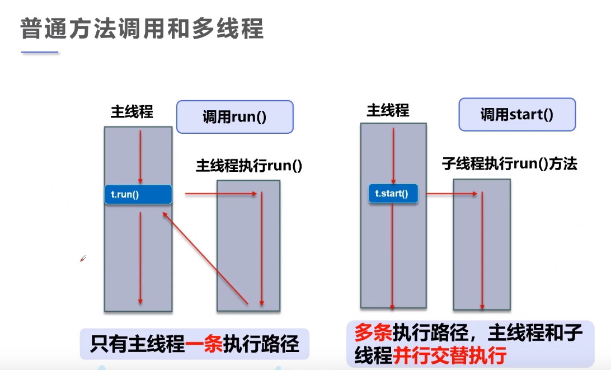
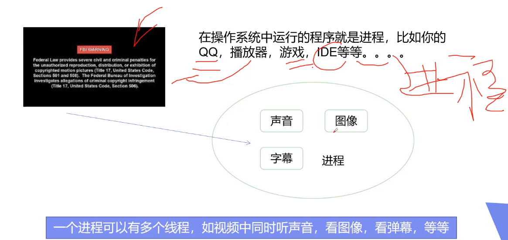
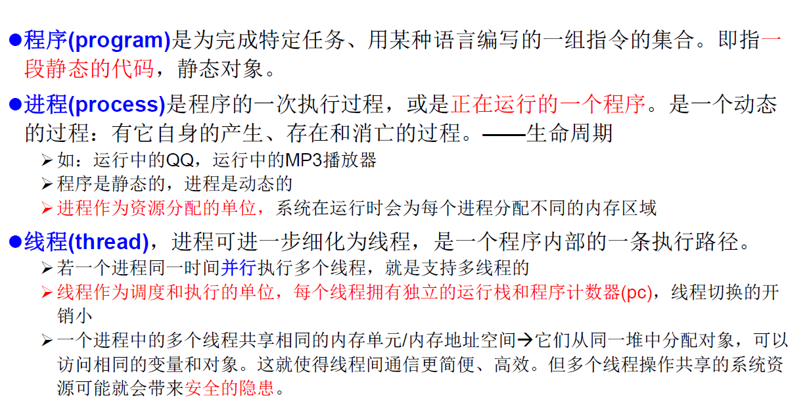

## 1.线程简介

参考视频：狂神多线程详解

学习建议：先学完IO流再来学习多线程。

<!--more-->

线程（thread）



进程（process）



程序、进程和线程的区别：



通常在一个进程中可以包含若干个线程，一个进程至少有一个线程。线程数CPU调度和执行的单位。


核心概念：


## 2.创建线程

有三种创建线程的方式：

1. Thread class：继承Thread类**（重点）**
2. Runnable接口：实现Runnable接口**（重点）**
3. Callable接口：实现Callable接口（了解）

## 3.Thread

1.自定义线程类继承Thread类

2.重写run()方法，编写线程执行体

3.创建线程对象，调用start()方法启动线程

```Java
public class Thread_1 extends Thread{
    // 创建线程方式1：继承Thread类，重写run方法，调用start启动线程
    // 总结：线程开启不一定立即执行，由CPU调度执行
    @Override
    public void run() {
        // run方法线程体
        for (int i = 0; i < 200; i++) {
            System.out.println("我在看源码..."+i);
        }
    }

    public static void main(String[] args) {
        // main线程，主线程

        // 创建一个线程对象
        Thread_1 th1 = new Thread_1();
        // 调用start方法，开启线程
        // 看源码和学多线程是并发运行的
        th1.run();

        for (int i = 0; i < 1000; i++) {
            System.out.println("我在学习多线程..."+i);
        }
    }
}
```

