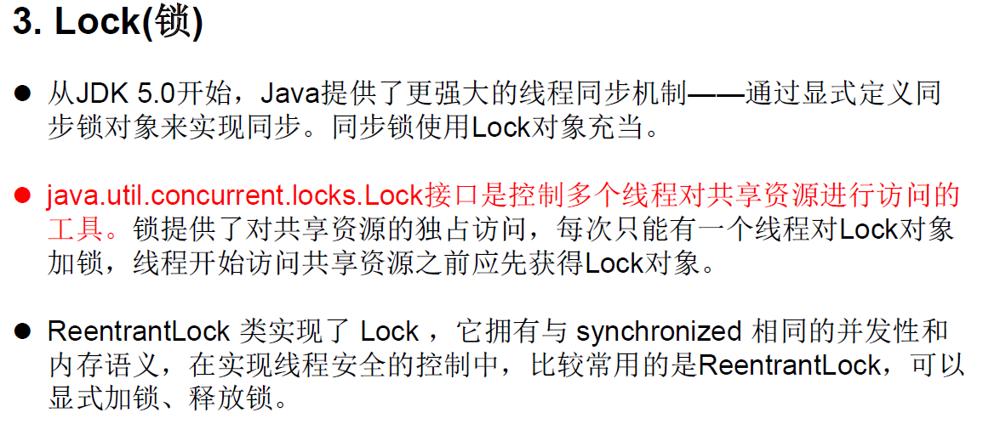

## 1.多线程安全的单例模式

<!--more-->

```Java
class Bank{
    private Bank(){
    }
    // 单例模式之懒汉式
    private static Bank instance = null;
    public static synchronized Bank getInstance(){// 加上synchronized就线程安全
        if (instance == null){// 保证instance只会new一次
            instance = new Bank();
        }
        /*这样也可以，效率稍差
        synchronized (Bank.class){
            if (instance == null){// 保证instance只会new一次
                instance = new Bank();
            }
            return instance;
        }
        效率高些的方式
        if (instance == null){多判断一次，其余的线程不需要再等待可以直接返回
            if (instance == null){// 保证instance只会new一次
                instance = new Bank();
            }
        }
        return instance;
         */
        return instance;
    }
}
```

## 2.线程的死锁问题

不同的线程分别占用**对方需要的同步资源**不放弃，都在等待对方放弃 自己需要的同步资源，就形成了线程的死锁

出现死锁后，不会出现异常，不会出现提示，只是所有的线程都处于 阻塞状态，无法继续

```Java
class ThreadTest {
    public static void main(String[] args) {

        //MThread mTherad = new MThread();
        //Thread th1 = new Thread(mTherad);
        //Thread th2 = new Thread(mTherad);
        //th1.setName("窗口1");
        //th2.setName("窗口2");
        //th1.start();
        //th2.start();

        StringBuffer s1 = new StringBuffer();
        StringBuffer s2 = new StringBuffer();

        new Thread(){// 匿名类创建多线程方式1
            @Override
            public void run() {
                synchronized (s1){// 同步代码块
                    s1.append("a");
                    s2.append("1");
                    // sleep增加死锁概率
                    synchronized (s2){
                        s1.append("b");
                        s2.append("2");

                        System.out.println(s1);
                        System.out.println(s2);
                    }
                }
            }
        }.start();

        new Thread(new Runnable() {// 匿名类创建多线程方式2
            @Override
            public void run() {
                synchronized (s2){
                    s1.append("c");
                    s2.append("3");
                    synchronized (s1){
                        s1.append("d");
                        s2.append("4");

                        System.out.println(s1);
                        System.out.println(s2);
                    }
                }
            }
        }).start();
    }
}// 输出
/*ab
12
abcd
1234*/
```

加个sleep，让死锁的概率高一点

第一个线程等待拿s2，第二个线程等待拿s1，出现死锁

我们使用同步时要避免死锁

## 3.方式三：Lock锁 — JDK5.0新增



```java
class HThread implements Runnable{

    private int ticket = 100;
    // 1.实例化ReentrantLock
    private ReentrantLock lock = new ReentrantLock();
    @Override
    public void run() {
        while (true) {
            try{
                // 2.调用lock()上锁
                lock.lock();
                if (ticket > 0) {
                    try {
                        Thread.sleep(100);
                    } catch (InterruptedException e) {
                        e.printStackTrace();
                    }
                    System.out.println(Thread.currentThread().getName() + ":" + ticket);
                    ticket--;
                }else{
                    break;
                }
            }finally{
                // 3.调用unlock()解锁
                lock.unlock();
            }
        }
    }
}


class Thread_2 {
    public static void main(String[] args) {

        HThread mTherad = new HThread();
        Thread th1 = new Thread(mTherad);
        Thread th2 = new Thread(mTherad);
        th1.setName("窗口1");
        th2.setName("窗口2");
        th1.start();
        th2.start();
    }
}
```

synchronized 与 Lock的异同？

相同：二者都可以解决线程安全问题

不同：synchronized机制在执行完相应的同步代码以后，自动的释放同步监视器

Lock需要手动的启动同步（lock()，同时结束同步也需要手动的实现（unlock()）

建议使用顺序：

Lock —> 同步代码块（已经进入了方法体，分配了相应资源 ) —> 同步方法（在方法体之外)

## 4.线程的通信

线程通信涉及到的三个方法
wait():一旦执行此方法，当前线程就进入阻塞状态，并释放同步监视器。
notify():一旦执行此方法，就会唤醒被wait的一个线程。如果有多个线程被wait，就唤醒优先级高的那个。
notifyAll():一旦执行此方法，就会唤醒所有被wait的线程。

说明
wait()，notify()，notifyAll()三个方法必须使用在同步代码块或同步方法中。
wait()，notify()，notifyAll()三个方法的调用者必须是同步代码块或同步方法中的**同步监视器**。否则，会出现IllegalMonitorStateException异常。
wait()，notify()，notifyAll()三个方法是定义在java.lang.Object类中。

使用两个线程打印 1-100 。线程 1, 线程 2 交替打印。

```Java
class Number implements Runnable{
    private int number = 1;
    @Override
    public void run() {
        while (true) {
            synchronized (this) {
                notify();// 唤醒等待的线程

                if (number <= 100) {
                    try {
                        Thread.sleep(100);
                    } catch (InterruptedException e) {
                        e.printStackTrace();
                    }
                    System.out.println(Thread.currentThread().getName() + ":" + number);
                    number++;

                    try {
                        // 使得调用如下wait()方法的线程进入阻塞状态
                        wait();
                    } catch (InterruptedException e) {
                        e.printStackTrace();
                    }
                } else {
                    break;
                }
            }
        }
    }
}

public class CommunicationTest {
    public static void main(String[] args) {
        Number num = new Number();
        Thread th1 = new Thread(num);
        Thread th2 = new Thread(num);

        th1.setName("线程1");
        th2.setName("线程2");
        th1.start();
        th2.start();
    }
}
```

**面试题**

sleep() 和 wait()的异同？

相同点：一旦执行方法，都可以使得当前的线程进入阻塞状态。
不同点：
两个方法声明的位置不同：Thread类中声明sleep() , Object类中声明wait()
调用的要求不同：sleep()可以在任何需要的场景下调用。 wait()必须使用在同步代码块或同步方法中
关于是否释放同步监视器：如果两个方法都使用在同步代码块或同步方法中，sleep()不会释放锁，wait()会释放锁。

## 5.实现Callable 接口创建多线程（了解）


```Java
/**
 * 如何理解实现Callable接口的方式创建多线程比实现Runnable接口创建多线程方式强大？
 * 1. call()可以有返回值的。
 * 2. call()可以抛出异常，被外面的操作捕获，获取异常的信息
 * 3. Callable是支持泛型的
 */
//1.创建一个实现Callable的实现类
class NumThread implements Callable{
    //2.实现call方法，将此线程需要执行的操作声明在call()中
    @Override
    public Object call() throws Exception {
        int sum = 0;
        for (int i = 1; i <= 100; i++) {
            if(i % 2 == 0){
                System.out.println(i);
                sum += i;
            }
        }
        return sum;
    }
}
public class ThreadNew {
    public static void main(String[] args) {
        //3.创建Callable接口实现类的对象
        NumThread numThread = new NumThread();
        //4.将此Callable接口实现类的对象作为传递到FutureTask构造器中，创建FutureTask的对象
        FutureTask futureTask = new FutureTask(numThread);
        //5.将FutureTask的对象作为参数传递到Thread类的构造器中，创建Thread对象，并调用start()
        new Thread(futureTask).start();

        try {
            //6.获取Callable中call方法的返回值
            //get()返回值即为FutureTask构造器参数Callable实现类重写的call()的返回值。
            Object sum = futureTask.get();
            System.out.println("总和为：" + sum);
        } catch (InterruptedException e) {
            e.printStackTrace();
        } catch (ExecutionException e) {
            e.printStackTrace();
        }
    }
}
```

## 6.使用线程池创建多线程


```Java
class NumberThread implements Runnable{
    @Override
    public void run() {
        for (int i = 0; i < 100; i++) {
            if (i % 2 == 0){
                System.out.println(i);
            }
        }
    }
}

public class ThreadPool {
    public static void main(String[] args) {
        // 提供指定线程数量的线程池
        ExecutorService service = Executors.newFixedThreadPool(10);
        service.execute(new NumberThread());// 适合Runnable
        //service.submit();// 适合Callable
        service.shutdown();// 关闭线程池
    }
}
```

