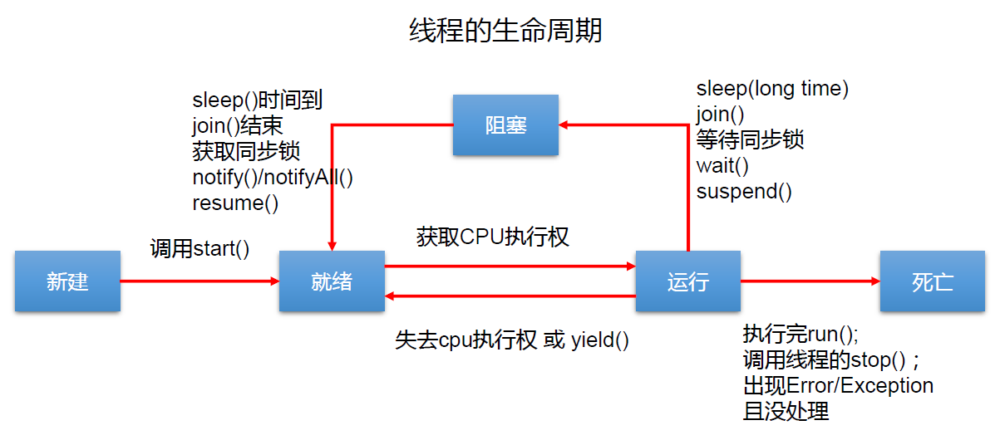

## 1.线程的调度 


默认优先级为5。

获取和设置当前线程优先级。

获取：`Thread.currentThread().getPriority()`，和getName类似。

设置：`h1.setPriority(Thread.MAX_PRIORITY)`，和setName类似。

## 2.实现Runnable接口创建线程

 1. 创建一个实现了Runnable接口的类
 2. 实现类去实现Runnable中的抽象方法：run()
 3. 创建实现类的对象
 4. 将此对象作为参数传递到Thread类的构造器中，创建Thread类的对象
 5. 通过Thread类的对象调用start()

  ```Java
  class MThread implements Runnable{
	private int num;
    @Override
    public void run() {
        for (int i = 0; i < 1000; i++) {
            System.out.println(Thread.currentThread().getName()+":"+i);
        }
    }
}

class ThreadTest {
    public static void main(String[] args) {
        MThread mTherad = new MThread();
        Thread thread = new Thread(mTherad);
        Thread th = new Thread(mTherad);// 两个线程共享一个MThread对象，数据num也是共享的
        // 通过继承Thread的方式创建多线程，各线程对应不同对象，数据不共享，需要加static修饰
        thread.start();
        th.start();
    }
}
  ```

  两种方式的对比

开发中：优先选择：实现Runnable接口的方式

原因：1. 实现的方式没类的单继承性的局限性

2. 实现的方式更适合来处理多个线程共享数据的情况。

 联系：public class Thread implements Runnable
 相同点：两种方式都需要重写run(),将线程要执行的逻辑声明在run()中。
          目前两种方式，要想启动线程，都是调用的Thread类中的start()。

Java中线程分为2类：守护线程和用户线程。

用户线程结束，守护线程也随之结束。

## 3.线程的生命周期

线程的生命周期一般要经历五种状态。

新建： 当一个Thread类或其子类的对象被声明并创建时，新生的线程对象处于新建 状态

就绪：处于新建状态的线程被start()后，将进入线程队列等待CPU时间片，此时它已 具备了运行的条件，只是没分配到CPU资源

运行：当就绪的线程被调度并获得CPU资源时,便进入运行状态， run()方法定义了线 程的操作和功能

阻塞：在某种特殊情况下，被人为挂起或执行输入输出操作时，让出 CPU 并临时中 止自己的执行，进入阻塞状态

死亡：线程完成了它的全部工作或线程被提前强制性地中止或出现异常导致结束



## 4.线程的同步

问题的提出？

多个线程执行的不确定性引起执行结果的不稳定；

多个线程对账本的共享，会造成操作的不完整性，会破坏数据。

所以需要通过线程的同步来解决多线程的安全问题。

问题的原因：当多条语句在操作同一个线程**共享数据**时，一个线程对多条语句只执行了一部分，还没有 执行完，另一个线程参与进来执行。**导致共享数据的错误**。

解决办法：对多条操作共享数据的语句，只能让一个线程都执行完，在执行过程中，其他线程不可以参与执行。即使这个线程出现了阻塞，也不能让其他线程参与执行。

**Java解决方案：同步机制**
Java对于多线程的安全问题提供了专业的解决方式：同步机制

方式一：同步代码块

```Java
synchronized (对象){
    // 需要被同步的代码；
}
```

说明：

1. 操作共享数据的代码，即为需要被同步的代码。 –>不能包含代码多了，也不能包含代码少了。
2. 共享数据：多个线程共同操作的变量。比如：ticket就是共享数据。
3. **同步监视器**，俗称：**锁**。任何一个类的对象，都可以充当锁。要求：多个线程必须要共用同一把锁。
4. 操作同步代码时，只能有一个线程参与，其他线程等待。相当于一个单线程，效率低但安全。

```java
// 实现Runnable接口的同步代码块
class MThread implements Runnable{

    private int ticket = 100;
    Object obj = new Object();// 也可以换别的对象
    @Override
    public void run() {
        // Object obj = new Object();不能放在这里
        while (true) {
            synchronized (obj) {// 包在里面的代码是线程安全的
                //  改成synchronized (this) {也行，this指代唯一的MThread对象
                if (ticket > 0) {
                    try {
                        Thread.sleep(100);
                    } catch (InterruptedException e) {
                        e.printStackTrace();
                    }
                    System.out.println(Thread.currentThread().getName() + ":" + ticket);
                    ticket--;
                } else {
                    break;
                }
            }
        }
    }
}
class ThreadTest {
    public static void main(String[] args) {

        MThread mTherad = new MThread();
        Thread th1 = new Thread(mTherad);
        Thread th2 = new Thread(mTherad);
        th1.setName("窗口1");
        th2.setName("窗口2");
        th1.start();
        th2.start();
    }
}
// 继承Thread类的同步代码块
// 注意static Object obj = new Object();要改成静态的，保证不同线程对应的对象共用一把锁
// 也可以写成synchronized (helloThread.class) {
// helloThread是Thread的子类，加上.class是Class的对象（只会加载1次），后面到反射就能理解
```

补充：

在实现Runnable接口创建多线程的方式中，我们可以考虑使用this充当同步监视器（锁）。

在继承Thread类创建多线程的方式中，慎用this充当同步监视器，考虑使用当前类充当同步监视器。

方式二：同步方法

如果操作共享数据的代码完整的声明在一个方法中，我们不妨将此方法声明同步的。

```Java
public synchronized void show (String name){
    ….
}
```

关于同步方法的总结

同步方法仍然涉及到同步监视器，只是不需要我们显式的声明。

非静态的同步方法，同步监视器是：this（当前类的对象）

静态的同步方法，同步监视器是：当前类本身

```Java
// 实现Runnable接口的同步方法
class MThread implements Runnable{

    private static int ticket = 100;
    @Override
    public void run() {
        while (true) {
            show();
            if (ticket <= 0){
                break;
            }
        }
    }

    private static synchronized void show(){// 同步方法实现线程同步
        if (ticket > 0) {
            try {
                Thread.sleep(100);
            } catch (InterruptedException e) {
                e.printStackTrace();
            }
            System.out.println(Thread.currentThread().getName() + ":" + ticket);
            ticket--;
        }
    }
}


class ThreadTest {
    public static void main(String[] args) {

        MThread mTherad = new MThread();
        Thread th1 = new Thread(mTherad);
        Thread th2 = new Thread(mTherad);
        th1.setName("窗口1");
        th2.setName("窗口2");
        th1.start();
        th2.start();
    }
}
// 继承Thread类的同步方法
// 注意private static synchronized void show()要改成静态的，保证不同线程对应同一个同步方法
```

