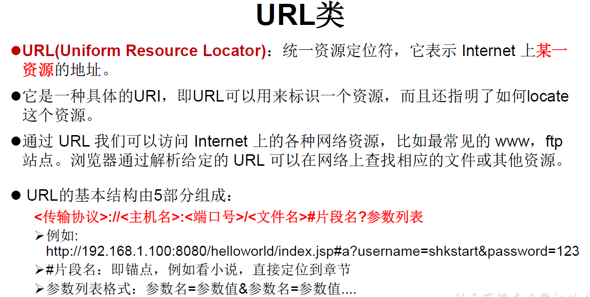

## 1.UDP网络编程

<!--more-->

类 DatagramSocket 和 DatagramPacket 实现了基于 UDP 协议网络程序。

UDP数据报通过数据报套接字 DatagramSocket 发送和接收，系统不保证 UDP数据报一定能够安全送到目的地，也不能确定什么时候可以抵达。

DatagramPacket 对象封装了UDP数据报，在数据报中包含了发送端的IP 地址和端口号以及接收端的IP地址和端口号。

UDP协议中每个数据报都给出了完整的地址信息，因此无须建立发送方和接收方的连接。如同发快递包裹一样。

```Java
// UDP网络编程示例
// 发送端
@Test
public void sender() throws IOException {
    DatagramSocket socket = new DatagramSocket();
    String str = "我是UDP方式发送的信息！";
    byte[] data = str.getBytes();
    InetAddress inet = InetAddress.getLocalHost();
    DatagramPacket packet = new DatagramPacket(data,0,data.length,inet,9090);

    socket.send(packet);
    socket.close();
}
// 先启动接收端再启动发送端，反过来不会报异常，但接收不到数据
// 接收端
@Test
public void receiver() throws IOException {
    DatagramSocket socket = new DatagramSocket(9090);
    byte[] buffer = new byte[100];
    DatagramPacket packet = new DatagramPacket(buffer,0,buffer.length);
    socket.receive(packet);

    System.out.println(new String(packet.getData(),0,packet.getLength()));
    socket.close();
}
```

## 2.URL编程

URL(Uniform Resource Locator)：统一资源定位符，它表示 Internet 上某一 资源的地址。

URL的5个基本结构：

> 示例： http://localhost:8080/examples/beauty.jpg?username=Tom
>
> 协议 主机名 端口名 资源地址 参数列表



如何实例化：

> URL url = new URL("http://localhost:8080/examples/beauty.jpg?username=Tom");

常用方法：

一个URL对象生成后，其属性是不能被改变的，但可以通过它给定的方法来获取这些属性：

```Java
public String getProtocol( ) 获取该URL的协议名
public String getHost( ) 获取该URL的主机名
public String getPort( ) 获取该URL的端口号
public String getPath( ) 获取该URL的文件路径
public String getFile( ) 获取该URL的文件名
public String getQuery( ) 获取该URL的查询名
```

```Java
URL url = new URL("http://localhost:8080/examples/myTest.txt");
System.out.println("getProtocol() :"+url.getProtocol());
System.out.println("getHost() :"+url.getHost());
System.out.println("getPort() :"+url.getPort());
System.out.println("getPath() :"+url.getPath());
System.out.println("getFile() :"+url.getFile());
System.out.println("getQuery() :"+url.getQuery());

//=============================
getProtocol() :http
getHost() :localhost
getPort() :8080
getPath() :/examples/myTest.txt
getFile() :/examples/myTest.txt
getQuery() :null
```

URL类的异常通常用try-catch来捕获。

可以读取、下载对应的url资源：

URLConnection：表示到URL所引用的远程对象的连接。当与一个URL建立连接时， 首先要在一个 URL 对象上通过方法 openConnection() 生成对应的 URLConnection 对象。如果连接过程失败，将产生IOException.

通过URLConnection对象获取的输入流和输出流，即可以与现有的CGI 程序进行交互。

```Java
public static void main(String[] args) {

    HttpURLConnection urlConnection = null;
    InputStream is = null;
    FileOutputStream fos = null;
    try {
        URL url = new URL("http://localhost:8080/examples/beauty.jpg");

        urlConnection = (HttpURLConnection) url.openConnection();

        urlConnection.connect();

        is = urlConnection.getInputStream();
        fos = new FileOutputStream("day10\\beauty3.jpg");

        byte[] buffer = new byte[1024];
        int len;
        while((len = is.read(buffer)) != -1){
            fos.write(buffer,0,len);
        }

        System.out.println("下载完成");
    } catch (IOException e) {
        e.printStackTrace();
    } finally {
        //关闭资源
        if(is != null){
            try {
                is.close();
            } catch (IOException e) {
                e.printStackTrace();
            }
        }
        if(fos != null){
            try {
                fos.close();
            } catch (IOException e) {
                e.printStackTrace();
            }
        }
        if(urlConnection != null){
            urlConnection.disconnect();
        }
    }
}
```

