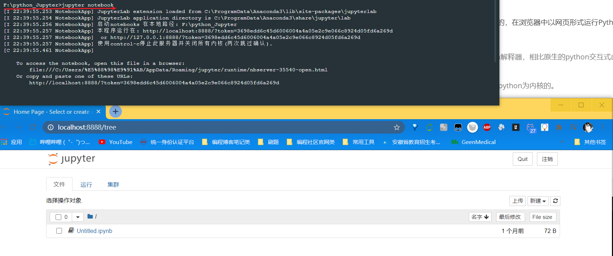
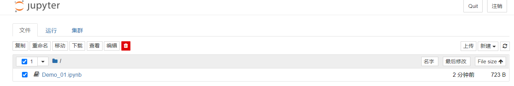
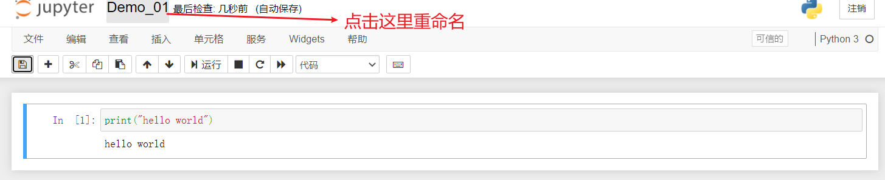

Jupyter notebook是用python进行数据科学、机器学习的必备工具。

吴恩达的《深度学习》慕课的课后编程作业、大数据竞赛网站Kaggle上的代码文档、美国大学的数据科学课程的课后资料及编程作业，都是以jupyter notebook文件的形式给出的，也就是`.ipynb`文件。

[文章参考自TommyZihao](https://github.com/TommyZihao/zihaopython/blob/master/%E6%95%B0%E6%8D%AE%E5%88%86%E6%9E%90%E4%B8%8E%E5%8F%AF%E8%A7%86%E5%8C%96%E5%AE%9E%E6%88%98%E6%A1%88%E4%BE%8B%EF%BC%9A%E5%AD%A6%E4%B9%A0%E6%97%B6%E9%97%B4%E4%B8%8E%E6%88%90%E7%BB%A9%E7%9A%84%E5%85%B3%E7%B3%BB%EF%BC%88%E7%BA%BF%E6%80%A7%E5%9B%9E%E5%BD%92%EF%BC%89/Jupyter%20notebook%E5%BF%AB%E9%80%9F%E4%B8%8A%E6%89%8B.md)

<!--more-->

Jupyter notebook是基于Ipython内核的，在浏览器中以网页形式运行Python代码的工具，十分方便。

> Ipython是啥？
>
> Ipython可以理解成更高级的python解释器，相比原生的python交互式命令行，Ipython有更强大的命令计数、自动补全等交互功能。
>
> Spyder和Jupyter notebook都是以Ipython为内核的。

## 安装Jupyter notebook

如果你安装了python数据科学全家桶Anaconda，那么其中自带了Jupyter notebook。

如果你没安装Anaconda，可以直接在命令行里运行这行命令

```
pip install jupyter -i https://pypi.tuna.tsinghua.edu.cn/simple
```

## 运行Jupyter notebook

打开命令行，通过cd命令切换到指定文件路径下，输入`jupter notebook`，回车。稍等片刻即可跳出浏览器网页。如果没有跳转浏览器，也可以手动复制链接到浏览器打开。



## 主要操作界面






点击右边的New-Python3即可创建python文档。

点击New-Folder可以创建新文件夹。

点击New-Text File可以创建空的`.txt`文件。

点击New-Terminal可以打开操作系统命令行，你可以使用操作系统对应的命令行进行目录切换、解压文件等操作。

勾选文件夹，点击rename即可重命名。

## 蓝绿两模式：命令模式、编辑模式

Jupyter notebook中，代码和文档都存在于一个个单元格中，每个单元格都有蓝色和绿色两种状态。

- 命令模式（蓝色）：用于执行键盘输入的快捷命令（新增单元格、剪切、复制等等）。通过 `Esc` 键从绿色的编辑模式切换到蓝色的命令模式，此时单元左侧显示蓝色竖线。
- 编辑模式（绿色）：编辑文本和代码。选中单元并按 `Enter` 键进入编辑模式，此时单元左侧显示绿色竖线。

> 命令模式和编辑模式，其实是源自于著名的vim编辑器，vim编辑器以特别难学和学成之后可以超神而闻名于世。

## 两种单元格：代码单元格和Markdown单元格

Jupyter notebook中，有两种单元格：代码单元格和Markdown单元格。

- 代码单元格：这里是你编写代码的地方，通过按 `Shift + Enter` 运行代码，其结果显示在本单元下方。代码单元左边有 `In [1]:` 这样的序列标记，方便人们查看代码的执行次序。在**蓝色命令模式下，按`y`键**可以将Markdown单元格转换为代码单元格。
- Markdown 单元格：在这里对文本进行编辑，采用 markdown 的语法规范，可以设置文本格式、插入链接、图片甚至数学公式。同样使用 `Shift + Enter` 运行 markdown 单元来显示渲染后的文本。在**蓝色命令模式下按`m`键**可以将代码单元格转换为Markdown单元格。

> Markdown是程序员通用的撰写文档的语法，可以轻松实现标题、引用、链接、图片等，非常简洁易学，Github代码托管网站、有道云笔记、简书、知乎、CSDN论坛、电子邮件等都支持Markdown语法。
>
> 学习Markdown，推荐我制作的博客和视频教程：
>
> [二十分钟精通排版神器Markdown，从此word和秀米是路人](https://www.jianshu.com/p/4475b9d8810f)
>
> [Bilibili视频：二十分钟精通排版神器Markdown](https://www.bilibili.com/video/av35579542)

## 抛弃鼠标，只用键盘

下面介绍Jupyter notebook快捷键，掌握这些快捷键之后，你将彻底解放你拿鼠标的那只手，更专注、高效地敲代码了。在文件操作界面按`h`键可以查看全部快捷键。

## 最常用快捷键（必会）

h 查看所有快捷键

Enter 从命令模式进入编辑模式

Esc 从编辑模式退回到命令模式

m 将代码单元格转换为Markdown单元格

y 将Markdown单元格转换为代码单元格

shift+Enter 运行本单元格，选择下面的代码块

ctrl+Enter 运行本单元格

alt+Enter 运行本单元格，在下方新建一个单元格

a 在上方新建一个单元格（above）

b 在下方新建一个单元格（below）

d 删除选中的单元格（delete）

x 剪切本单元格

c 复制本单元格

shift v 粘贴到上面

v 粘贴到下面

l 显示代码行号