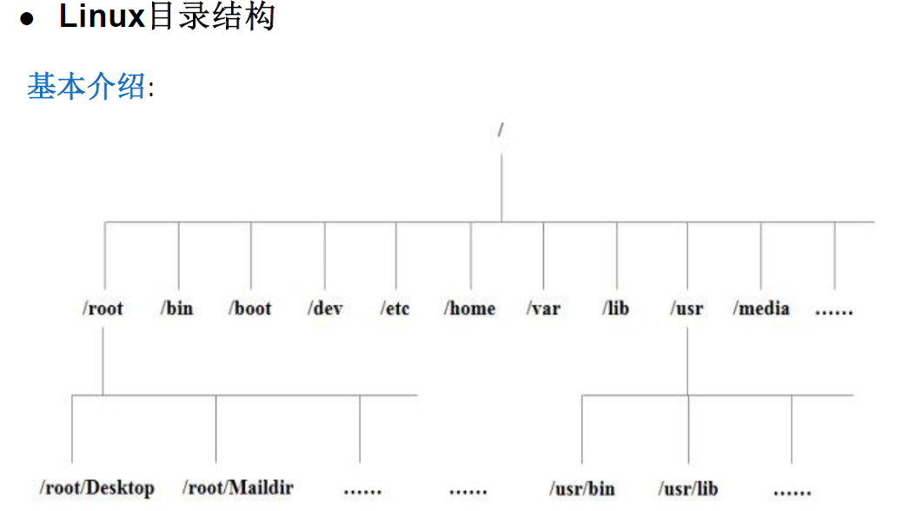

# 1：VM虚拟机

==防止出现问题：养成备份的好习惯！==（在做一些可能影响系统的事前备份）

<!--more-->

VM虚拟机的两种备份方式：拍摄快照（短期高频）和克隆（长期低频）。

关机命令：1.shutdown (-h) now;2.halt(关闭内存);

以超级管理员身份登录：sudo -i,输入密码。（tips：输密码时光标不会移动）

找不到之前创建好的虚拟机：查看-->自定义-->库。

# 2：acwing学习

AC terminal复制，粘贴快捷键：`Ctrl +insert `，`Shift + insert`。

> acwing Linux基础课：轻理论，重实践。

目前的的app，web，小程序等各种应用的模式：前端形式各种各样。后端都是用server来处理。

基础技术就是掌握好sever，一套后端框架可以服务多种前端形式。

server绝大多数都是部署在Linux上，所以需要先学好Linux，Linux基础课就是整个工程课系列的基础。

学习资料 ：**菜鸟教程**，黑马程序员Linux笔记，尚硅谷Linux课程资料，**韩顺平Linux课程**。

参考博客： https://www.junmajinlong.com/linux/index/。

《趣谈Linux操作系统》 ： https://time.geekbang.org/column/article/87111。

# 3：lesson1

## 3.1：课程概论

Linux的常见发行版本：Ubuntu，CentOS等等。

terminal其实就相当于主机的一个屏幕。同时打开两个终端也就是打开了2个屏幕，它们共享一台主机，在其中一个终端使用命令也会影响另一个终端。

我们可以通过ssh将终端连接到自己的或者公司的服务器，本地都不需要Linux环境，只需要一个万能屏幕就行，操作服务器可以通过终端来操作，很方便。

先介绍两个常用的帮助指令：`man`和`help`。

用法示例：`man ls`，`ls --help`。（需要能看懂英语）

如果嫌英语麻烦，可以直接百度指令。

**help、man、--help命令区别：**

1、help 命令：只能查询shell内置命令。

  使用格式：`help cd`

2、--help 命令：只能查询linux外部命令。

​    使用格式：`mkdir --help`

3、man 命令：即可以帮助查询linux内置命令，也可以查询linux外部命令。man查询的内容比其余两个命令内容都多。

  使用格式：`man cd`

  q Q 退出界面。

4、其中 “--help、man”是我们常用命令。

> 关于命令等Linux内容，现学现查是最高效的学习方式。

## 3.2：文件系统结构

**Linux一切皆文件。**

①在windows是文件的，在Linux下同样也是文件；

②在windows不是文件的，在Linux下也是以文件的形式存储的。

日常学习中和日常工作中，对于文件的操作的都有哪些种类？

**创建文件、编辑文件、保存文件、关闭文件、重命名文件、删除文件、恢复文件。**



Linux系统的根目录就是`/`，一个斜杠。

使用命令：`ls /`。可以看到根目录下的文件结构。

以下是对这些目录的解释：（了解，不需要记忆）

- **/bin**：
    bin 是 Binaries (二进制文件) 的缩写, 这个目录存放着最经常使用的命令，一些可执行文件的命令。

- **/etc：**
    etc 是 Etcetera(等等) 的缩写,这个目录用来存放所有的系统管理所需要的配置文件和子目录。
- **/var**：
    var 是 variable(变量) 的缩写，这个目录中存放着在不断扩充着的东西，我们习惯将那些经常被修改的目录放在这个目录下。包括各种日志文件。
- **/lib**：
    lib 是 Library(库) 的缩写这个目录里存放着系统最基本的动态连接共享库，其作用类似于 Windows 里的 DLL 文件。几乎所有的应用程序都需要用到这些共享库。存一些安装包，库文件等。
- **/home**：
    用户的主目录，在 Linux 中，每个用户都有一个自己的目录，一般该目录名是以用户的账号命名的。表示**除了root用户以外其他用户的家目录**。
- **/root**：
    该目录为系统管理员，也称作超级权限者的用户主目录。

文件的两种路径：

绝对路径：从根目录开始的路径，例如`ls /home/grant/passwd`。ls后面的就是绝对路径。

相对路径：不从根目录开始的路径，例如当前在/home路径下，`ls /grant`。ls后面的就是相对路径。

在Linux文件系统中有两个特殊的目录，一个用户所在的工作目录，也叫当前目录，可以使用一个点 **.** 来表示；另一个是当前目录的上一级目录，也叫父目录，可以使用两个点 **..** 来表示。

-  . ：代表当前的目录，也可以使用 ./ 来表示；
-  .. ：代表上一层目录，也可以 ../ 来代表。

如果一个目录或文件名以一个点 . 开始，表示这个目录或文件是一个隐藏目录或文件(如：.bashrc)。即以默认方式查找时，不显示该目录或文件。

~ ：代表当前使用者的家目录，或者~/。`~grant`或者`~grant/`表示名为grant的家目录。

## 3.3：文件管理常用命令

linux命令查询网站： https://www.linuxcool.com/。

### ls (列出目录)：list

在Linux系统当中， ls 命令可能是最常被运行的。

选项与参数：

- -a ：全部的文件，连同隐藏文件( 开头为 . 的文件) 一起列出来(常用)
- -A：显示除隐藏文件“.”和“..”以外的所有文件列表
- -d ：仅列出目录本身，而不是列出目录内的文件数据(常用)
- -l ：长数据串列出，包含文件的属性与权限等等数据(常用)
- -h：将文件内容大小以GB、KB等易读的方式显示
- 参数可以叠加使用：`ls -lh`或者`ls -hl`都可以，效果一样，与顺序无关

### pwd (显示目前所在的目录)

pwd 是 **Print Working Directory** 的缩写，也就是显示目前所在目录的命令。

### cd (切换目录)

cd是Change Directory的缩写，这是用来变换工作目录的命令。

```shell
#使用绝对路径切换到 runoob 目录
[root@www ~]# cd /root/runoob/

#使用相对路径切换到 runoob 目录
[root@www ~]# cd ./runoob/

# 表示回到自己的家目录，亦即是 /root 这个目录
[root@www runoob]# cd ~ ，也可以直接输入cd，省略~

# 表示去到目前的上一级目录，亦即是 /root 的上一级目录的意思；
[root@www ~]# cd ..

# 表示返回上一次所在目录
[root@www ~]# cd -
```

### cp (复制文件或目录)

cp 即拷贝文件和目录。其实应该是：复制+粘贴+重命名。

语法：**#cp 被复制的文档路径 文档被复制到的路径**，还兼有重命名的功能

```shell
acs@83ea09fe037b:~$ ls
homework  test  test.txt
acs@83ea09fe037b:~$ cp test.txt ./test # 将当前目录下test.txt文件复制到./test目录下

acs@83ea09fe037b:~$ cd test
acs@83ea09fe037b:~/test$ ls# 复制成功
test.txt

acs@83ea09fe037b:~/test$ cd 
# 将当前目录下test.txt文件复制到./test目录下，并重命名为test1.txt
acs@83ea09fe037b:~$ cp test.txt ./test/test1.txt
acs@83ea09fe037b:~$ cd ./test

acs@83ea09fe037b:~/test$ ls# 复制成功
test.txt  test1.txt
```

文件夹的复制：

`cp a b -r`：a和b属于同一级目录，-r参数用于**递归**复制文件和目录，将整个a目录复制到b的下面。

`cp a c -r`：a存在，c不存在，将整个a目录复制到当前目录的下面，命名为c。当前目录同时存在a,c。

这样复制时注意文件覆盖问题！

### mkdir (创建新目录)

如果想要创建新的目录的话，那么就使用mkdir (make directory)吧。

- 参数-p ：帮助你直接将所需要的目录(包含上一级目录)递归创建起来！

```shell
mkdir ./a/b/c -p # 在当前目录下创建一连串目录a/b/c
```

### history (查看历史命令，很有用！)

history命令用于显示用户以前执行过的历史命令，并且能对历史命令进行追加和删除等操作。

### rm (移除文件或目录)

remove，谨慎使用删除命令。删除后找不回来，不走回收站！

选项与参数：

- -f ：就是 force 的意思，忽略不存在的文件，不会出现警告信息；
- -i ：互动模式，在删除前会询问使用者是否动作，加上这个删除文件比较保险
- -r ：递归删除啊！删除目录时需要加上！这是非常危险的选项！！！

```shell
rm a.txt b.txt # 可以删除多个文件a和b
rm -rf * # 删除当前目录下所有文件，慎用
rm -rf /* # 系统都给你删干净了！
rm *.txt # 支持正则表达式，将当前目录下txt文件都删除，*和.之前不能有空格
rm a/* # 将a里面的文件目录都删除，保留a目录，*不会删除隐藏文件
```

### touch (创建文件)

touch命令有两个功能：一是创建新的空文件，二是改变已有文件的时间戳属性。

### mv (移动文件与目录，或修改名称)

move，剪切+粘贴，兼有重命名的功能。

和cp命令类似的格式。

```shell
acs@83ea09fe037b:~$ mkdir a b 
acs@83ea09fe037b:~$ ls
a  b  homework
acs@83ea09fe037b:~$ touch ./a/tmp.txt

acs@83ea09fe037b:~$ mv a/tmp.txt b/ # 将a目录下的tmp文件移动到b目录下
acs@83ea09fe037b:~$ ls a
acs@83ea09fe037b:~$ ls b
tmp.txt
# 将b目录下的tmp文件移动到a目录下，并重命名为tmp1
acs@83ea09fe037b:~$ mv b/tmp.txt a/tmp1.txt
acs@83ea09fe037b:~$ ls a
tmp1.txt
acs@83ea09fe037b:~$ ls b

acs@83ea09fe037b:~$ mv test1.txt test2.txt # 将test1重命名为test2
```

### cat

由第一行开始显示文件内容。用来查看文件内容。

```shell
acs@83ea09fe037b:~$ touch test.txt
acs@83ea09fe037b:~$ vim test
acs@83ea09fe037b:~$ cat test # 查看test文件的内容
this is a test!
```

## 3.4：Linux讲义

1. 常用命令介绍
    **ctrl c**: 取消命令，并且换行
    **ctrl u**: 清空本行命令
    tab键：可以补全命令和文件名，如果补全不了快速按两下tab键，可以显示备选选项
    ls: 列出当前目录下所有文件，蓝色的是文件夹，白色的是普通文件，绿色的是可执行文件
    pwd: 显示当前路径
    cd XXX: 进入XXX目录下, cd .. 返回上层目录
    cp XXX YYY: 将XXX文件复制成YYY，XXX和YYY可以是一个路径，比如../dir_c/a.txt，表示上层目录下的dir_c文件夹下的文件a.txt
    mkdir XXX: 创建目录XXX
    rm XXX: 删除普通文件;  rm XXX -r: 删除文件夹
    mv XXX YYY: 将XXX文件移动到YYY，和cp命令一样，XXX和YYY可以是一个路径；重命名也是用这个命令
    touch XXX: 创建一个文件
    cat XXX: 展示文件XXX中的内容
2. 创建作业 & 测试作业的正确性
    homework 1 create 可以重新创建所有lesson_1的作业
    homework 1 create id 可以单独创建lesson_1的第id个作业. e.g.
    homework 1 create 0 可以只重新创建lesson_1的第0个作业
    homework 1 test 可以评测lesson_1的所有作业
3. 作业
    创建好作业后，先进入文件夹/home/acs/homework/lesson_1/，然后：
    (0) 进入homework_0文件夹，分别创建文件夹dir_a, dir_b, dir_c
    (1) 进入homework_1文件夹，将a.txt, b.txt, c.txt 分别复制成: a.txt.bak, b.txt.bak, c.txt.bak
    (2) 进入homework_2文件夹，将a.txt, b.txt, c.txt 分别重命名为: a_new.txt, b_new.txt, c_new.txt
    (3) 进入homework_3文件夹，将dir_a文件夹下的a.txt, b.txt, c.txt分别移动到文件夹dir_b下
    (4) 进入homework_4文件夹，将普通文件a.txt, b.txt, c.txt删除
    (5) 进入homework_5文件夹，将文件夹dir_a, dir_b, dir_c删除
    (6) 进入homework_6文件夹，查看task.txt的内容，并按其指示进行操作
    (7) 进入homework_7文件夹，创建文件夹dir_0, dir_1, dir_2，
        将a.txt, b.txt, c.txt复制到dir_0下，重命名为a0.txt, b0.txt, c0.txt;
        将a.txt, b.txt, c.txt复制到dir_1下，重命名为a1.txt, b1.txt, c1.txt;
        将a.txt, b.txt, c.txt复制到dir_2下，重命名为a2.txt, b2.txt, c2.txt;
    (8) 进入homework_8文件夹，分别在dir_a, dir_b, dir_c文件夹下查看task.txt的内容，并分别按照指示进行操作
    (9) 进入homework_9文件夹，将其中所有txt类型的文件删除

```shell
# 作业答案
# 0
mkdir dir_a dir_b dir_c
mkdir dir_{a..c} # 批量创建
# 1
cp a.txt a.txt.bak
cp b.txt b.txt.bak
cp c.txt c.txt.bak

for var in *.txt;# 批量复制
do
    cp "$var" "${var%.txt}.txt.bak"
done
# 2
mv a.txt a_new.txt
mv b.txt b_new.txt
mv c.txt c_new.txt

for var in *# 批量移动
do
    mv "$var" "${var%.txt}_new.txt"
done
# 3
mv dir_a/a.txt dir_b/
mv dir_a/b.txt dir_b/
mv dir_a/c.txt dir_b/

mv dir_a/* dir_b # 将目录dir_a整体移动
# 4
rm *.txt

rm {a..c}.txt# 批量删除
# 5
rm dir_a dir_b dir_c -r

rm dir_{a..c} -r
# 6
mv done.txt dir_a/
# 7
acs@83ea09fe037b:~/homework/lesson_1/homework_7$ cp a.txt  dir_0/a0.txt
acs@83ea09fe037b:~/homework/lesson_1/homework_7$ cp b.txt  dir_0/b0.txt
acs@83ea09fe037b:~/homework/lesson_1/homework_7$ cp c.txt  dir_0/c0.txt
acs@83ea09fe037b:~/homework/lesson_1/homework_7$ cp a.txt  dir_1/a1.txt
acs@83ea09fe037b:~/homework/lesson_1/homework_7$ cp b.txt  dir_1/b1.txt
acs@83ea09fe037b:~/homework/lesson_1/homework_7$ cp c.txt  dir_1/c1.txt
acs@83ea09fe037b:~/homework/lesson_1/homework_7$ cp a.txt  dir_2/a2.txt
acs@83ea09fe037b:~/homework/lesson_1/homework_7$ cp b.txt  dir_2/b2.txt
acs@83ea09fe037b:~/homework/lesson_1/homework_7$ cp c.txt  dir_2/c2.txt

for i in {0..2} 从 0∼2 创建名为 dir_i 的目录
再遍历 homework_7 下的所有 x.txt 文本，把它们复制到 dir_i 并重命名为 x0.txt

for i in {0..2}
do
    mkdir "dir_$i"
    for var in *.txt
    do
        cp "$var" "dir_$i/${var%.txt}$i.txt"
    done
done
# 8
acs@83ea09fe037b:~/homework/lesson_1/homework_8/dir_a$ ls
a.txt  task.txt
acs@83ea09fe037b:~/homework/lesson_1/homework_8/dir_a$ rm a.txt
acs@83ea09fe037b:~/homework/lesson_1/homework_8/dir_a$ ls
task.txt
acs@83ea09fe037b:~/homework/lesson_1/homework_8/dir_a$ cd ../dir_b
acs@83ea09fe037b:~/homework/lesson_1/homework_8/dir_b$ ls
b.txt  task.txt
acs@83ea09fe037b:~/homework/lesson_1/homework_8/dir_b$ cat task.txt 
将b.txt重命名为b_new.txt
acs@83ea09fe037b:~/homework/lesson_1/homework_8/dir_b$ mv b.txt b_new.txt
acs@83ea09fe037b:~/homework/lesson_1/homework_8/dir_b$ cd ../dir_c
acs@83ea09fe037b:~/homework/lesson_1/homework_8/dir_c$ ls
c.txt  task.txt
acs@83ea09fe037b:~/homework/lesson_1/homework_8/dir_c$ cat task.txt 
将c.txt复制成c.txt.bak
acs@83ea09fe037b:~/homework/lesson_1/homework_8/dir_c$ cp c.txt c.txt.bak

for var in *
do
    cd "$var/"
    cat task.txt
    if [ $var == "dir_a" ]
    then
        rm a.txt
    elif [ $var == "dir_b" ]
    then
        mv b.txt b_new.txt
    elif [ $var == "dir_c" ]
    then
        cp c.txt c.txt.bak
    fi
    cd ..
done
# 9
rm *.txt
```

shell脚本统一处理：https://www.acwing.com/solution/content/63079/。

