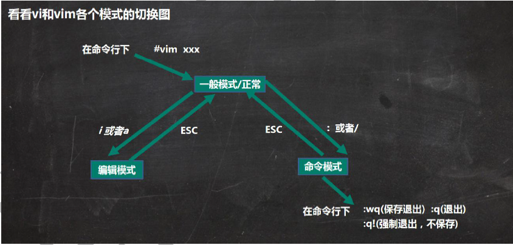
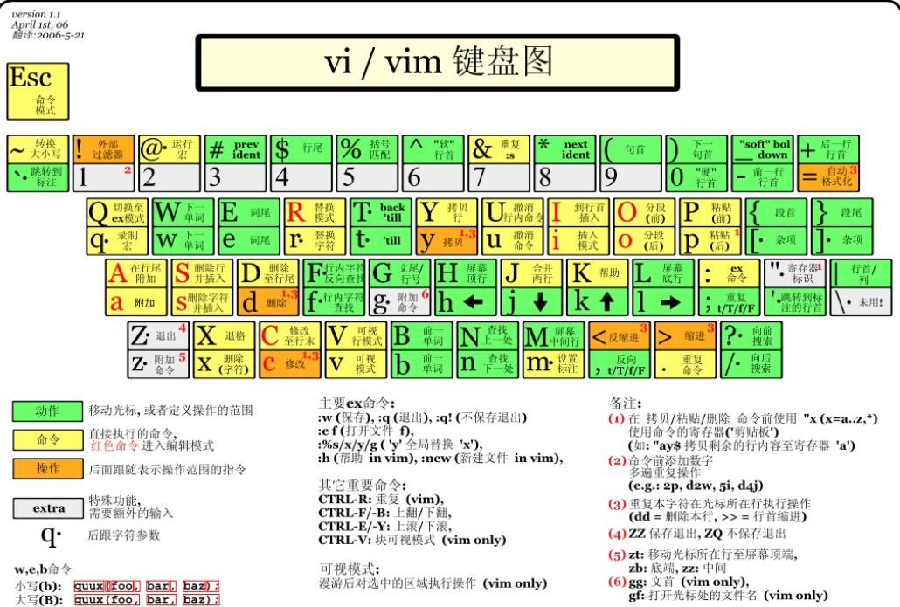

# 1：lesson2

## 1.1：Tmux

y总说： 命令比较多，多写多练，不要纯靠背。

<!--more-->

参考文章： http://www.ruanyifeng.com/blog/2019/10/tmux.html。（详细介绍）

命令行的典型使用方式是，打开一个终端窗口（terminal window，以下简称"窗口"），在里面输入命令。**用户与计算机的这种临时的交互，称为一次"会话"（session）** 。

**Tmux 就是会话与窗口的"解绑"工具，将它们彻底分离。**

Tmux就是一款终端复用工具。

（1）它允许在单个窗口中，同时访问多个会话。这对于同时运行多个命令行程序很有用。

（2） 它可以让新窗口"接入"已经存在的会话。

（3）它允许每个会话有多个连接窗口，因此可以多人实时共享会话。

（4）它还支持窗口任意的垂直和水平拆分。

Ubuntu系统安装Tmux的命令：`sudo apt-get install tmux`，启动Tmux：`tmux`。

按下`Ctrl+d`或者显式输入`exit`命令，就可以退出 Tmux 窗口。

我们所看到的就是一个window（窗口）。

**Tmux前缀键：**

Tmux 窗口有大量的快捷键。所有快捷键都要通过前缀键唤起。默认的前缀键是`Ctrl+b`，即先按下`Ctrl+b`，快捷键才会生效。

举例来说，**帮助命令的快捷键是`Ctrl+b ?`**。它的用法是，在 Tmux 窗口中，先按下`Ctrl+b`，再按下`?`，就会显示帮助信息。

然后，按下 ESC 键或`q`键，就可以退出帮助。

如何修改前缀键？

相信只要你用过几次tmux，就会发现`Ctrl+b`指令前缀，着实不太方便。这两个键相距太远，按键成本太高了。因此我们首先需要将它更换为距离更近的`Ctrl+a`组合键。

要永久生效，则在创建或修改系统级的/etc/tmux.conf或用户级的~/.tmux.conf

首先打开文件：`vim ~/.tmux.conf `。

 然后在文件中输入三个命令：

```shell
set -g prefix C-x
unbind C-b
bind C-x send-prefix
```

然后让他生效：使用`tmux`命令进入tmux，然后`ctrl+b`，之后按下`:`，并输入`source ~/.tmux.conf`，或者重启tmux也可以。

如何支持鼠标操作？

在配置文件中加上：`set -g mouse on`。

复制模式快捷键：按下ctrl + a后手指松开，然后按[，按q/ESC退出。

**杀死会话（session）的命令：**

```bash
# 使用会话编号
$ tmux kill-session -t 0
# 使用会话名称
$ tmux kill-session -t <session-name>
```

`tmux switch`命令用于**切换会话**。

```shell
# 使用会话编号
$ tmux switch -t 0

# 使用会话名称
$ tmux switch -t <session-name>
```

`tmux attach`命令用于**重新接入某个已存在的会话**。

```shell
# 使用会话编号
$ tmux attach -t 0

# 使用会话名称
$ tmux attach -t <session-name>
```

Tmux中复制文本的两种方式：

1. 按住`shift`不放，鼠标选中文本，`ctrl+insert`复制，`shift+insert`粘贴；
2. `ctrl+a, [` 选中文本复制，`ctrl+a, ]` 粘贴。

## 1.2：Vim

参考资料： https://www.runoob.com/linux/linux-vim.html。（查看命令）

Vim是从 vi 发展出来的一个文本编辑器。它是**命令行模式**下的一个编辑器。

**Vim重点是光标的移动，模式切换，删除，查找，替换，复制，粘贴，撤销命令的使用**。

vim的三种打开文件的方式：

\#vim 文件路径                     作用：打开指定的文件

\#vim +数字  文件的路径          作用：打开指定的文件，并且将光标移动到指定行

\#vim +/关键词  文件的路径       作用：打开指定的文件，并且高亮显示关键词

```shell
# 例子
grant@UbuntuofLX:~/code_test$ vim main.cpp 
grant@UbuntuofLX:~/code_test$ vim +4 main.cpp 
grant@UbuntuofLX:~/code_test$ vim +/hello main.cpp
```

基本上 vi/vim 共分为三种模式，分别是**命令模式（Command mode）**，**输入模式（Insert mode）**和**底线命令模式（Last line mode）**。





**命令模式：一般默认模式**

此状态下敲击键盘动作会被Vim识别为命令，而非输入字符。比如我们此时按下i，并不会输入一个字符，i被当作了一个命令。

以下是常用的几个命令：

- **i** 切换到输入模式，以输入字符。
- **a** 切换到输入模式，以输入字符，比`i`更舒服，直接定位到光标处输入。
- **x** 删除当前光标所在处的字符。相当于 [del] 按键。
- **:** 切换到底线命令模式，以在最底一行输入命令。
- 在一行字当中，x 为向后删除一个字符 (相当于 [del] 按键)， X 为向前删除一个字符(相当于 [backspace] 亦即是退格键) (常用)
- **.**一个点，表示重复上一次操作。
- **cc**整行重写，开启输入模式。
- **o**创建新行，开启输入模式。
- **f+字母**光标跳转到本行指定字母处。

若想要编辑文本：启动Vim，进入了命令模式，按下i，切换到输入模式。

命令模式只有一些最基本的命令，因此仍要依靠底线命令模式输入更多命令。

**按ESC键进入一般命令模式。**

在编辑模式下可以按Backspace删除文本。

**在底线命令模式下支持鼠标操作？**

`set mouse=a`，开启鼠标；`set mouse-=a`，关闭鼠标。

Vim配置参考文章： https://www.ruanyifeng.com/blog/2018/09/vimrc.html。


## 1.3：Linux讲义

1. tmux教程
    功能：
        (1) 分屏。
        (2) 允许断开Terminal连接后，继续运行进程。
    结构：
        一个tmux可以包含多个session，一个session可以包含多个window，一个window可以包含多个pane。每个pane里打开一个shell对话框，pane是最小单位。
        实例：
            tmux:
                session 0:
                    window 0:
                        pane 0
                        pane 1
                        pane 2
                        ...
                    window 1
                    window 2
                    ...
                session 1
                session 2
                ...
    操作：
        (1) tmux：新建一个session，其中包含一个window，window中包含一个pane，pane里打开了一个shell对话框。
        (2) 按下Ctrl + a后手指松开，然后按%：将当前pane左右平分成两个pane。（tips：shifit+5 = %）
        (3) 按下Ctrl + a后手指松开，然后按"：将当前pane上下平分成两个pane。
        (4) Ctrl + d：关闭当前pane；如果当前window的所有pane均已关闭，则自动关闭window；如果当前session的所有window均已关闭，则自动关闭session。（**关闭选中的pane**）
        (5) 鼠标点击可以选pane。
        (6) 按下ctrl + a后手指松开，然后按方向键：选择相邻的pane。
        (7) 鼠标拖动pane之间的分割线，可以调整分割线的位置。
        (8) 按住ctrl + a的同时按方向键，可以调整pane之间分割线的位置。
        (9) 按下ctrl + a后手指松开，然后按z：将当前pane全屏/取消全屏。
        (10) 按下ctrl + a后手指松开，然后按d：挂起当前session。
        (11) tmux a：打开之前挂起的session。（a是attach的缩写）
    
    上面是**pane**的相关操作，下面介绍**session**和**window**的相关操作。
    
    用`tmux`可以再创建一个session。
    
    ​    (12) 按下ctrl + a后手指松开，然后按s：选择其它session。（至少有2个session才行）
    ​        方向键 —— 上：选择上一项 session/window/pane
    ​        方向键 —— 下：选择下一项 session/window/pane
    ​        方向键 —— 右：展开当前项 session/window
    ​        方向键 —— 左：闭合当前项 session/window
​    (13) 按下Ctrl + a后手指松开，然后按c：在当前session中创建一个新的window。
    ​    (14) 按下Ctrl + a后手指松开，然后按w：选择其他window，操作方法与(12)完全相同。
    ​    (15) 按下Ctrl + a后手指松开，然后按PageUp：翻阅当前pane内的内容。
    ​    (16) 鼠标滚轮：翻阅当前pane内的内容。
    ​    (17) 在tmux中选中文本时，需要按住shift键。先按shift，再选择文本。
    
2. vim教程
    功能：
        (1) 命令行模式下的文本编辑器。
        (2) 根据文件扩展名自动判别编程语言。支持代码缩进、代码高亮等功能。
        (3) 使用方式：vim filename，支持同时打开多个文件
            如果已有该文件，则打开它。
            如果没有该文件，则打开个一个新的文件，并命名为filename
    模式：
        (1) 一般命令模式
            默认模式。命令输入方式：类似于打游戏放技能，按不同字符，即可进行不同操作。可以复制、粘贴、删除文本等。
        (2) 编辑模式
            在一般命令模式里按下i，会进入编辑模式。
            按下ESC会退出编辑模式，返回到一般命令模式。
        (3) 命令行模式
            在一般命令模式里按下:/?三个字母中的任意一个，会进入命令行模式。命令行在最下面。
            可以查找、替换、保存、退出、配置编辑器等。
    操作：
        (1) i：进入编辑模式
        (2) ESC：进入一般命令模式
        (3) h 或 左箭头键：光标向左移动一个字符
        (4) j 或 向下箭头：光标向下移动一个字符
        (5) k 或 向上箭头：光标向上移动一个字符
        (6) l 或 向右箭头：光标向右移动一个字符
    
    数字+方向键表示移动多少行，如3+上方向表示向上移动3行。
    

​    (7) n<Space>：n表示数字，按下数字后再按空格，光标会向右移动这一行的n个字符
​    ​    (8) 0 或 功能键[Home]：光标移动到本行开头
​    (9) `$` 或 功能键[End]：光标移动到本行末尾
​    
​    **注意：快捷键中字母区分大小写！**
​    
​    ​    (10) G：光标移动到最后一行
​    ​    (11) :n 或 nG：n为数字，光标移动到第n行
​    ​    (12) gg：光标移动到第一行，相当于1G
​    ​    (13) n<Enter>：n为数字，光标向下移动n行，空格移动字符，回车移动行
​    ​    (14) /word：向光标之下寻找第一个值为word的字符串。回车定位到字符串位置。
​    ​    (15) ?word：向光标之上寻找第一个值为word的字符串。回车定位到字符串位置。
​    ​    (16) n：重复前一个查找操作
​    ​    (17) N：反向重复前一个查找操作
​    ​    (18) :n1,n2s/word1/word2/g：n1与n2为数字，在第n1行与n2行之间寻找word1这个字符串，并将该字符串替换为word2，s是命令的一部分，不可省略。**包括n1和n2这两行。**
​    ​    (19) :`1,$s/word1/word2/g`：将全文的word1替换为word2
​    ​    (20) :`1,$s/word1/word2/gc`：将全文的word1替换为word2，且在替换前要求用户确认。
​    ​    (21) v：选中文本，先按v然后用方向键选择连续文本。
​    ​    (22) d：删除选中的文本，其实带有剪切功能，按d删除后可以按p粘贴。d1G删除删除光标所在到第一行的所有数据，dG删除光标所在到最后一行的所有数据，同理有dnG。   
​    ​    (23) dd: 删除当前行，ndd删除光标所在的向下 n 行，包括光标所在行。
​    ​    (24) y：复制选中的文本，先按v选中文本，然后按y复制，最后按p粘贴。复制的快捷键类似删除。
​    ​    (25) yy: 复制当前行
​    ​    (26) p: 将复制的数据在光标的下一行/下一个位置粘贴，复制文本在光标下个位置粘贴，复制整行在光标下行粘贴。
​    ​    (27) u：撤销
​    ​    (28) Ctrl + r：取消撤销
​    ​    (29) 大于号 >：将选中的文本整体向右缩进一次
​    ​    (30) 小于号 <：将选中的文本整体向左缩进一次
​    ​    (31) :w 保存
​    ​    (32) :w! 强制保存
​    ​    (33) :q 退出
​    ​    (34) :q! 强制退出
​    ​    (35) :wq 保存并退出
​    ​    (36) :set paste 设置成粘贴模式，取消代码自动缩进，粘贴代码进来的时候就没有自动缩进，很方便。
​    ​    (37) :set nopaste 取消粘贴模式，开启代码自动缩进
​    ​    (38) :set nu 显示行号
​    ​    (39) :set nonu 隐藏行号，这样复制的时候就不带行号
​    ​    (40) gg=G：将全文代码格式化，和(43)类似。==将当前行格式化。
​    ​    (41) :noh 关闭查找关键词高亮
​    ​    (42) Ctrl + q：当vim卡死时，可以取消当前正在执行的命令，救命操作
​    ​    (43) ggdG：删除文件全部内容，从第一行到最后一行。同理ggdnG可以删除第1行到第n行的内容。
​    
​    异常处理：
​    每次用vim编辑文件时，会自动创建一个.filename.swp的临时文件。
​        如果打开某个文件时，该文件的swp文件已存在，则会报错。此时解决办法有两种：
​            (1) 找到正在打开该文件的程序，并退出
​            (2) 直接删掉该swp文件即可

3. 创建作业 & 测试作业的正确性
    homework 2 create 可以重新创建所有lesson_2的作业。
    homework 2 create id 可以单独创建lesson_2的第id个作业. e.g.
        homework 2 create 0 可以只重新创建lesson_2的第0个作业
    homework 2 test 可以评测lesson_2的所有作业

4. 作业
    创建好作业后，先进入文件夹/home/acs/homework/lesson_2/，然后：
    (1) 进入homework_0文件夹，创建文件names.txt，并顺次将下列姓名写入该文件，每个名字占一行。
        AcWing、yxc、Bob、张强、李明、Alice
    (2) 进入homework_1文件夹，打开problem.txt，并依次删除下列字符：
        [1] 最后一行第101个字符
        [2] 第3行第8个字符
        [3] 第1行第30个字符
        [4] 第16行第55个字符
        [5] 第9行第80个字符
        最后保存文件并退出。
    (3) 进入homework_2文件夹，打开problem.txt，并依次执行如下操作：
        [1] 在第1个"two"的后面添加"abc"
        [2] 在第2个"two"的前面添加"def"
        [3] 将第3个"two"后面的连续12个字符删掉
        [4] 将第4个"two"所在的行删掉
        最后保存文件并退出。
    (4) 进入homework_3文件夹，打开problem.txt，并依次执行如下操作：
        [1] 将第5行至第15行中所有of替换成OF。
        [2] 将全文中所有的the替换成THE。
        [3] 将第偶数个is替换成IS，第奇数个is不变。下标从1开始。
    (5) 进入homework_4文件夹，打开problem.txt，并依次执行如下操作：
        [1] 删除第11行
        [2] 将所删除的行粘贴到文件最后一行的下一行
        [3] 复制第5行
        [4] 将所复制的行粘贴到文件当前最后一行的下一行
    (6) 进入homework_5文件夹，打开problem.txt，并依次执行如下操作：
        [1] 删除第11行第15个字符（包含该字符）至第13行第5个字符（包含该字符）
        [2] 将所删除的内容粘贴到文件末尾（注意不要另起一行）
        [3] 复制第5行第88个个字符（包含该字符）至第7行第6个字符（包含该字符）
        [4] 将所复制的内容粘贴到当前文件末尾（注意不要另起一行）
    (7) 进入homework_6文件夹，并依次执行如下操作：
        [1] 清空source0.cpp
        [2] 将source1.cpp中的第1-3行和第12-24行复制到source0.cpp中
    (8) 进入homework_7文件夹，格式化source.cpp
    (9) 进入homework_8文件夹，打开source.cpp，并依次执行如下操作：
        [1] 将第15-21行向右缩进2次。
        [2] 将第22-23行向左缩进1次。
    (10) 进入homework_9文件夹，打开链接：https://www.acwing.com/activity/content/code/content/1694465/
        新建文件source.cpp，将链接中的代码抄进source.cpp文件中。

```shell
# 0
acs@83ea09fe037b:~/homework/lesson_2$ cd homework_0/                                 acs@83ea09fe037b:~/homework/lesson_2/homework_0$ vim names.txt 
然后输入单词并保存退出
# 1
acs@83ea09fe037b:~/homework/lesson_2/homework_0$ cd ../homework_1/                   acs@83ea09fe037b:~/homework/lesson_2/homework_1$ vim problem.txt
G101<space><backspace>x # 或者：G101<Space>i<Backspace>ESC
3G8<space><backspace>x
gg30<space><backspace>x
16G55<space><backspace>x
9G80<space><backspace>x
:wq
# 2，错了
acs@83ea09fe037b:~/homework/lesson_2/homework_0$ cd ../homework_2/                   acs@83ea09fe037b:~/homework/lesson_2/homework_1$ vim problem.txt
gg
/two<enter>
3<space>iabcESC
nidefESC
n3<space>d12<space>
ndd
:wq
# 3
acs@83ea09fe037b:~/homework/lesson_2/homework_0$ cd ../homework_2/                   acs@83ea09fe037b:~/homework/lesson_2/homework_1$ vim problem.txt
gg
:5,15s/of/OFESC/g
:1,$s/the/THEESC/g
:1,$s/is/ISESC/gc   nynyny... # 没想到
:wq
# 4
acs@83ea09fe037b:~/homework/lesson_2/homework_0$ cd ../homework_2/                   acs@83ea09fe037b:~/homework/lesson_2/homework_1$ vim problem.txt
11Gdd
Gp
5Gyy
Gp
:wq
# 5 ，错了
# 注意：题目要求删除第2个（包括）到第5个（包括）字符，光标选择应该是1<space>到4<space>
# 会选择到光标的下一个位置
11G14<Space>v13G4<Space>dG$p   # 前两个要求,写下标的前一位（14，4）
5G87<Space>v7G5<Space>yG$p # 后两个要求,写下标的前一位（87，5）
:wq # 保存并退出
# 6
cd homework_6
vim source0.cpp
dG :wq
vim source1.cpp
gg v3G$ y :q
vim source0.cpp
p G dd :wq  # 删除多余空行

vim source1.cpp
12G v24G y :q
vim source0.cpp
G $ i <RIGHT> <ENTER> p :wq
# 7
cd homework_7
vim source.cpp
gg=G
:wq
# 8
cd homework_8
vim source.cpp
1. 15G v21G <SHIFT> + ">" , . # 点重复上一次操作

2. 22G v23G <SHIFT> + "<"
:wq
# 9
vim source.cpp
i
#include <iostream>

using namespace std;

int main()
{
    int a, b;
    cin >> a >> b;
    cout << a + b << endl;
    return 0;
}

:wq <Enter>
```

关于第5题的补充说明：

这里有同学删除的时候需要写13G5<Space>，有些同学需要写13G4<Space>，主要取决于vim的配置。大家打开vim的配置文件：

```shell
vim ~/.vimrc
看第48行：set selection=exclusive
```

如果这行没有被注释，那么需要写13G5<Space>，否则需要写13G4<Space>。
现在所有同学的服务器vim配置文件已更新，都需要写13G5<Space>才可以通过此题。