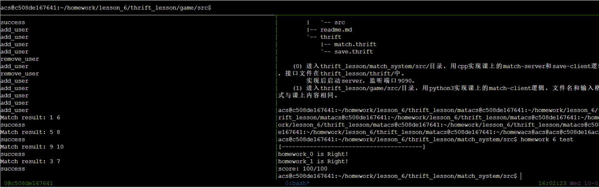
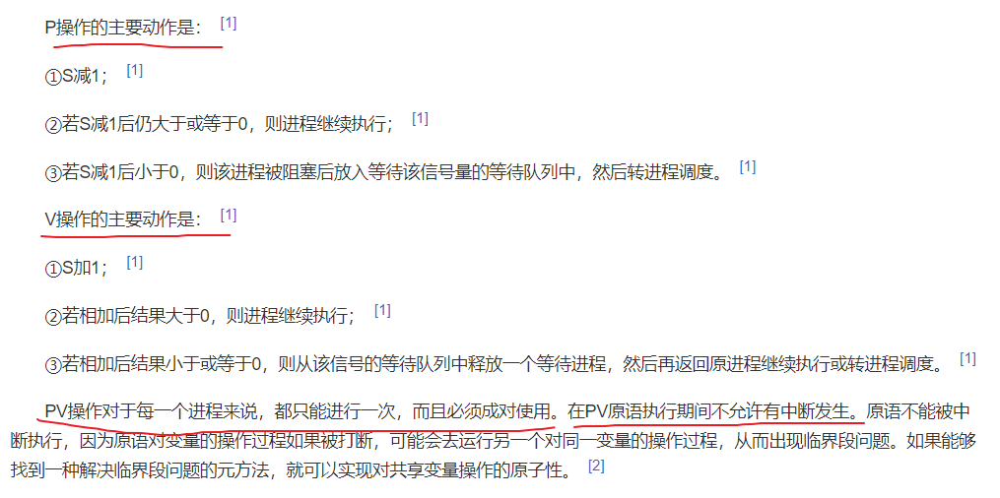
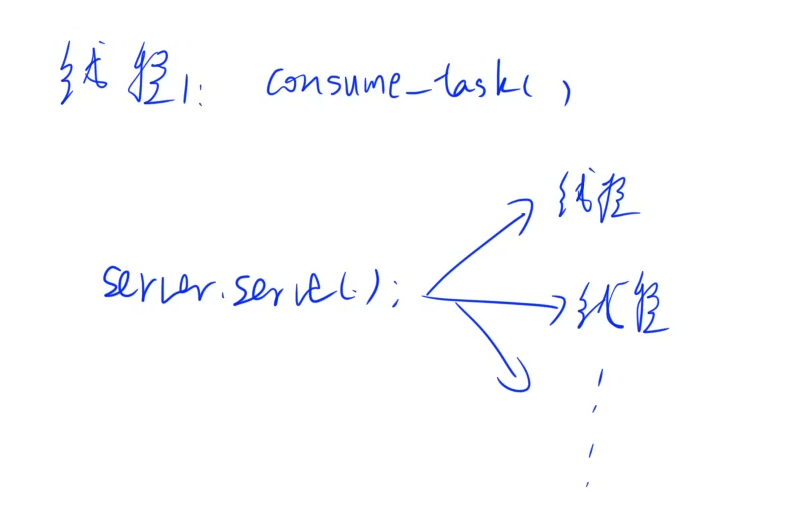

作业：

复现上节课的内容。

<!--more-->

这节课真得写疯了，Bug满天飞。

---

> 补充上节课涉及到的知识点：

消费者：

消费任务通过`consume_task()`函数来实现，里面是一个死循环，不断执行匹配任务。

在`mian.cpp`中，这里`thread matching_thread(consume_task);`为消费函数单独开了一个线程，让它不停执行匹配任务。

生产者：

后面的`server.serve();`利用线程池，每当客户端发送一个添加或者删除用户的请求时，`serve()`函数就为它单独创建一个线程去执行添加或删除用户函数。

用信号量同步线程：

消费队列是一个**共享**的临界区，消费者和生产者都可以操作它，但它们不能同时操作。多个线程之前访问消费队列的顺序是随机的，这样很可能出现两个线程几乎同时访问它的情况，这样就导致了线程的安全问题。所以需要引入**信号量**（互斥量），`mutex`作为**互斥锁**，来实现消费者和生产者多线程的**互斥访问**消费队列。

用信号量实现进程互斥：

C++中的`mutex`是一个二元信号量，它的值总是0或1。对于互斥锁有两种操作，P操作（加锁）和V操作（解锁）。`mutex`的值所表示的意义就是可用资源数为0或1。P操作将`mutex-1`，V操作将`mutex+1`。PV操作属于原子操作，也就是不可中断的过程，为了使得它们在执行时不发生因交叉访问信号量S而可能出现的错误，当执行PV操作时不会有别的过程打断它。

`unique_lock<mutex>`可以实现自动解锁，也可以手动解锁。

P操作就是，将进程从运行态转化为阻塞态，直到它被另一个进程唤醒。V操作就是，将一个处于阻塞态的进程唤醒。这两个操作是CPU原语，所以从操作系统层面能保证这两个操作是原子操作。

实现互斥的PV操作必须成对出现。

P、V操作应分别紧靠临界区的头尾部，临界区的代码应尽可能短，不能有死循环。

以上只是对于多线程与锁的简单介绍，详细内容可以参考csapp第十二章食用，还有操作系统的相关知识。

y总忠告：人的时间有限，不要花太多时间在很少用到的技术、知识上。

面试背八股和实际写项目不一样，编程切忌纸上谈兵，能动手实现才能证明你真正掌握了。

一位同学的学习笔记： https://www.acwing.com/file_system/file/content/whole/index/content/3011407/。

讲到了这里没有提到的条件变量等知识。