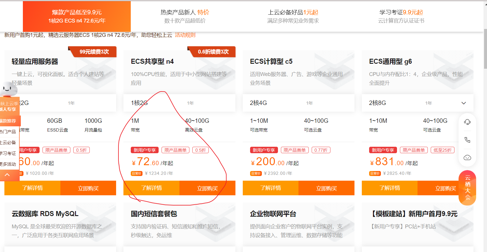
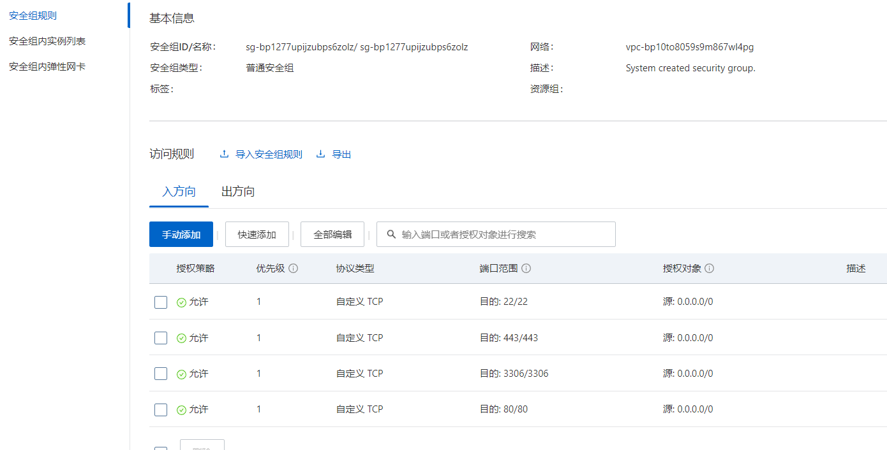
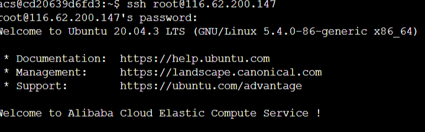

# 1：lesson8

## 云服务器

云平台的作用:

存放我们的docker容器，让计算跑在云端。

获得公网IP地址，让每个人可以访问到我们的服务。

<!--more-->

任选一个云平台即可，推荐配置：

1. 1核 2GB（esc，后期可以动态扩容，前期配置低一些没关系）
2. 网络带宽采用按量付费，最大带宽拉满即可（费用取决于用量，与最大带宽无关）
3. 系统版本：ubuntu 20.04 LTS（推荐用统一版本，避免后期出现配置不兼容的问题）

docker安装教程地址：https://docs.docker.com/engine/install/ubuntu/




添加一下安全组：设置一些端口的访问权限。



然后设置一下root密码。

各种功能和配置参考帮助文档。

SSH远程连接服务器： `ssh root@116.62.200.147`。



创建acs用户：在root用户下运行各种命令可能有风险。

```shell
adduser acs  # 创建用户acs

usermod -aG sudo acs  # 给用户acs分配sudo权限
```

退回AC Terminal，然后配置acs用户的别名和免密登录。

官网安装Docker教程：

```shell
 sudo apt-get update
 sudo apt-get install \
    apt-transport-https \
    ca-certificates \
    curl \
    gnupg \
    lsb-release

curl -fsSL https://download.docker.com/linux/ubuntu/gpg | sudo gpg --dearmor -o /usr/share/keyrings/docker-archive-keyring.gpg

echo \
  "deb [arch=$(dpkg --print-architecture) signed-by=/usr/share/keyrings/docker-archive-keyring.gpg] https://download.docker.com/linux/ubuntu \
  $(lsb_release -cs) stable" | sudo tee /etc/apt/sources.list.d/docker.list > /dev/null

sudo apt-get update
sudo apt-get install docker-ce docker-ce-cli containerd.io

acs@iZbp14kyqi4fdphfasv1wnZ:~$ docker --version # 查看docker版本，标志安装成功！
Docker version 20.10.9, build c2ea9bc
```

---

## 作业

注意：本次作业的2个题目不是独立的，每个题目会依赖于前一个题目，因此评测时如果当前题目错误，则不再评测后续题目。
创建好作业后，先进入文件夹/home/acs/homework/lesson_8/，然后：
(0) 进入homework_0文件夹，然后：
    [1] 租一台云服务器
    [2] 配置服务器别名及免密登录
    [3] 将服务器别名写在当前目录下的server_name.txt文件中
(1) 进入homework_1文件夹，然后：
    [1] 在租好的云服务器中安装docker
    [2] 将服务器别名写在当前目录下的server_name.txt文件中

```shell
acs@cd20639d6fd3:~/homework/lesson_8/homework_0$ echo aliserver > server_name.txt

acs@cd20639d6fd3:~/homework/lesson_8/homework_1$ echo aliserver > server_name.txt
```

## Docker

https://www.docker.com 最好的资源在官网！

Docker系列教程： https://caochenlei.blog.csdn.net/article/details/119428303。

Docker简易教程： [Docker 入门教程 - 阮一峰的网络日志 (ruanyifeng.com)](https://ruanyifeng.com/blog/2018/02/docker-tutorial.html)。

