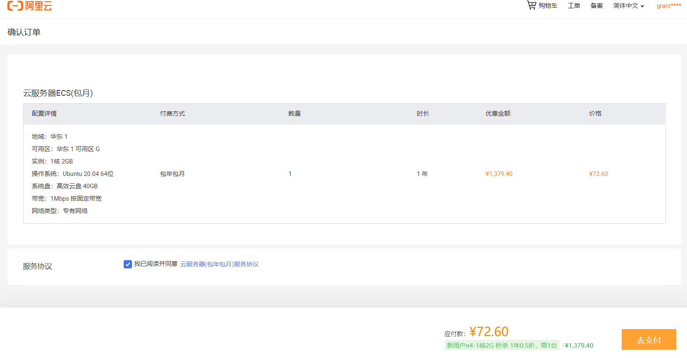

# 1：lesson8

## 云服务器

云平台的作用:

存放我们的docker容器，让计算跑在云端。

获得公网IP地址，让每个人可以访问到我们的服务。

<!--more-->

任选一个云平台即可，推荐配置：

1. 1核 2GB（esc，后期可以动态扩容，前期配置低一些没关系）
2. 网络带宽采用按量付费，最大带宽拉满即可（费用取决于用量，与最大带宽无关）
3. 系统版本：ubuntu 20.04 LTS（推荐用统一版本，避免后期出现配置不兼容的问题）

docker安装教程地址：https://docs.docker.com/engine/install/ubuntu/




添加一下安全组：设置一些端口的访问权限。


然后设置一下root密码。

各种功能和配置参考帮助文档。

SSH远程连接服务器： `ssh root@116.62.200.147`。


创建acs用户：在root用户下运行各种命令可能有风险。

```shell
adduser acs  # 创建用户acs

usermod -aG sudo acs  # 给用户acs分配sudo权限
```

退回AC Terminal，然后配置acs用户的别名和免密登录。

官网安装Docker教程：

```shell
 sudo apt-get update
 sudo apt-get install \
    apt-transport-https \
    ca-certificates \
    curl \
    gnupg \
    lsb-release

curl -fsSL https://download.docker.com/linux/ubuntu/gpg | sudo gpg --dearmor -o /usr/share/keyrings/docker-archive-keyring.gpg

echo \
  "deb [arch=$(dpkg --print-architecture) signed-by=/usr/share/keyrings/docker-archive-keyring.gpg] https://download.docker.com/linux/ubuntu \
  $(lsb_release -cs) stable" | sudo tee /etc/apt/sources.list.d/docker.list > /dev/null

sudo apt-get update
sudo apt-get install docker-ce docker-ce-cli containerd.io

acs@iZbp14kyqi4fdphfasv1wnZ:~$ docker --version # 查看docker版本，标志安装成功！
Docker version 20.10.9, build c2ea9bc
```

---

## 作业

注意：本次作业的2个题目不是独立的，每个题目会依赖于前一个题目，因此评测时如果当前题目错误，则不再评测后续题目。
创建好作业后，先进入文件夹/home/acs/homework/lesson_8/，然后：
(0) 进入homework_0文件夹，然后：
    [1] 租一台云服务器
    [2] 配置服务器别名及免密登录
    [3] 将服务器别名写在当前目录下的server_name.txt文件中

(1) 进入homework_1文件夹，然后：
    [1] 在租好的云服务器中安装docker
    [2] 将服务器别名写在当前目录下的server_name.txt文件中

(2) 进入homework_2文件夹，然后：
[1] 将AC Terminal中的/var/lib/acwing/docker/images/docker_lesson_1_0.tar镜像上传到租好的服务器中
[2] 登录到租好的服务器
[3] 将上传的镜像提取出来
[4] 创建该镜像的容器，设置端口映射：20000:22。
[5] 去云平台控制台中修改安全组配置，放行端口20000。
[6] 进入该容器，创建新账户acs
[7] 返回AC Terminal。配置容器中acs账户的别名及免密登录。
[8] 将别名写在当前目录下的server_name.txt文件中

```shell
acs@cd20639d6fd3:~/homework/lesson_8/homework_0$ echo aliserver > server_name.txt

acs@cd20639d6fd3:~/homework/lesson_8/homework_1$ echo aliserver > server_name.txt
```

# 2：lesson9

## Docker

https://www.docker.com 最好的资源在官网！

Docker系列教程： https://caochenlei.blog.csdn.net/article/details/119428303。

Docker简易教程： [Docker 入门教程 - 阮一峰的网络日志 (ruanyifeng.com)](https://ruanyifeng.com/blog/2018/02/docker-tutorial.html)。

### Docker架构


### 将当前用户添加到docker用户组

为了避免每次使用docker命令都需要加上sudo权限，可以将**当前用户**加入安装中自动创建的docker用户组(可以参考官方文档)：

```shell
$ docker version
Client: Docker Engine - Community
 Version:           20.10.9
 API version:       1.41
 Go version:        go1.16.8
 Git commit:        c2ea9bc
 Built:             Mon Oct  4 16:08:29 2021
 OS/Arch:           linux/amd64
 Context:           default
 Experimental:      true
Got permission denied while trying to connect to the Docker daemon socket at unix:///var/run/docker.sock: Get "http://%2Fvar%2Frun%2Fdocker.sock/v1.24/version": dial unix /var/run/docker.sock: connect: permission denied
# 显示当前用户权限不够
$ sudo groupadd docker # 新建docker用户组
$ sudo usermod -aG docker $USER # 将当前用户加入用户组
# 然后输入用户密码
$ newgrp docker # 更新用户组
$ docker version # 测试发现没有Got permission denied 说明权限修改成功
```

### 镜像（images）

**Docker 把应用程序及其依赖，打包在 image 文件里面。**只有通过这个文件，才能生成 Docker 容器。image 文件可以看作是容器的模板。Docker 根据 image 文件生成容器的实例。同一个 image 文件，可以生成多个同时运行的容器container实例。

image镜像是一个二进制文件。镜像名称格式为`名称:版本号`，如果版本号不指定则是最新的版本。

1. docker pull ubuntu:20.04：拉取一个镜像，默认从Docker仓库下载镜像到本地
2. docker images：列出本地所有镜像
3. docker image rm ubuntu:20.04 或 docker rmi ubuntu:20.04：删除镜像ubuntu:20.04
4. docker [container] commit CONTAINER IMAGE_NAME:TAG：创建某个container的镜像
5. docker save -o ubuntu_20_04.tar ubuntu:20.04：将镜像ubuntu:20.04导出到本地文件ubuntu_20_04.tar中
6. docker load -i ubuntu_20_04.tar：将镜像ubuntu:20.04从本地文件ubuntu_20_04.tar中加载出来

### 容器(container)

**image 文件生成的容器实例，本身也是一个文件，称为容器文件。**也就是说，一旦容器生成，就会同时存在两个文件： image 文件和容器文件。而且关闭容器并不会删除容器文件，只是容器停止运行而已。

1. docker [container] create -it ubuntu:20.04：利用镜像ubuntu:20.04创建一个容器。
2. docker ps -a：查看本地的所有容器，不加-a查看所有正在运行的容器
3. docker [container] start CONTAINER：启动容器
4. docker [container] stop CONTAINER：停止容器
5. docker [container] restart CONTAINER：重启容器
6. docker [contaienr] run -itd ubuntu:20.04：创建并启动一个容器，-it不加d会创建并启动进入一个容器
7. docker [container] attach CONTAINER：进入容器，只能进入启动中的容器
    - 先按Ctrl-p，再按Ctrl-q可以挂起容器，类似tmux的挂起操作
8. docker [container] exec CONTAINER COMMAND：在启动的容器中执行命令，但不进入容器
9. docker [container] rm CONTAINER：删除容器
10. docker container prune：删除所有已停止的容器
11. docker export -o xxx.tar CONTAINER：将容器CONTAINER导出到本地文件xxx.tar中
12. docker import xxx.tar image_name:tag：将本地文件xxx.tar导入成镜像，并将镜像命名为image_name:tag，**容器不能直接导出迁移，必须将容器的镜像迁移！**
13. docker export/import与docker save/load的区别：export/import会丢弃历史记录和元数据信息，仅保存容器当时的快照状态，save/load会保存完整记录，体积更大
14. docker top CONTAINER：查看某个容器内的所有进程
15. docker stats：查看所有容器的统计信息，包括CPU、内存、存储、网络等信息
16. docker cp xxx CONTAINER:xxx 或 docker cp CONTAINER:xxx xxx：在本地和容器间复制文件，复制文件夹不用加-r
17. docker rename CONTAINER1 CONTAINER2：重命名容器
18. docker update CONTAINER --memory 500MB：修改容器限制

### 实战

概述：本地通过ssh越过服务器直接登录到服务器上的docker容器。

进入AC Terminal，然后：

```shell
scp /var/lib/acwing/docker/images/docker_lesson_1_0.tar server_name:  # 将镜像上传到自己租的云端服务器
ssh server_name  # 登录自己的云端服务器

docker load -i docker_lesson_1_0.tar  # 将镜像加载到本地
docker run -p 20000:22 --name my_docker_server -itd docker_lesson:1.0  # 创建并运行docker_lesson:1.0镜像
# 解释：将22端口修改到20000，因为22端口已经用于ssh登录到服务器，这样本地就可以用ssh通过20000端口登录到容器

docker attach my_docker_server  # 进入创建的docker容器
passwd  # 设置root密码
```

去云平台控制台中修改安全组配置，放行端口20000。


返回AC Terminal，即可通过ssh登录自己的docker容器：

```shell
ssh root@xxx.xxx.xxx.xxx -p 20000  # 将xxx.xxx.xxx.xxx替换成自己租的服务器的IP地址
# 然后输入前面配置的容器的root密码就行
```

然后，可以仿照上节课内容，创建工作账户acs。

```shell
$ apt-get sudo
# 如果没有sudo需要先安装sudo命令 
$ apt-get update
# 然后更新一下
```

tips：如果apt-get下载软件速度较慢，可以参考[清华大学开源软件镜像站](https://mirrors.tuna.tsinghua.edu.cn/help/ubuntu/)中的内容，修改软件源。

最后，可以参考4. ssh——ssh登录配置docker容器的别名和免密登录。

```shell
# 回到AC terminal
vim ~/.ssh/config
# 添加如下内容：
HOST dockerserver
	HostName xxx.xx.xx.xxx
	User acs
	Port 20000
# 然后设置ssh免密登录
ssh-copy-id dockerserver
# 输入acs密码

# 尝试登录容器的acs用户，成功！
ssh dockerserver
# 效果等价于下面的命令
ssh acs@116.62.200.147 -p 20000
```

# 3：Bug复盘

本地Git输入`git push`后出现如下报错：

```bash
$ git push -u origin master
To github.com:grant1499/smbms_java_web.git
 ! [rejected]        master -> master (non-fast-forward)
error: failed to push some refs to 'github.com:grant1499/smbms_java_web.git'
hint: Updates were rejected because the tip of your current branch is behind
hint: its remote counterpart. Integrate the remote changes (e.g.
hint: 'git pull ...') before pushing again.
hint: See the 'Note about fast-forwards' in 'git push --help' for details.
```

首先尝试`git pull`：

这句话是说将远程中进行的相关修改保存下来。

```bash
$ git pull origin master
error: Pulling is not possible because you have unmerged files.
hint: Fix them up in the work tree, and then use 'git add/rm <file>'
hint: as appropriate to mark resolution and make a commit.
fatal: Exiting because of an unresolved conflict.
```

如果出现如上报错，再处理：

解决上述问题后就可保证远程仓库的更新会被同步到本地而本地仓库的修改也不会被覆盖  然后就是add,commit,push命令将本地的修改上传到远程仓库中。

```bash
$ git add .
$ git commit -m '提交本地代码并且获取最新代码'
$ git pull origin master
From github.com:grant1499/smbms_java_web
 * branch            master     -> FETCH_HEAD
Already up to date.
$ git push -u origin master
```

