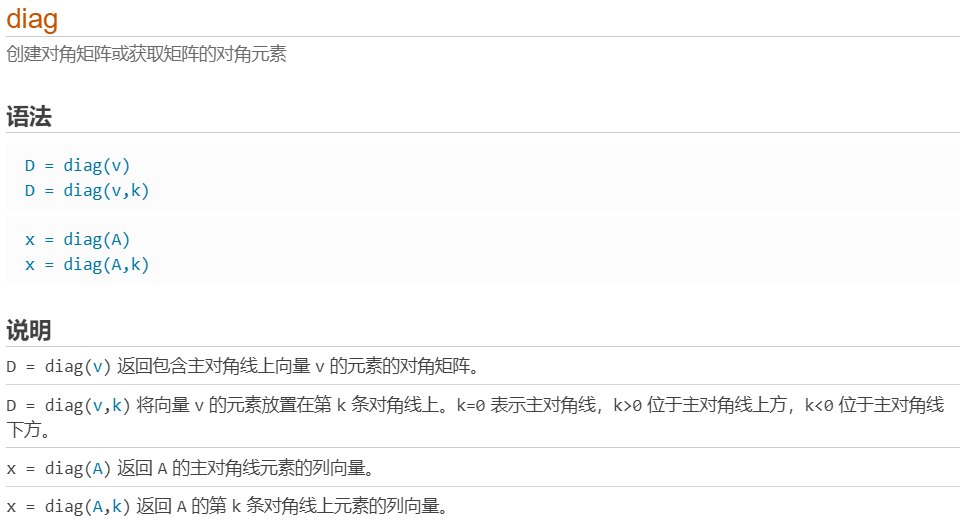
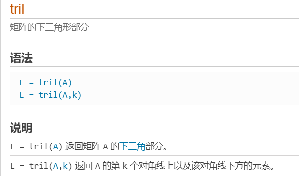
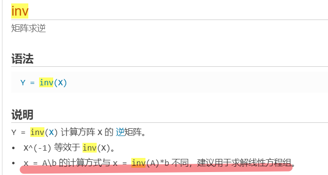
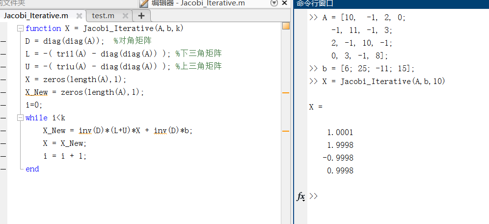

## 1.迭代法求解线性方程组

### 1.1雅可比（Jacobi）迭代法

<!--more-->





triu用于生成矩阵A的上三角部分的矩阵（其余部分为0），用法基本同tril。



```matlab
function X = Jacobi(A,b,k)
D = diag(diag(A));  %对角矩阵
L = -( tril(A) - diag(diag(A)) ); %下三角矩阵
U = -( triu(A) - diag(diag(A)) ); %上三角矩阵
X = zeros(length(A),1);
X_New = zeros(length(A),1);
i=0;
while i<k
    X_New = D\((L+U)*X) + D\b;
    X = X_New;
    i = i + 1;
end
```



注意：

- 源文件中命令不以分号结尾会显示结果在命令行中，加上就不显示。
- 函数名与文件名必须相同。

### 1.2高斯-塞德尔(Gauss-Seidel)迭代法

```matlab
function X = Gauss_Seidel(A,b,k)
D = diag(diag(A));  %对角矩阵
L = -( tril(A) - diag(diag(A)) ); %下三角矩阵
U = -( triu(A) - diag(diag(A)) ); %上三角矩阵
X = zeros(length(A),1);
X_New = zeros(length(A),1);
i=0;
while i<k
    X_New = (D-L)\(U*X) + (D-L)\b;
    X = X_New;
    i = i + 1;
end
```

