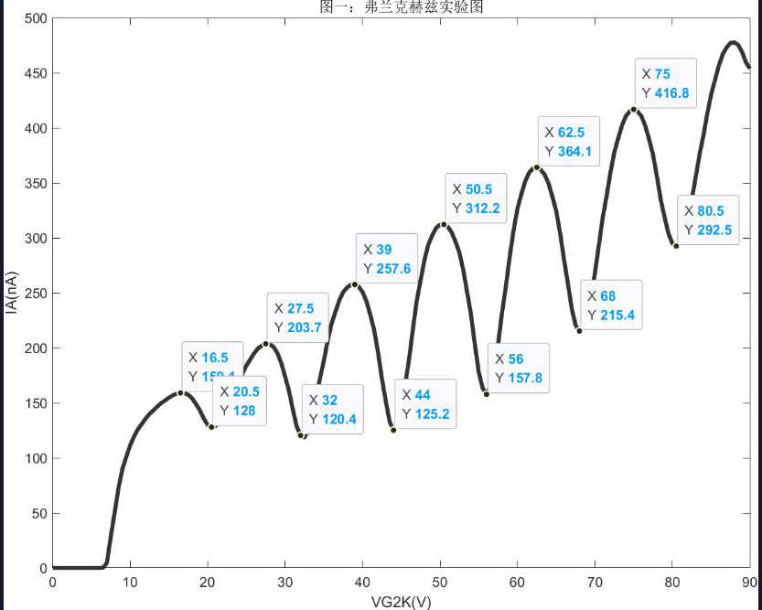

续上文。

<!--more-->

#### 4.简单解绘图

通过弗兰克-赫兹实验的图像来简单了解matlab的绘图方法。

```matlab
clear;
clc;
y=[0 ... 453.8];
x=[0.0 ... 90.0]; % 这里的横纵坐标数据不作展开，只是示例
values = spcrv([[x(1) x x(end)];[y(1) y y(end)]],3);
plot(values(1,:),values(2,:),'LineWidth',3,'Color',[.2 .2 .2]);
title('图一：弗兰克赫兹实验图');

xlabel('VG2K(V)');
ylabel('IA(nA)');
```

如图（图上的峰值谷值是手动添加的）：

