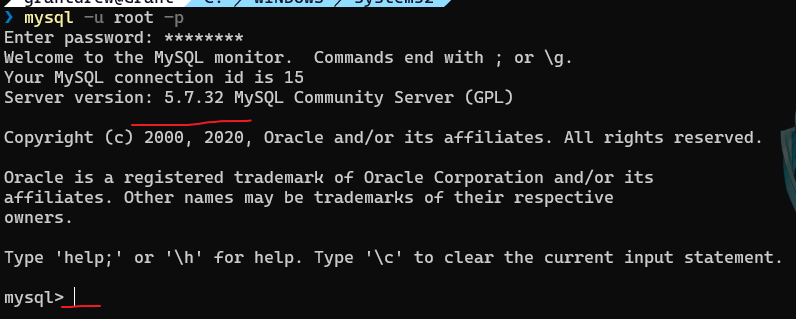
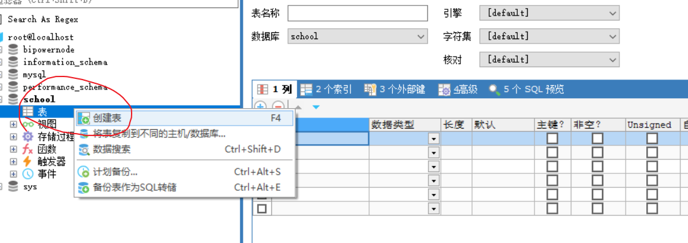
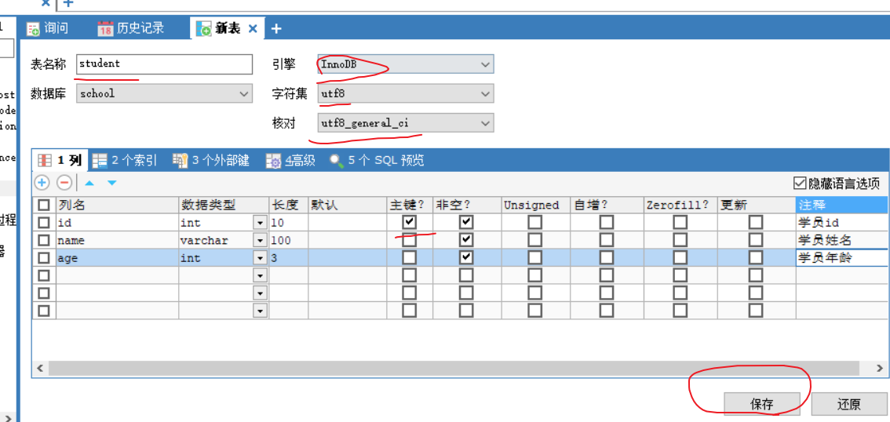
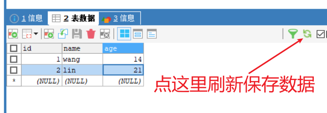
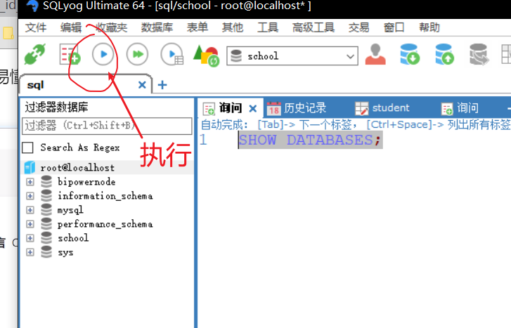

## 1.什么是数据库？

DataBase，数据仓库，用于存储有组织的数据。

数据库分类：

1. 关系型数据库：MySQL，Oracle，...

   - SQL

   - RDBMS，即关系数据库管理系统(Relational Database Management System)

   - 通过表和表之间，行和列之间的关系进行数据的存储，如学员信息表

2. 非关系型数据库：Redis，MongDB，...

   - NoSQL，Not Only SQL

   - 通过对象存储，由对象自身属性来决定。

<!--more-->

DBMS：数据库管理系统

它是数据库的管理软件，通过DBMS来操作管理数据库

软件安装建议：

尽量不要安装exe，卸载时会有注册表残留，尽可能使用压缩包安装，卸载方便

## 2.MySQL入门使用

sql练习网站： http://xuesql.cn/。

牛客网sql题目： https://www.nowcoder.com/ta/sql。

廖雪峰sql教程： https://www.liaoxuefeng.com/wiki/1177760294764384。

安装MySQL直接百度教程就行。

打开cmd命令行，输入`mysql -u root -p`，然后输入密码，进入mysql。



然后是安装SQLyog，建议看我的另一篇[文章](https://grant1499.github.io/2021/04/27/%E4%BD%BF%E7%94%A8SQL%E7%9A%84%E4%B8%A4%E4%B8%AA%E5%B7%A5%E5%85%B7/)。

新建一个数据库school，名称随意。

在`root@localhost`处右键创建数据库，然后填入名称，选择字符集、排序规则，**注意不要选错**。


右键-->创建表。



填入信息。



查看表：

选中左侧表下属的student，打开表。

尝试添加删除数据：



## 3.连接数据库

在cmd中输入

```sql
>mysql -uroot -p你的密码 --连接数据库
-------------------------------
--注意：所有的语句都用;结尾
mysql> show databases;--查看所有的数据库
+--------------------+
| Database           |
+--------------------+
| information_schema |
| bipowernode        |
| mysql              |
| performance_schema |
| school             |
| sys                |
+--------------------+
6 rows in set (0.00 sec)

mysql> use school--使用切换数据库，use 数据库名
Database changed
mysql> show tables;--查看当前数据库所有的表
+------------------+
| Tables_in_school |
+------------------+
| student          |
+------------------+
1 row in set (0.00 sec)

mysql> describe student;--查看查看当前数据库所有表的信息
+-------+--------------+------+-----+---------+-------+
| Field | Type         | Null | Key | Default | Extra |
+-------+--------------+------+-----+---------+-------+
| id    | int(10)      | NO   | PRI | NULL    |       |
| name  | varchar(100) | NO   |     | NULL    |       |
| age   | int(3)       | NO   |     | NULL    |       |
+-------+--------------+------+-----+---------+-------+
3 rows in set (0.00 sec)

mysql> create database school;--创建一个数据库
-----------------------------------
mysql> exit;--退出连接
--单行注释（SQL本来的注释）
/*
SQL的多行注释
*/
```

对于SQLyog的操作：选中语句执行



## 4.数据库的四种语言

CRUD：增删改查

1. DDL： 数据库定义语言
2. DML：数据库操作语言
3. DQL： 数据库查询语言
4. DCL：  数据库控制语言