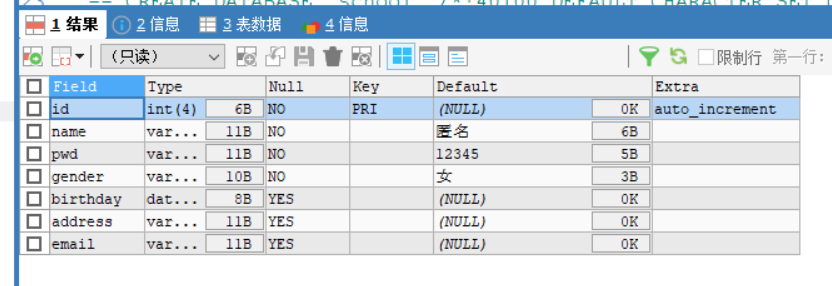
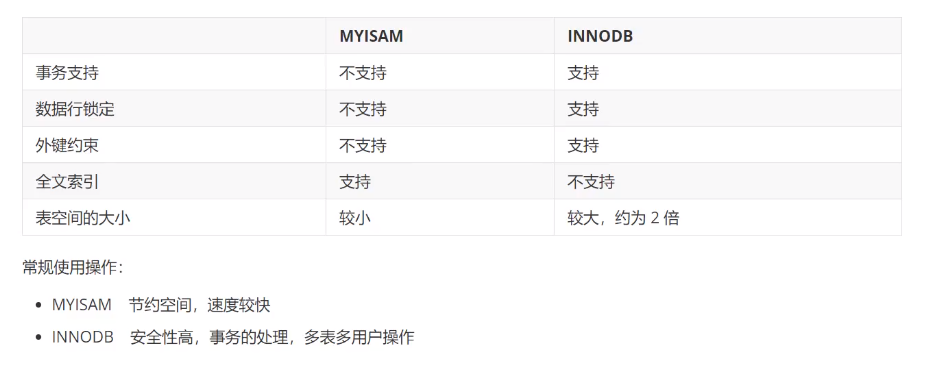
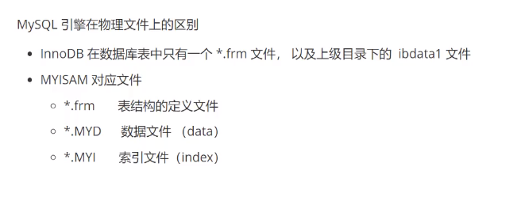

## 1.创建数据库表

<!--more-->

```sql
-- 注意：表的名称和字段尽量用``包起来
-- 字符串使用单引号括起来！（双引号也行）
-- 所有语句后面加,最后一个不用
-- primary key，主键一般一张表一个
CREATE TABLE IF NOT EXISTS `student` (
`id` INT(4) NOT NULL AUTO_INCREMENT COMMENT '学号',
`name` VARCHAR(30) NOT NULL DEFAULT '匿名' COMMENT '姓名',
`pwd` VARCHAR(15) NOT NULL DEFAULT '12345' COMMENT '密码',
`gender` VARCHAR(3) NOT NULL DEFAULT '女' COMMENT '性别',
`birthday` DATETIME DEFAULT NULL COMMENT '出生日期',
`address` VARCHAR(30) DEFAULT NULL COMMENT '家庭住址',
`email` VARCHAR(30) DEFAULT NULL COMMENT '邮箱',
PRIMARY KEY(`id`)
)ENGINE = INNODB DEFAULT CHARSET = utf8
```

## 2.三个常用命令

```sql
-- 查看数据库和表的创建语句
SHOW CREATE DATABASE school
-- CREATE DATABASE `school` /*!40100 DEFAULT CHARACTER SET utf8 */
SHOW CREATE TABLE `student`
-- CREATE TABLE IF NOT EXISTS `student`(XXX)XXX
DESC student
-- 查看表的结构
```



## 3.数据表的类型

关于数据库引擎：（了解）

默认使用INNODB，

早些年使用MYISAM。

两者的区别：



所有数据库文件都存在data目录下，一个文件夹对应一个数据库。

数据库本质还是用文件存储。



了解。

charset设置数据库表的字符集编码。

不设置的话，默认的不支持中文

