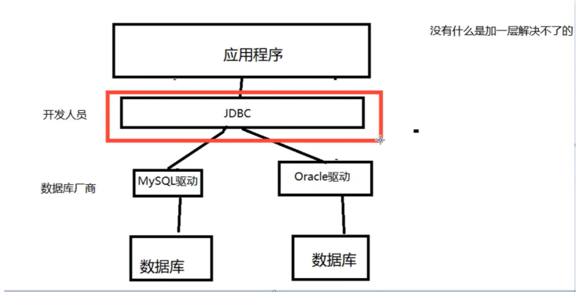

## 1.JDBC（重点）

Java操作数据库。

<!--more-->

### 1.1 数据库驱动

驱动: 声卡，显卡，数据库等等都有驱动。

通过数据库驱动（中间桥梁），应用程序就可以和数据库打交道！

不同数据库厂商会提供相应的数据库驱动。

### 1.2 JDBC概述

规范，一个Java操作数据库的规范；

规范的具体实现，让具体的厂商去做；

对于开发人员来说，只要掌握JDBC接口的操作即可。



IDEA如何彻底删除一个project： https://blog.csdn.net/daponi/article/details/95328834。

IDEA如何在一个project（必须创建空项目）下创建同级module： 

https://blog.csdn.net/qq_42764468/article/details/102496375。

JDBC入门教程（注意你的jar包版本）： https://blog.csdn.net/weixin_44519467/article/details/103175338。

mysql驱动5.1.47： https://mvnrepository.com/artifact/mysql/mysql-connector-java/5.1.47。

要用到的东西：

两个类：java.sql和javax.sql；

还需要导入一个数据库驱动包。

---

### 1.3 第一个JDBC程序

- 导入mysql-connector-java-5.1.49
- 新建jdbc工程
- 将下载的jar包复制到 （lib）下，没有lib目录自行创建
- 在lib目录右键，添加到项目的库，add as library
- idea导入mysql驱动教程： https://www.cnblogs.com/dadian/p/11936056.html
- 如果出现异常，尝试用idea下载驱动导入

2.SQL yog创建测试数据库。

关于SQLyog创建的数据库不显示的问题？

重新建立root用户连接。

3.编写测试代码。

```java
package com.jdbc.java.demo;
import java.sql.Connection;
import java.sql.DriverManager;
import java.sql.ResultSet;
import java.sql.Statement;

// 我的第一个JDBC程序
public class JDBCDemo1 {
    public static void main(String[] args) throws  Exception{
        // jdbc代码也就对应着SQL yog的可视化操作
        // 1.加载驱动 固定写法
        Class.forName("com.mysql.jdbc.Driver");
        // 2.用户信息和url
        String url = "jdbc:mysql://localhost:3306/jdbcstudy?useUnicode=true&characterEncoding=utf8&useSSL=false";
        String username = "root";
        String password = "xxxxxxxx";
        // 3.连接成功，返回数据库对象，Connection代表数据库
        Connection connection = DriverManager.getConnection(url,username,password);
        // 4.执行SQL的对象
        Statement statement = connection.createStatement();
        // 5.执行SQL的对象 去 执行SQL
        String sql = "select * from users;"; // 建议先在SQL yog中跑一遍
        ResultSet resultSet = statement.executeQuery(sql); // 查询操作，返回结果集
        // 结果集中封装了全部查询的结果
        int num = 1;
        while (resultSet.next()){
            System.out.println("line" + num + ":\t");
            System.out.println("id=" + resultSet.getObject("id"));
            System.out.println("NAME=" + resultSet.getObject("NAME"));
            System.out.println("PASSWORD=" + resultSet.getObject("PASSWORD"));
            System.out.println("email=" + resultSet.getObject("email"));
            System.out.println("birthday=" + resultSet.getObject("birthday"));
            num ++;
            System.out.println("------------------------");
        }
        // 6.释放连接  必须要做，会占用内存
        resultSet.close();
        statement.close();
        connection.close();
    }
}
/*
line1:	
id=1
NAME=zhansan
PASSWORD=123456
email=zs@sina.com
birthday=1980-12-04
------------------------
xxx  */
```

```java
// ----------关于上面程序的解释----------
// DriverManager 加载数据库驱动
Class.forName("com.mysql.jdbc.Driver");
-------------------
// url
String url = "jdbc:mysql://localhost:3306/jdbcstudy?useUnicode=true&characterEncoding=utf8&useSSL=false";
//mysql--3306
// jdbc:mysql://主机地址:端口号/数据库名?参数1&参数2...
//oracle--1521
//jdbc:oracle:thin:@localhost:1521:sid
-------------------
// Connection
//链接成功 数据库对象 connection代表数据库
Connection connection = DriverManager.getConnection(url,username,password);
connection.rollback();
connection.commit();    // 数据库层面的操作
connection.setAutoCommit();
-------------------
// Statement  PrepareStatement   执行SQL的对象
statement.executeQuery();//查询操作 返回结果集ResultSet
statement.execute();//可以执行任何sql
statement.executeUpdate();//更新 插入 删除都是用这个，返回受影响的行数
-------------------
// ResultSet 查询结果集
//不知道类型就用Object
resultSet.getObject();
//知道类型可以直接使用对应类型获取
resultSet.getString();
resultSet.getInt();
resultSet.getFloat();
resultSet.getDouble();
// 结果集的结构类似链表通过指针移动
resultSet.next();//移动到下一行数据
resultSet.beforeFirst();//移动到最前
resultSet.afterLast();//移动到最后
resultSet.previous();//移动到前一行
resultSet.absolute(i);//移动到第i行
```

### 1.4 工具类

根据JDBC程序，整体框架是不变的，主要是sql语句的变动。

所以可以封装一个工具类来简化操作。

在`src`目录下新建`db.properties`文件，将驱动操作解耦合。

Properties 继承于 Hashtable。表示一个持久的属性集.属性列表中每个键及其对应值都是一个字符串。

加载Properties配置文件的两种方式在Java入门笔记（二十）讲解过。

```java
// db.properties
driver=com.mysql.jdbc.Driver
url=jdbc:mysql://localhost:3306/jdbcstudy?useSSL=false&useUnicode=true&characterEncoding=utf8
username=root
password=xxx
// 工具类
package com.jdbc.java.demo.utils;
import java.io.InputStream;
import java.sql.*;
import java.util.Properties;

public class Jdbcutil {
    private static  String driver = null;
    private static  String url = null;
    private static  String username = null;
    private static  String password = null;
    static{
        InputStream in = null;
        try{ // 用这种方式获取配置 要求：db.properties与工具类在同一目录下
            in = Jdbcutil.class.getClassLoader().getResourceAsStream("db.properties");
            Properties properties = new Properties();
            properties.load(in);

            driver = properties.getProperty("driver");
            url = properties.getProperty("url");
            username = properties.getProperty("username");
            password = properties.getProperty("password");

            // 1.加载驱动 固定写法
            Class.forName(driver);
        }catch(Exception e){
            e.printStackTrace();
        }finally {
            if (in != null) {
                try {
                    in.close();
                } catch (Exception e) {
                    e.printStackTrace();
                }
            }
        }
    }
    // 获取连接
    public static Connection getConnection() throws SQLException {
        return DriverManager.getConnection(url, username, password);
    }

    // 释放连接
    public static void release(Connection con, Statement st, ResultSet rs) throws SQLException {
        if (rs != null){
            try{
                rs.close();
            }catch(Exception e){
                e.printStackTrace();
            }
        }
        if (st != null){
            try{
                st.close();
            }catch(Exception e){
                e.printStackTrace();
            }
        }
        if (con != null){
            try{
                con.close();
            }catch(Exception e){
                e.printStackTrace();
            }
        }
    }
}
```

插入操作测试类：

```java
package com.jdbc.java.demo;
import com.jdbc.java.demo.utils.Jdbcutil;// 导入封装的工具类
import java.sql.Connection;
import java.sql.ResultSet;
import java.sql.Statement;

public class JDBCDemo2 {
    public static void main(String[] args){
        Connection con = null;
        Statement st = null;
        ResultSet rs = null;
        try{
            con = Jdbcutil.getConnection(); // 获取数据库连接
            st = con.createStatement(); // 创建执行SQL的对象

            String sql = "insert into users(`id`,`NAME`,`PASSWORD`,`email`,`birthday`)" +
                    "values ('4','Tom','123345','2325524@163.com','1993-09-21');";
            int i  = st.executeUpdate(sql);
            if (i > 0) System.out.println("插入数据成功！");
        }catch(Exception e){
            e.printStackTrace();
        }finally {
            try {
                Jdbcutil.release(con, st, rs);
            }catch(Exception e){
                e.printStackTrace();
            }
        }
    }
}
```

以后执行SQL操作只需要将SQL的内容换掉就行，如：

```mysql
DELETE FROM users WHERE id = 4;
```

增删改都用：`executeUpdate`方法，查使用：`executeQuery`方法。