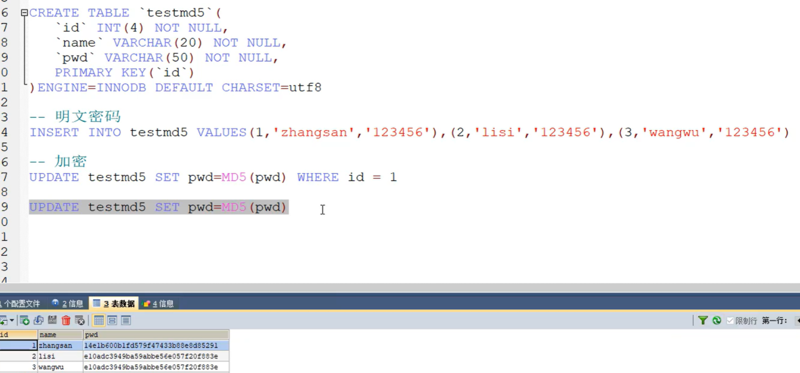

### 6.6 子查询

在where语句中嵌套一个子查询语句。

<!--more-->

`where( select xxx)`

**关联查询的效率比子查询更高。关联查询适合数据量较大的查询。**

```mysql
-- 查询 数据库结构-1 的所有考试结果(学号,科目编号,成绩),并且成绩降序排列
-- 方法一:使用联结查询
SELECT `studentno`,r.`subjectno`,`studentresult`,`subjectname`
FROM `subject` AS sub
INNER JOIN `result` AS r
ON r.`subjectno` = sub.`subjectno`
WHERE `subjectname` = '数据库结构-1'
ORDER BY `studentresult` DESC;

-- 方法二:使用子查询(执行顺序:由里及外)
SELECT `studentno`,r.`subjectno`,`studentresult`
FROM `result` AS r
WHERE r.`subjectno` = ( -- 这里的=最好换成IN
	SELECT `subjectno` FROM `subject` AS sub
	WHERE sub.`subjectname` = '数据库结构-1'
)
ORDER BY `studentresult` DESC;
```

注意：在where子句中使用子查询必须里外的列的数目匹配。

比如上例中：`` r.`subjectno` ``和里面的`` `subjectno` ``都是一列。

小练习：

```mysql
-- 查询课程为 高等数学-2 且分数不小于80分的学生的学号和姓名
-- 方法一:使用连接查询
SELECT s.studentno,studentname
FROM student s
INNER JOIN result r
ON s.`StudentNo` = r.`StudentNo`
INNER JOIN `subject` sub
ON sub.`SubjectNo` = r.`SubjectNo`
WHERE subjectname = '高等数学-2' AND StudentResult>=80

-- 方法二:使用连接查询+子查询
-- 分数不小于80分的学生的学号和姓名
SELECT r.studentno,studentname FROM student s
INNER JOIN result r ON s.`StudentNo`=r.`StudentNo`
WHERE StudentResult>=80

-- 在上面SQL基础上,添加需求:课程为 高等数学-2
SELECT r.studentno,studentname FROM student s
INNER JOIN result r ON s.`StudentNo`=r.`StudentNo`
WHERE StudentResult>=80 AND subjectno=(
   SELECT subjectno FROM `subject`
   WHERE subjectname = '高等数学-2'
)

-- 方法三:使用子查询
-- 分步写简单sql语句,然后将其嵌套起来
SELECT studentno,studentname FROM student WHERE studentno IN(
   SELECT studentno FROM result WHERE StudentResult>=80 AND subjectno=(
       SELECT subjectno FROM `subject` WHERE subjectname = '高等数学-2'
  )
)
-- 子查询效率较低
```

## 7.MySQL函数

一些数学运算和字符串函数：不太用得到

```mysql
-- 数学运算
select abs(-7)
select ceiling(9.4) 向上取整
select floor(9.4) 向下取整
select rand() 返回0~1之间的一个随机数
select sign(10)  返回符号，正数返回1，负数返回-1

-- 字符串函数
select CHAR_LENGTH('string')  字符串长度
select CONCAT('A','B') 拼接字符串，可以有多个参数
SELECT INSERT('12345',1,2,'cc')
-- cc345
-- INSERT(s1,x,len,s2)，字符串 s2 替换 s1 的 x 位置开始长度为 len 的字符串，位置从1开始！！！

LOWER 小写
UPPER 大写

SELECT NOW() -- 获取当前日期和时间
SELECT CURRENT_DATE() -- 查询当前日期
```

**聚合函数（常用）：**运行在行组上，计算和返回单个值的函数。

|函数名|功能|
|---|---|
|**COUNT()**|**返回某列的行数**|
|AVG()|均值|
|SUM()|总和|
|MAX()|最大值|
|MIN()|最小值|

```mysql
SELECT COUNT(`studentname`) FROM `student`; -- count(column)会忽略所有的null值
SELECT COUNT(*) FROM `student`; -- count(*)不会忽略null
SELECT COUNT(1) FROM `student`; -- count(1)不会忽略null

SELECT SUM(`studentresult`) AS 总分 FROM `result`;
SELECT AVG(`studentresult`) AS 平均分 FROM `result`;
SELECT MAX(`studentresult`) AS 最高分 FROM `result`;
SELECT MIN(`studentresult`) AS 最低分 FROM `result`;
```

分组与过滤：

```mysql
-- 分组之前，只能查出一条数据，所有分数不分具体科目
SELECT any_value(`subjectname`) 科目,AVG(`studentresult`) 平均分,
MAX(`studentresult`) 最高分,MIN(`studentresult`) 最低分
FROM result r
INNER JOIN `subject` sub
ON r.`subjectno` = sub.`subjectno`;
-- 分组之后，能够按科目查询对应分数
SELECT `subjectname` 科目,AVG(`studentresult`) 平均分,
MAX(`studentresult`) 最高分,MIN(`studentresult`) 最低分
FROM result r
INNER JOIN `subject` sub
ON r.`subjectno` = sub.`subjectno`
GROUP BY r.`subjectno`;
```

分组之后再过滤数据，用`HAVING`子句。

HAVING和WHERE子句的重要区别：

WHERE用于分组前的数据过滤，HAVING用于分组后的数据过滤。这里的前后指的是逻辑上的前后，即：WHERE的内容必须在分组之前就能查询到。WHERE先计算再过滤，HAVING先过滤再计算。

WHERE不能用于聚合函数，HAVING子句

```mysql
...
GROUP BY r.`subjectno`
HAVING AVG(`studentresult`) >= 70;
```

## 8.课外拓展：数据库级别的MD5加密

MD5即Message-Digest Algorithm 5（信息-摘要算法5），用于确保信息传输完整一致。是计算机广泛使用的杂凑算法之一（又译摘要算法、哈希算法），主流编程语言普遍已有MD5实现。

主要增强算法复杂度和不可逆性。



如何校验？

将用户传入的密码进行md5加密后与数据库中加密后的密码匹配。

## 9.事务（重要）

MySQL 事务主要用于处理操作量大，复杂度高的数据。

参考博客： https://www.jianshu.com/p/081a3e208e32。

举个经典的银行转账的例子：

```mysql
1. sql语句1  A 给 B 转账      A  1000 -- > 200 B: 200
2. sql语句2  B 收到 A 的 钱 A 800  B 400
```

显然我们不希望看到语句1执行成功而语句2执行失败这样的情况发生。

事务处理是一种机制，用来管理必须成批执行的MySQL操作，以保证不会发生意外。

简而言之，**事务就是将一组SQL放在一个批次中执行。**这组SQL操作要么都成功，要么都失败。

---

一般来说，事务是必须满足4个条件（ACID）：：原子性（**A**tomicity，或称不可分割性）、一致性（**C**onsistency）、隔离性（**I**solation，又称独立性）、持久性（**D**urability）。

- **原子性：**一个事务（transaction）中的所有操作，要么全部完成，要么全部不完成，不会结束在中间某个环节。事务在执行过程中发生错误，会被回滚（Rollback）到事务开始前的状态，就像这个事务从来没有执行过一样。
- **一致性：**在事务开始之前和事务结束以后，数据库的完整性没有被破坏。这表示写入的资料必须完全符合所有的预设规则，这包含资料的精确度、串联性以及后续数据库可以自发性地完成预定的工作。
- **隔离性：**数据库允许多个并发事务同时对其数据进行读写和修改的能力，隔离性可以防止多个事务并发执行时由于交叉执行而导致数据的不一致。事务隔离分为不同级别，包括读未提交（Read uncommitted）、读提交（read committed）、可重复读（repeatable read）和串行化（Serializable）。
- **持久性：**事务处理结束后，对数据的修改就是永久的，即便系统故障也不会丢失。

持久性：事务处理结束后数据不随外界原因导致数据丢失。

- 事务还没提交，重启数据库会恢复到原状；
- 事务一旦提交不可逆转，重启数据库会被持久化到数据库中。
- 隔离所导致的问题：

隔离性（并行事务）导致的问题：

脏读：
	指一个事务读取了另外一个事务未提交的数据。

不可重复读：
	在一个事务内读取表中的某一行数据，多次读取结果不同。（这个不一定是错误，只是某些场合不对）

虚读(幻读)
	是指在一个事务内读取到了别的事务插入的数据，导致前后读取数量总量不一致。

---

感觉事务处理和Git版本控制有点像。


