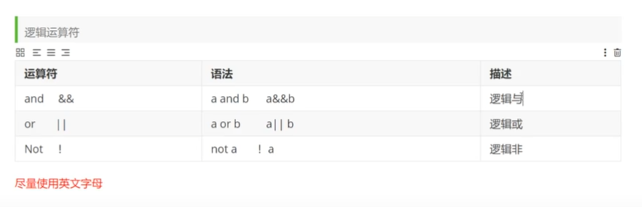

### 5.5 删除

<!--more-->

**delete命令：**

不会影响自增。

```mysql
delete from `student`;  -- 全删了
-- 删除指定数据
delete from `student` where id = 1;
```

`ddelete`和`update`一样，也有一个`where`子句，可选可不选，最好加上。

**truncate命令：**完全清空数据库，但表结构 ， 索引 ， 约束等不变 。

- truncate 重新设置 自增列 计数器归零
- truncate 不会影响事务

```mysql
truncate `student`;
truncate table `student`;
```

delete，drop，truncate 都有删除表的作用，区别在于：

- 1、delete 和 truncate 仅仅删除表数据，drop 连表数据和表结构一起删除，打个比方，delete 是单杀，truncate 是团灭，drop 是把电脑摔了。
-  2、delete 是 DML 语句，操作完以后如果没有不想提交事务还可以回滚，truncate 和 drop 是 DDL 语句，操作完马上生效，不能回滚，打个比方，delete 是发微信说分手，后悔还可以撤回，truncate 和 drop 是直接扇耳光说滚，不能反悔。
-  3、执行的速度上，**drop>truncate>delete**，打个比方，drop 是神舟火箭，truncate 是和谐号动车，delete 是自行车。

## 6.DQL：数据库查询语言（最重点）


MySQL 数据库使用SQL SELECT语句来查询数据。它可能是用的最多的语句。

**数据库中最核心的语句。**

测试数据：

```mysql
CREATE DATABASE IF NOT EXISTS `school`;
-- 创建一个school数据库
USE `school`;-- 创建学生表
DROP TABLE IF EXISTS `student`;
CREATE TABLE `student`(
    `studentno` INT(4) NOT NULL COMMENT '学号',
    `loginpwd` VARCHAR(20) DEFAULT NULL,
    `studentname` VARCHAR(20) DEFAULT NULL COMMENT '学生姓名',
    `sex` TINYINT(1) DEFAULT NULL COMMENT '性别，0或1',
    `gradeid` INT(11) DEFAULT NULL COMMENT '年级编号',
    `phone` VARCHAR(50) NOT NULL COMMENT '联系电话，允许为空',
    `address` VARCHAR(255) NOT NULL COMMENT '地址，允许为空',
    `borndate` DATETIME DEFAULT NULL COMMENT '出生时间',
    `email` VARCHAR (50) NOT NULL COMMENT '邮箱账号允许为空',
    `identitycard` VARCHAR(18) DEFAULT NULL COMMENT '身份证号',
    PRIMARY KEY (`studentno`),
    UNIQUE KEY `identitycard`(`identitycard`),
    KEY `email` (`email`)
)ENGINE=MYISAM DEFAULT CHARSET=utf8;


-- 创建年级表
DROP TABLE IF EXISTS `grade`;
CREATE TABLE `grade`(
    `gradeid` INT(11) NOT NULL AUTO_INCREMENT COMMENT '年级编号',
  `gradename` VARCHAR(50) NOT NULL COMMENT '年级名称',
    PRIMARY KEY (`gradeid`)
) ENGINE=INNODB AUTO_INCREMENT = 6 DEFAULT CHARSET = utf8;

-- 创建科目表
DROP TABLE IF EXISTS `subject`;
CREATE TABLE `subject`(
    `subjectno`INT(11) NOT NULL AUTO_INCREMENT COMMENT '课程编号',
    `subjectname` VARCHAR(50) DEFAULT NULL COMMENT '课程名称',
    `classhour` INT(4) DEFAULT NULL COMMENT '学时',
    `gradeid` INT(4) DEFAULT NULL COMMENT '年级编号',
    PRIMARY KEY (`subjectno`)
)ENGINE = INNODB AUTO_INCREMENT = 19 DEFAULT CHARSET = utf8;

-- 创建成绩表
DROP TABLE IF EXISTS `result`;
CREATE TABLE `result`(
    `studentno` INT(4) NOT NULL COMMENT '学号',
    `subjectno` INT(4) NOT NULL COMMENT '课程编号',
    `examdate` DATETIME NOT NULL COMMENT '考试日期',
    `studentresult` INT (4) NOT NULL COMMENT '考试成绩',
    KEY `subjectno` (`subjectno`)
)ENGINE = INNODB DEFAULT CHARSET = utf8;


-- 插入科目数据
INSERT INTO `subject`(`subjectno`,`subjectname`,`classhour`,`gradeid`)VALUES
(1,'高等数学-1',110,1),
(2,'高等数学-2',110,2),
(3,'高等数学-3',100,3),
(4,'高等数学-4',130,4),
(5,'C语言-1',110,1),
(6,'C语言-2',110,2),
(7,'C语言-3',100,3),
(8,'C语言-4',130,4),
(9,'Java程序设计-1',110,1),
(10,'Java程序设计-2',110,2),
(11,'Java程序设计-3',100,3),
(12,'Java程序设计-4',130,4),
(13,'数据库结构-1',110,1),
(14,'数据库结构-2',110,2),
(15,'数据库结构-3',100,3),
(16,'数据库结构-4',130,4),
(17,'C#基础',130,1);


-- 插入学生数据 其余自行添加 这里只添加了2行
INSERT INTO `student` (`studentno`,`loginpwd`,`studentname`,`sex`,`gradeid`,`phone`,`address`,`borndate`,`email`,`identitycard`)
VALUES
(1000,'123456','张伟',0,2,'13800001234','北京朝阳','1980-1-1','text123@qq.com','123456198001011234'),
(1001,'123456','赵强',1,3,'13800002222','广东深圳','1990-1-1','text111@qq.com','123456199001011233');


-- 插入成绩数据  这里仅插入了一组，其余自行添加
INSERT INTO `result`(`studentno`,`subjectno`,`examdate`,`studentresult`)
VALUES
(1000,1,'2013-11-11 16:00:00',85),
(1000,2,'2013-11-12 16:00:00',70),
(1000,3,'2013-11-11 09:00:00',68),
(1000,4,'2013-11-13 16:00:00',98),
(1000,5,'2013-11-14 16:00:00',58);

-- 插入年级数据
INSERT INTO `grade` (`gradeid`,`gradename`) VALUES(1,'大一'),(2,'大二'),(3,'大三'),(4,'大四'),(5,'预科班');
```

### 6.1 指定查询字段

```mysql
-- 查询表中全部信息，开发中较少用到，要用什么就查什么
SELECT * FROM student;  --查询所有学生
SELECT * FROM result; --查询所有成绩

-- 查询指定字段
SELECT `studentno`, `studentname` FROM student;

studentno   studentname
1000    张伟
1001    赵强

-- 使用别名 ， 给结果起一个名字替换列名 -- 也可以给表起别名
-- 其实 AS 关键字也可以省略
SELECT `studentno` AS  学号, `studentname` AS 学生姓名 FROM student as s;

学号  学生姓名
1000    张伟
1001    赵强


-- 函数 concat(a,b)
SELECT CONCAT('姓名：', `studentname`) AS 新名字 FROM student;

新名字
姓名：张伟
姓名：赵强
```

去重复：`distinct`关键字。

作用： 去除select 查询出来的结果中重复的数据，只显示一条。

```mysql
SELECT `studentno` `学号` FROM `result`;
SELECT  DISTINCT `studentno` `学号` FROM `result`;
-- 如果查询两个字段，除非它们都相同同，否则 DISTINCT 会将它们认为是不同数据
```

`SELECT`的其他用法：

```mysql
SELECT VERSION() -- 查询系统版本（函数）
SELECT 23*7-23 AS result -- 计算表达式
SELECT @@auto_increment_increment -- 查询自增步长（变量）
-- 查询学生考试成绩，+1分后查看
SELECT `studentno`,`studentresult`+1 FROM `result`;
```

`select`语法格式：`select 表达式 from 表`。

**完整语法：子句顺序不能换。**

```mysql
SELECT [ALL | DISTINCT]
{* | table.* | [table.field1[as alias1][,table.field2[as alias2]][,...]]}
FROM table_name [as table_alias]
  [left | right | inner join table_name2]  -- 联合查询
  [WHERE ...]  -- 指定结果需满足的条件
  [GROUP BY ...]  -- 指定结果按照哪几个字段来分组
  [HAVING]  -- 过滤分组的记录必须满足的次要条件
  [ORDER BY ...]  -- 指定查询记录按一个或多个条件排序
  [LIMIT {[offset,]row_count | row_countOFFSET offset}];
   -- 指定查询的记录从哪条至哪条
   -- **注意 : [ ] 括号代表可选的 , { }括号代表必选得**
```

### 6.2 `where`条件子句

作用：检索数据中`符合条件`的值。

`where`子句在一条语句中只能用一次，多个过滤条件用`and`连接。

**逻辑运算符：**



尽量使用英文字母（如`AND`之类的），有语法高亮。

```mysql
-- 查询一个区间内的学生成绩
-- 方式1，速度更快
SELECT `studentno` AS `学号`,`studentresult` AS `成绩` FROM `result`
WHERE `studentresult` BETWEEN 70 AND 100;
-- 方式2
SELECT `studentno` AS `学号`,`studentresult` AS `成绩` FROM `result`
WHERE `studentresult` >= 70 AND `studentresult` <= 100;

-- 查询成绩不等于70的学生成绩
-- 方式1
SELECT `studentno` AS `学号`,`studentresult` AS `成绩` FROM `result`
WHERE `studentresult` != 70;
-- 方式2
SELECT `studentno` AS `学号`,`studentresult` AS `成绩` FROM `result`
WHERE NOT `studentresult` = 70;
```

**模糊查询（重点）：**

本质就是一些比较运算符。

| 运算符      | 语法              | 描述                             |
| ----------- | ----------------- | -------------------------------- |
| is null     | a is null         | 操作符null,结果真                |
| is not null | a is not null     |                                  |
| between and | a between b and c |                                  |
| **like**    | a like b          | SQL匹配，如果匹配，真            |
| **in**      | a in (a1,a2,…)    | 假设a在a1,或者a2,…其中一个返回真 |

**`LIKE`操作符配合通配符进行模糊查询。**

参考文章：http://c.biancheng.net/view/7395.html。

“%”是 MySQL 中最常用的通配符，它能代表任何长度的字符串，字符串的长度可以为 0。例如，`a%b`表示以字母 a 开头，以字母 b 结尾的任意长度的字符串。该字符串可以代表 ab、acb、accb、accrb 等字符串；`%e%`表示所有包含字母`e`的任意长度的字符串。

“_”只能代表单个字符，字符的长度不能为 0。例如，`a_b`可以代表 acb、adb、aub 等字符串。

注意：**匹配的字符串必须加单引号或双引号**。

`NOT LIKE` 表示字符串不匹配时满足条件。

“%”不能匹配到NULL，这是唯一的例外。

默认情况下，LIKE 关键字匹配字符的时候是不区分大小写的。如果需要区分大小写，可以加入 BINARY 关键字，`LIKE BINARY`。

```mysql
-- 以张开头
SELECT `studentno`,`studentname` FROM student
WHERE `studentname` LIKE '张%';

-- 中间有某个字  %张%
```

**`IN`操作符：**

查询具体的一个或多个值，不能模糊查询。

```mysql
SELECT `studentno`,`studentname`,`address` FROM student
WHERE `address` IN ('广东深圳','江西南昌');
```

```mysql
-- 查询地址为空的同学，空字符串或者NULL
SELECT `studentno`,`studentname`,`address` FROM student
WHERE `address`='' OR `address` IS NULL;
```