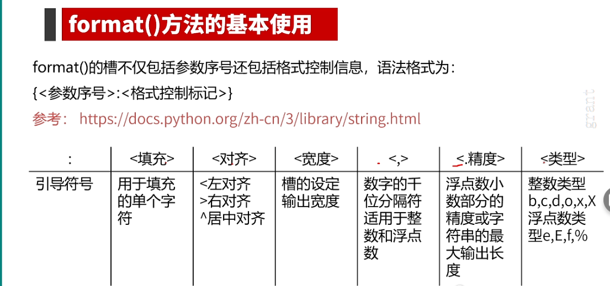
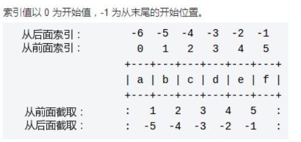

##### 1.多行语句

使用 \ 来实现多行语句：（尽量不用续行符）

<!--more-->

```python
total = item_one + \
        item_two + \
        item_three
s = 'string,\
abc,\
de'  # 注意这里续行符后不能存在空格，续行符之后直接换行
```

在  [], {}, 或 () 中的多行语句，不需要使用反斜杠()，例如：

```python
total = ['item_one', 'item_two', 'item_three',
        'item_four', 'item_five']
```

##### 2.print函数的格式化输出

示例：

练习1：华氏温度转换为摄氏温度。

> 提示：华氏温度到摄氏温度的转换公式为：$C=(F−32)÷1.8$

```python
f = float(input('请输入华氏温度: '))
c = (f - 32) / 1.8
print('%.1f华氏度 = %.1f摄氏度' % (f, c)) # solution1
print('{:.1f}华氏度 = {:.1f}摄氏度'.format(f,c))# solution2,不带编号输出
print('{0:.1f}华氏度 = {1:.1f}摄氏度'.format(f,c))# solution3,带编号输出
print(f'{f:.1f}华氏度 = {c:.1f}摄氏度')# solution4,带关键字输出1
print('{0:.1f}华氏度 = {1:.1f}摄氏度'.format(f,c))# solution5,带关键字输出2
```

###### 2.1 %操作符的使用：

%o：oct，八进制

%c:  返回整数对应的Unicode字符

%d：dec，十进制；%2d ：占位符2位，空格填充；%02d：占位符2位，0填充

%x：hex，十六进制

%f：保留小数点后6位有效数字。如果是%.3f则保留3位小数

%e：保留小数点后6位有效数字，按指数形式输出，如果是%.3e则保留3位小数位，使用科学记数法

%s：字符串

%10s：右对齐，占位符10位

%-10s：左对齐，占位符10位

%.2s：截取两位字符串

%10.2s：10位占位符，截取两位字符串

###### 2.2 str.format() 格式化：

{:.2f}: 保留2位小数

{:+.2f}: 带正负号，保留2位小数

**{:.0f}: 不带小数**

{:0>2d}: 数字补零 (填充左边, 宽度为2)，即右对齐

{:x<4d} : 数字补x (填充右边, 宽度为4) ，即左对齐

{:,} : 以逗号分隔的数字，每三位分隔

{:.2e} : 指数计数法，例1.00e+09 

{:>10d} ,{:<10d} ,{:^10d} : 右，左，居中对齐，宽度为10

{:b},{:d},{:o},{:x},{:#x},{:c}: 输出二，十，八，十六进制数，整数对应的Unicode字符

|                                                              |                           |
| ------------------------------------------------------------ | ------------------------- |
| `‘{:b}’.format(11)  ‘{:d}’.format(11)  ‘{:o}’.format(11)  ‘{:x}’.format(11)  ‘{:#x}’.format(11)  ‘{:#X}’.format(11)` | 1011  11  13  b  0xb  0XB |

^, <, > 分别是居中、左对齐、右对齐，后面带宽度， : 号后面带填充的字符，只能是一个字符，不指定则默认是用空格填充。

\+ 表示在正数前显示 +，负数前显示 -；` `（空格）表示在正数前加空格

b、d、o、x 分别是二进制、十进制、八进制、十六进制。

```python
#此外我们可以使用大括号 {} 来转义大括号
>>> print ("{} 对应的位置是 {{0}}".format("runoob"))
runoob 对应的位置是 {0}
# 字符串拼接
>>> print('dDASD','fdsd','dsf')
#print()会依次打印每个字符串，遇到逗号“,”会输出一个空格
```



注意引导符号的优先顺序！！！以上表格建议背下来！！！

##### 3.python的主要数据类型

-  number：int, bool, float, complex 其中bool包括True和False
-  str：加了引号的字符都被认为是字符串
-  tuple：元组和列表一样，也是一种序列，与列表不同的是，元组是不可修改的
-  dict：字典是一种键值对的集合，列表是有序的对象集合，字典是无序的对象集合
-  set：集合是一个无序的、不重复的数据组合，主要作用有两个，分别是去重和关系测试
-  list：列表是由一系列特定元素顺序排列的元素组成的

```python
# list
a = [1,'two',3.0]

# tuple
b = (1,'throw',4.2)

# dict
c = {1:'one',2:'two'}

# set
d = set([1,2,3,4,3,1])
>>>set
{1, 2, 3, 4} # set只保留不重复的数据
```

##### 4.变量类型转换

可以使用Python中内置的函数对变量类型进行转换。

- `int()`：将一个数值或字符串转换成整数，可以指定进制。
- `float()`：将一个字符串转换成浮点数。
- `str()`：将指定的对象转换成字符串形式，可以指定编码。
- `chr()`：将整数转换成该编码对应的字符串（一个字符）。
- `ord()`：将字符串（一个字符）转换成对应的编码（整数）。

##### 5.常用运算符

| 运算符           | 描述                                  |
| ---------------- | ------------------------------------- |
| `[]` `[:]`       | 下标，切片                            |
| **               | 指数                                  |
| `~ + -`          | 按位取反，正负号                      |
| `* / % //`       | 乘，除，模，整除                      |
| `is` `is not`    | 身份运算符                            |
| `in`  `not in`   | 成员运算符                            |
| `not` `or` `and` | 逻辑运算符，与C的&&，！，\|\|注意区别 |

**优先级：not > and >or**　

**说明：**   大家可以自己感受一下这两种写法到底是哪一种更好。在之前我们提到的Python之禅中有这么一句话“Flat is better than   nested.”，之所以提倡代码“扁平化”是因为嵌套结构的嵌套层次多了之后会严重的影响代码的可读性，所以能使用扁平化的结构时就不要使用嵌套。

##### 6.循环结构

在Python中构造循环结构有两种做法，一种是`for-in`循环，一种是`while`循环。

###### 6.1 for-in 循环

```python
"""
用for循环实现1~100求和
"""
sum = 0
for x in range(101): # 不写的话默认从0开始
    sum += x
print(sum)

"""
打印乘法口诀表
"""
for i in range(1, 10):
    for j in range(1, i + 1):
        print('%d*%d=%d' % (i, j, i * j), end='\t')
    print()
```

需要说明的是上面代码中的`range(1, 101)`可以用来构造一个从1到100的范围，当我们把这样一个范围放到`for-in`循环中，就可以通过前面的循环变量`x`依次取出从1到100的整数。当然，`range`的用法非常灵活，下面给出了一个例子：

- `range(101)`：可以用来产生0到100范围的整数，需要注意的是取不到101。
- `range(1, 101)`：(左闭右开)可以用来产生1到100范围的整数，相当于前面是闭区间后面是开区间。
- `range(1, 101, 2)`：可以用来产生1到100的奇数，其中2是步长，即每次数值递增的值。
- `range(100, 0, -2)`：可以用来产生100到1的偶数，其中-2是步长，即每次数字递减的值。

###### 6.2 while 循环

```python
while True:
    counter += 1
    number = int(input('请输入: '))
```

注意break和continue关键字，作用基本同C/C++.

##### 7.练习：输入两个正整数，计算它们的最大公约数和最小公倍数。

```python
x = int(input('x = '))
y = int(input('y = '))

if x > y: # 这里可以直接简化为 x,y = y,x
    t = x
    x = y
    y = t

for n in range(x,0,-1):
    if not x%n and not y%n:
        print('{}是最大公约数，{}是最小公倍数'.format(n,x*y//n)) # "//" 对应C的"/"
        break
```

##### 8.整数与浮点数

二进制（Bin）：0b或0B，例0b1010

八进制（Oct）：0o或0O，例0o1010

十进制（Dec）：无，默认十进制

十六进制（Hex）：0x或0X，例0x1010

浮点数科学计数法：`1e-6 == 1*10^-6`

注意浮点数的计算不是完全精确的！！！

```python
>>> 0.1 + 0.2 == 0.3
False

# solution 1,使用round函数四舍五入保留一定位数再判断
>>> round(0.1+0.2,5) == round(0.3,5)
True
>>> round(0.1+0.2,20) == round(0.3,20)
False

#solution 2,两数作差，当差值足够小时认为近似相等
>>> abs((0.1+0.2)-0.3) < 1e-10
True
```

##### 9.一些内置数值运算函数

| **函数**             | **描述**                                                |
| -------------------- | ------------------------------------------------------- |
| abs(x)               | x的绝对值  ，计算整数、浮点数结果为非负值，也可用于复数 |
| divmod(x,y)          | (x//y,x%y)，输出为二元组形式                            |
| pow(x,y)或pow(x,y,z) | `x**y或(x**y)%z`，幂运算                                |
| round(x)或round(x,d) | 对x四舍五入，保留d位小数，无参则返回x的整数             |
| max(x1,x2,…,xn)      | 任意数量的最大值                                        |
| min(x1,x2, …,xn)     | 任意数量的最小值                                        |

```python
>>> divmod(10,3)
(3,1)
>>> pow(10,2)
100
>>> pow(2,5,3) == pow(2,5)%3
2
>>> round(1,3),round(0.5),round(1.5) # 奇进偶不进只针对round(x)
1,0,2 # 奇进偶不进取决于小数点前一位
# 如果保留小数位数是0位或1位，奇进偶不进
# 如果保留位数的后一位数字是5且后面还有数字，则进
>>> round(2.30000045,5) # 多余的0省略s
2.3
# round()函数掌握一进整，二进一即可，可能存在一些精度问题，避免使用太多
```

##### 10.字符串

两种索引方式：（1）从左到右，从0开始到长度-1,；（2）从右到左，从-1开始到开头

截取方式：



**牢牢记住**：不管索引还是截断，都是**左闭右开**的！！！

```python
>>> str = 'IlovePython'
>>> str[3] # 第4个字符
'v'
>>> str[-3] # 倒数第3个字符
'h'
>>> str[:] # 整个字符串
'IlovePython'
>>> str[1:] # 第2个字符 -> 最后面
'lovePython'
>>> str[2:6] # 第3个字符 -> 第6个
'oveP'
>>> str[:-1] # 最前面 -> 倒数第2个(左闭右开，不包括最后一个)
'IlovePytho'
>>> str[-5:-1] # 倒数第5个 -> 倒数第2个(左闭右开，不包括最后一个)
'ytho'
```

创建字符串：单、双、三引号

```python
s = 'asdsd' or s = "sadaf"
s = '''asdfdf!
afdgg''' # 相当于加一个\n
```

len()函数：返回字符串长度或者字符数

```python
#ininstance()和type()判断类型：
s = 'adsaf'
>>> type(s)
<class 'str'>
>>> type(s) == str
True
>>> isinstance(s,str)
True
```

字符串的相关操作：

`x + y`: 连接两个字符串x，y，不加空格，如果用逗号会自动加空格

`x * n`: 复制n次字符(串)x

`x in s`: x 在s中，返回True

`x not in s`:与上面相反

r/R:原始字符串（raw），所有的字符串都是直接按照字面的意思来使用，没有转义特殊或不能打印的字符。在字符串的第一个引号前加上字母 r/R。`print( r'\badc\t\n' )`

```python
>>> print('a' * 8)
aaaaaaaa
>>> print('a,b' * 4)
a,ba,ba,ba,b
>>> 'a' in 'fggfsgradgf'
True
```

字符串处理函数：

| **函数** | **描述**                                                |
| -------- | ------------------------------------------------------- |
| len(x)   | 返回字符串x的长度或者是其他组合类型的元素个数           |
| str(x)   | 把任意类型转换为字符串形式                              |
| chr(x)   | 返回Unicode编码对应的单字符，**注意是Unicode不是ASCII** |
| ord(x)   | 返回单个字符对应的Unicode编码                           |
| hex(x)   | 返回整数x对应的十六进制的小写形式，返回字符串           |
| oct(x)   | 返回整数x对应的八进制的小写形式返回字符串               |

字符串处理方法：（str用于替换字符串变量名）

| **方法**                   | **描述**                                         |
| -------------------------- | ------------------------------------------------ |
| str.lower()                | 以小写的方式全部返回str的副本                    |
| str.upper()                | 以大写的方式全部返回str的副本                    |
| str.split(sep=None)        | 返回一个列表，以sep作为分隔点，sep默认为空格或\n |
| str.count(sub)             | 返回sub子串出现的次数                            |
| str.replace(old,new)       | 返回字符串str的副本，所有old子串被替换为new      |
| str.center(width,fillchar) | 字符串居中函数，fillchar参数可选，用于填充       |
| str.format()               | 格式化字符串                                     |
| str.strip(chars)           | 从字符串str中去掉在其左侧和右侧chars中列出的字符 |
| str.join(iter)             | 将iter变量的每一个元素后面增加一个str            |
| str.isdigit()              | 如果 str只包含数字则返回 True 否则返回 False.    |

str.join(iter)：注意，str是一个字符串，里面包含着你将要将可迭代变量中元素分隔的符号

```python
s = "abc"
print(",".join(s))
# a,b,c

# 注意str.replace()返回str的副本，并不会修改str
s = "bilaoshi"
print(s.replace("bi","xu"))
print(s)
# xulaoshi
# bilaoshi

>>> "1234".isdigit()
True
>>> "213.254".isdigit()
False
```