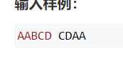
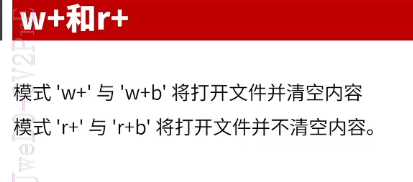
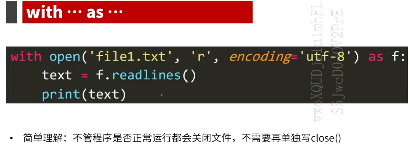
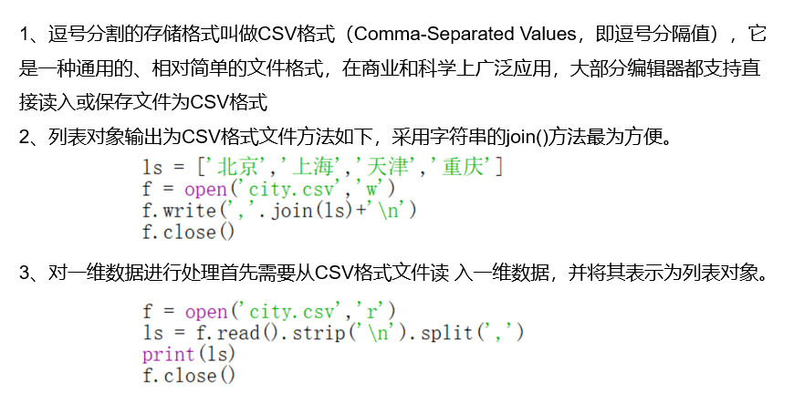

## 1.函数

四种传递参数的方式！！！

<!--more-->

```python
def sum(a,b):
    print(a+b)
    
sum(2,2)
```

**位置参数**是比较常用的形式，调用函数时实参和形参的顺序必须一致，并且数量相同。

​    **默认值参数**：函数的参数在定义时也可以指定默认值，函数调用时若该位置没有给定实际参数，则使用默认值代替。但需要注意可选参数应当放在非可选参数后面。

```python
def mul(x,y=10):
    print(x*y)

mul(2,5)# 2 * 5 = 10
mul(2)# 2 * 10 = 20
def mul(y=10,x): #ERROR:默认参数不能放在位置参数前面
def mul(x,z,y=10):
    print(x*y)
mul(2,3) # 20
```

**关键字参数**：

```python
def mul(x,y):
    print(x,y)
    
mul(y = 2,x = 99)
```

**可变长度参数**：

除了以上传参方式以外，当我们不确定会接受多少个参数的时候可以利用可变长度参数解决。

​    *param接收任意多个参数放在一个元组中

​    **param接收任意多个关键字参数放入字典中

```python
#  *param返回元组
def mul(*x):
    print(x)
    
mul(2,3,4,5,6,7)# (2, 3, 4, 5, 6, 7)
# **param返回字典
def demo(**p):
    print(p)
demo(a=1,b=2,c=3)# {'a': 1, 'b': 2, 'c': 3}
demo(1,2,3)# ERROR:只能以关键字方式接受参数
```

## 2.变量的作用域

局部变量仅在函数内部，且作用域也在函数内部，全局变量的作用域跨越多个函数。

当局部变量与全局变量同名时，函数内部会优先使用局部变量。

```python
a = 1 # 全局变量
b = 2
def sum(x,y):
    s = x + y
    print(s)# 3，局部变量
    print(a)# 1
sum(a,b)
```

全局变量指在函数之外定义的变量，在程序执行全过程有效。全部变量在函数内部使用（修改）时，需要提前使用保留字global声明，语法形式如下：

```python
a = 1
b = 2
def sum(x,y):
    s = x + y
    a = 4 # 未使用global，在函数内部不能修改全局变量
    # 此处的a是一个同名的局部变量
    # 建议尽量不适用global，以免与外面代码形成耦合容易出错
sum(a,b)
print(a)

a = 1
b = 2
def sum(x,y):
    print(x+y)
    global a
    a = 4
sum(a,b)
print(a)# a == 4
```

## 3.函数的返回值

- 用return返回函数值，作用同C/C++。
- return语句可以出现在函数中的任何部分。
- return可以同时返回0个或多个函数运算的结果给函数被调用处的变量。
- 当return返回多个值时，返回的值形成元组数据类型。
- 函数也可以没有return代表无返回值。

```python
a = 1
b = 2
def sum(x,y):
    s = x+y
    return s
print(sum(a,b))

def mul(x,y):
    s = x + y
    v = x * y
    return s,v
print(mul(a,b)) #以元组形式返回值
m = mul(a,b)
print(m[1])  
'''
3
(3, 2)
2
'''
```

**代码复用（选择题常考）**

模块化设计指通过函数的封装功能将程序划分为主程序、子程序和子程序间关系的表达。模块化设计是使用函数设计程度的思考方法，以功能为基本单位，一般由两个基本要求：    

•紧耦合：尽可能合理划分功能模块，功能块内部耦合紧密。

•松耦合：模块间关系尽可能简单，功能块之间耦合度低。

耦合性指程序中各模块之间想相互关联的程度。

**匿名函数**

匿名函数适合处理临时需要一个类似于函数的功能但又不想定义函数的场合，可以省去函数的定义过程和考虑函数的命名，让代码更加简洁，可读性更好。

适合处理一些简单的函数

使用语法：`<函数对象名>=lambda <形式参数列表>:<表达式>`

```python
# 1
def fun(x:y):
    return x+y
# 2
fun = lambda x,y:x+y
# 1和2是等价的
print(fun(2,3))# 5
```

## 4.组合数据类型

注意：对于基本的数据类型，如整数或字符串，可以通过等号实现元素赋值。但对于列表类型，使用等号无法实现真正的赋值。其中，ls = lt语句并不是拷贝lt中 元素给变量ls，而是新关联了一个引用，即ls和lt所指向 的是同一套内容。

## 5.做题总结




如何读取类似用空格分隔的两个字符串：

```python
str = input()
s = str.split(' ')
s1 = s[0]
s2 = s[1]
print(s1,s2)
# str == "abc defg"
# "abc" & "defg"
```

## 6.文件

（记住）**文件主要分为：文本文件和二进制文件**。

1、 文本文件一般由单一特定编码的字符组成，如 UTF-8编码，内容容易统一展示和阅读。 

2、 二进制文件直接由比特0和比特1组成，文件内部数据的组织格式与文件用途有关。二进制是信息按照非字符但特定格式形成的文件，例如，png 格式的图片文件、avi格式的视频文件。

3、二进制文件和文本文件最主要的区别在于是否有统一的字符编码。 

 4、无论文件创建为文本文件或者二进制文件，都可以用“文本文件方式”和“二进制文件方式”打开，但打开后的操作不同。

**（记住）**采用文本方式读入文件，文件经过编码形成**字符串**，打印出有含义的字符；采用二进制方式打开文件，文件被解析为**字节流**

Python对文本文件和二进制文件采用统一的操作步骤， 即“打开-操作-关闭”

open函数语法：`<变量名> = open(<文件路径及文件名>, <打开模式>)`

| **打开模式** | **含义**                                                    |
| ------------ | ----------------------------------------------------------- |
| ‘r’          | 只读模式，如果文件不存在，返回异常FileNotFoundError，默认值 |
| ‘w’          | 覆盖写模式，文件不存在则创建，存在则完全覆盖源文件          |
| ‘x’          | 创建写模式，文件不存在则创建，存在则返回异常FileExistsError |
| ‘a’          | 追加写模式，文件不存在则创建，存在则在原文件最后追加内容    |
| ‘b’          | 二进制文件模式                                              |
| ‘t’          | 文本文件模式，默认值                                        |
| ‘+’          | 与r/w/x/a一同使用，在原功能基础上增加同时读写功能           |





```python
f = open("abc.txt","r")# 这里的txt是相对路径（与py文件同一级）
# 如果中文乱码
# 改成open("abc.txt","r",encoding = "utf-8")
s = f.read()
print(s)
f.close()

f = open("F:\\Python二级\\abc.txt", "r", encoding="utf-8")
# 采用绝对路径，用\\表示转义
# 写法2：f = open("F:/Python二级/abc.txt", "r", encoding="utf-8")
# 写法3：f = open(r"F:\Python二级\abc.txt", "r", encoding="utf-8")

f = open("b.txt", "w")#  覆盖写模式
f.write("今天天气正好")
f.close()
# "rb", "wb", "ab" 以二进制形式对文件操作
# 二进制操作千万不要加encoding="utf-8"
# "rt"与"r"没有区别
# "r+"在原有功能上增加同时读写功能

with open("hello.txt","r") as f: # 老师推荐，不用close文件
    t = f.read()
    print(t)
```

文件的读取

| **方法**               | **含义**                                                     |
| ---------------------- | ------------------------------------------------------------ |
| f.read(size=-1)        | 从文件中读入整个文件内容。参数可选，如果给出，读入  前size长度的字符串或字节流 |
| f.readline(size  = -1) | 从文件中读入一行内容。参数可选，如果给出，读入该行  前size长度的字符串或字节流 |
| f.readlines(hint=-1)   | 从文件中读入所有行，以每行为元素形成一个**列表**。参数  可选，如果给出，读入hint行 |
| f.seek(offset,whence)  | 改变当前文件操作指针的位置，whence的值：  0：文件开头；1:当前位置 2: 文件结尾 |

如果文件不大，可以一次性将文件内容读入，保存到程序内部变量中。f.read()是最常用的一次性读入文件的函数，其结果是一个字符串。 

f.seek(offset,whence)方法能够移动读取指针的位置。

offset ： 开始的偏移量，也就是代表需要移动偏移的字节数，如果是负数表示从倒数第几位开始。 

whence：可选，默认值为 0。给 offset 定义一个参数，表示要从哪个位置开始偏移；0 代表从文件开头开始算起，1 代表从当前位置开始算起，2 代表从文件末尾算起。

```python
f = open("abc.txt", "r", encoding="utf-8")
s = f.read(5)# 读取前5个字符
print(s)
print(type(s))  # "str"
f.close()

f = open("abc.txt", "r", encoding="utf-8")
s = f.readline()# 读取一行内容，继续读的话就从下一行开始，会读到行未的换行符
print(type(s))  # "str"
print(s)
f.close()

s = f.readlines()
print(type(s))  # "list"这里是列表类型，不是字符串
# 每一行（包括\n）作为列表中的一个元素

f = open("abc.txt", "r", encoding="utf-8")
s = f.read()
print(s)
f.seek(0, 0)  # 文件指针的位置可以理解为光标位置
string = f.read()
print(string)
print(type(s))  # "str"
f.close()
```

文件的写入

| **方法**            | **含义**                             |
| ------------------- | ------------------------------------ |
| f.write(s)          | 向文件写入一个字符串或字节流         |
| f.writelines(lines) | 将一个**元素为字符串的列表**写入文件 |

```python
f = open("abcd.txt", "w")
f.write("学习使我快乐")
f.close()

f = open("abcd.txt", "w")
ls = ["a", "b", "c"]
f.writelines(ls)
f.close()# 文件里是abc连在一起
```

**补充知识**

w+：在写的基础上增加读的功能（打开文件清空内容）；

r+：在读的基础上增加写的功能（打开文件不清空内容），两者不一样。

```python
f = open("abc.txt","w")
s = "塔防"
f.write(s)
f.close()# abc文件中写入“塔防”
---------------------Demo1
f = open("abc.txt","w+")
f.write("塔防")
s = f.read()
print(s)# 空
# abc内容：塔防
# 先写后读，写完后指针走到末尾，读不到内容
f.close()
---------------------Demo2
f = open("abc.txt","r+")
s = f.read()
print(s)# 塔防
# abc内容：塔防塔防
f.write("塔防")
f.close()
```

## 7.数据的组织维度

### 7.1 一维数据

一维数据是最简单的数据组织类型，由于是线性结构，在Python语言中主要采用列表形式表示。

一维数据的文件存储有多种方式，总体思路是采用特殊字符分隔各数据。常用存储方法包括4种。

 （1）采用空格分隔元素，例如： 北京  上海  天津  重庆

 （2）采用逗号分隔元素，（重点）例如： 北京,上海,天津,重庆

 （3）采用换行分隔包括，例如：

​      北京

​      上海

​      天津

​      重庆 

 （4）其他特殊符号分隔，以分号分隔为例，例 如： 

​      北京;上海;天津;重庆 



```python
##s = "北京,重庆,武汉,广东"  # 注意用英文逗号！！！
##f = open("demo.csv", "w")
##f.write(s)
##f.close()


ls = ["北京","西藏","武汉","广州"] # 把列表变成字符串
f = open("test.csv", "w")
f.write(",".join(ls))
f.close()

# 读取
f = open("demo.csv", "r")
s = f.read()
print(s.strip("\n").split(","))
f.close()
# ['北京', '重庆', '武汉', '广东']得到列表
```

### 7.2 二维数据

1、二维数据由一维数据组成，用CSV格式文件存储。 CSV文件的每一行是一维数据，整个CSV文件是 一个二维数据。

2、二维列表对象输出为CSV格式文件方法如下，采用遍历循环和字符串的join()方法相结合。

二维数据处理等同于二维列表的操作，与一维列表不同，二维列表一般需要借助循环遍历实现对每个数据的处理，基本代码格式如下：

`for row in ls:`

 `for item in row:`   

 `<对第row行第item列元素进行处理>` 

```python
ls = [["学校", "报考人数", "往年录取人数", "理科人数"],
    ["xx实验中学","100", "100", "60"],
    ["xx中学","150","30","80"],
    ["xx高级中学","200","140","160"]]
# 写入
f = open("demo1.csv", "w")
for row in ls:
    f.write(",".join(row)+"\n")# 在每行后面加换行，以便从下一行继续写入
# 读取
f = open("demo1.csv", "r")
ls = f.readlines()
L = []
for line in ls:
    L.append(line.strip("\n").split(","))# 将小列表ls放入大列表L
print(L)
f.close()
```