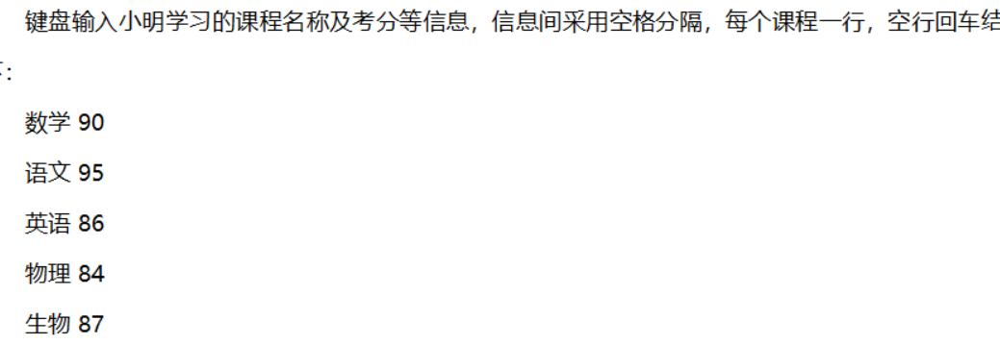

## 1.列表作为函数参数的例子

<!--more-->

```python
def func(x=[],y=[6,7]):
    x.append(8)
    y.append(8)
    return x+y

a,b = [1,2],[3,4]
t = func(x=a)
t = func(y=b)
print(func(),end=";")
```

执行完第7行：

a = [1,2,8] **注意**：a被func函数修改了

b = [3,4] # 不变

x = [1,2,8]

y = [6,7,8]

t = [1,2,8,6,7,8]

执行完第8行：

a = [1,2,8] # 不变

b = [3,4,8]

x = [8] 

y = [3,4,8]

执行完第9行：

func()中传入上一步得到的默认参数x和y

输出[8,8,3,4,8,8];

```python
def func(x=[],y=[6,7]):
    x.append(8)
    print("x:{}".format(x))
    y.append(8)
    print("y:{}".format(y))
    return x+y

a,b = [1,2],[3,4]
t = func(x=a)
t = func(y=b)
print(func(),end=";")
'''x:[1, 2, 8]
y:[6, 7, 8]
x:[8]
y:[3, 4, 8]
x:[8, 8]
y:[6, 7, 8, 8]
[8, 8, 6, 7, 8, 8];'''
```

## 2.python处理空行输入

input()遇到空行、回车即停止，即使没接收到有效输入。



```python
data = input()  # 课程名 考分
...  
while data:
    ...
    data = input()
```

