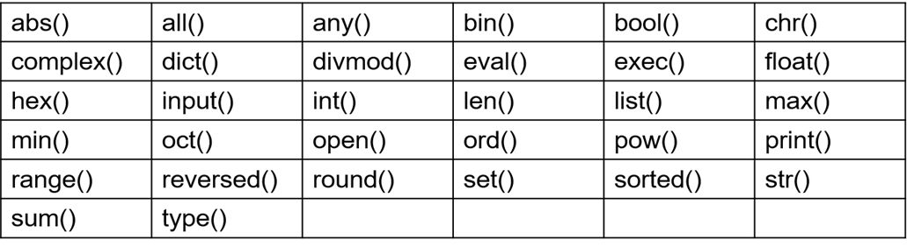
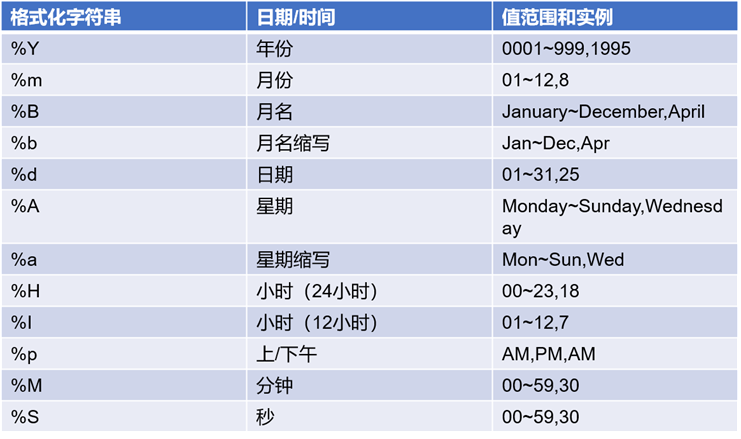
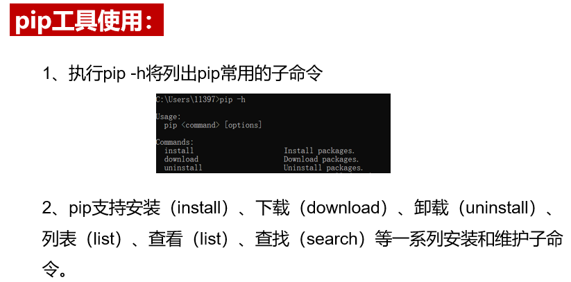
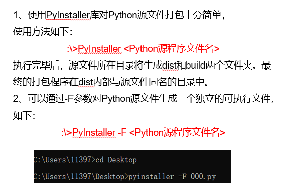
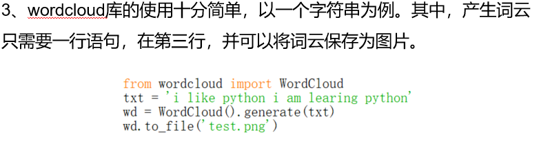
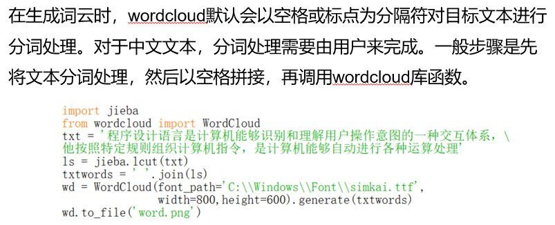
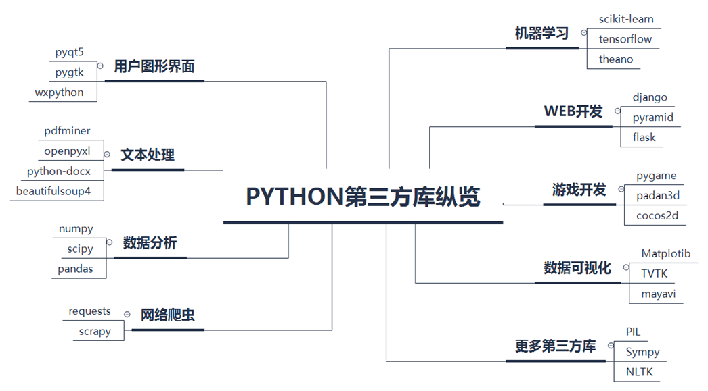

## 1.小练习

```python
# s = "* ** ** hel  l* o*  ** * *  "
# 去除两边的' '和'*'
while s[0] == "*" or s[0] == " ":
    s.strip()
    s.strip("*")
while s[-1] == "*" or s[-1] == " ":
    s.strip()
    s.strip("*")  
```

<!--more-->

## 2.计算思维

考点：计算思维的本质是抽象和自动化。

自顶向下设计，自底向上执行。

## 3.常用内置函数



## 4.turtle库

### turtle库的引用方式

第一种，import turtle，则对turtle库中函数调 用采用turtle.<函数名>()形式。

第二种，from turtle import *，则对turtle库中 函数调用直接采用<函数名>()形式，不在使用 turtle.作为前导。

第三种，import turtle as t，则对turtle库中函数 调用采用更简洁的t.<函数名>()形式，保留字as 的作用是将turtle库给予别名t。

```python
# 1
import turtle
turtle.fd(100)
# 2
from turtle import *
fd(100)
# 3
import turtle as t # 类似取别名
t.fd(100)
```

### 窗口函数

`turtle.setup(width, height, startx, starty)` 窗体函数

作用：设置主窗体的大小和位置 参数： 

width ：窗口宽度，如果值是整数，表示的像素值；如果值 是小数，表示窗口宽度与屏幕的比例； 

height: 窗口高度，如果值是整数，表示的像素值；如果 值是小数，表示窗口高度与屏幕的比例； 

startx：窗口左侧与屏幕左侧的像素距离，如果值是None ，窗口位于屏幕水平中央； 

starty：窗口顶部与屏幕顶部的像素距离，如果值是None ，窗口位于屏幕垂直中央。

### 常用状态函数

| **函数**     | **描述**                           |
| ------------ | ---------------------------------- |
| pendown()    | 放下画笔                           |
| penup()      | 拿起画笔                           |
| pensize()    | 设置画笔线条的粗细                 |
| pencolor()   | 设置画笔颜色                       |
| color()      | 设置画笔和填充颜色                 |
| begin_fill() | 填充图形前，调用该方法             |
| end_fill()   | 填充图形结束                       |
| filling()    | 返回填充状态，True为填充，较少用到 |
| clear()      | 清空当前窗口                       |

| **函数**             | **描述**                       |
| -------------------- | ------------------------------ |
| reset()              | 清空当前窗口，并重置位置       |
| write(str,font=None) | 输出font字体的字符串           |
| screensize()         | 设置画布的长和宽               |
| hideturtle()         | 隐藏画笔的turtle形状，比较重要 |
| showturtle           | 显示画笔形状                   |
| Isvisible()          | 如果画笔可见则显示true         |

### 常用运动函数

| **函数**          | **描述**                       |
| ----------------- | ------------------------------ |
| forward()         | 沿着当前指定方向前进距离       |
| backward()        | 沿着当前相反方向后退指定距离   |
| setheading(angle) | 设置当前朝向为angle角度        |
| circle(r,e)       | 绘制一个半径r和角度e的圆或弧形 |
| undo()            | 撤销画笔最后一步动作           |
| right(angle)      | 向右旋转angle角度              |
| left(angle)       | 向左旋转angle角度              |
| goto(x,y)         | 移动到绝对坐标（x,y）处        |
| speed()           | 设置画笔得绘制速度，参数为0-10 |
| dot(d,color)      | 绘制一个直径d和颜色color的圆点 |
| home()            | 设置当前画笔位置为原点，朝向东 |

实例1：

```python
# import turtle
# turtle.fd(100)

# from turtle import *
# fd(100)

# import turtle as t
# t.fd(100)

from turtle import *
penup() # 抬起画笔
pendown() # 放下画笔，有点多余
fd(100)
done()  # 避免一闪而过，对于第一种导入方式改成turtle.done()

import turtle as t
t.pensize(5) # 粗细为5pix
t.pencolor("blue")
t.fd(110)
t.done()

# color(),begin_fill()和end_fill()是搭配使用的
import turtle as t
t.color("green", "red")
t.begin_fill()
for i in range(3):
    t.fd(120)
    t.left(120)
t.end_fill()
t.done()

import turtle
turtle.fd(200)
# turtle.clear()  # 注意！清空窗口(只擦掉痕迹)但画笔停留在200处
# turtle.reset()  # 清空窗口并重置画笔位置
turtle.write("你好")
turtle.hideturtle()
turtle.done()

# hideturtle()和showturtle()是搭配使用的
```

实例2：

```python
import turtle as t
t.forward(100),简写成fd(100)
t.fd(-100) # == t.backward(100)
t.done()

t.setheading(60),简写成seth(60)
t.fd(100)
t.circle(100)
t.circle(100, 180)
t.circle(100, 180, 5)
t.undo()  # 撤销最后一步动作
t.done()

# right()和left()比较重要
# seth()是朝着某角度方向，left()是旋转某角度
t.speed(1)
t.left(60)
t.left(60)  # 旋转是有记忆的
t.fd(100)

t.goto(100, 200)  # 向绝对坐标移动，不改变方向
t.dot(100, "pink")
t.home()  # 画笔回到原点，方向朝东
t.done()
```

## 5.random库

使用random库主要目的是生成随机数 

​    这个库提供了不同类型的随机数函数，其中最基本的函数是`random.random()`，它生成 一个[0.0, 1.0)之间的随机小数，所有其他随机函数都是基于这个函数扩展而来。

random库常用函数： 

| **函数**                        | **描述**                                           |
| ------------------------------- | -------------------------------------------------- |
| seed(a=None)                    | 初始化随机数种子，默认值为当前系统时间             |
| random()                        | 生成一个[0.0,  1.0)之间的随机小数                  |
| randint(a,  b)                  | 生成一个[a,b]之间的整数                            |
| getrandbits(k)                  | 生成一个k比特长度的随机整数                        |
| randrange(start,  stop[, step]) | 生成一个[start,  stop)之间以step为步数的随机整数   |
| uniform(a,  b)                  | 生成一个[a,  b]之间的随机小数                      |
| choice(seq)                     | 从序列类型(例如：列表)中随机返回一个元素，考试常考 |
| shuffle(seq)                    | 将序列类型中元素随机排列，返回打乱后的序列         |
| sample(pop,  k)                 | 从pop类型中随机选取k个元素，以列表类型返回         |

实例：

```python
import random
n = random.random()
# 注意生成随机数的右边区间开闭情况
print(n)
# 学到了，文件名不要设置成random库名，否则会报错循环导入，憨憨
# random.seed()  # seed参数限定了后面生成随机数的值
m = random.randint(1, 6)
print(m)
t = random.getrandbits(6)
print(bin(t))
print(random.randrange(2,6,2))
print(random.uniform(1,11))
ls = [12,34.56,4,"你","我",1434,34,[2,3,232.4]]
print(random.choice(ls)) # 有返回值
random.shuffle(ls)  # 无返回值
print(ls)
lt = random.sample(ls,3)
print(lt)
```

## 6.time库

处理时间是程序最常用的功能之一，time库是Python提供的处理时间标准库。time库提供系统级精确计时器的计时功能，可以用来分析程序性能，也可让程序暂停运行时间。

time库的功能主要分为3个方面：时间处理、 时间格式化和计时。 

• 时间处理主要包括4个函数：time.time()、 time.gmtime()、time.localtime() 、time.ctime()。 

• 时间格式化主要包括3个函数：time.mktime()、 time.strftime()、time.strptime()。 

• 计 时 主 要 包用到 1 个 函 数 ： time.sleep( )。

使用time.gmtime(secs)获取当前时间戳对应的struct_time对象。

使用time.localtime(secs)获取当前时间戳对应的本地时间的struct_time对象。

time库使用time.mktime()、time.strftime()、 time.strptime()进行时间格式化。 

使用time.mktime(t) 将struct_time对象t转换 为时间戳，注意t代表当地时间。

time.strftime()函数是时间格式化最有效的方法，几 乎可以以任何通用格式输出时间。该方法利用一个 格式字符串，对时间格式进行表达。

**strftime()方法的格式化控制符** 





实例：

```python
import time
print(time.time())  # 获取当前时间戳
print(time.gmtime())  # 很少考到，返回UTC时间
print(time.localtime())  # 经常考到，一定要记住，返回本地北京时间
print(time.ctime())  # 返回当地时间对应的字符串
t = time.localtime()
print(time.mktime(t))
print(time.strftime("%Y-%m-%d %H:%M:%S", t))  # 记住这些常用的，这是考的最多的
timestring = "2020-04-17 10:17:44"  # 反格式化
print(time.strptime(timestring, "%Y-%m-%d %H:%M:%S"))  # 和上面相反，用到较少

# time.sleep()较常用到，记住
for i in range(3):
    print(i)
    time.sleep(3)  # 每次循环睡眠3秒
```

## 7.PyInstaller库

PyInstaller是一个十分有用的Python第三方库，它能够在Windows、Linux、Mac OS  X等操作系统下将Python源文件打包，变成直接可运行的可执行文件。通过对源文件打包，Python程序可以在没有安装Python的环境中运行，也可以作为一个独立文件方便传递和管理。




第2种方式在dist文件夹中只有一个exe文件。（记住常用参数指令）

| **参数**               | **功能**                           |
| ---------------------- | ---------------------------------- |
| -h,  –help             | 查看帮助                           |
| –clean                 | 清理打包过程中的临时文件           |
| -D,  –onedir           | 默认值，生成dist目录               |
| -F,  –onefile          | 在dist文件夹中只生成独立的打包文件 |
| -i  <图标文件名.ico  > | 指定打包程序使用的图标（icon）文件 |

eg : `pyinstaller -F -i 1.cio yinyang.py`

eg : `pyinstaller -F -w yinyang.py  # -w去掉运行exe时的黑窗口`

## 8.jieba库

1、由于中文文本中的单词不是通过空格或者标点符号分割，中文及类似语言存在一个重要的“分词”问题。

2、jieba（“结巴”）是Python中一个重要的第三方中文分词函数库。

3、jieba库的分词原理是利用一个中文词库，将待分词的内容与分词词库进行比对，通过图结构和动态规划方法找到最大概率的词组。除了分词jieba还提供增加自定义中文单词的功能。

4、jieba库支持三种分词模式：精确模式，将句子最精确地切开，适合文本分析；全模式，把句子中所有可以成词的词语都扫描出来，速度非常快，但是不能解决歧义；搜索引擎模式，在精确模式基础上，对长词再次切分，提高召回率，适合用于搜索引擎分词。

1、`jieba.lcut(s)`是最常用的中文分词函数，用于精准模式，即将字符串分割成等量的中文词组，返回结果是列表类型。

2、`jieba.lcut(s, cut_all = True)`用于全模式，即将字符串的所有分词可能均列出来，返回结果是列表类型，冗余性最大。

3、`jieba.lcut_for_search(s)`返回搜索引擎模式，该模式首先执行精确模式，然后再对其中长词进一步切分获得最终结果。搜索引擎模式更倾向于寻找短词语，这种方式具有一定冗余度，但冗余度相比全模式较少。

4、`jieba.add_word()`函数，顾名思义，用来向jieba词库增加新的单词。

实例：

```python
import jieba
ls = jieba.lcut("全国计算机等级考试python科目")
print(ls)

from jieba import *
ls = lcut("全国计算机等级考试python科目",cut_all = True)
print(ls)

import jieba
ls = jieba.lcut_for_search("全国计算机等级考试python科目")
print(ls)

import jieba
jieba.add_word("奥利给")
ls = jieba.lcut("作为一个年轻人，我们要努力加油，奥利给！！")
print(ls)
```

## 9.wordcloud库

1、wordcloud库是专门用于根据文本生成词云的Python第三方库，十分常用且有趣。

2、装wordcloud库在Windows的cmd命令行使用






**WordCloud对象创建的常用参数**

| **参数**         | **功能**                                         |
| ---------------- | ------------------------------------------------ |
| font_path        | 指定字体文件的完整路径，默认None                 |
| width            | 生成图片宽度，默认400像素                        |
| height           | 生成图片高度，默认200像素                        |
| mask             | 词云形状，默认None，即，方形图                   |
| min_font_size    | 词云中最小的字体字号，默认4号                    |
| font_step        | 字号步进间隔，默认1                              |
| min_font_size    | 词云中最大的字体字号，默认None，根据高度自动调节 |
| max_words        | 词云图中最大词数，默认200                        |
| stopwords        | 被排除词列表，排除词不在词云中显示               |
| background_color | 图片背景颜色，默认黑色                           |

WordCloud不显示中文问题解决：

在下面的代码中添加`font_path="./kai.ttf"`（自己替换），选择一个支持中文的字体。无法确定是否支持中文的话，双击字体打开查看，有中文显示就是支持中文的。

```python
wc=WordCloud(font_path="./kai.ttf",background_color="white",width=800,height=600,max_font_size=50,max_words=1000)
```

| **方法**          | **功能**                         |
| ----------------- | -------------------------------- |
| generate(text)    | 由text文本生成词云               |
| to_file(filename) | 将词云图保存为名为filename的文件 |

实例：

```python
import wordcloud
txt = "i like python and i am learning python"
wd = wordcloud.WordCloud().generate(txt)
wd.to_file("test.png")


txt = '''程序设计语言是计算机能够识别和理解用户
操作意图的一种交互体系，它能够按照特定的规则
组织计算机指令，使得计算机能够自动进行各种运算处理
'''
import jieba
import wordcloud
ls = jieba.lcut(txt)
txtwords = ' '.join(ls)
print(txtwords)
wd = wordcloud.WordCloud(font_path=r"F:\下载\方正楷体_GBK.TTF",width=800,height=600).generate(txtwords) 
# wordcloud默认不支持中文，得设置font_path添加中文字体
wd.to_file("word.png")
```

## 10.python第三方库纵览

考选择题，以记忆库的名称、作用为主。

