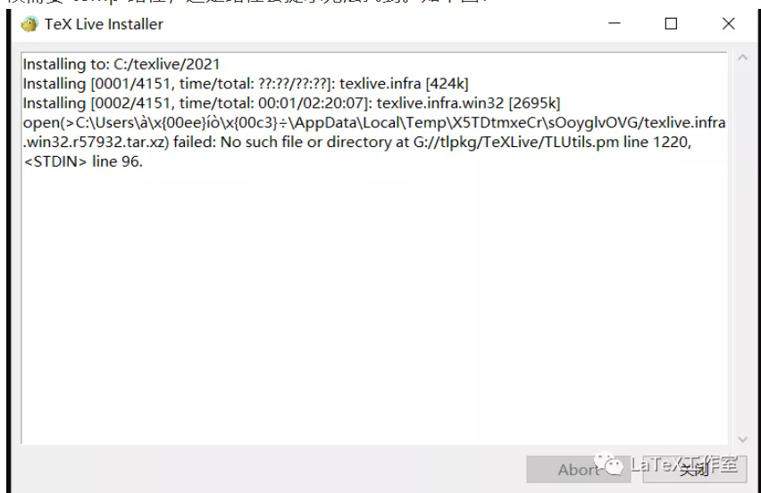
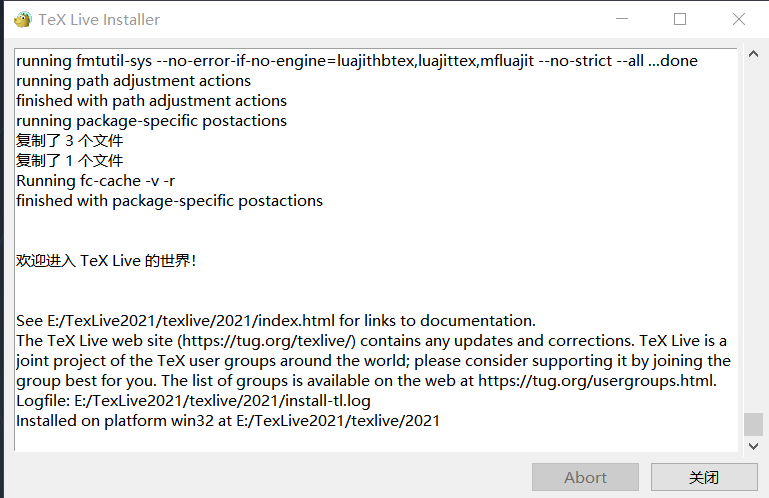
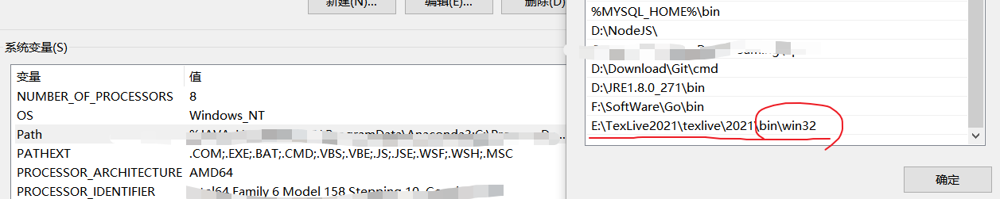
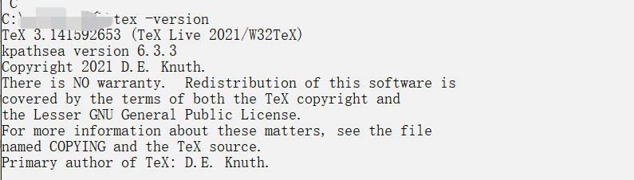
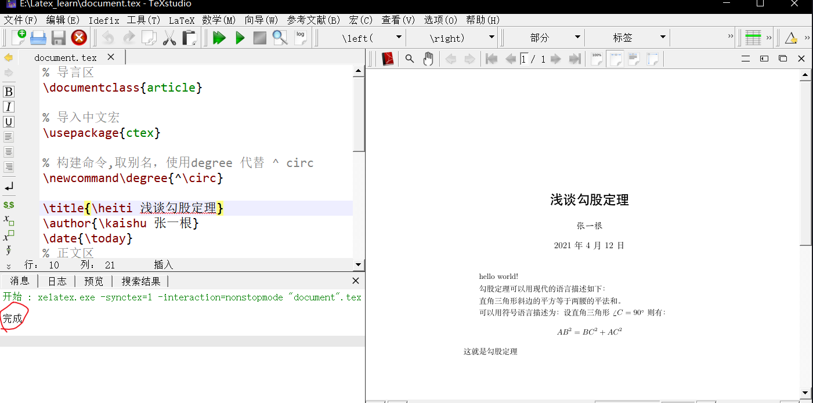

## TexLive2021

首先我们要安装Texlive，它是一个Tex的发行版。

详细安装配置过程建议参考：https://blog.csdn.net/Mikchy/article/details/94448707

以及https://github.com/OsbertWang/install-latex-guide-zh-cn。

<!--more-->

如果出现一些TexLive的安装问题，看这个：https://blog.csdn.net/dogfat/article/details/106962966。

- 注意：路径中不要出现中文，一些特殊符号和空格

- 特别提一点，安装教程中提到的.bat文件，如果双击打开闪退，就尝试右键管理员身份打开。

- 如果两种方式都会闪退，说明大概率是你没有**配置好环境变量**。

-  配置环境变量时还可能会出问题：提示你此环境变量太大，最长为2047个字符。

这时候新建了一个Path1,把要添加的变量放到Path1里，再在Path里新建变量%Path1%就OK了。

- 如果安装时出现如下图所示错误：

  

多半是因为系统用户名含有中文！！！

这个问题困扰我很久，才发现大佬的[解决方案](https://mp.weixin.qq.com/s/9aE4AlHj2XfnymmT8P3I5Q)。

还有这篇文章给了我提示：https://www.zhihu.com/people/zhang-shao-fan-45。

按照文章的提示来做，就能够成功安装上TexLive2021了。(PS：安装过程可能要等很久时间，约1h40min)

注意：千万不要点Abrobt！！！会直接退出安装，后期还要重装。

直到出现这个，才表示安装成功！！！



接下来到cmd中测试是否成功安装上，输入命令：tex -version。

如果提示'tex'不是内部或外部命令等，说明可能是没有配置好环境变量。

那么我们找到TexLive的安装目录中的bin目录下的win32，将它加入系统变量Path。



然后继续输入命令：tex -version测试。



如图表示成功安装，否则需要重新安装。

## Tex Studio

下面我们跟着[教程](https://blog.csdn.net/Mikchy/article/details/94448707)继续安装Tex Studio。

安装过程非常简单。

安装好之后，我们来测试一下。新建一个文件复制以下内容。

```latex
% 导言区
\documentclass{article} 

% 导入中文宏
\usepackage{ctex}

% 构建命令,取别名，使用degree 代替 ^ circ
\newcommand\degree{^\circ}

\title{\heiti 浅谈勾股定理}
\author{\kaishu 张一根}
\date{\today}
% 正文区
\begin{document}
	\maketitle
	hello world!
	
	勾股定理可以用现代的语言描述如下：
	
	直角三角形斜边的平方等于两腰的平法和。
	
	可以用符号语言描述为：设直角三角形 
	$\angle C=90\degree $则有：
	$$ 
	AB^2 = BC^2 + AC^2 
	$$
	这就是勾股定理
\end{document}
```

出现**完成**表示安装成功。

