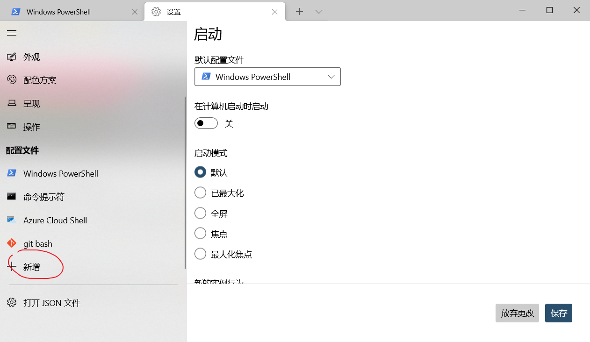
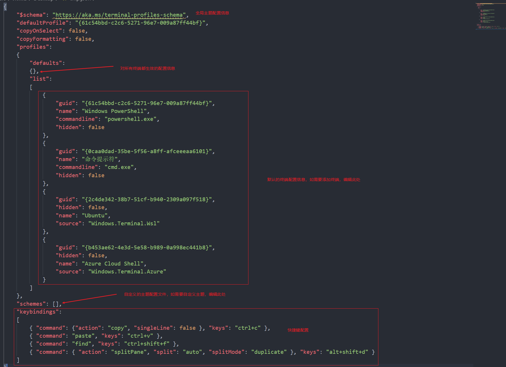
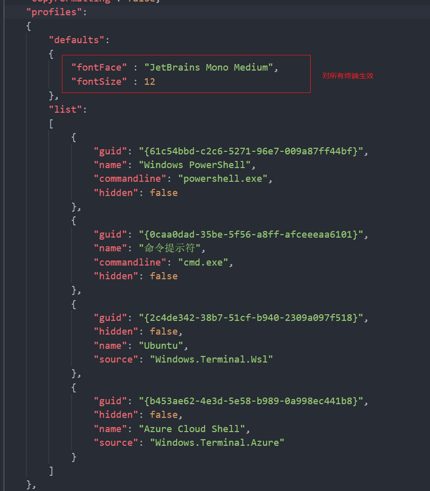
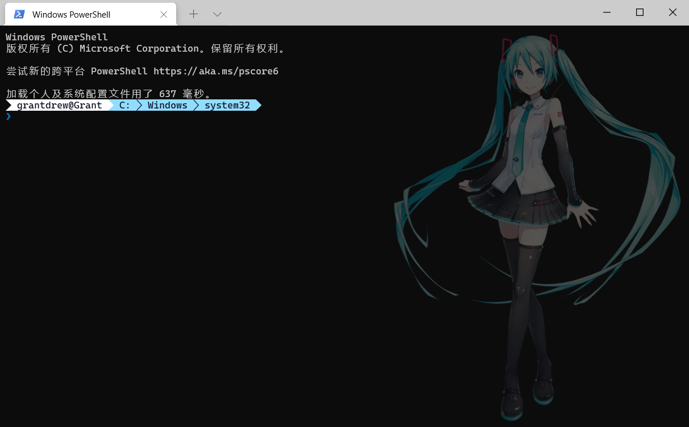
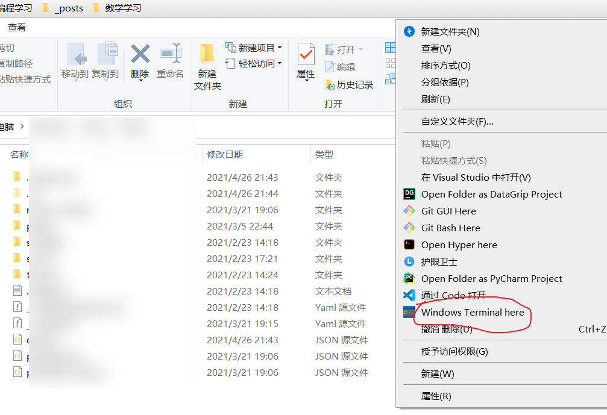

参考自：https://blog.csdn.net/yuanlaijike/article/details/107599983

## 如何安装Windows Terminal

直接从Microsoft Store下载就行。

<!--more-->

首先添加git bash到Windows Terminal：

在命令行选择Git\bin\bash.exe路径。

如果想要添加一个图标，可以下载添加路径就可以了。

常用的配置方式是直接打开JSON文件进行修改。

## 如何美化

配置文件的大致布局如下所示，对于我们美化来说，只需要关注 `profiles` 和 `schemes` 两块即可。

让我们先牛刀小试下，调整下终端的字体和字体大小。因为我想对所有终端都应用这个配置。所以我写在了 `defaults` 中，如下图所示即可。

## 把windows terminal添加到右键菜单

[参考教程](https://blog.csdn.net/willingtolove/article/details/109167629?ops_request_misc=&request_id=&biz_id=102&utm_term=windows%20terminal%E5%8F%B3%E9%94%AE%E6%89%BE%E4%B8%8D%E5%88%B0%E5%BA%94%E7%94%A8%E7%A8%8B%E5%BA%8F&utm_medium=distribute.pc_search_result.none-task-blog-2~all~sobaiduweb~default-0-109167629.first_rank_v2_pc_rank_v29)

记得修改`startingDirectory`属性为`null`；（PS：没有自己加上就可以）

## 最终效果

