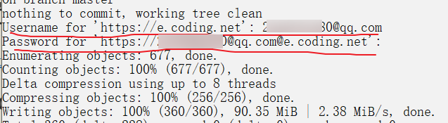
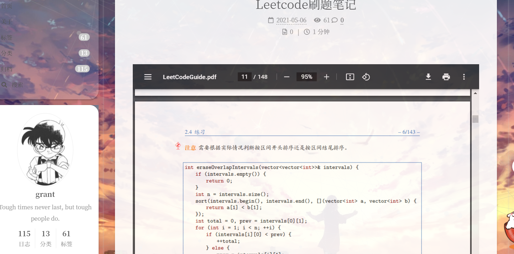
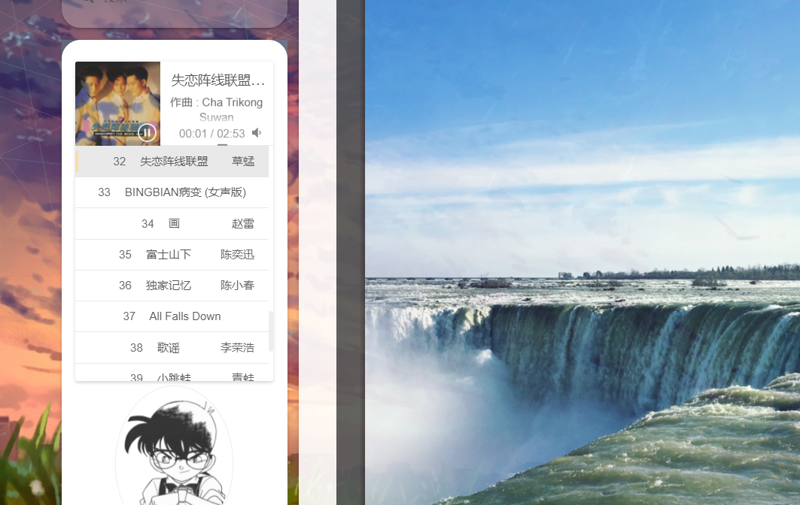

> 本文将介绍总结一些hexo的常见/不常见/棘手问题的解决方法。

<!--more-->

# FAQ

## 1.插入图片

只需在 md 文件里使用 `` ，无需路径名就可以插入图片。

## 2.文章摘要

在文章`<!--more-->`之前的内容将作为首页的摘要部分！

## 3.[解决busuanzi不显示问题必看](https://muyuuuu.github.io/2019/11/22/busuanzi-notdisplay/)

其实核心问题就是找到span id里是否有style = "display: none"，找到对应文件对应位置的代码并删除即可

## 4.hexo s本地样式与网页样式不一致？

- 其实原因很简单，拉到服务器之前要`hexo clean`清理一下缓存，然后再生成和部署，你学会了吗？


（可能`hexo c && hexo g && hexo d`一步到位，有时候不太行，分开写）

- 或者清理一下浏览器缓存就可以解决。

## 5.[markdown语法速成宝典](https://www.kuangstudy.com/bbs/1356475333565587458)

## 6.推荐hexo搭建文章：

https://tding.top/archives/aad98408.html

## 7.使用插件备份博客源文件：

https://blog.csdn.net/qq_41793001/article/details/103151182

---

有关备份问题：


解决方案：https://cloud.tencent.com/developer/article/1572090

文章中提到的`.ssh`文件夹一般位于C:\Users\你的用户名\xxx。


如果出现下图的情况，一般就成功了：


这时我们再检查github上的hexo仓库，会发现用于备份的backup分支已经成功备份。


## 8.hexo博客使用[Valine](https://valine.js.org/)添加评论系统：

参见博客 https://www.luanzhuxian.com/post/c49d1b87.html  和 https://www.zhyong.cn/posts/95cb/

第三方插件增强邮件提醒：https://blog.csdn.net/AC916305619/article/details/110379680 和 https://github.com/DesertsP/Valine-Admin

## 9.文章加密处理：

参考https://blog.csdn.net/weixin_45750972/article/details/111396124

- password: 该Blog使用的密码，注意单词不要拼错，尬
- abstract: Blog摘要文字（少量）
- message: 密码框上的描述性文字

## 10.添加打赏功能：

参考https://www.dazhuanlan.com/2020/01/20/5e25021a447f6/

## 11.hexo d时网络不稳定

当执行`hexo d`命令时出现如下错误时，OpenSSL SSL_read: Connection was aborted, errno 10053...

参考解决方案：https://blog.csdn.net/weixin_43945983/article/details/110882074

先执行`git config --global http.sslVerify "false"`命令，再执行`hexo d`就行了。
如果还有错，多试几次，网络不好。

## 12.文章生成永久化链接

参考：https://blog.csdn.net/u011063477/article/details/105929290/

安装hexo-abbrlink插件

```shell
npm install hexo-abbrlink --save
```

站点配置文件(_config.yml)里:

```yml
permalink: post/:abbrlink.html
abbrlink:
  alg: crc32  # 算法：crc16(default) and crc32
  rep: hex    # 进制：dec(default) and hex
```

先使用`hexo c && hexo g`，清除缓存，重新生成，再使用`hexo g`会自动在你的文章中加上`abbrlink: fbf5310d`。

如果打开网站发现打开不同文章都会重定向到一篇文章，而且都会出现undefined.html，说明没有清除缓存。

图像不显示问题：https://www.pianshen.com/article/65241119972/

如果还是不显示，就`hexo s`，在md文件中先删除``其中的`arctile/`，再粘贴回去，在浏览器刷新一下就能看到了。（PS：一篇文章有多张图片时只要第一张这样做就行了）

个人无意中发现的，原理不清楚。可能是插入图片时会自动把文章同名目录下的图片设定为相对路径，不需要加上文章同名的上一级目录。

一顿操作下来，不停CV，我手都摁麻了。

## 14.购买域名与绑定域名

处理域名花了我一下午功夫，事情起因是我突然想着要不要买个域名玩玩，然后去B站搜了一下，发现一个UP做的系列视频，觉得讲得还不错，推荐给大家。

视频地址：https://www.bilibili.com/video/BV18a4y1Y7e9?share_source=copy_web

我是在阿里云买的域名，其实腾讯云也还不错。一次性买了三年，花了不到100软妹币。

参考教程：

https://noshore.cn/shuangxianbushu.html#2-%E5%9F%9F%E5%90%8D%E8%A7%A3%E6%9E%90

其实我更推荐看腾讯云的官方文档，看不懂的话还有人工客服。因为博客的内容毕竟不是最新的，而且不一定适合所有人。

折腾老半天最后还是成功了。

https://www.grantdrew.top/和http://www.grantdrew.top/都能访问当前站点。

以后用`hexo d -g`进行双线部署。

tips：绑定域名后访问量将清零！

注意：执行`hexo d -g`时coding的用户名时你的邮箱或者手机号，输入密码时光标不会动。



## 15.配置域名后评论区出现code403

参考：https://blog.csdn.net/weixin_43868299/article/details/107601150

## 16.hexo增加展示PDF功能

https://blog.csdn.net/qq_43827595/article/details/104574959

```html
<br>



<br>
<!-- 这么写就行-->
```

记得在next主题下的配置文件搜索pdf把enable设置为true。

测试效果图：

```html
<!--测试代码-->
<embed src="/file/LeetCodeGuide.pdf" width="100%" height="750" type="application/pdf">
```



经测试发现如果设置width="105%"会刚好贴到文章右边框，再宽就不合适了。

## 17.插入音乐之aplayer音乐播放器

参考：https://blog.csdn.net/qq_45533937/article/details/105496572

```html
// 方案一
<!-- 音乐播放器 -->
      <div>
          
              <iframe frameborder="no" border="0" marginwidth="0" marginheight="0" width=330 height=86 src="{{ theme.background_music }}"></iframe>
          
      </div>
//将上面代码插入themes\next\layout\_macro\sidebar.swig inner的后面
// 方案二，插入同样位置
<!--网易云插件-->
    <!-- require APlayer -->
    <link rel="stylesheet" href="https://cdn.jsdelivr.net/npm/aplayer@1.10.1/dist/APlayer.min.css">
    <script src="https://cdn.jsdelivr.net/npm/aplayer@1.10.1/dist/APlayer.min.js"></script>
    <!-- require MetingJS-->
    <script src="https://cdn.jsdelivr.net/npm/meting@2.0.1/dist/Meting.min.js"></script> 
    <!--网易云-->   
    <meting-js
      server="netease"
      id="4916164702"
	    type="playlist" 
	    mini="false"
      fixed="false"
      list-folded="true"
      autoplay="false"
      volume="0.4"
      theme="#FADFA3"
      order="random"
	    loop="all"
      preload="auto"
      mutex="true">
    </meting-js>
```

可能要等待一会才会在侧边栏看到效果。

