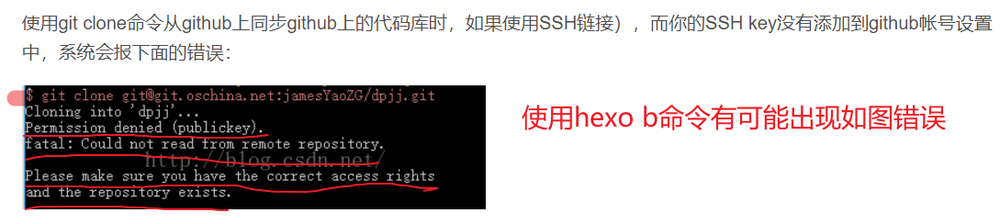
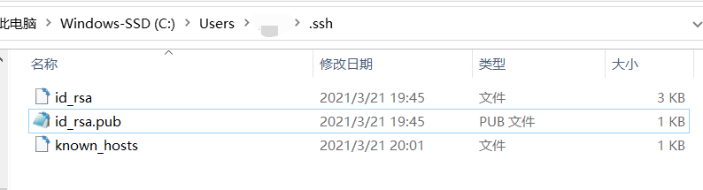
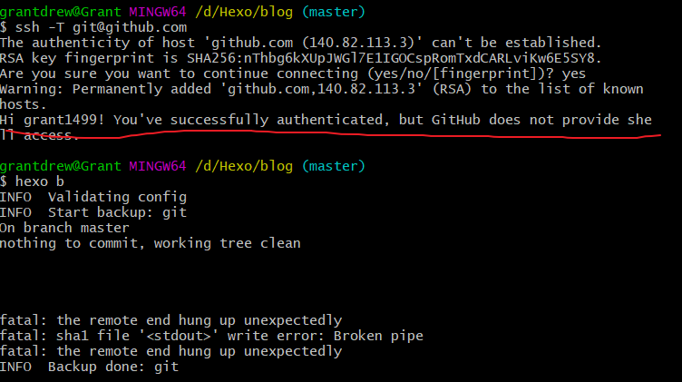
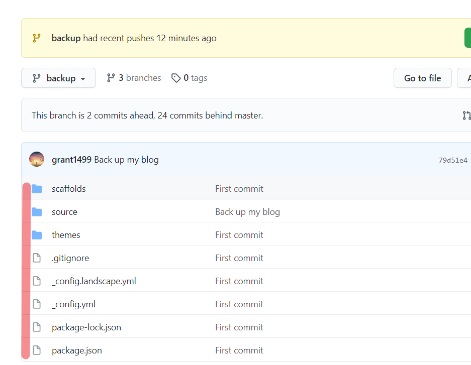

> 本文将介绍总结一些hexo的常见/不常见/棘手问题的解决方法。

<!--more-->

1.只需在 md 文件里使用 `` ，无需路径名就可以插入图片。

2.在文章`<!--more-->`之前的内容将作为首页的摘要部分！

3.[解决busuanzi不显示问题必看](https://muyuuuu.github.io/2019/11/22/busuanzi-notdisplay/)

其实核心问题就是找到span id里是否有style = "display: none"，找到对应文件对应位置的代码并删除即可

4.hexo s本地样式与网页样式不一致？

- 其实原因很简单，拉到服务器之前要`hexo clean`清理一下缓存，然后再生成和部署，你学会了吗？

（可能`hexo c && hexo g && hexo d`一步到位，有时候不太行，分开写）

- 或者清理一下浏览器缓存就可以解决。

5.[markdown语法速成宝典](https://www.kuangstudy.com/bbs/1356475333565587458)

6.推荐hexo搭建文章：https://tding.top/archives/aad98408.html

7.使用插件备份博客源文件：https://blog.csdn.net/qq_41793001/article/details/103151182

---

有关备份问题：

解决方案：https://cloud.tencent.com/developer/article/1572090

文章中提到的`.ssh`文件夹一般位于C:\Users\你的用户名\xxx。

如果出现下图的情况，一般就成功了：

这时我们再检查github上的hexo仓库，会发现用于备份的backup分支已经成功备份。

8.hexo博客使用[Valine](https://valine.js.org/)添加评论系统：

参见博客 https://www.luanzhuxian.com/post/c49d1b87.html  和 https://www.zhyong.cn/posts/95cb/