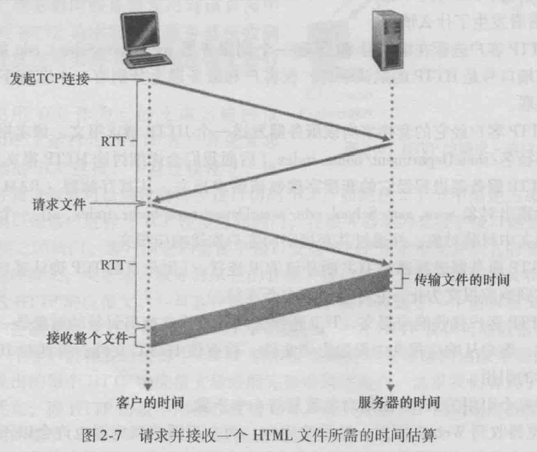
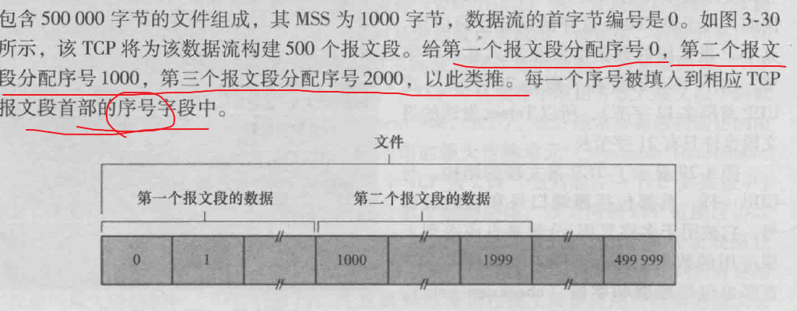
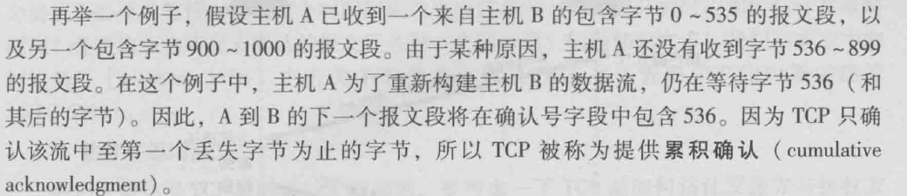
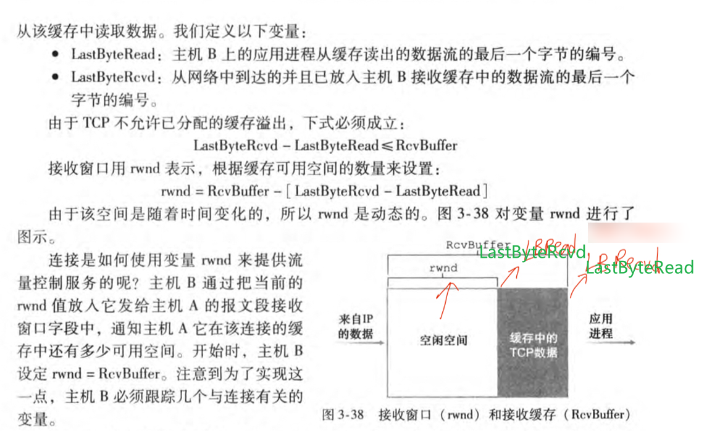
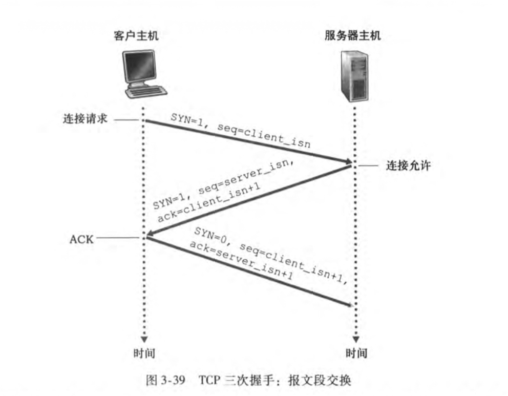
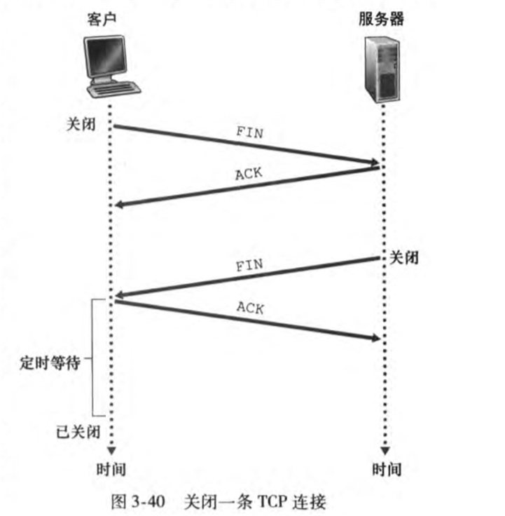

# Chapter 1

本书配套资源[地址](https://wps.pearsoned.com/ecs_kurose_compnetw_6/216/55463/14198700.cw/index.html).

湖科大计网笔记： https://nullcode.fun/172.html。

自顶向下方法笔记： https://blog.csdn.net/qq_39326472/article/details/88089747。

<!--more-->

主机，或端系统通过因特网相连；端系统由通信链路和分组交换机组成。

2种著名的分组交换机:路由器和链路层交换机。

TCP/IP协议是因特网的主要协议。分别是传输控制协议和网际协议。

套接字接口与端系统相连，规定了2个端口间的交付数据的方式。

- 什么是协议?
- 定义2个或多个通信实体间交换报文的格式和顺序，以及报文发送/接收采取的动作。
    掌握计网就是理解网络协议的构成，原理和工作方式。

网络边缘:应用程序，端系统。

端系统连接到边缘路由器的网络，就是接入网。家庭，学校，企业有不同的接入方式。

网络核心:由端系统的分组交换机和链路构成的网络。

端系统间发送报文经过分组交换，将长报文划分为小的数据块(分组)。每个分组通过通信链路和分组交换机由源到目的地。

分组交换机：

存储转发传输机制，当路由器接收完源传过来的完整分组时，才开始向目的地传输。每经过1个路由器，就要多一个L/R时延。交换机可连接多条链路，对于每条链路它具有1个输出缓存。如果到达的分组需要的链路忙，则它在输出缓存中等待。输出缓存填满，将出现丢包。

- 路由器如何转发分组？
- 每台路由器有1个转发表，将目的地址或其一部分映射为输出链路，路由器检查分组首部的IP地址，搜索转发表。路由选择协议用于自动设置这些转发表。

通过网络链路和交换机移动数据的2种方式:电路交换和分组交换。传统电话属于电路交换。

发展趋势:分组交换。

网络协议分层，所有协议统称为协议栈，一个协议层通过硬件，软件或两者结合实现。

共有五层：物理层，链路层，网络层，运输层，应用层。

每层中的分组称呼，应用层:报文，运输层:报文段，网络层:数据报，链路层:帧，物理层:比特。

数据封装，上层分组附上首部信息后封装成下层分组。

# Chapter 2

网络应用程序体系结构：cs体系结构，客户-服务器，和P2P体系结构。

进程通信，两个端系统上的进程**(不是程序)**通过计算机网络交换报文实现通信。

套接字接口是主机内应用层与传输层间的接口，具体来说是应用程序进程与运输层协议间的接口，它是可编程接口。

2个重要的传输层协议：
TCP面向连接，可靠数据传输。一个TCP连接是全双工的，双方都可以发送报文。拥塞控制机制。
UDP提供最小服务，无连接，不可靠。

常见应用层协议：

HTTP，超文本传输协议。它是web的核心。它使用TCP协议。无状态协议，不存储用户的状态信息。
连接分类，持续和非持续连接。

HTTP属于持续连接。但也可以设为非持续。

HTTP总响应时间，2个RTT+传HTML文件时间。（RTT，往返时间）tcp的三次握手，客户发，服务器回，客户确认。然后服务器传文件。看下图：

HTTP使用cookie来跟踪用户，标识一个用户。

web缓存器，也叫代理服务器。作用类似cache在CPU和内存间的作用。

SMTP协议，用来发邮件。发送不经过中间服务器。http是拉协议，smtp是推协议。

POP3协议用来访问邮件。

DNS协议，提供域名解析服务。通常被http等其他应用层协议使用。DNS缓存，在一段时间后会丢弃缓存信息，因为映射不是永久的。
主机名和IP地址都能识别主机。DNS，主机名解析为IP地址。它有一个分布式、层次数据库用于查询。运行在UDP之上。

# Chapter 3

运输层协议为不同主机上的应用进程提供了逻辑通信。而网络层提供了主机间的逻辑通信。

IP协议为主机间提供通信，不可靠服务。

将主机交付扩展到进程间交付，称为运输层的多路复用和多路分解。
多路分解，将运输层报文段中数据交到正确的套接字。
多路复用，从源主机不同套接字从收集数据块，为每个数据块封装上首部信息后生成报文段，交给网络层。

tcp拥塞控制机制力求每个通过拥塞网络链路的连接平等共享网络链路带宽；而udp流量不可调节。
udp套接字由目的IP和目的端口组成的二元组唯一标识。tcp由四元组唯一标识。
udp检验和提供差错检测功能，但它不能纠错。

可靠数据传输：
自动重传请求协议。接收方反馈ACK或NCK，以此知道哪些要重传。
流水线差错恢复方法，回退N步和选择重传。
回退N步，滑动窗口协议。接收方丢弃所有失序分组。
选择重传，发送方仅重传它怀疑接收方出错的分组。接收方将确认一个正确接收的分组不管顺序。失序分组将缓存到所有丢失分组都收到。

tcp通过三次握手建立连接，客户发，服务器回，前两次不包含数据。最后客户回应，可以包含数据。
发送数据通过套接字之后，tcp将其放入该连接的发送缓存中，接下来tcp时不时从缓存中取数据传给网络层。从缓存中取出并放入报文段的数据数量受限于最大报文段长度MSS。MSS指报文段中应用层数据的最大长度，不包括首部。

tcp在连接的两端都有各自的发送，接收缓存。

tcp报文段首部中**两个重要字段是序号字段和确认号字段**。它们是tcp可靠传输的关键部分。
序号是该报文段首字节在字节流中的编号。见下图：

tcp提供累积确认：

TCP的一些机制:

估计往返时间：在你任意时刻，仅为一个已发送但目前尚未被确认的报文段估计SampleRTT。

超时间隔加倍：每次超时后，会将间隔时间加倍。

快速重传：一旦收到3个冗余ACK，就执行快速重传。

流量控制：TCP提供流量控制服务以消除发送方使得接收方缓存溢出的可能性。它是一个速度匹配服务，匹配发送速率和读取速率。

注意：**不要把前面的拥塞控制和流量控制混为一谈。**发送方因为IP网络而被遏制。

如何实现流量控制？

TCP让发送方维护一个接收窗口，给发送方指示接收方还有多少可用的缓存空间。由于TCP是全双工通信，两边都有接收窗口。

发送方会轮流跟踪两个变量`LastByteSent`，`LastByteAcked`，它们需要满足不等式：`LastByteSent - LastByteAcked <= rwnd`，确保发送到连接中但未被确认的数据量小于空闲空间。以此确保不会缓存溢出。

> UDP不提供流量控制，报文段由于缓存溢出可能丢失。

TCP连接：三次握手

1. 第一步：客户端TCP发送报文段，不包含应用层数据，会在报文段的首部的SYN比特标志位置1，客户随机选择一个初始序号`client_isn`。
2. 第二步：服务器从收到的IP数据报中提取TCP SYN报文段，为该TCP连接分配TCP缓存和变量。发送允许连接的报文段，SYN比特置1，也不包含应用层数据，首部确认号设为client_isn+1，服务器选择自己的初始序号作为报文首部序号。发回的报文段被称为SYNACK报文段。
3. 第三步：客户给连接分配缓存和变量，首部确认号设为`client_isn+1`，表示对允许连接的确认。SYN比特置0，因为连接已经建立。

终止连接：四次挥手

TCP连接的任意一方进程都能终止连接，连接结束后，缓存和变量资源将释放。

假设客户发起关闭连接命令。

客户发送报文，FIN比特置1，服务器发送一个ACK确认报文段。

服务器发送终止报文，FIN比特置1，客户发送一个ACK确认报文段。

最后连接占用的资源释放。

拥塞控制原理：

丢包一般因为网络拥塞导致路由器缓存溢出发生。分组重传是网络拥塞的前兆，但不能解决网络拥塞。为了处理网络拥塞，需要遏制发送方。

