# 第二章：Wireshark实验

《计算机网络--自顶向下方法》[笔记及配套资料](https://github.com/moranzcw/Computer-Networking-A-Top-Down-Approach-NOTES)。

《计算机网络--自顶向下方法》资料： https://github.com/jzplp/Computer-Network-A-Top-Down-Approach-Answer。

实验与习题答案： https://blog.csdn.net/qq278672818/category_8368262.html。

**在线实验平台： https://www.educoder.net/paths/734。（强烈推荐！）**

<!--more-->

## 实验1：HTTP

本次实验[地址](https://github.com/moranzcw/Computer-Networking-A-Top-Down-Approach-NOTES/blob/master/WiresharkLab/Wireshark%E5%AE%9E%E9%AA%8C-HTTP/Wireshark%E5%AE%9E%E9%AA%8C-HTTP.md)。

推荐使用Edge F12 查看相应信息，非常好用！

我们开始探索HTTP，方法是下载一个非常简单的HTML文件 非常短，并且不包含嵌入的对象。

在Windows的开始界面找到Wireshark，点击进入。

选择WLAN开始捕获，在浏览器中输入示例网站，使用http过滤分组。

示例网站： http://gaia.cs.umass.edu/wireshark-labs/HTTP-wireshark-file1.html。

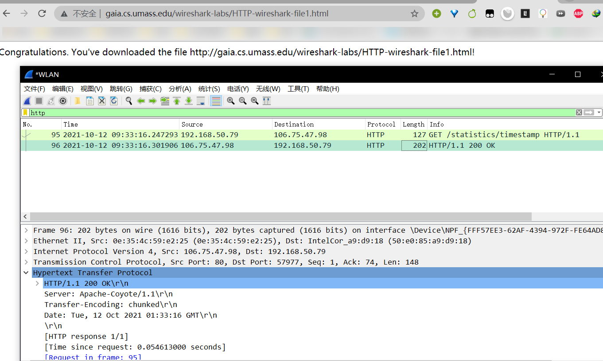

查看HTTP协议响应报文：点击第二条信息

查看下方对应的报文内容。

分别查看请求报文和响应报文可以得知浏览器和服务器运行的HTTP版本都是1.1。

查看浏览器能接收的语言：中文和英文。

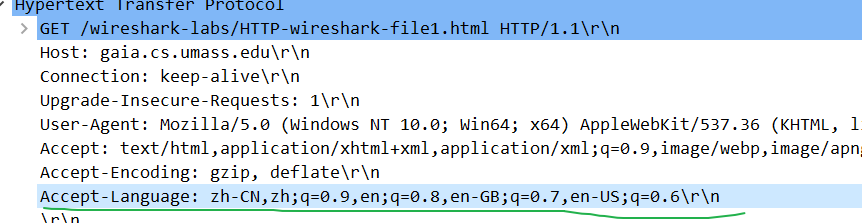

查看双方的IP地址，上次实验已经做了。

服务器返回浏览器的状态码：200 OK。

服务器的html文件上最后一次修改的时间？

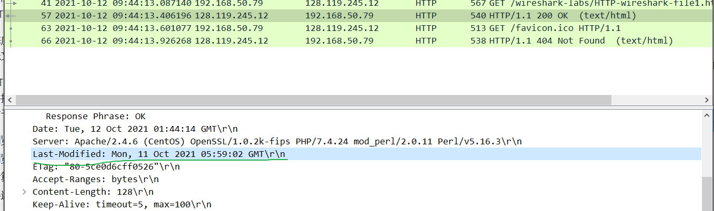

不要奇怪为什么是刚刚修改的。

那是因为（对于这个特定文件），gaia.cs.umass.edu服务器将文件的最后修改时间设置为当前时间，并且每分钟执行一次。 因此，如果您在两次访问之间等待一分钟，则该文件看起来已被修改，因此您的浏览器将下载文档的“新”副本。

服务器返回多少字节的内容到浏览器？

128字节。

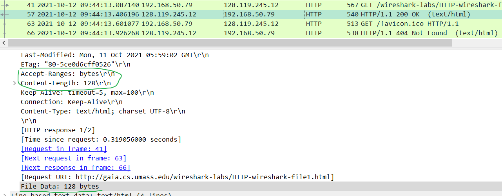

---

开始下一次捕获。

首先必须清空浏览器缓存文件。使用Edge浏览器清空最近1小时的浏览记录就行。

示例网站：  http://gaia.cs.umass.edu/wireshark-labs/HTTP-wireshark-file2.html。

访问一次网站之后再刷新一次，一共有4条HTTP报文。

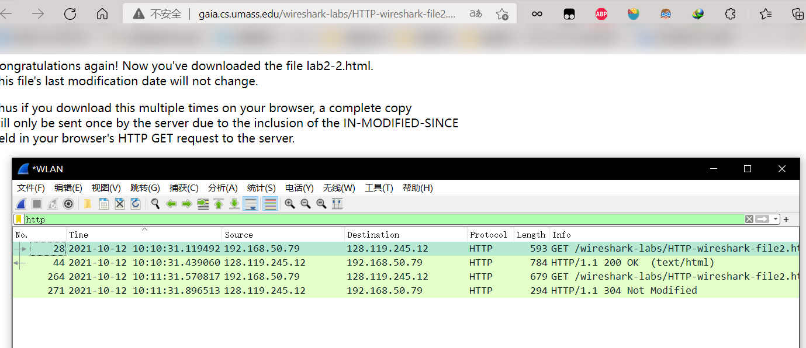

检查第一个从您浏览器到服务器的HTTP GET请求的内容。您在HTTP GET中看到了“IF-MODIFIED-SINCE”行吗？

没有。

现在，检查第二个HTTP GET请求的内容。 您在HTTP GET中看到了“IF-MODIFIED-SINCE:”行吗？ 如果是，“IF-MODIFIED-SINCE:”头后面包含哪些信息？

有。内容是上次得到的 服务器最后修改这个文件的时间。

第二次请求时浏览器会发送“IF-MODIFIED-SINCE:”，服务器发现文件未修改，返回304状态码，调用本地cache返回文件。

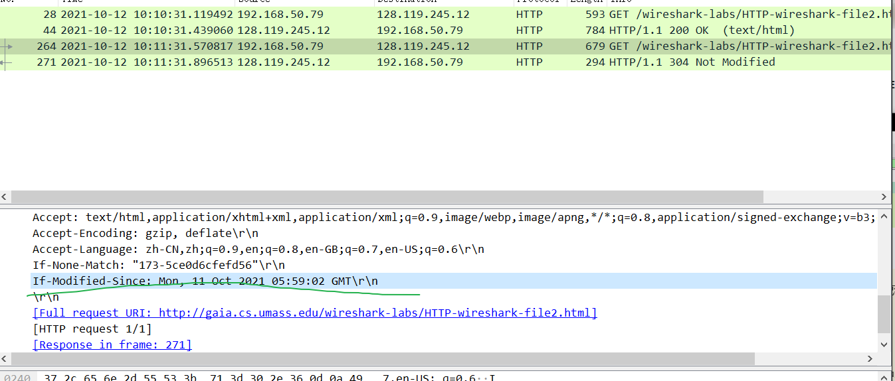

针对第二个HTTP GET，从服务器响应的HTTP状态码和短语是什么？服务器是否仍然返回文件的内容？请解释。

状态码是304，服务器未返回文件内容，而是调用本地缓存。

对比第一、二次响应报文：

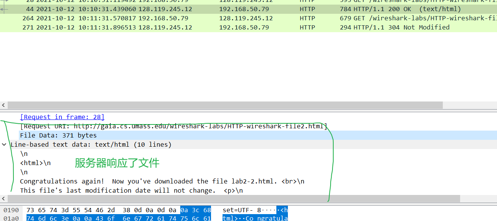

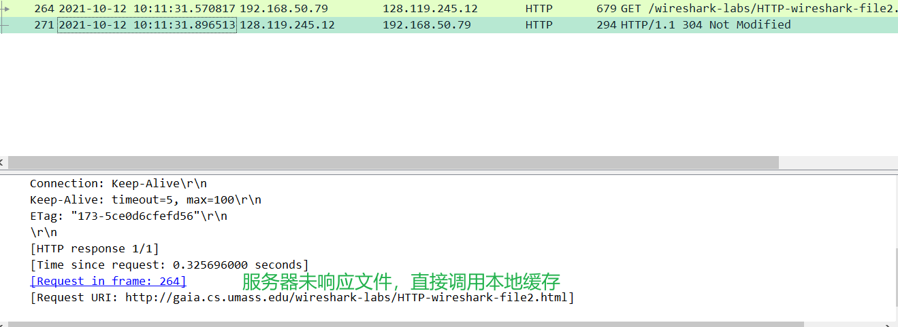

---

开始下一次捕获。

首先必须清空浏览器缓存文件。使用Edge浏览器清空最近1小时的浏览记录就行。

示例网站：  http://gaia.cs.umass.edu/wireshark-labs/HTTP-wireshark-file3.html。

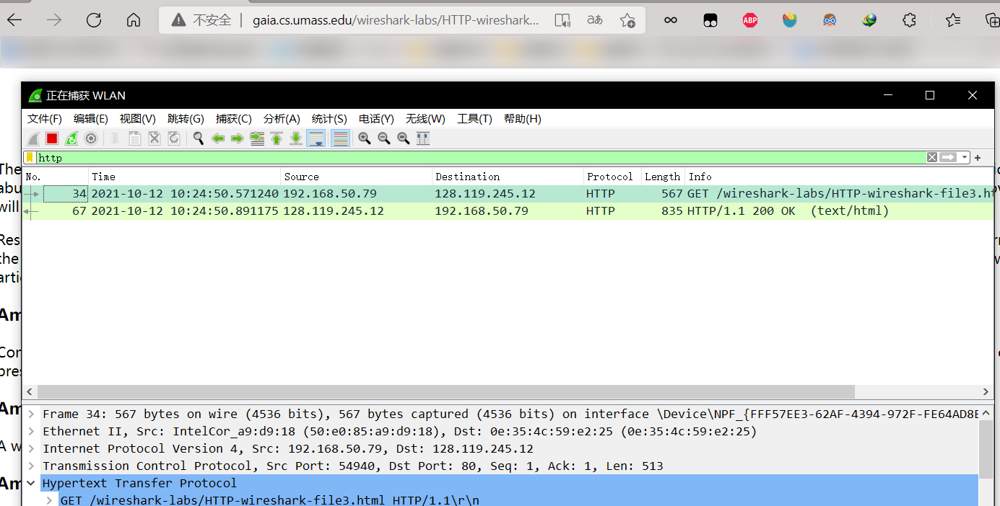

1. 您的浏览器发送多少HTTP GET请求消息？哪个数据包包含了美国权利法案的消息？
2. 哪个数据包包含响应HTTP GET请求的状态码和短语？
3. 响应中的状态码和短语是什么？
4. 需要多少包含数据的TCP段来执行单个HTTP响应和权利法案文本？

答案：

1.发送了一条GET请求报文。编号67的数据包，就是上面的HTTP响应报文。

2.编号67的数据包，200 OK。

3.200 OK。

4.4个TCP段。

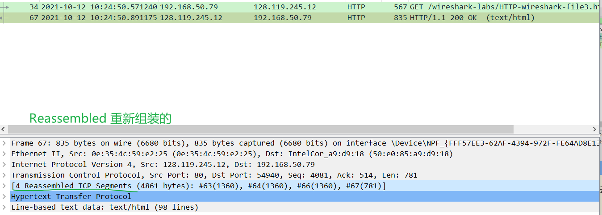

---

开始下一次捕获。

我们可以看看当浏览器使用嵌入的对象下载文件时，会发生什么，即包含其他对象的文件（在下面的例子中是图像文件） 的服务器。

首先必须清空浏览器缓存文件。使用Edge浏览器清空最近1小时的浏览记录就行。

示例网站： http://gaia.cs.umass.edu/wireshark-labs/HTTP-wireshark-file4.html。

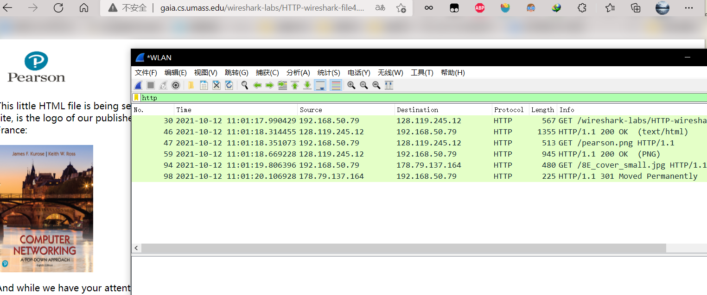

1. 您的浏览器发送了几个HTTP GET请求消息？ 这些GET请求发送到哪个IP地址？
2. 浏览器从两个网站串行还是并行下载了两张图片？请说明。

答案：

1.发送了3个GET请求，前2个发送到128.119.245.12，最后1个发送到178.79.137.164。

2.串行下载，数据包都是先后发出的，有时间差，看上图。

---

开始下一次捕获。

首先必须清空浏览器缓存文件。使用Edge浏览器清空最近1小时的浏览记录就行。

示例网站： http://gaia.cs.umass.edu/wireshark-labs/protected_pages/HTTP-wiresharkfile5.html。

用户名是“wireshark-students”（不包含引号），密码是“network”（再次不包含引号）。所以让我们访问这个“安全的”受密码保护的网站。

1. 对于您的浏览器的初始HTTP GET消息，服务器响应（状态码和短语）是什么响应？
2. 当您的浏览器第二次发送HTTP GET消息时，HTTP GET消息中包含哪些新字段？

答案：

1.401 Unauthorized。

2.Authorization: 

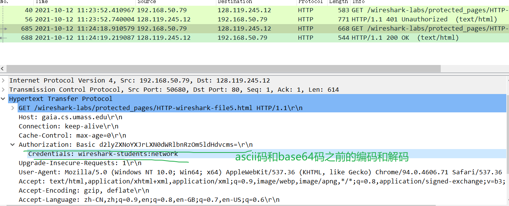

可以发现GET请求将用户名和密码通过base64编码处理了，这里可以借助wireshark直接查看其对应的ASCII码，也就是我们输入的内容。这个简单加密并不安全，很容易解码。