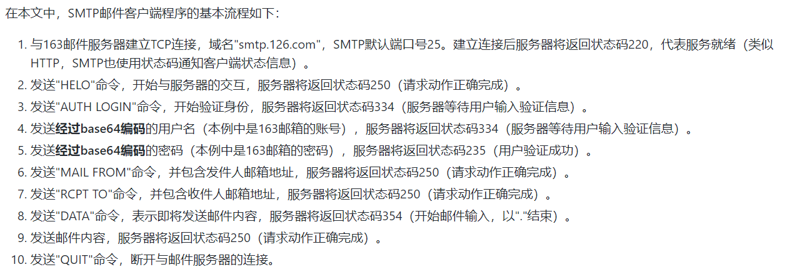
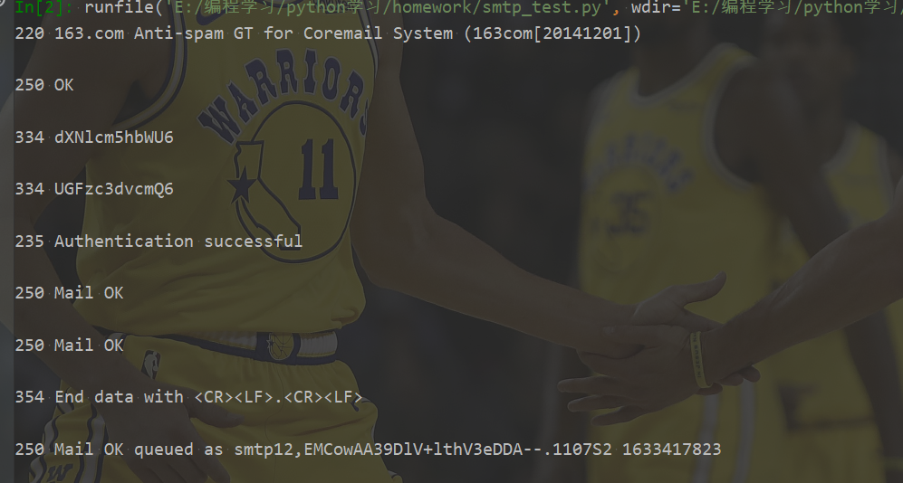
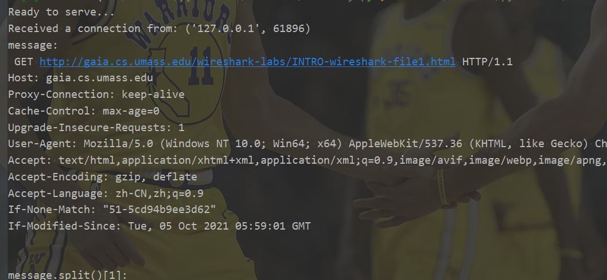

《计算机网络--自顶向下方法》[笔记及配套资料](https://github.com/moranzcw/Computer-Networking-A-Top-Down-Approach-NOTES)。

《计算机网络--自顶向下方法》资料： https://github.com/jzplp/Computer-Network-A-Top-Down-Approach-Answer。

实验与习题答案： https://blog.csdn.net/qq278672818/category_8368262.html。

**在线实验平台： https://www.educoder.net/paths/734。（强烈推荐！）**

<!--more-->

本文作业涉及到的相关知识可以在廖雪峰的python教程中学习！

廖雪峰教程： https://www.liaoxuefeng.com/wiki/1016959663602400/1017788916649408。（最全面！）

## 作业1：Web服务器

作业文档[中文翻译]( https://github.com/moranzcw/Computer-Networking-A-Top-Down-Approach-NOTES/blob/master/SocketProgrammingAssignment/%E4%BD%9C%E4%B8%9A1-Web%E6%9C%8D%E5%8A%A1%E5%99%A8/%E4%BD%9C%E4%B8%9A1-Web%E6%9C%8D%E5%8A%A1%E5%99%A8-%E7%BF%BB%E8%AF%91.md)地址。[答案](https://github.com/moranzcw/Computer-Networking-A-Top-Down-Approach-NOTES/blob/master/SocketProgrammingAssignment/%E4%BD%9C%E4%B8%9A1-Web%E6%9C%8D%E5%8A%A1%E5%99%A8/%E4%BD%9C%E4%B8%9A1-Web%E6%9C%8D%E5%8A%A1%E5%99%A8-%E8%A7%A3%E7%AD%94.md)地址。

另一份答案： https://jzplp.blog.csdn.net/article/details/106029429。（完整答案，包括扩展练习）

```python
#import socket module
from socket import *
serverSocket = socket(AF_INET, SOCK_STREAM) 
#Prepare a sever socket 
#Fill in start 
#Fill in end 
while True:     
    #Establish the connection    
    print 'Ready to serve...'     # python2的语法
    connectionSocket, addr =   #Fill in start  #Fill in end
    try:         
        message =   #Fill in start  #Fill in end
        filename = message.split()[1]                          
        f = open(filename[1:])
        outputdata = #Fill in start  #Fill in end
        #Send one HTTP header line into socket         
        #Fill in start         
        #Fill in end    

        #Send the content of the requested file to the client
        for i in range(0, len(outputdata)):
            connectionSocket.send(outputdata[i])
        connectionSocket.close()
    except IOError:
        #Send response message for file not found
        #Fill in start
        #Fill in end

        #Close client socket
        #Fill in start
        #Fill in end             
    serverSocket.close()
```

需要在标有#Fill in start 和 # Fill in end的地方填写代码。另外，每个地方都可能需要不止一行代码。

将HTML文件（例如HelloWorld.html）放在服务器所在的目录中。运行服务器程序。确认运行服务器的主机的IP地址（例如128.238.251.26）。从另一个主机，打开浏览器并提供相应的URL。例如：

http://128.238.251.26:6789/HelloWorld.html

“HelloWorld.html”是您放在服务器目录中的文件。还要注意使用冒号后的端口号。您需要使用服务器代码中使用的端口号来替换此端口号。在上面的例子中，我们使用了端口号6789. 浏览器应该显示HelloWorld.html的内容。如果省略“:6789”，浏览器将使用默认端口80，只有当您的服务器正在端口80监听时，才会从服务器获取网页。

然后用客户端尝试获取服务器上不存在的文件。你应该会得到一个“404 Not Found”消息。

---

不会python的参照中文文档： https://docs.python.org/zh-cn/3.8/library/functions.html。

菜鸟教程： https://www.runoob.com/python/python-socket.html。

```python
#import socket module
from socket import *
serverSocket = socket(AF_INET, SOCK_STREAM) 
#Prepare a sever socket 
#Fill in start 
HOST = '127.0.0.1'# gethostname()
PORT = 6789
serverSocket.bind((HOST,PORT)) # 绑定主机，端口到套接字
serverSocket.listen(5) # 开始TCP监听，最大连接数至少为1
#Fill in end 
while True:     
    #Establish the connection    
    print ('Ready to serve...')  # 修改python2的语法   
    connectionSocket, addr = serverSocket.accept()  # 被动接收TCP客户端连接
    try:         
        message =  connectionSocket.recv(1024) # 接收 客户发送的TCP报文数据
        filename = message.split()[1]                          
        f = open(filename[1:])
        outputdata = f.read()
        f.close()
        #Fill in start  #Fill in end
        #Send one HTTP header line into socket         
        header = 'HTTP/1.1 200 OK\r\n\r\n'
        connectionSocket.send(header.encode())

        #Send the content of the requested file to the client
        for i in range(0, len(outputdata)):
            connectionSocket.send(outputdata[i].encode())
        connectionSocket.close()
    except IOError:
        #Send response message for file not found
        #Fill in start
        header = 'HTTP/1.1 404 Not Found\r\n\r\n'
        connectionSocket.send(header.encode())
        #Fill in end

        #Close client socket
        #Fill in start
        connectionSocket.close()
        #Fill in end             
    serverSocket.close()
```

`web_server.py`程序如上，在同一目录下创建`helloworld.html`：

内容为：`<head>Hello world!</head>`

在浏览器中输入地址访问：`http://127.0.0.1:6789/helloworld.html`

成功看到html内容。

这里的浏览器就作为了TCP的客户端，主动发起TCP连接，`web_server.py`被动接收连接，并发送一个简单的HTTP响应，只有一个状态码，然后发送html文件。

若地址不正确，服务器将抛出异常，发送HTTP 404 状态码作为响应。

## 作业2：UDP ping 程序

作业文档[中文翻译](https://github.com/moranzcw/Computer-Networking-A-Top-Down-Approach-NOTES/blob/master/SocketProgrammingAssignment/%E4%BD%9C%E4%B8%9A2-UDPping%E7%A8%8B%E5%BA%8F/%E4%BD%9C%E4%B8%9A2-UDPping%E7%A8%8B%E5%BA%8F-%E7%BF%BB%E8%AF%91.md)地址。[答案](https://github.com/moranzcw/Computer-Networking-A-Top-Down-Approach-NOTES/blob/master/SocketProgrammingAssignment/%E4%BD%9C%E4%B8%9A2-UDPping%E7%A8%8B%E5%BA%8F/%E4%BD%9C%E4%B8%9A2-UDPping%E7%A8%8B%E5%BA%8F-%E8%A7%A3%E7%AD%94.md)地址。

您需要实现以下客户端程序。

客户端向服务器发送10次ping。因为UDP是不可靠的协议，所以从客户端发送到服务器的数据包可能在网络中丢失。因此，客户端不能无限期地等待ping消息的回复。客户等待服务器回答的时间至多为一秒，如果在一秒内没有收到回复，您的客户端程序应该假定数据包在网络传输期间丢失。

具体来说，您的客户端程序应该

1. 使用UDP发送ping消息（注意：不同于TCP，您不需要首先建立连接，因为UDP是无连接协议。）
2. 从服务器输出响应消息
3. 如果从服务器受到响应，则计算并输出每个数据包的往返时延（RTT）（以秒为单位），
4. 否则输出“请求超时”

> 客户端消息格式： Ping sequence_number time
>
> 其中*sequence_number*从1开始，一直到10，共10条消息，而*time*则是客户端发送消息时的时间。

给定`UDPPingerServer.py`：

```python
# UDPPingerServer.py
# We will need the following module to generate randomized lost packets import random
from socket import *
import random

# Create a UDP socket
# Notice the use of SOCK_DGRAM for UDP packets
serverSocket = socket(AF_INET, SOCK_DGRAM)
# Assign IP address and port number to socket
serverSocket.bind(('', 12000))

while True:
	# Generate random number in the range of 0 to 10
	rand = random.randint(0, 10)
	# Receive the client packet along with the address it is coming from
	message, address = serverSocket.recvfrom(1024)
	# Capitalize the message from the client
	message = message.upper()
	# If rand is less is than 4, we consider the packet lost and do not respond
	if rand < 4:
		continue
	# Otherwise, the server responds
	serverSocket.sendto(message, address)
```

客户端代码，`UDPPinger.py`：

其中每次在发送前从系统提取一次时间，接收到服务器返回的消息后 ，再提取一次时间，两次相减，即可得到每个消息的往返时延（RTT）。

```python
# UDPPinger.py
from socket import *
import time

clientSocket = socket(AF_INET,SOCK_DGRAM) # 建立UDP连接
clientSocket.settimeout(1) # 设置socket超时值1秒
HOST = '127.0.0.1'
PORT = 12000

for i in range(10):
	sendTime = time.time()
	message = ('Ping %d %s' % (i + 1, sendTime)).encode()
	try:
		clientSocket.sendto(message,(HOST,PORT)) # 将信息发送到服务器
		modifiedMessage, serverAddress = clientSocket.recvfrom(1024)  # 从服务器接收信息，同时也能得到服务器地址
		rtt = time.time() - sendTime
		print('Sequence %d : Request from %s , RTT = %.3f' % (i+1,HOST,rtt))
	except Exception as e:
		print('Sequence %d : Request from %s time out!' % (i+1,HOST))
clientSocket.close()
```

测试结果：

```text
Sequence 1 : Request from 127.0.0.1 time out!
Sequence 2 : Request from 127.0.0.1 time out!
Sequence 3 : Request from 127.0.0.1 time out!
Sequence 4 : Request from 127.0.0.1 time out!
Sequence 5 : Request from 127.0.0.1 , RTT = 0.000 s
Sequence 6 : Request from 127.0.0.1 , RTT = 0.000 s
Sequence 7 : Request from 127.0.0.1 time out!
Sequence 8 : Request from 127.0.0.1 , RTT = 0.000 s
Sequence 9 : Request from 127.0.0.1 , RTT = 0.000 s
Sequence 10 : Request from 127.0.0.1 , RTT = 0.000 s
```

## 作业3：邮件客户端

作业文档[中文翻译](https://github.com/moranzcw/Computer-Networking-A-Top-Down-Approach-NOTES/blob/master/SocketProgrammingAssignment/%E4%BD%9C%E4%B8%9A3-%E9%82%AE%E4%BB%B6%E5%AE%A2%E6%88%B7%E7%AB%AF/%E4%BD%9C%E4%B8%9A3-%E9%82%AE%E4%BB%B6%E5%AE%A2%E6%88%B7%E7%AB%AF-%E7%BF%BB%E8%AF%91.md)地址。[答案](https://github.com/moranzcw/Computer-Networking-A-Top-Down-Approach-NOTES/blob/master/SocketProgrammingAssignment/%E4%BD%9C%E4%B8%9A3-%E9%82%AE%E4%BB%B6%E5%AE%A2%E6%88%B7%E7%AB%AF/%E4%BD%9C%E4%B8%9A3-%E9%82%AE%E4%BB%B6%E5%AE%A2%E6%88%B7%E7%AB%AF-%E8%A7%A3%E7%AD%94.md)地址。

```python
from socket import *
msg = "\r\n I love computer networks!"
endmsg = "\r\n.\r\n"
# Choose a mail server (e.g. Google mail server) and call it mailserver 
mailserver = #Fill in start   #Fill in end
# Create socket called clientSocket and establish a TCP connection with mailserver
#Fill in start

#Fill in end
recv = clientSocket.recv(1024)
print recv
if recv[:3] != '220':
    print '220 reply not received from server.'

# Send HELO command and print server response.
heloCommand = 'HELO Alice\r\n'
clientSocket.send(heloCommand)
recv1 = clientSocket.recv(1024)
print recv1
if recv1[:3] != '250':
    print '250 reply not received from server.'

# Send MAIL FROM command and print server response.
# Fill in start

# Fill in end

# Send RCPT TO command and print server response.
# Fill in start

# Fill in end

# Send DATA command and print server response.
# Fill in start

# Fill in end

# Send message data.
# Fill in start

# Fill in end 

# Message ends with a single period.
# Fill in start

# Fill in end

# Send QUIT command and get server response.
# Fill in start

# Fill in end
```

本文将实现一个SMTP客户端，使用163邮箱作为发件人，向指定的QQ邮箱发送一封邮件。



```python
from socket import *
import base64

msg = "\r\n I love computer networks!" # 邮件内容
endmsg = "\r\n.\r\n"
# Choose a mail server (e.g. Google mail server) and call it mailserver
mailserver = 'smtp.163.com'

subject = "I love computer networks!" # 邮件标题
contenttype = "text/plain"

# Sender and reciever
fromaddress = "xxx@163.com"
toaddress = "xxx@qq.com"

# Auth information (Encode with base64) base64加密处理用户名和密码
username = base64.b64encode("xxx@163.com".encode()) + b'\r\n'
password = base64.b64encode("xxx".encode()) + b'\r\n'

# Create socket called clientSocket and establish a TCP connection with mailserver
clientSocket = socket(AF_INET, SOCK_STREAM)
clientSocket.connect((mailserver, 25))

recv = clientSocket.recv(1024).decode()
print(recv)
if recv[:3] != '220':
	print('220 reply not received from server.')

# Send HELO command and print server response.
heloCommand = 'HELO Alice\r\n'
clientSocket.send(heloCommand.encode())
recv1 = clientSocket.recv(1024).decode()
print(recv1)
if recv1[:3] != '250':
	print('250 reply not received from server.')

# 登陆邮箱过程
clientSocket.sendall('AUTH LOGIN\r\n'.encode())
recv = clientSocket.recv(1024).decode()
print(recv)
if (recv[:3] != '334'):
	print('334 reply not received from server')

clientSocket.sendall(username)
recv = clientSocket.recv(1024).decode()
print(recv)
if (recv[:3] != '334'):
	print('334 reply not received from server')

clientSocket.sendall(password)
recv = clientSocket.recv(1024).decode()
print(recv)
if (recv[:3] != '235'):
	print('235 reply not received from server')

# Send MAIL FROM command and print server response.
# Fill in start
clientSocket.sendall(('MAIL FROM: <' + fromaddress + '>\r\n').encode())
recv = clientSocket.recv(1024).decode()
print(recv)
if (recv[:3] != '250'):
	print('250 reply not received from server')
# Fill in end

# Send RCPT TO command and print server response.
# Fill in start
clientSocket.sendall(('RCPT TO: <' + toaddress + '>\r\n').encode())
recv = clientSocket.recv(1024).decode()
print(recv)
if (recv[:3] != '250'):
	print('250 reply not received from server')
# Fill in end

# Send DATA command and print server response.
# Fill in start
clientSocket.send('DATA\r\n'.encode())
recv = clientSocket.recv(1024).decode()
print(recv)
if (recv[:3] != '354'):
	print('354 reply not received from server')
# Fill in end

# Send message data.
# Fill in start
message = 'from:' + fromaddress + '\r\n'
message += 'to:' + toaddress + '\r\n'
message += 'subject:' + subject + '\r\n'
message += 'Content-Type:' + contenttype + '\t\n'
message += '\r\n' + msg
clientSocket.sendall(message.encode())
# Fill in end

# Message ends with a single period.
# Fill in start
clientSocket.sendall(endmsg.encode())
recv = clientSocket.recv(1024).decode()
print(recv)
if (recv[:3] != '250'):
	print('250 reply not received from server')
# Fill in end

# Send QUIT command and get server response.
# Fill in start
clientSocket.sendall('QUIT\r\n'.encode())
# Fill in end

# Close connection
clientSocket.close()
```

- 有些邮箱默认关闭SMTP服务，比如本文使用的163邮箱。需要在设置中打开SMTP服务。另外，163邮箱在打开SMTP服务后，会设置一个授权码，在程序使用这个授权码作为密码登录，而不是平时使用的密码。
- 代码中带有xxx的内容的是需要自行设置的内容，包含：发件人邮箱，收件人邮箱，登录邮箱的用户名和密码。

测试结果：

程序返回输出，邮箱也收到相应邮件。

## 作业4：多线程Web代理服务器

作业文档[中文翻译](https://github.com/moranzcw/Computer-Networking-A-Top-Down-Approach-NOTES/blob/master/SocketProgrammingAssignment/%E4%BD%9C%E4%B8%9A4-%E5%A4%9A%E7%BA%BF%E7%A8%8BWeb%E4%BB%A3%E7%90%86%E6%9C%8D%E5%8A%A1%E5%99%A8/%E4%BD%9C%E4%B8%9A4-%E5%A4%9A%E7%BA%BF%E7%A8%8BWeb%E4%BB%A3%E7%90%86%E6%9C%8D%E5%8A%A1%E5%99%A8-%E7%BF%BB%E8%AF%91.md)地址。[答案](https://github.com/moranzcw/Computer-Networking-A-Top-Down-Approach-NOTES/blob/master/SocketProgrammingAssignment/%E4%BD%9C%E4%B8%9A4-%E5%A4%9A%E7%BA%BF%E7%A8%8BWeb%E4%BB%A3%E7%90%86%E6%9C%8D%E5%8A%A1%E5%99%A8/%E4%BD%9C%E4%B8%9A4-%E5%A4%9A%E7%BA%BF%E7%A8%8BWeb%E4%BB%A3%E7%90%86%E6%9C%8D%E5%8A%A1%E5%99%A8-%E8%A7%A3%E7%AD%94.md)地址。

您的任务是开发一个能够缓存网页的小型Web代理服务器。这是一个很简单的代理服务器，它只能理解简单的GET请求，但能够处理各种对象 —— 不仅仅是HTML页面，还包括图片。

通常，当客户端发出一个请求时，请求将被直接发送到Web服务器。然后Web服务器处理该请求并将响应消息发送客户端。为了提高性能，我们在客户端和Web服务器之间建立一个代理服务器。现在，客户端发送的请求消息和Web服务器返回的响应消息都要经过代理服务器。换句话说，客户端通过代理服务器请求对象。代理服务器将客户端的请求转发到Web服务器。然后，Web服务器将生成响应消息并将其传递给代理服务器，代理服务器又将其发送给客户端。

需要您填写代码的地方标有`#Fill in start`和`#Fill in end`。 每个地方都需要填写至少一行代码。

代理服务器的Python代码框架：

```python
from socket import *
import sys

if len(sys.argv) <= 1:
    print 'Usage : "python ProxyServer.py server_ip"\n[server_ip : It is the IP Address Of Proxy Server'
	sys.exit(2)
# Create a server socket, bind it to a port and start listening
tcpSerSock = socket(AF_INET, SOCK_STREAM)
# Fill in start.
# Fill in end.
while 1:
	# Strat receiving data from the client
	print 'Ready to serve...'
	tcpCliSock, addr = tcpSerSock.accept()
	print 'Received a connection from:', addr
	message = # Fill in start. # Fill in end.
	print message
	# Extract the filename from the given message
	print message.split()[1]
	filename = message.split()[1].partition("/")[2]
	print filename
	fileExist = "false"
	filetouse = "/" + filename
	print filetouse
	try:
		# Check wether the file exist in the cache
		f = open(filetouse[1:], "r")
		outputdata = f.readlines()
		fileExist = "true"
		# ProxyServer finds a cache hit and generates a response message
		tcpCliSock.send("HTTP/1.0 200 OK\r\n")
		tcpCliSock.send("Content-Type:text/html\r\n")
		# Fill in start.
		# Fill in end.
			print 'Read from cache'
	# Error handling for file not found in cache
	except IOError:
		if fileExist == "false":
			# Create a socket on the proxyserver
			c = # Fill in start. # Fill in end.
			hostn = filename.replace("www.","",1) 
			print hostn
			try:
				# Connect to the socket to port 80
				# Fill in start.
				# Fill in end.
				# Create a temporary file on this socket and ask port 80
				for the file requested by the client
				fileobj = c.makefile('r', 0)
				fileobj.write("GET "+"http://" + filename + " HTTP/1.0\n\n")
				# Read the response into buffer
				# Fill in start.
				# Fill in end.
				# Create a new file in the cache for the requested file.
				# Also send the response in the buffer to client socket and the corresponding file in the cache
				tmpFile = open("./" + filename,"wb")
				# Fill in start.
				# Fill in end.
			except:
				print "Illegal request"
		else:
			# HTTP response message for file not found
			# Fill in start.
			# Fill in end.
	# Close the client and the server sockets
	tcpCliSock.close()
# Fill in start.
# Fill in end.
```

按照官方文档的代码骨架，代理程序接收用户的GET请求，若请求的内容发已存在于代理服务器，则直接返回内容，若不存在，则转发该请求到目标服务器，接收目标服务器的响应，并将响应内容存储为文件，作为缓存，已备之后同样的请求。

```python
from socket import *

# 为代理服务器 创建一个TCP套接字、绑定端口号、设置服务器最大连接客户机数量为3(因为是多线程Web服务器)
tcpSerSock = socket(AF_INET, SOCK_STREAM)
tcpSerSock.bind(('',1234))
tcpSerSock.listen(3)

while 1:
	# 准备从客户机接收响应消息
	print ('准备从客户机接收响应消息...')
	tcpCliSock, addr = tcpSerSock.accept()
	print ('接收到一个连接，来自：', addr)
	
	# 获取客户机发送过来的消息
	message = tcpCliSock.recv(4096).decode()
	print ('客户机发送过来的消息：',message)
	
	# 从消息从提取出文件名
	filename = message.split()[1].partition("//")[2].replace('/','_')
	print ('文件名：',filename)
	fileExist = "false"
	
	try:
		# 检查要访问的文件是否在此Web代理服务器中
		print ('开始检查代理服务器中是否存在文件：',filename)
		f = open(filename, "r")
		outputdata = f.readlines()
		fileExist = "true"
		print ('文件存在在代理服务器中')
		# 文件存在在代理服务器中，返回响应消息(请求的web网页)给客户机
		#tcpCliSock.send("HTTP/1.0 200 OK\r\n")
		#tcpCliSock.send("Content-Type:text/html\r\n")
		for i in range(0,len(outputdata)):
				tcpCliSock.send(outputdata[i].encode())	
		print ('Read from cache')
			
	# 文件不在代理服务器当中，代理服务器就会向远端服务器请求消息，保存好了再返回给客户机
	except IOError:
		if fileExist == "false":
			print ('文件不在代理服务器当中，开始向远端服务器请求网页')
			# 在代理服务器中创建一个TCP套接字
			c = socket(AF_INET,SOCK_STREAM)
			
			hostn = message.split()[1].partition("//")[2].partition("/")[0]
			print ('Host Name: ',hostn)
			try:
				# TCP套接字c 连接到远端服务器80端口
				c.connect((hostn,80))
				print ('套接字连接到主机的80号端口')
				
				# 在套接字上创建一个临时的文件，而且要向80端口(远端服务器)请求信息
				#for the file requested by the client
				#fileobj = c.makefile('r', 0)
				#fileobj.write("GET "+"http://" + filename + " HTTP/1.0\n\n")
				
				# 代理服务器 读取 从远端服务器从响应的消息
				c.sendall(message.encode())
				buff = c.recv(4096)
				tcpCliSock.sendall(buff)
				
				# 在代理服务器中 创建一个新的文件 用于存放请求过来的消息
				# 将代理服务器中的响应 发送到客户端套接字，并将相应的文件发送到缓存中
				tmpFile = open("./" + filename,"w")
				tmpFile.writelines(buff.decode().replace('\r\n','\n'))
				tmpFile.close();
				
			except:
				print ("代理服务器向远端服务器请求网页失败")
		else:
			# 如果客户机请求的消息在远端服务器也找不到，就说明请求不到了
			print ('文件存在，但是还是出现了 IOError异常')

	# 关闭客户机 和 代理服务器的TCP套接字
	print ('关闭套接字：tcpCliSock')
	tcpCliSock.close();
# 关闭代理服务器 和 服务器的TCP套接字
print ('关闭套接字：tcpSerSock')
tcpSerSock.close();
```

测试参考： https://blog.csdn.net/qq_41708792/article/details/102134906。

测试网站：http://gaia.cs.umass.edu/wireshark-labs/INTRO-wireshark-file1.html

