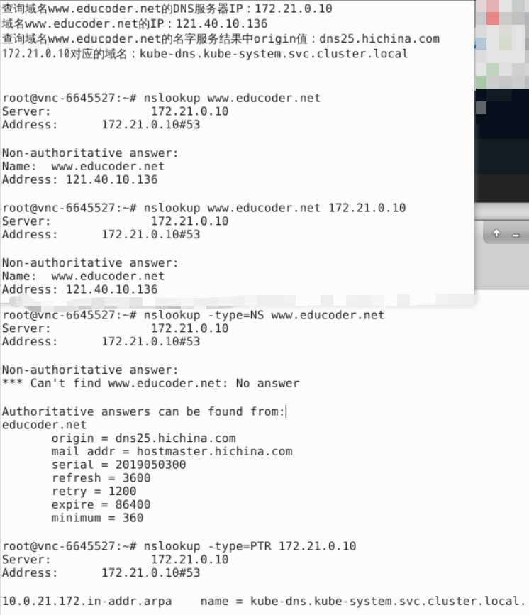
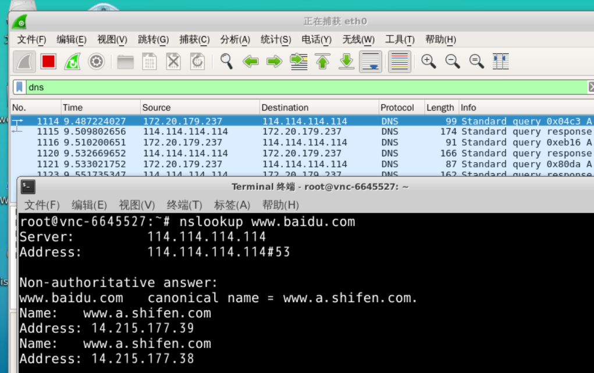
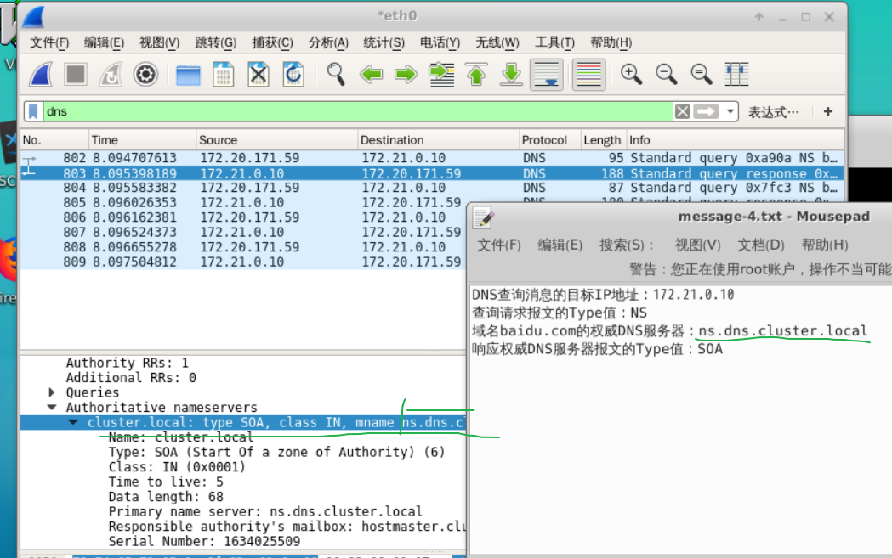
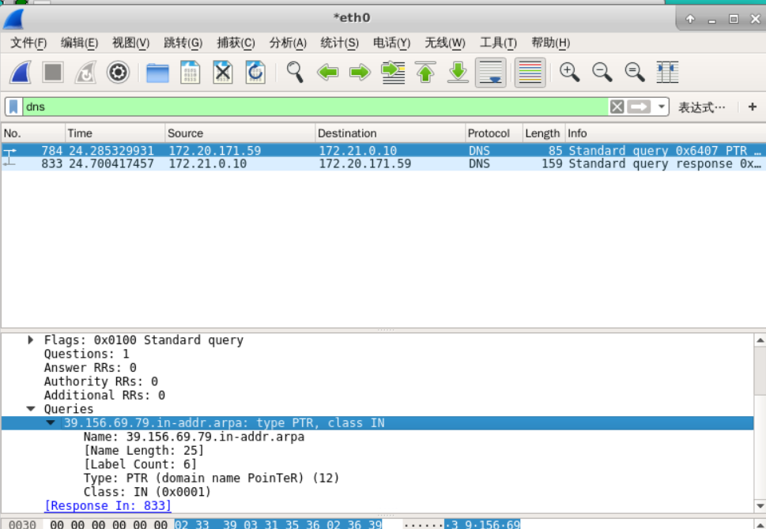
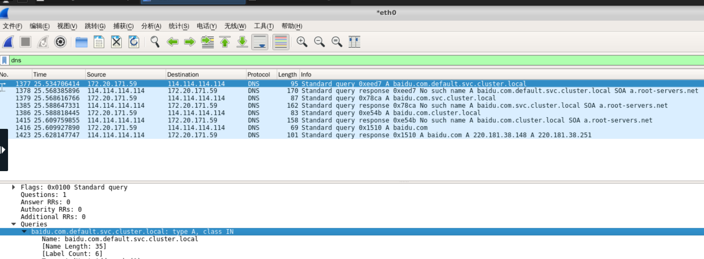

# 第二章：Wireshark补充实验

《计算机网络--自顶向下方法》[笔记及配套资料](https://github.com/moranzcw/Computer-Networking-A-Top-Down-Approach-NOTES)。

《计算机网络--自顶向下方法》资料： https://github.com/jzplp/Computer-Network-A-Top-Down-Approach-Answer。

实验与习题答案： https://blog.csdn.net/qq278672818/category_8368262.html。

**在线实验平台： https://www.educoder.net/paths/734。（强烈推荐！）**

<!--more-->

## 实验2：DNS

本次实验[地址](https://github.com/moranzcw/Computer-Networking-A-Top-Down-Approach-NOTES/blob/master/WiresharkLab/Wireshark%E5%AE%9E%E9%AA%8C-DNS/Wireshark%E5%AE%9E%E9%AA%8C-DNS.md)。

推荐使用Edge F12 查看相应信息，非常好用！

nslookup实验：https://www.educoder.net/tasks/hfovykfsrmuj。

---

DNS报文分析实验： https://www.educoder.net/tasks/4hbosy5fv7rf。

打开 Wireshark ，并在过滤器中输入 DNS 。筛选出 DNS 协议报文，并开始捕获报文。然后打开终端，输入命令并执行`nslookup www.baidu.com`，在 Wireshark 中停止捕获报文。

在DNS的请求、响应报文中可以查看相应信息。

---

NS 类型的 DNS 报文分析实验： https://www.educoder.net/tasks/ocybtfvm2qwg。

DNS 中 NS 记录 NS（Name Server）记录是域名服务器记录，用来指定该域名由哪个 DNS 服务器来进行解析。

打开 Wireshark ，并在过滤器中输入 DNS 。筛选出 DNS 协议报文，并开始捕获报文。然后打开终端，输入命令并执行`nslookup -type=NS baidu.com`，在 Wireshark 中停止捕获报文。

---

反向DNS解析实验： https://www.educoder.net/tasks/hjsxlig5yfab。

打开 Wireshark ，并在过滤器中输入 DNS 。筛选出 DNS 协议报文，并开始捕获报文。然后打开终端，输入命令并执行`nslookup -type=PTR 79.69.156.39`，在 Wireshark 中停止捕获报文。

---

指定服务器进行 DNS 解析实验： https://www.educoder.net/tasks/2kv9x3qhb6ym。

