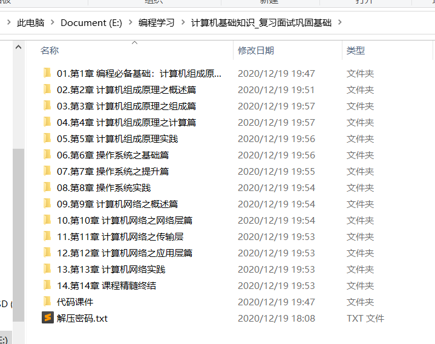

## 1IDE安装/配置教程

### 1.1VScode的C++环境搭建

手把手教会VSCode的C++环境搭建，多文件编译等：

<!--more-->

https://www.bilibili.com/video/BV13K411M78v?share_source=copy_web。

### 1.2Pycharm安装、配置和使用指南

2020最新版本Pycharm安装、配置和使用指南：

https://www.bilibili.com/video/BV11t4y1C7Dq?share_source=copy_web。

PS：Jetbrain家的产品，社区版是免费的，高级版是要付费的，具体差别和如何破解高级版请自行百度，**Pycharm、IDEA等同一家的产品可以用一个文件破解**。

### 1.3IntelliJ IDEA下载安装和配置教程

IntelliJ IDEA下载安装和配置教程：

https://www.bilibili.com/video/BV1j54y1U7uP?share_source=copy_web。

### 1.4vs2019(Visual Studio 2019)安装配置指南

vs2019(Visual Studio 2019)权威指南：

https://www.bilibili.com/video/BV1Xt411g7jT?share_source=copy_web。

墙裂推荐UP主Frank-FuckPPT，人称FUCK老师，教学视频很不错。

## 2刷题笔记/指南推荐

### 2.1霜神的Go刷题笔记

https://books.halfrost.com/leetcode/。

每题都beats100%，精益求精，采用Go语言实现。

### 2.2袁厨的Java算法笔记

https://github.com/chefyuan/algorithm-base。

全部采用Java实现，很贴心地添加了不少动画模拟，帮助理解。适合刚开始刷题打基础的同学。

### 2.3ACM算法日常的算法路线笔记

https://github.com/acm-clan/algorithm-stone。

https://mp.weixin.qq.com/s/pgKzObVLmmmL5oE6sz74rA。

项目花了不少功夫，为我们详细规划好了算法的刷题路线，题目按照标签进行分类整理。

### 2.4LeetCode题型总结

https://www.acwing.com/blog/content/4474/。

对常见的LeetCode题型进行总结，可以点击链接跳转LeetCode开始刷题。

### 2.5数据结构和算法必知必会的50个代码实现

https://github.com/wangzheng0822/algo。

作者王争开设了《数据结构与算法之美》专栏，这是配套的代码，非常棒！

有C/C++、Java、Go等多种语言实现，包含多种算法的代码实现。

### 2.6《数据结构与算法之美》专栏的实现代码（C++）

https://github.com/saber/algorithm。

一位学习专栏的同学写的笔记。

### 2.7LeetCode动画演示

https://github.com/MisterBooo/LeetCodeAnimation。

项目描述：我会尽力将 LeetCode 上所有的题目都用动画的形式演示出来，计划用 3 到 4 年时间去完成它，期待与你见证这一天！

### 2.8小浩算法图解题典

https://mp.weixin.qq.com/s/3eJNKDTZ5y5icMnfv9Is_w。

### 2.9PAT甲级题单模板

https://mp.weixin.qq.com/s/Ru-Zqm27IQlwHXdEQmmvLQ。

## 3竞赛教材及配套习题

https://www.summerfire.cn/posts/problemlist/。

建议阅读顺序：

1. 白书：[《挑战程序设计竞赛》](https://vjudge.net/article/46)秋叶拓哉等著；
2. 白书2：[《挑战程序设计竞赛2》](https://vjudge.net/article/732)渡部有隆著；
3. 紫书：[《算法竞赛入门经典》](https://vjudge.net/article/45)刘汝佳著；
4. 蓝书：[《算法竞赛进阶指南》](https://vjudge.net/article/755)李煜东著；
5. 蓝书2：[《算法竞赛训练指南2》](https://ac.nowcoder.com/acm/problem/collection/109)李煜东著。

提供了一些经典的竞赛教材和配套的习题。

## 4C++/Java/Python学习路线

### 4.1C++学习路线

1. 这个GitHub项目叫做[C++那些事](https://light-city.club/sc/)。

   这是一个适合初学者从**入门到进阶**的仓库，解决了**面试者与学习者**想要**深入C++**及如何**入坑C++**的问题。

2. 这个GitHub项目是为[C++校招](https://github.com/huihut/interview#cc)的同学服务的。

    本仓库是面向 C/C++ 技术方向校招求职者、初学者的基础知识总结，包括语言、程序库、数据结构、算法、系统、网络、链接装载库等知识及面试经验、招聘、内推等信息。

### 4.2Java学习路线

1. 这个GitHub项目是一个太过于经典的[Java学习项目](https://github.com/Snailclimb/JavaGuide)，面试必看。

   开源 JavaGuide 初始想法源于自己的个人那一段比较迷茫的学习经历。主要目的是为了通过这个开源平

   台帮助一些在学习 Java 或者面试过程中遇到问题的小伙伴。

2. 这个GitHub项目帮助你[成为一个更好的Java程序员](https://github.com/crisxuan/bestJavaer)。

   这是一个成为更好的 `Java 程序员`的系列教程。

### 4.3Python学习路线

这个GitHub项目[Python - 100天从新手到大师](Python - 100天从新手到大师)非常火爆，达到了恐怖的102K，几乎是我见过star最多的项目。项目非常全面，只要你能够完全吃透，Python水平绝对不在话下。

## 5博客/教程推荐

### 5.1[菜鸟教程](https://www.runoob.com/)

### 5.2[W3Cschool](https://www.w3cschool.cn/)

### 5.3[廖雪峰的官方网站](https://www.liaoxuefeng.com/)

### 5.4[公众号guangcity](https://cloud.tencent.com/developer/user/1021473/inventories)

### 5.5[kuangbin的博客](https://kuangbin.github.io/)

### 5.6[王帅真](https://wang_shuai_zhen.gitee.io/2020/03/13/Java%E4%B8%8E%E7%94%9F%E6%B4%BB/#more)

### 5.7[昂昂累世士](https://blog.csdn.net/qq_30277239)

### 5.8[程序员黄小斜](https://juejin.cn/user/289926800744029)

## 6其他优质资源推荐

**微信公众号的大佬的文章合集！！！**

极客时间专栏。

印象笔记收藏。

Github星标。

## 7常用工具类网站分享

羊哥分享的网站：https://mp.weixin.qq.com/s/XUHnLCbq7mDWhOc9imTVzg

导航网站：http://ilxdh.com/

超棒的去水印网站：https://theinpaint.com/?move

在线PS网站：https://www.uupoop.com/#/

## 8程序员cxuan微信公众号

这个是必须单独提一嘴的，巨佬tql，开了好几个系列文章，都是精华，干货多多，太良心了。

[Java核心技术超强总结](https://mp.weixin.qq.com/s/dNZ7Zyf6toTGfbYIaQC4yw)

[B站学习资源总结](https://mp.weixin.qq.com/s/4kuEfBZ8N2zTjs8EywocWg)

## 9小雨编程微信公众号

大佬也是写了不少笔记的。

[Linux学习笔记专栏](https://mp.weixin.qq.com/s/MdXP8uJCrAKV1Kpl9x_kAQ)

[Python基础学习笔记](https://mp.weixin.qq.com/s/mhF66GZ_p1g0k8XIIOk8lA)

## 10计算机基础知识

1.蛙课网视频：

2.B站默认收藏夹里的**计算机科学速成课**

3.多看经典推荐书籍

4.看总结的PDF资料

## 11机器学习

机器学习100天（英文项目翻译）:https://github.com/MLEveryday/100-Days-Of-ML-Code

可以看B站视频辅助学习。

莫烦Python（9K高赞）:https://github.com/MorvanZhou/tutorials