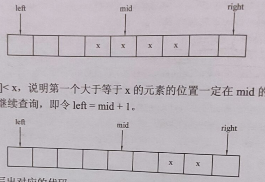
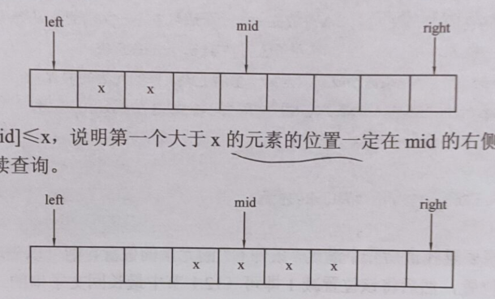

## 二分查找

首先，我们抛出一个经典的问题：如何在一个严格递增序列A中找出给定的数x。

<!--more-->

最直接的办法就是对序列进行现行扫描所有元素，如果找到x则成功，如果没找到就失败。

这种顺序查找的时间复杂度为O(n)，当查询数据较小时，是个很好的选择，但数据量太大就不行了。

---

由此，我们可以通过二分查找来缩短时间。

### 一般的二分做法（严格递增递减序列）

明确一点，二分查找是基于**有序序列**的查找算法，这里仅以严格递增序列为例子，对于其他有序序列做法类似。

二分查找的高效在于每一步二分都能够去除当前区间一半的元素，所以时间复杂度为$O(log n)$。

我们先设[left,right]为序列A的整个下标区间，然后不断二分查找。

```c++
#include <iostream>
#include <cstdio>
using namespace std;
// A为严格递增序列，left为二分下界，right为二分上界，x为查找的数
// 二分区间为[left,right]，传入[0,n-1]
int binarySearch(int A[],int left,int right,int x){
    int mid;
    while (left <= right){ // 注意<=，取=时还要再判断是否找到x
        mid = (left+right)/2;
        if(A[mid] == x) return mid;// 找到x，返回下标
        else if(A[mid] > x) right = mid-1;
        else left = mid+1;
    }
    return -1;// 查找失败，返回-1
}
int main(){
    const int n = 10;
    int A[n]  = {0,3,5,7,9,11,13,15,16,19};
    cout << binarySearch(A,0,n-1,13) << ' ' << binarySearch(A,0,n-1,8) << endl;
    return 0;
}
```

这里的循环条件是`left <= right`，当`left>right`时可以作为元素x不存在的判定条件。

注意：`mid= (left+right)/2`中的left+right有可能超出int范围而溢出，所以一般用`imd=left + (right-left) >> 1`，是等价的。（位运算会稍快一点）

> 以下所涉及的序列未说明是严格递增递减序列。

对于递增（递减）序列，要在其中找到x（如果有多个）的位置范围。如果我们能够求出序列中第一个大于等于x的元素的位置L，以及序列中第一个大于x的元素的位置R，这样元素x在序列中的存在区间就是`[L,R)`。

### 如何求序列中第一个大于等于x的元素的位置（下界）

如果序列中存在元素x，那么序列中第一个大于等于x的元素的位置也就是第一个x的位置，下界；

如果序列中不存在元素x，那么返回值是序列中下标，或者是n。

这里仅以递增序列为例子。

注意：**这里的二分区间是[0,n]**，不再是上面的[0,n-1]，因为x可能比序列中所有元素都大。

```c++
#include <iostream>
#include <cstdio>
using namespace std;
// A为递增序列，left为二分下界，right为二分上界，x为查找的数
// 二分区间为[left,right]，传入[0,n]

int lower_bound(int A[],int left,int right,int x){
    int mid;
    while (left < right){ // 注意<，取=时意味着找到唯一的位置
        mid = (left+right)/2;
        if(A[mid] >= x) right =  mid;
        else left = mid+1;
    }
    return left;// 返回夹出来的位置
}
int main(){
    const int n = 10;
    int A[n]  = {0,3,5,7,7,7,7,15,17,19};
    cout << lower_bound(A,0,n,7) << ' ' << lower_bound(A,0,n,20) << endl;
    return 0;
}
```

说明：

**当`A[mid]>=x`时，说明第一个大于等于x的元素的位置一定在mid处或mid的左侧，所以往`[left,mid]`查找。**

**当`A[mid]<x`时，说明第一个大于等于x的元素的位置一定在mid右侧，所以往`[mid+1,right]`查找。**



​																			配图请细品:)

由于第一个大于等于x的元素的位置肯定存在，所以当`left==right`时，所夹出来的位置就是所求下标，这里返回right也是一样的。

### 如何求序列中第一个大于x的元素的位置（上界往上）

做法类似上一个问题。

```c++
#include <iostream>
#include <cstdio>
using namespace std;
// A为递增序列，left为二分下界，right为二分上界，x为查找的数
// 二分区间为[left,right]，传入[0,n]

int upper_bound(int A[],int left,int right,int x){
    int mid;
    while (left < right){ // 注意<，取=时意味着找到唯一的位置
        mid = (left+right)/2;
        if(A[mid] > x) right =  mid;
        else left = mid+1;
    }
    return left;// 返回夹出来的位置
}
int main(){
    const int n = 10;
    int A[n]  = {0,3,5,7,7,7,7,15,17,19};
    cout << lower_bound(A,0,n,7) << ' ' << lower_bound(A,0,n,20) << endl;
    return 0;
}
```

眼力好的同学肯定发现了，这里只是把上一问中的`A[mid]>=x`换成了`A[mid]>x`，其他完全一样。

说明：

**当`A[mid]>x`时，说明第一个大于x的元素的位置一定在mid处或mid的左侧，所以往`[left,right]`查找。**

**当`A[mid]<=x`时，说明第一个大于x的元素的位置一定在mid的右侧，所以往`[mid+1,right]`查找。**



## 补充

在STL中，C++其实已经帮我们写好了二分的lower_bound和upper_bound函数。

详见：https://grant1499.github.io/2021/02/24/C-%E7%AB%9E%E8%B5%9B%E8%AF%AD%E6%B3%95%E6%80%BB%E7%BB%93%EF%BC%88%E4%B9%9D%EF%BC%89/

