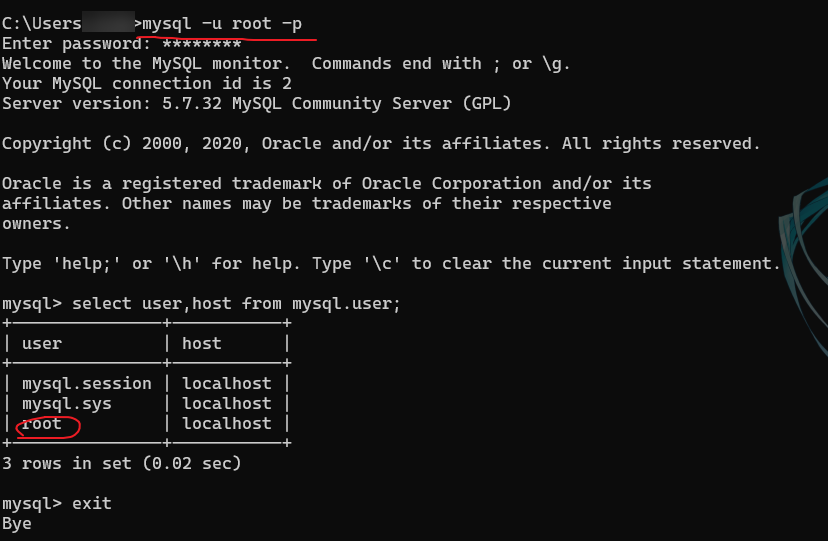
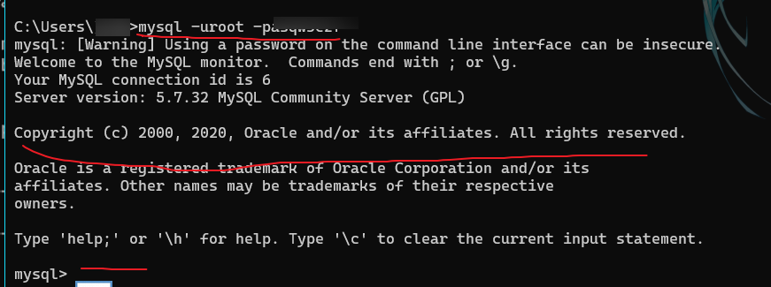
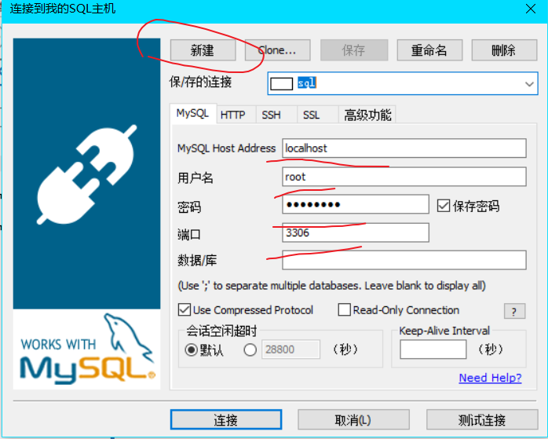

## 1.Navicat15下载安装教程

这个实在太小白了，跟着教程一步一步来就行了。

<!--more-->

安装教程：https://www.cnblogs.com/xuexianqi/p/12797170.html

官方下载地址：http://www.navicat.com.cn/download/direct-download?product=navicat_premium_cs_x64.exe&location=1

## 2.SQLyog13安装与使用教程

SQLyog13如下：（需要安装的Ultimate版本，应该是已经免激活的）

链接：https://pan.baidu.com/s/1HjkFYDpojuqANSXttGdL5Q

提取码：myn9

安装完成后打开SQLyog界面，然后开始连接MySQL。

参考自：https://www.jianshu.com/p/ced6e0537444

首先打开cmd输入命令：`mysql -u root -p`,

然后输入密码就进入了MySQL，exit退出。

下一步，输入：`mysql -u用户名(root) -p密码`，

出现下图表示正确连接。

最后将SQLyog连接MySQL。

文件-->新建一个连接，名字随意。

一般会帮你把大部分地方都填好了，你只要输入MySQL的密码就行了。

然后就可以看到服务器上的数据库，并进行图形化操作了。