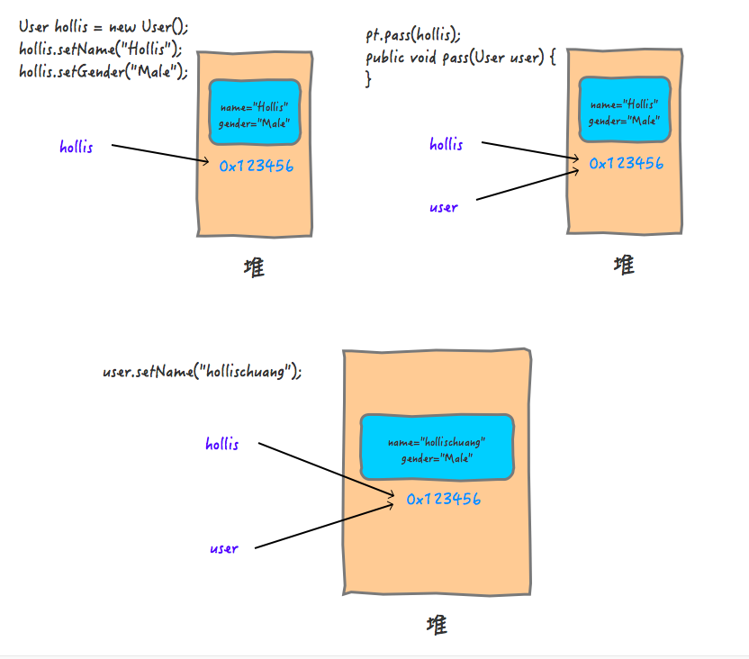

# Java是传值 or 传引用？

> 参考文章： http://www.hollischuang.com/archives/4640。

<!--more-->

## 1.结论

首先抛出结论：**Java可以说只有传值，没有真正的传引用**。

## 2.严格求值的求值策略

在“严格求值”中，函数调用过程中，给函数的实际参数总是在应用这个函数之前求值。多数现存编程语言对函数都使用严格求值。所以，我们本文只关注严格求值。

在严格求值中有几个关键的求值策略是我们比较关心的，那就是**传值调用**（Call by value）、**传引用调用**（Call by reference）以及**传共享对象调用**（Call by sharing）。

- 传值调用（值传递）
    - 在传值调用中，实际参数先被求值，然后其值通过复制，被传递给被调函数的形式参数。因为形式参数拿到的只是一个”局部拷贝”，所以如果在被调函数中改变了形式参数的值，并不会改变实际参数的值。
- 传引用调用（应用传递）
    - 在传引用调用中，传递给函数的是它的实际参数的隐式引用而不是实参的拷贝。因为传递的是引用，所以，如果在被调函数中改变了形式参数的值，改变对于调用者来说是可见的。
- 传共享对象调用（共享对象传递）
    - 传共享对象调用中，先获取到实际参数的地址，然后将其复制，并把该地址的拷贝传递给被调函数的形式参数。因为参数的地址都指向同一个对象，所以我们称也之为”传共享对象”，所以，如果在被调函数中改变了形式参数的值，调用者是可以看到这种变化的。

不知道大家有没有发现，其实传共享对象调用和传值调用的过程几乎是一样的，都是进行”求值”、”拷贝”、”传递”。

但是，传共享对象调用和内传引用调用的结果又是一样的，都是在被调函数中如果改变参数的内容，那么这种改变也会对调用者有影响。

对于这个问题，我们应该关注过程，而不是结果，**因为传共享对象调用的过程和传值调用的过程是一样的，而且都有一步关键的操作，那就是”复制”，所以，通常我们认为传共享对象调用是传值调用的特例**。

我们先把传共享对象调用放在一边，我们再来回顾下传值调用和传引用调用的主要区别：

**传值调用是指在调用函数时将实际参数`复制`一份传递到函数中，传引用调用是指在调用函数时将实际参数的引用`直接`传递到函数中。**


所以，两者的最主要区别就是是直接传递的，还是传递的是一个副本。

这里我们来举一个形象的例子。再来深入理解一下传值调用和传引用调用：

你有一把钥匙，当你的朋友想要去你家的时候，如果你`直接`把你的钥匙给他了，这就是引用传递。

这种情况下，如果他对这把钥匙做了什么事情，比如他在钥匙上刻下了自己名字，那么这把钥匙还给你的时候，你自己的钥匙上也会多出他刻的名字。

你有一把钥匙，当你的朋友想要去你家的时候，你`复刻`了一把新钥匙给他，自己的还在自己手里，这就是值传递。

这种情况下，他对这把钥匙做什么都不会影响你手里的这把钥匙。

## 3.Java中的求值策略

**其实Java中使用的求值策略就是传共享对象调用，也就是说，Java会将对象的地址的拷贝传递给被调函数的形式参数。**只不过”传共享对象调用”这个词并不常用，所以Java社区的人通常说”Java是传值调用”，这么说也没错，因为传共享对象调用其实是传值调用的一个特例。

举个例子解释Java中的求值策略过程：

```Java
public static void main(String[] args) {
  Test pt = new Test();

  User hollis = new User();
  hollis.setName("Hollis");
  hollis.setGender("Male");
  pt.pass(hollis);
  System.out.println("print in main , user is " + hollis);
}

public void pass(User user) {
  user.setName("hollischuang");
  System.out.println("print in pass , user is " + user);
}
```

输出结果：

```java
print in pass , user is User{name='hollischuang', gender='Male'}
print in main , user is User{name='hollischuang', gender='Male'}
```



你复制了一把你家里的钥匙给到你的朋友，他拿到钥匙以后，并没有在这把钥匙上做任何改动，而是通过钥匙打开了你家里的房门，进到屋里，把你家的电视给砸了。

这个过程，对你手里的钥匙来说，是没有影响的，但是你的钥匙对应的房子里面的内容却是被人改动了。

也就是说，**Java对象的传递，是通过复制的方式把引用关系传递了，如果我们没有改引用关系，而是找到引用的地址，把里面的内容改了，是会对调用方有影响的，因为大家指向的是同一个共享对象。**

那么，如果我们改动一下pass方法的内容：

```java
public void pass(User user) {
  user = new User();
  user.setName("hollischuang");
  System.out.println("print in pass , user is " + user);
}
```

上面的代码中，我们在pass方法中，重新new了一个user对象，并改变了他的值，输出结果如下：

```java
print in pass , user is User{name='hollischuang', gender='Male'}
print in main , user is User{name='Hollis', gender='Male'}
```

再看一下整个过程中发生了什么：


这个过程，就好像你复制了一把钥匙给到你的朋友，你的朋友拿到你给他的钥匙之后，找个锁匠把他修改了一下，他手里的那把钥匙变成了开他家锁的钥匙。这时候，他打开自己家，就算是把房子点了，对你手里的钥匙，和你家的房子来说都是没有任何影响的。

**所以，Java中的对象传递，如果是修改引用，是不会对原来的对象有任何影响的，但是如果直接修改共享对象的属性的值，是会对原来的对象有影响的。**

## 4.总结

我们知道，编程语言中需要进行方法间的参数传递，这个传递的策略叫做求值策略。

在程序设计中，求值策略有很多种，比较常见的就是值传递和引用传递。还有一种值传递的特例——共享对象传递。

值传递和引用传递最大的区别是传递的过程中有没有复制出一个副本来，如果是传递副本，那就是值传递，否则就是引用传递。

在Java中，其实是通过值传递实现的参数传递，只不过**对于Java对象的传递，传递的内容是对象的引用**。

**我们可以总结说，Java中的求值策略是共享对象传递，这是完全正确的。**

但是，为了让大家都能理解你说的，**我们说Java中只有值传递，只不过传递的内容是对象的引用。这也是没毛病的。**

但是，绝对不能认为Java中有引用传递。