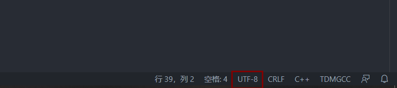

在Windows下使用VSCode编译运行，都出现中文乱码的问题，今天我就遇见了这种情况，上网搜了半天也没有找到正确的解决方法，现将我把我的方法晒一下。

<!--more-->

中文的windows下的cmd默认使用GBK的编码, 每次需要的时候只要在VSCode终端输入命令:`chcp 65001`, 切换代码页到使用UTF-8就可以解决中文代码的问题，只不过这种方法太麻烦了，每次进入终端都要输入命令，那有没有永久性解决的呢？当然有了。

永久性地修改为VSCode的控制台代码页为65001:

在VSCode中通过打开“文件”--“首选项”--“设置”, 然后在setting.json中设置, 把下面三行复制到里面:

```javascript
{
  "editor.fontSize": 18,
  "terminal.integrated.shellArgs.windows": ["/K chcp 65001 >nul"],
  "terminal.integrated.fontFamily": "Lucida Console",
}
```

/K chcp 65001 >nul的含义是在运行cmd的时候将编码设置为65001;

\>nul是避免在控制台输出修改编码的信息，否则会输出active code page: 65001;

同时，赠送两个彩蛋，例如:

editor.fontSize: 20(修改字体大小为 20);

terminal.integrated.fontFamily:"Courier New"(字体修改为 "Courier New").

这个可以根据自己的需求填写，当然如果不需要的话，可以不写。

如果上述方法出错的话可以试一试下方评论区的

```
"terminal.integrated.shellArgs.windows": ["-NoExit", "/c", "chcp 65001"]
```

当然了，如果你能通过修改右下方的GBK或者UTF-8可以解决的话就没必要选择上面的两种方法：



发现如果改成UTF-8的话，通过Run Code运行的话是正常的，但是到了F5调试，弹出的黑框是乱码的，如果改成GBK，那么F5调试是正常的，Run Code是乱码，反正二者不可兼得，大家自己选择。总结下来就是，Run Code运行改成UTF-8，F5调试运行改成GBK，当然这个不是绝对的，还要看一看"terminal.integrated.shellArgs.windows"修改的是什么，如果"terminal.integrated.shellArgs.windows"没有填，好像改成GBK就行了。

到此这篇关于永久解决VSCode终端中文乱码问题的文章就介绍到这了,更多相关VSCode终端中文乱码内容请搜索脚本之家以前的文章或继续浏览下面的相关文章希望大家以后多多支持脚本之家！

本文作者：ityanger  

转载自[脚本之家](https://www.jb51.net/article/192736.htm)

---

补充：关于VScode出现卡顿、打字缓慢、滚动和选择延迟等问题的解决方法。

参考：https://www.codeprj.com/blog/bc42ba1.html