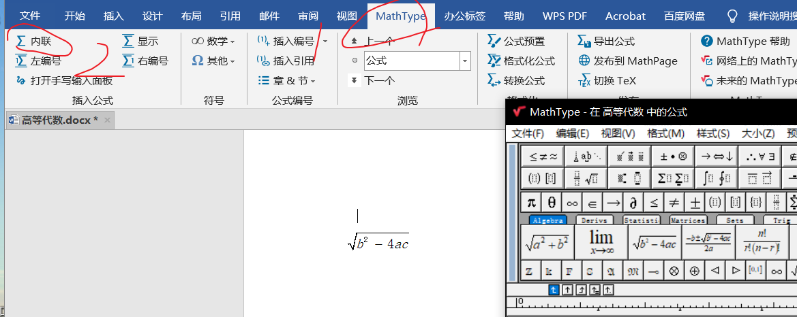
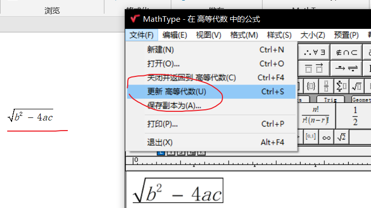
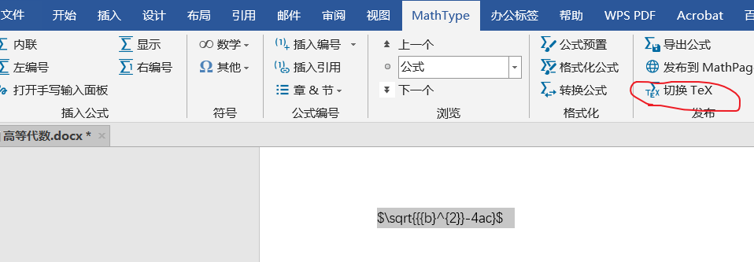
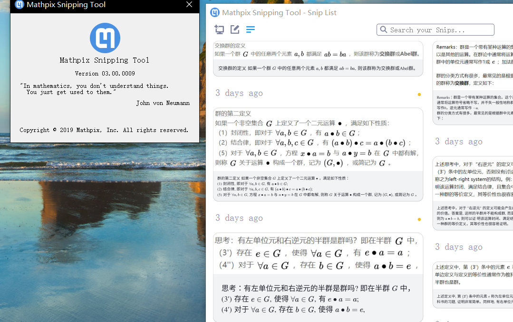

## 1.为什么用Word

关于该用Word还是用Latex的争论由来已久，这里就不再讨论，我们可以灵活使用这两种工具，它们可以在不同的场景发挥作用。

有时候，用Word会更加方便省事，我们接下来就讲一讲如何在Word2019中更好地使用数学公式。

<!--more-->

**友情提示：本文仅仅针对Word2019！！！**

## 2.Mathtype公式编辑器

Word2019虽然自带了公式插入功能，但是功能不是很强大，这里我们使用Mathtype公式编辑器。

Mathtype下载安装教程：[MathType7.4安装、加载至word](https://www.bilibili.com/video/BV1cV41117SR?from=search&seid=6028489259985023645)

视频讲解算是很详细了，跟着做就没什么大问题。

需要用到的工具：https://pan.baidu.com/s/1aeRHoUv3iS5x8mTLRr4m4Q 提取码:hand

讲一讲会遇到的问题：

1. 出现Word2019的'53'错误：将破解包里的MathPage.wll文件复制到
   `"C:\Program Files\Microsoft Office\root\Office16 "`中
2. Word有两个mathtype选项卡：你需要去除没用的那一个，具体参照[这里](https://www.mathtype.cn/jiqiao/an-niu-shanchu.html)

如果没什么问题了，你就可以开心地使用Mathtype编辑器了，效率杠杠滴！

**使用技巧：**推荐一个[使用说明网站](https://www.mathtype.cn/)

点击内联后会弹出公式编辑窗口，然后就能编辑公式了。

编辑完成后，点击文件-->更新 XXX就能看到公式已经显示出来了。

 **如何实现MathType公式转换LaTeX代码**

参考：https://www.mathtype.cn/jiqiao/gongshi-daima.html

这里介绍最简单的一种：点击切换Tex，再点一次就会再变回来。

## 3.原生插入Latex公式

参考：https://www.cnblogs.com/qq-757617012/p/12098279.html

自带的公式编辑器也能转换成Latex公式。

## 4.推荐一个Latex OCR识别工具

效果是非常不错的，亲身体验。

