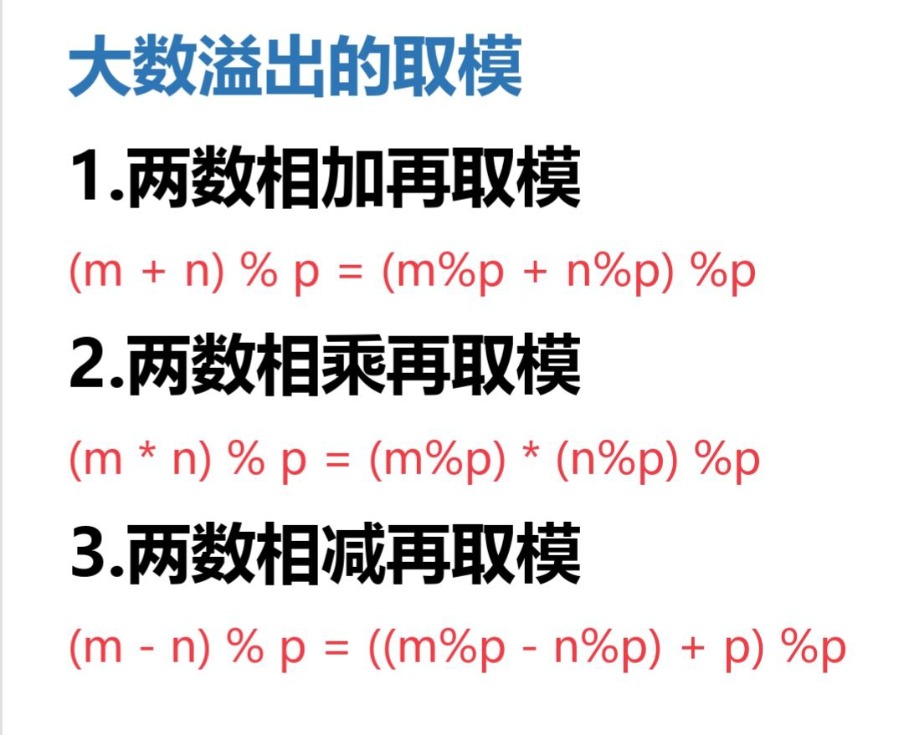
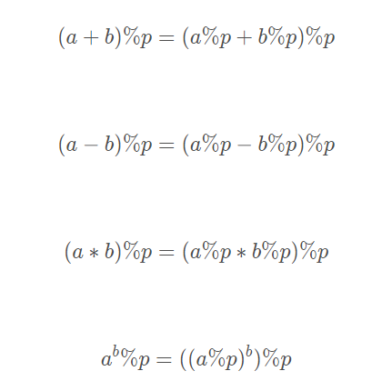

我们首先来看一个问题：

> 给定三个正整数a，b，m(a<10^9, b<10^18, 1<m<10^9)，求a^b%m。

<!--more-->

如果用循环来写，不断乘上a再取模，时间复杂度为O(b)。很容易超时。

所以我们考虑快速幂算法。它**基于二分的思想**，也被称为**二分幂**。

## 递归写法

1.如果b是奇数，那么有：$a^b = a*a^{b-1}$

2.如果b是偶数，那么有：$a^b = a^{b/2}*a^{b/2}$

```C++
typedef long long LL;
// 递归求a^b%m
LL binaryPow(LL a,LL b,LL m){
    if (b == 0) return 1;

    if (b%2 == 1) return a * binaryPow(a,b-1,m) % m;
    else{
        LL mul = binaryPow(a,b >>1,m);
        return mul * mul % m;
    }
}
```

- 如果初始时a>=m，需要执行函数时先对a%m。
- 如果m==1，直接在函数外部特判为0。

## 迭代写法

把b写成二进制的形式，那么b可以写成若干二次幂之和。

例如13的二进制形式为1101， $13=2^3+2^2+2^0,a^{13}=a^8\ *a^4\ *a^1$ 。

不难推出：当b的二进制的第i（从0开始）位是1时，初值ans=1要乘上$a^{2{^i}}$。由于我们每次迭代时令a平方

（$a=a^{2i}$），所以枚举当前第i位时，a已经迭代到初始a的$2^i$次方，如果是1，就令ans乘上a。

```C++
typedef long long LL;
//  迭代求a^b%m
LL binaryPow(LL a,LL b,LL m){
    LL ans = 1;
    while (b > 0){
        // 等价于b%2 == 1
        if (b&1) ans = ans*a%m;
        a = a*a%m;
        b >>1;
    }
    return ans;
}
```

在实际应用场景，两种写法效率差不多。

**大数取模公式总结：**




参考资料1：[博客园](https://www.cnblogs.com/llsq/p/5810262.html)

参考资料2：《算法笔记》