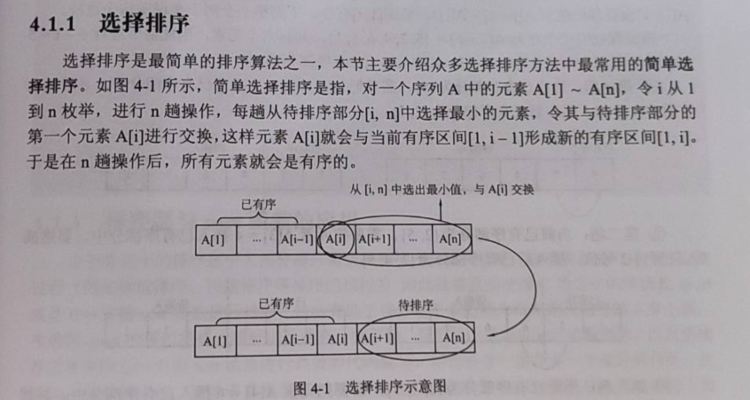

# 初等排序算法

**排序算法的稳定性**

仅仅用执行效率和内存消耗来衡量排序算法的好坏是不够的。针对排序算法，我们还有一个重要的度量指标，稳定性。这个概念是说，如果待排序的序列中存在值相等的元素，经过排序之后，相等元素之间原有的先后顺序不变。

<!--more-->

**空间复杂度**

我们前面讲过，算法的内存消耗可以通过空间复杂度来衡量，排序算法也不例外。不过，针对排序算法的空间复杂度，我们还引入了一个新的概念，**原地排序**（Sorted in place）。原地排序算法，就是特指空间复杂度是 O(1) 的排序算法。

**时间复杂度**

我们在分析排序算法的时间复杂度时，要分别给出最好情况、最坏情况、平均情况下的时间复杂度。除此之外，你还要说出最好、最坏时间复杂度对应的要排序的原始数据是什么样的。为什么要区分这三种时间复杂度呢？第一，有些排序算法会区分，为了好对比，所以我们最好都做一下区分。第二，对于要排序的数据，有的接近有序，有的完全无序。有序度不同的数据，对于排序的执行时间肯定是有影响的，我们要知道排序算法在不同数据下的性能表现。

### 1.Bubble Sort（冒泡排序）

时间复杂度：$O(n^2)$.

稳定排序算法。

冒泡排序是最基础的排序算法之一。

冒泡的过程只涉及相邻数据的交换操作，只需要常量级的临时空间，所以它的空间复杂度为 O(1)，是一个原地排序算法。

最好情况下，要排序的数据已经是有序的了，我们只需要进行一次冒泡操作，就可以结束了，所以最好情况时间复杂度是 O(n)。而最坏的情况是，要排序的数据刚好是倒序排列的，我们需要进行 n 次冒泡操作，所以最坏情况时间复杂度为 $O(n^2)$，平均情况下的时间复杂度就是 $O(n^2)$。

冒泡排序的本质就是**交换**；第一层循环确定冒泡（交换）执行的趟数，n个数执行n趟，每一趟选出一个最大数或最小数；第二层循环进行相邻数的比较。

```C++
//C++板子
#include <iostream>
#include <cstdio>
#include <algorithm>
using namespace std;
const int N = 10;
int main(){
	int a[N];
	int k;
	for (k = 0;k < N;k ++){
		cin >> a[k];
	}
	// k是元素个数
	// Bubble Sort
	for (int i = 0;i < k-1;i ++)// 循环k-1趟
	{
		for (int j = 0;j < k - i - 1;j ++)
		{
            	// 注意：这里加上等号会失去稳定性
			if (a[j] > a[j+1]) swap(a[j],a[j+1]);
		}
	}
	for (int x : a) cout << x << ' ';
	putchar(10);// 输出回车
	return 0;
}
```

```java
// Java板子，极客时间
// 冒泡排序，a表示数组，n表示数组大小
public void bubbleSort(int[] a, int n) {
  if (n <= 1) return;
 
 for (int i = 0; i < n; ++i) {
    // 提前退出冒泡循环的标志位，优化
    boolean flag = false;
    for (int j = 0; j < n - i - 1; ++j) {
      if (a[j] > a[j+1]) { // 交换
        int tmp = a[j];
        a[j] = a[j+1];
        a[j+1] = tmp;
        flag = true;  // 表示有数据交换      
      }
    }
    if (!flag) break;  // 没有数据交换，说明已经是有序的，提前退出
  }
}
```

### 2.Selection Sort（选择排序）

时间复杂度：$O(n^2)$.

**不稳定**排序算法。正是因此，相对于冒泡排序和插入排序，选择排序就稍微逊色了。

选择排序（据y总说）是最简单的排序算法。

首先，选择排序空间复杂度为 O(1)，是一种原地排序算法。选择排序的最好情况时间复杂度、最坏情况和平均情况时间复杂度都为 $O(n^2)$。你可以自己来分析看看。

第一层循环对n个数进行n-1趟选择，因为最后一个多出来的数不用再选择。第二层循环对待排序区域的数进行选择，选出最大（最小）的数。每一趟选择就会选出一个最大（最小）的数。



```C++
//C++板子
#include <iostream>
#include <cstdio>
#include <algorithm>
using namespace std;
const int N = 10;
int main(){
	int a[N];
	int k;
	for (k = 0;k < N;k ++){
		cin >> a[k];
	}
	// k是元素个数
	// Selection Sort
	for (int i = 0;i < k-1;i ++)
	{
		int min = i;
		for (int j = i+1;j < k;j ++)// 注意边界
		// 从a[i+1]到a[k-1]选出最小的数，下标为min
		{
			if (a[j] < a[min]) min = j;//可以写成a[j] != a[k]
		}
		swap(a[i],a[min]);
	}
	for (int x : a) cout << x << ' ';
	putchar(10);
	return 0;
}
```

选择排序是一种简单直观的排序算法，无论什么数据进去都是 $O(n^2)$ 的时间复杂度。所以用到它的时候，数据规模越小越好。好处可能就是不占用额外的内存空间了吧。

由于选择排序每一趟总是从无序区中选出全局最小（或最大）的元素，所以适用于从大量元素中选择一部分排序元素。例如，从10000个元素中选出最小的前10位元素。

### 3.Insertion Sort（插入排序）

时间复杂度：$O(n^2)$.

稳定排序算法。

原地排序算法。

插入排序也是一种常见的简单算法。

输入数据的顺序能大幅度影响它的复杂度。

插入排序将数组分成已排序和未排序两个部分，过程就是将待插入元素插入如有序部分。这里的做法是**从后往前枚举有序部分**来确定插入位置。

如果要排序的数据已经是有序的，我们并不需要搬移任何数据。如果我们从尾到头在有序数据组里面查找插入位置，每次只需要比较一个数据就能确定插入的位置。所以这种情况下，最好是时间复杂度为 O(n)。注意，这里是**从尾到头遍历已经有序的数据**。

如果数组是倒序的，每次插入都相当于在数组的第一个位置插入新的数据，所以需要移动大量的数据，所以最坏情况时间复杂度为$O(n^2)$。

还记得我们在数组中插入一个数据的平均时间复杂度是多少吗？没错，是 O(n)。所以，对于插入排序来说，每次插入操作都相当于在数组中插入一个数据，循环执行 n 次插入操作，所以平均时间复杂度为$O(n^2)$。

```C++
//C++板子
#include <iostream>
#include <cstdio>
#include <algorithm>
using namespace std;
const int N = 10;
int main(){
	int a[N];
	int k;
	for (k = 0;k < N;k ++){
		cin >> a[k];
	}

	// Insertion Sort
    for (int i = 1;i < k;i ++)
    {
        //temp临时存放待插入元素，j是有序部分最后一个元素的下标
        int temp = a[i],j = i-1;
        while (j >= 0 && temp < a[j])//j枚举完所有有序部分
        {
            a[j+1] = a[j];//元素后移
            j--;
        }
        a[j+1] = temp;//插入元素
    }

	for (int x : a) cout << x << ' ';
	putchar(10);
	return 0;
}
```

```java
// Java板子，极客时间
// 插入排序，a表示数组，n表示数组大小
public void insertionSort(int[] a, int n) {
  if (n <= 1) return;

  for (int i = 1; i < n; ++i) {
    int value = a[i];
    int j = i - 1;
    // 查找插入的位置
    for (; j >= 0; --j) {
      if (a[j] > value) {
        a[j+1] = a[j];  // 数据移动
      } else {
        break;
      }
    }
    a[j+1] = value; // 插入数据
  }
}
```

### 4.小结

- 以上三种都是原地排序算法。
- 虽然冒泡排序和插入排序在时间复杂度上是一样的，都是$O(n^2)$，但是如果我们希望把性能优化做到极致，那肯定首选插入排序。插入排序的算法思路也有很大的优化空间，我们只是讲了最基础的一种。
- 如果你对插入排序的优化感兴趣，可以自行学习一下希尔排序。
- 它们的时间复杂度都是 O(n2)，比较高，适合小规模数据的排序。

### 5.补充

1. 这里附上一份十大经典排序算法大梳理 (动图+代码)，这是经过系统整理过的！

   链接奉上：https://mp.weixin.qq.com/s/ekGdneZrMa23ALxt5mvKpQ

2. [常见排序算法及其对应的时间复杂度和空间复杂度](https://www.cnblogs.com/zwtgyh/p/10631760.html) （PS：部分分析不完整，请参照王争专栏）

3. 帅地大佬的文章：https://www.iamshuaidi.com/608.html（小破站好东西不少）