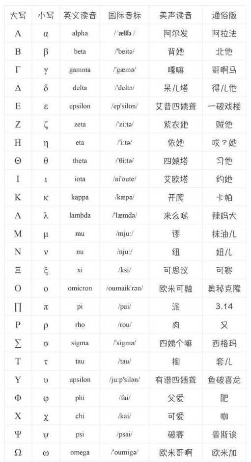

## Mathematical English 2

<!--more-->

1.表达正数：positive number a

同样地，关于负数有：negative number a

2.绝对值的表达：$|x-x_0|$，the absolute value of the difference of $x$ and $x_0$

3.可微与可积：differentiable and integrable

导数与积分（名词）：derivative and integral

4.表达极限的两种方式：

- $\displaystyle\lim_{x \rightarrow x_0}f(x) = A$,the limit of *f* of *x* is equal to *A* as *x* approaches *x*0

- ${f(x) \rightarrow A} \ as\ {x\rightarrow x_0}$,*f* of *x* approaches *A* as *x* tends to *x*0

5.表达某一定理等成立：with this one hold

6.常见希腊字母：

7.分数（fraction），分母（denominator），分子（numerator）

8.微分与积分

修正：定积分改正为from a to b of f of x。

9.线性代数

