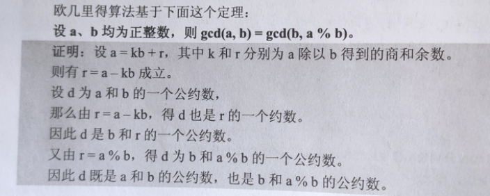
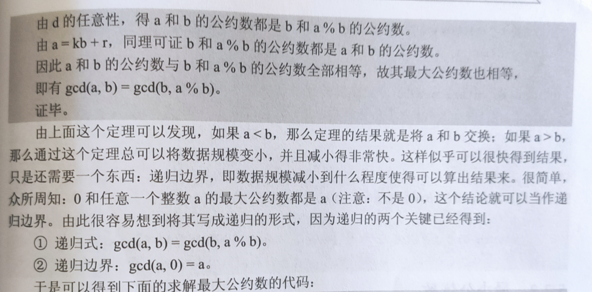

## 1.最大公因数

最大公因数，也即最大公约数。

最大公约数即为 Greatest Common Divisor，常缩写为 gcd。

我们求出最大公因数可以用于分数的约分问题，只要分子、分母都除以最大公因数d。

<!--more-->

最常用的求最大公因数的方法时欧几里得算法，也即辗转相除法。时间复杂度为$O(logn)$。

欧几里得算法基于下面的定理：

设a，b为均正整数，则`gcd(a,b) = gcd(b,a%b)`。



### 1.1递归写法

```c++
// 常规写法
int gcd(int a,int b){
	if (b == 0) return a; // 退出边界
	else return gcd(b,a % b);//递归
}

// 简化写法
int gcd(int a,int b)	{return !b?a:gcd(b,a%b);} // 注意加上{}
```

### 1.2循环写法

```c++
int gcd(int a,int b){
    int r;
    while (b != 0){
        r = a%b,a = b,b = r; // 辗转相除
    }
    return a;
}
```

总结：循环写法相对代码多一点，但是递归写法内存消耗大一点。

个人还是推荐递归写法，毕竟码字快一点。

注意：这里要求a>b，但是a<b也能计算，会多递归一次，相当于交换。

## 2.最小公倍数

接下来我们介绍如何求解最小公倍数（Least Common Multiple, LCM）。

我们容易发现，对于两个正整数a和b，它们的最小公倍数是ab/d(d是最大公因数)。

注意：`为了避免a*b可能存在的溢出问题，我们可以改写为a/d*b`。

如果你对详细证明过程感兴趣的话，推荐食用文章：https://oi-wiki.org/math/gcd/。

## 3.例题

题目链接：[C语言网](https://www.dotcpp.com/oj/problem2229.html)。

题目描述

已知一个正整数N，问从1~N中任选出三个数，他们的最小公倍数最大可以为多少。

输入

输入一个正整数N。

1 <= N <= 10^6。

输出

输出一个整数，表示你找到的最小公倍数。

**思路：**参考自[CSDN](https://blog.csdn.net/qq_36403227/article/details/88677874)。

题目要求我们在1 ~ N之间任意选择三个数，使得它们的最小公倍数最大。
 要使得最小公倍数最大，那么思路可以是：

> 1.这三个数要两两互质
> 		2.在满足1的前提下，使得三个整数取最大值

 第一点已经在上面分析过了。而第2点也很好理解，其实就是贪心策略。

1. N为奇数时
 当N为奇数时，N - 1为偶数，N - 2为奇数，显然，数学知识告诉我们，相邻的两个正整数互质。同样的，相邻的两个奇数也是互质的，那么此时题目要求的答案为N * (N - 1) * (N - 2)。

2. N为偶数时
    因为当N >3时，N 和当N - 3是可能不是互质的，例如3和6。所以偶数时又分为两种可能性：

  2.1 当3不能整除N时
    当N为偶数时，N - 2同样为偶数，那么就不能满足上面思路的第1点了。但是N和N - 1还是互质的，所以

在贪心策略下，我们优先考虑使用更小的值去替换N - 2，而不是替换N 和 N - 1。

​		经计算发现 N - 3满足要求，所以此时答案为N * (N - 1) * (N - 3)。

  2.2 当3能整除N时

​		因为N能够被3整除，所以N - 3同样能被3整除，为了不违反第1点，我们再次优先用更小的值替代 N -3（为什么又是换掉第三个？因为我贪心啊）。

  所以根据贪心策略，在放弃修改最小的数（在这里是N - 3）时，我们优先考虑换掉第中间大小的数（在这里是N - 2）。但是会发现，无论是使用N - 3、N - 4、N - 5……中的哪一个去替换N - 2，其结果都是跟替换最小的数（在这里是N - 3）的结果是一样的。

​		所以我们只能开始考虑使用更小的值去替换最大的数，也就是N。
    因为采用的是贪心策略，所以我们优先考虑使用N - 1去替换N，此时结果是：(N - 1) * (N - 2) * ( N - 3)。
  显然相邻的两个正整数是互质的，我们只要考虑N - 1和N - 3是否互质就可以了。

因为N - 1和 N - 3实际上等同于第1种情况，即N为奇数时，故 (N - 1) * (N - 2) * ( N - 3) 就是题目答案了。

```c++
#include<iostream>
using namespace std;
int main()
{
    int n;
    cin >> n;
    if (n <= 2){
        cout << n;
        return 0;
    }
    if (n%2 != 0) cout << n*(n-1)*(n-2);
    else if (n%3 != 0){
        cout << n*(n-1)*(n-3);
    }
    else cout << (n-1)*(n-2)*(n-3);
    return 0;
}
```

