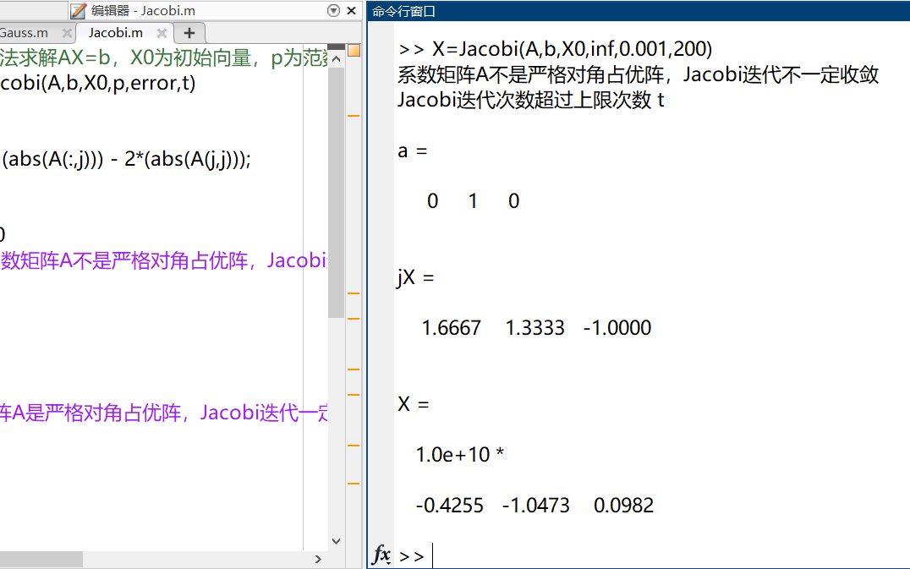
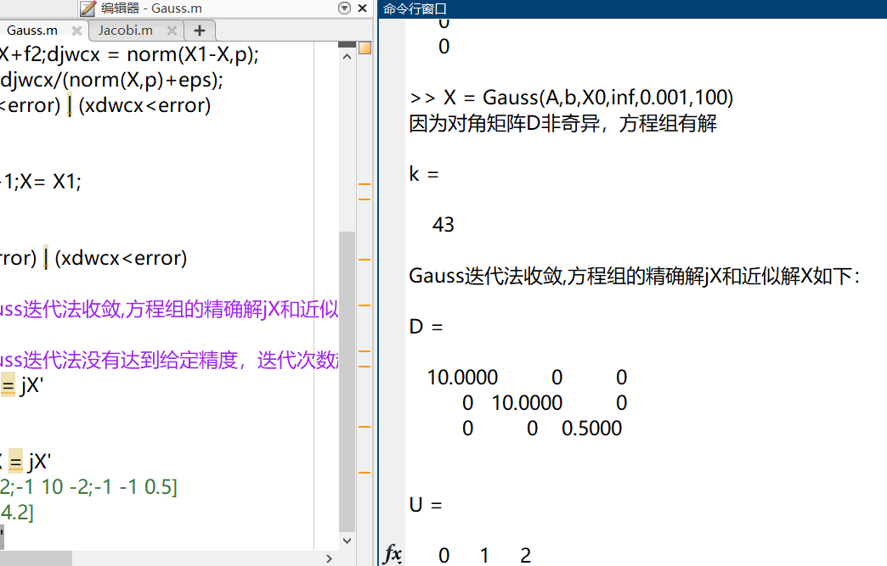
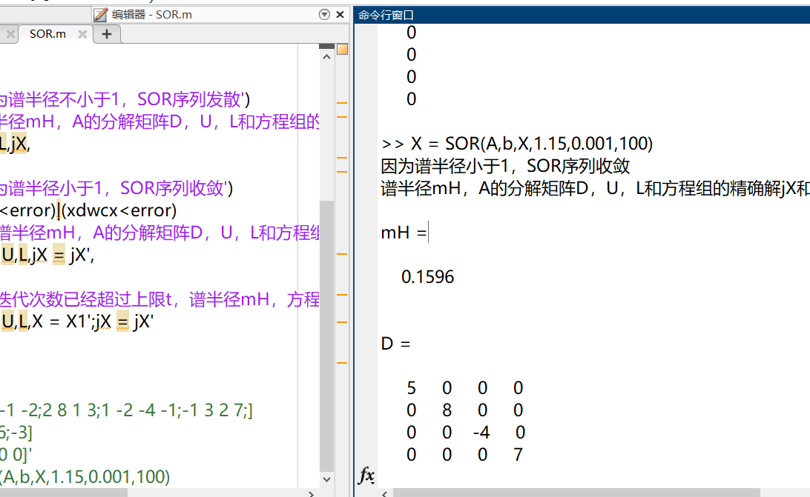

在Matlab快速入门笔记（二）中已经提到了两种迭代法，但是并没有对敛散性进行判断。

参考：

- 《Numerical Analysis》(Seventh Edition)--Richard L. Burden

- 《数值分析及其MATLAB实现》--任玉杰

这里根据其书加上对敛散性的判断。

<!--more-->

```matlab
% 用Jacobi迭代法求解AX=b，X0为初始向量，p为范数名称(1,2,inf)，error为误差，t为迭代次数
function X = Jacobi(A,b,X0,p,error,t)
[n,m] = size(A);
    for j = 1:m
        a(j) = sum(abs(A(:,j))) - 2*(abs(A(j,j)));
    end
    for i = 1:n
        if a(i) >= 0
            disp('系数矩阵A不是严格对角占优阵，Jacobi迭代不一定收敛')
            break
        end
    end
    
if a(i) < 0
    disp('系数矩阵A是严格对角占优阵，Jacobi迭代一定收敛')
end

for k = 1:t
    k;
    for j = 1:m
        X(j) = (b(j)-A(j,[1:j-1,j+1:m])*X0([1:j-1,j+1:m]))/A(j,j);
    end
    djwcx = norm(X'-X0,p);xdwcx = djwcx/(norm(X',p)+eps);
    X0 = X';X1 = A\b;
    if (djwcx<error)&(xdwcx<error)
        disp('Jacobi迭代收敛，方程组的精确解jX和近似解X如下：')
        k
        break
    end
end
if(djwcx>error)&(xdwcx>error)
    disp('Jacobi迭代次数超过上限次数 t ')
end
a,X = X;jX = X1',
% A = [2 -1 1;1 1 1;-1 -1 2]
% b = [1 ;2 ;-5]
% X0 = [0 0 0]'
```



```matlab
% 用Gauss迭代法求解AX=b，X0为初始向量，p为范数名称(1,2,inf)，error为误差，t为迭代次数
function X = Gauss(A,b,X0,p,error,t)
D = diag(diag(A));U = -triu(A,1);
L = -tril(A,-1);dD = det(D);
if dD == 0
    disp('因为对角矩阵D奇异，方程组无解')
else
    disp('因为对角矩阵D非奇异，方程组有解')
    iD = inv(D-L);B2 = iD*U;f2 = iD*b;jX = A\b;
    X = X0;[n m] = size(A);
    for k = 1:t
        X1 = B2*X+f2;djwcx = norm(X1-X,p);
        xdwcx = djwcx/(norm(X,p)+eps);
        if (djwcx<error) | (xdwcx<error)
            break
        else
            K = k+1;X= X1;
        end
    end
    if (djwcx<error) | (xdwcx<error)
        k
        disp('Gauss迭代法收敛,方程组的精确解jX和近似解X如下：')
    else
        disp('Gauss迭代法没有达到给定精度，迭代次数超过上限t，方程组的精确解jX和迭代向量X如下：')
        X = X';jX = jX'
    end
end
X = X';D,U,L,jX = jX'
% A = [10 -1 -2;-1 10 -2;-1 -1 0.5]
% b = [7.2;8.3;4.2]
% X0 = [0 0 0]'
```



```C++
% 用SOR迭代法求解AX=b，X为初始向量，om为松弛因子，error为误差，t为迭代次数
function X = SOR(A,b,X,om,error,t)
D = diag(diag(A));U = -triu(A,1);
L = -tril(A,-1);jX = A\b;[n m] = size(A);
iD = inv(D-om*L);B2= iD*(om*U + (1-om)*D);
H = eig(B2);mH = norm(H,inf);
for k = 1:t
    iD = inv(D-om*L);B2= iD*(om*U + (1-om)*D);
    f2 = om*iD*b;X1 = B2*X+f2;
    X = X1;djwcx = norm(X1-jX,inf);xdwcx = djwcx/(norm(X,inf)+eps);
end
if mH >= 1
    disp('因为谱半径不小于1，SOR序列发散')
    disp('谱半径mH，A的分解矩阵D，U，L和方程组的精确解jX和近似解X如下：')
    mH,D,U,L,jX,
else
    disp('因为谱半径小于1，SOR序列收敛')
    if (djwcx<error)|(xdwcx<error)
        disp('谱半径mH，A的分解矩阵D，U，L和方程组的精确解jX和近似解X如下：')
        mH,D,U,L,jX = jX',
    else
        disp('迭代次数已经超过上限t，谱半径mH，方程组的精确解jX和迭代向量X如下：')
        mH,D,U,L,X = X1';jX = jX'
        return
    end
end
% A = [5 1 -1 -2;2 8 1 3;1 -2 -4 -1;-1 3 2 7;]
% b = [4;1;6;-3]
% X = [0 0 0 0]'
% X = SOR(A,b,X,1.15,0.001,100)
```

