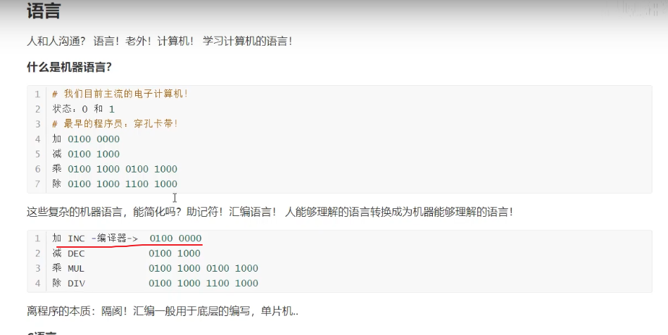
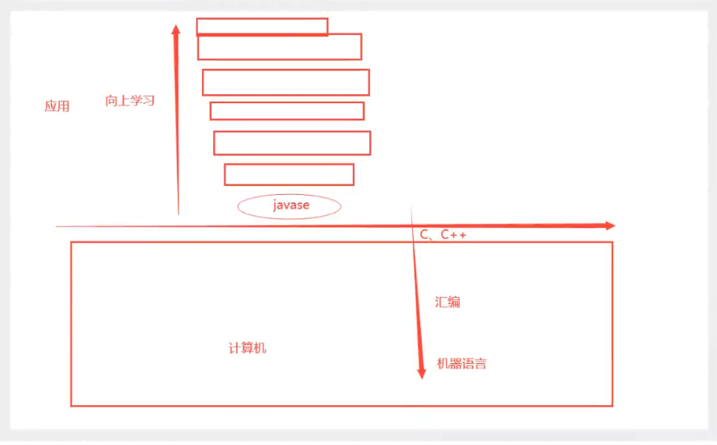
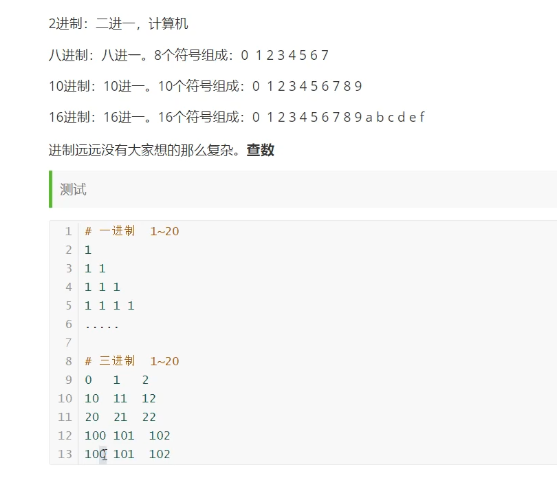
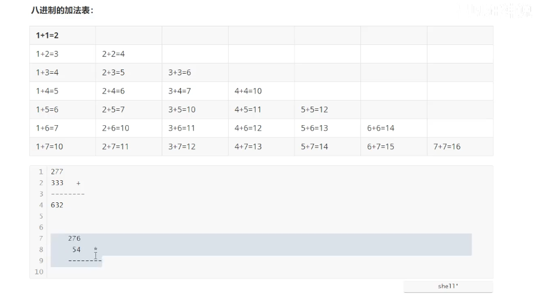
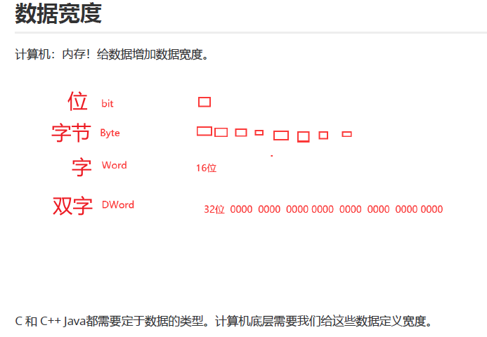
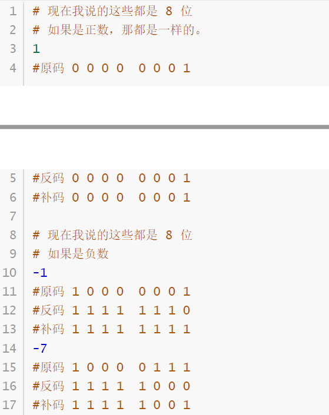
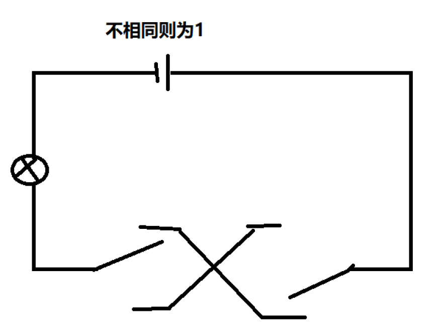
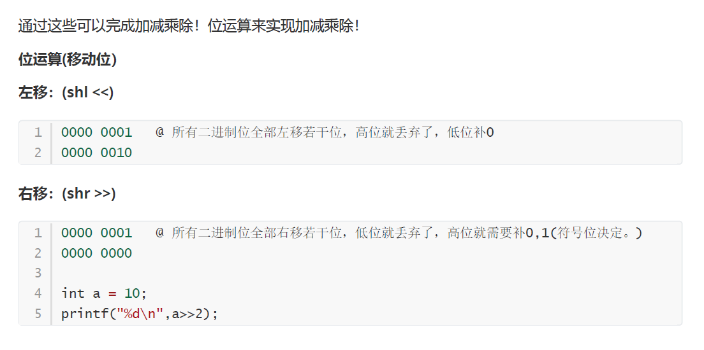

## 汇编语言的产生

汇编语言的主体就是汇编指令，可以说汇编指令是机器指令便于记忆的书写格式。

[推荐配合食用视频](https://www.bilibili.com/video/BV1ni4y1G7B9?p=2)

<!--more-->

编译器：将汇编指令转换成机器指令的翻译程序。



我们在不断向上学习的过程中，不应该忘掉基础的底层知识，汇编语言就是了解底层核心的重要内容之一。

向上学习是应用，向下学习是本质，这就是精髓。



## 进制

- N进制：逢N进一。



- 进制的计算：本质也就是查数进行运算。通过构建加法表、乘法表来快速运算。

事实上，减法、乘法和除法本质上都是由加法实现的。



- 进制的应用：

可以自己定义进制的符号，以此来加密解密。

- 为什么要用十六进制？

为了我们方便理解二进制。二进制与十六进制的转换很方便，最好不要混入十进制。

```shell
# 二进制
0 1 10 11 100 101 110 111 1000 1001 1010 1011 1100 1101 1110 1111
# 十六进制
0 1 2 3 4 5 6 7 8 9 a b c d e f
```

- 为什么要学习理解二进制？

为了理解寄存器、内存、位。底层的每一个位都是有含义的。这是汇编入门理解的基础。

```shell
十进制 二进制
2     10
4     100
8     1000
...
```


## 数据宽度



C等强类型语言之所以要定义数据的类型，是因为计算机底层需要给数据定义宽度。

```shell
位 0 1
字节 0~0xFF (一个F对应二进制的1111，四个位) 8位
字 0~0xFFFF 16位
双字 0~0xFFFFFFFF 32位
```

在计算机中，每一个数据都需要给他定义类型，也就是定义宽度，在内存中的宽度。

## 有符号数无符号数

现在我们给二进制的解码增加一些规则。


**无符号规则**

数字原来是多少，就是多少。

**有符号规则**

最高位设定为符号位：1为负数，0为正数

## 原码反码补码

**有符号数的编码规则**

1. 原码：最高位是符号位，其余位是数值位，原码又称为带符号的绝对值。

2. 反码：

   - 正数：它的反码与它的原码相同
   - 负数：符号位一定是1，其余位对原码取反

3. 补码：

   - 在计算机中，所有数都是用补码表示

   - 用到mod的概念，正数关于模的补数就是本身，负数加上关于模的补数就是模

   - 正数：它的补码与它的原码相同

   - 负数：符号位一定是1，反码+1



## 位运算

### 1.与运算（and &）

两个都是1才是1.

### 2.或运算（or |）

有一个是1就是1.

### 3.异或运算（xor  ^）

两个不同就是1.

### 4.非运算（not ~）

取反.



### 5.移位运算



### 6.位运算的加减乘除（这是精华）

计算机只认识 0 1

基本数学是建立在 加减乘除。（加法）

4+5？

```shell
# 计算机是怎么操作的！
0000 0100
0000 0101
---------- （加法：计算机是不会直接加的）
0000 1001
# 计算机的实现原理

# 第一步：异或： 如果不考虑进位，异或就可以直接出结果。
0000 0100
0000 0101
------------
0000 0001

# 第二步：与运算（判断进位，如果与运算结果为0，没有进位。）
0000 0100
0000 0101
------------
0000 0100

# 第三步：将与运算的结果，左移一位。 0000 1000 # 进位的结果
# 第四步：异或！
0000 0001
0000 1000
-------------
0000 1001
# 第五步：与运算（判断进位，如果与运算结果为0，没有进位。）
0000 0001
0000 1000
-----------
0000 0000
# 所以最终的结果就是与运算为0的结果的上一个异或运算。
```

4-5?

```shell
# 计算机是怎么操作的！
4+(-5)
0000 0100
1111 1011
---------- （减法：计算机是不会直接减的）
1111 1111

0000 0100
1111 1011
----------- 异或(如果不考虑进位，异或就可以直接出结果。)
1111 1111

0000 0100
1111 1011
----------- 与（判断进位，如果与运算结果为0，没有进位。）
0000 0000

最终结果 1111 1111 (16) ff (10) -1
```

乘：x*y， 就是 y 个 x 相加，还是加法

除：x/y， 本质就是减法，就是X 能减去多少个Y。

**计算机只会做加法！**

**机器语言就是位运算。都是电路来实现的。这就是计算机的最底层的本质。**

通过机器语言来实现加法计算器。设计电路。