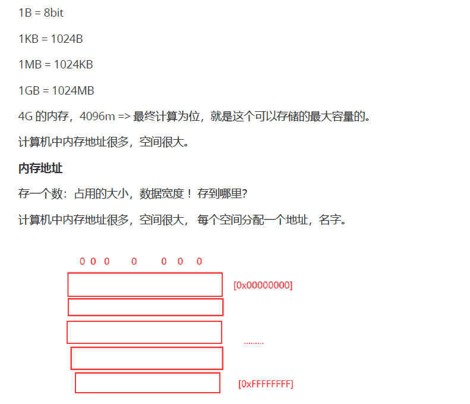

> 学汇编不是为了写代码，而是为了理解编程的本质。

<!--more-->

## 如何学习汇编

《汇编语言》 16位的汇编 32位 64位（本质架构区别不大，寻址能力增加。）

**建议大家可以直接学习32位汇编！**

**汇编入门：了解汇编和程序的对应关系，程序的本质即可！**

## 通用寄存器


32位通用寄存器的存值的范围：0 ~ FFFFFFFF

32位通用寄存器只有8个

计算机如何向寄存器存值？

通过**mov指令**。

```aseembly
mov 存的地址,存的数
mov 存的地址1,存的地址2
```

可以将数字写入寄存器，也可以将寄存器的值写到寄存器。


## 内存

寄存器地址有限，不够用，所以将数据放到内存。


32位操作系统的最大寻址能力就是$2^{32}$个字节，也就是4GB。




汇编向内存写入值。


## 两个重要的内存模型

### 内存模型：Heap

程序运行的时候，操作系统会给它分配一段内存，用来储存程序和运行产生的数据。这段内存有起始地址和结束地址，比如从`0x1000`到`0x8000`，起始地址是较小的那个地址，结束地址是较大的那个地址。

程序运行过程中，对于动态的内存占用请求（比如新建对象，或者使用`malloc`命令），系统就会从预先分配好的那段内存之中，划出一部分给用户，具体规则是从起始地址开始划分（实际上，起始地址会有一段静态数据，这里忽略）。举例来说，用户要求得到10个字节内存，那么从起始地址`0x1000`开始给他分配，一直分配到地址`0x100A`，如果再要求得到22个字节，那么就分配到`0x1020`。


这种因为用户主动请求而划分出来的内存区域，叫做 **Heap（堆）**。**它由起始地址开始，从低位（地址）向高位（地址）增长**。Heap 的一个重要特点就是**不会自动消失，必须手动释放，或者由垃圾回收机制来回收**。

### 内存模型：Stack

除了 Heap 以外，其他的内存占用叫做 Stack（栈）。简单说，Stack 是由于函数运行而临时占用的内存区域。


请看下面的例子。

```c
int main() {
   int a = 2;
   int b = 3;
}
```

上面代码中，系统开始执行`main`函数时，会为它在内存里面建立一个**帧（frame）**，所有`main`的内部变量（比如`a`和`b`）都保存在这个帧里面。`main`函数执行结束后，该帧就会被回收，释放所有的内部变量，不再占用空间。

如果函数内部调用了其他函数，会发生什么情况？

```c
int main() {
   int a = 2;
   int b = 3;
   return add_a_and_b(a, b);
}
```

上面代码中，`main`函数内部调用了`add_a_and_b`函数。执行到这一行的时候，系统也会为`add_a_and_b`新建一个帧，用来储存它的内部变量。也就是说，此时同时存在两个帧：`main`和`add_a_and_b`。一般来说，调用栈有多少层，就有多少帧。


等到`add_a_and_b`运行结束，它的帧就会被回收，系统会回到函数`main`刚才中断执行的地方，继续往下执行。通过这种机制，就实现了函数的层层调用，并且每一层都能使用自己的本地变量。

等到`add_a_and_b`运行结束，它的帧就会被回收，系统会回到函数`main`刚才中断执行的地方，继续往下执行。通过这种机制，就实现了函数的层层调用，并且每一层都能使用自己的本地变量。

所有的帧都存放在 Stack，由于帧是一层层叠加的，所以 Stack 叫做栈。生成新的帧，叫做"入栈"，英文是 push；栈的回收叫做"出栈"，英文是 pop。Stack 的特点就是，最晚入栈的帧最早出栈（因为最内层的函数调用，最先结束运行），这就叫做"后进先出"的数据结构。每一次函数执行结束，就自动释放一个帧，所有函数执行结束，整个 Stack 就都释放了。