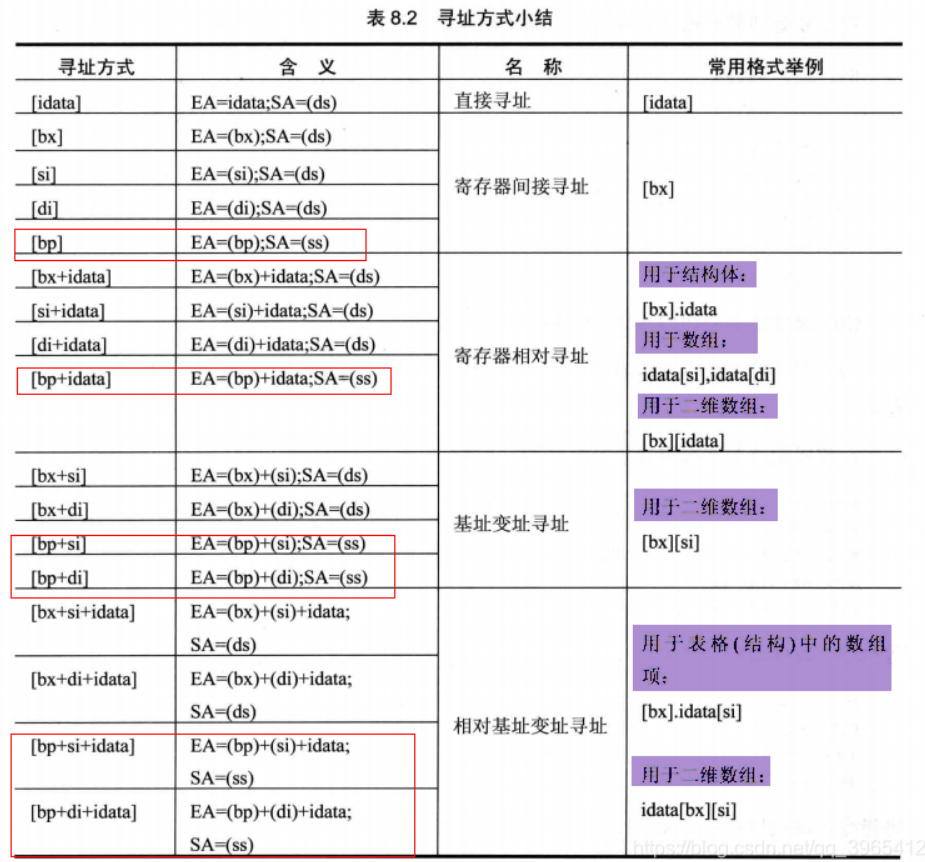
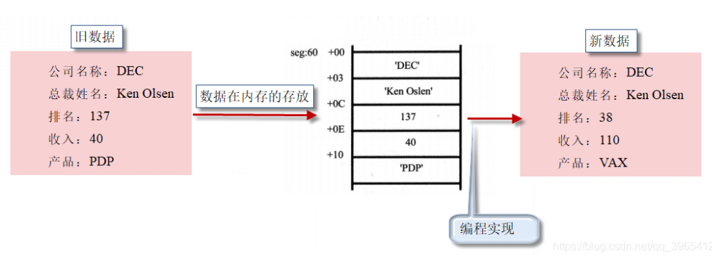

## 0x23：汇编语言中数据位置的表达

数据处理的两个基础问题？

<!--more-->

1. 处理的数据在哪；
2. 处理的数据多长。

如何表示数据的位置？

也就是某条指令执行前一刻数据的位置。

汇编语言中用3个概念来表达数据的位置：

- 立即数（idata）

```assembly
mov ax, 1                 ;对于直接包含在机器指令中的数据（执行前在CPU的指令缓冲器中）
add bx, 2000h             ;在汇编语言中称为：立即数（idata）
or bx, 00010000b
mov al, 'a'
```

- 寄存器

```assembly
mov ax, bx     ;指令要处理的数据在寄存器中，在汇编指令中给出相应的寄存器名。
mov ds, ax 
push bx 
mov ds:[0], bx 
push ds 
mov ss, ax
mov sp, ax
```

- 段地址（SA）和偏移地址（EA）

```assembly
;指令要处理的数据在内存中，在汇编指令中可用[X]的格式给出EA，SA在某个段寄存器中。
mov ax, [0]
mov ax, [di]
mov ax, [bx+8]
mov ax, [bx+si]
mov ax, [bx+si+8]   ;以上段地址默认在ds中

mov ax, [bp]
mov ax, [bp+8]
mov ax, [bp+si]
mov ax, [bp+si+8]   ;以上段地址默认在ss中

mov ax, ds:[bp]
mov ax, es:[bx]
mov ax, ss:[bx+si]
mov ax, cs:[bx+si+8] ;显式给出存放段地址的寄存器
```

## 0x24：寻址方式总结



## 0x25：指令要处理的数据有多长

8086CPU的指令，可以处理两种尺寸的数据，byte和word。

1. 通过寄存器名指明要处理的数据的尺寸。
    例如： `mov al, ds:[0]` 寄存器al指明了数据为1字节

2. **在没有寄存器名存在的情况下**，用操作符`X ptr`指明内存单元的长度，X在汇编指令中可以为`word`或`byte`。
    例如：`mov byte ptr ds:[0], 1`       byte ptr 指明了指令访问的内存单元是一个字节单元

3. 有些指令默认了访问的是字单元还是字节单元
    例如，`push [1000H]`，**push 指令只进行字操作**。pop指令也是一样。

寻址方式的综合应用：



```assembly
mov ax, seg 
mov ds, ax 
mov bx, 60h   ;确定记录地址，ds:bx 

mov word ptr [bx+0ch], 38   ;排名字段改为38  [bx].0ch
add word ptr [bx+0eh], 70   ;收入字段增加70  [bx].0eh
mov si, 0   ;用si来定位产品字符串中的字符
mov byte ptr [bx+10h+si], 'V'   ;[bx].10h[si]
inc si 
mov byte ptr [bx+10h+si], 'A'
inc si 
mov byte ptr [bx+10h+si], 'X'
```

## 0x26：div指令、dd、dup、mul指令

**div是除法指令**

1. 除数：有8位和16位两种，在一个`寄存器`或`内存单元`中。

2. 被除数：默认放在`AX`或`DX和AX`中，
    **如果**除数为8位，被除数**则**为16位，默认在AX中存放；
    **如果**除数为16位，被除数**则**为32位，在DX和AX中存放，DX存放高16位，AX存放低16位。

3. 结果：
    **如果**除数为8位，**则**`AL存储除法操作的商`，`AH存储除法操作的余数`；
    **如果**除数为16位，**则**AX存储除法操作的商，DX存储除法操作的余数。

```assembly
;利用除法指令计算100001/100。
;100001D = 186A1H
mov dx, 1
mov ax, 86A1H ;(dx)*10000H+(ax)=100001
mov bx, 100 ;除数(bx)为16位
div bx

;利用除法指令计算1001/100
mov ax, 1001
mov bl, 100 ;除数(bx)为8位
div b1
```

**伪指令dd**

db和dw定义字节型数据和字型数据。

dd是用来定义dword（double word，双字）型数据的伪指令。

**操作符dup**

dup在汇编语言中同db、dw、dd等一样，也是由编译器识别处理的符号。

它和db、dw、dd等数据定义伪指令配合使用，用来进行数据的重复：

```assembly
db 3 dup (0)       ;定义了3个字节，它们的值都是0，相当于db 0，0，0。
db 3 dup (0, 1, 2) ;定义了9个字节，它们是0、1、2、0、1、2、0、1、2，相当于db 0，1，2，0，1，2，0，1，2。
db 3 dup ('abc', 'ABC') ;定义了18个字节，它们是abcABCabcABCabcABCC，相当于db 'abc', 'ABC' ,'abc' , 'ABC, 'abc', 'ABC'。
```

**mul 指令**

mul是乘法指令，使用 mul 做乘法的时候：相乘的两个数：要么都是8位，要么都是16位。

- 8 位： `AL`中和 `8位寄存器`或`内存字节单元`中；
- 16 位： `AX`中和 `16 位寄存器`或`内存字单元`中。

结果

- 8位：AX中；
- 16位：DX（高位）和 AX（低位）中。

格式：`mul 寄存器` 或 `mul 内存单元`

```assembly
;计算100*10
;100和10小于255，可以做8位乘法
mov al,100
mov bl,10
mul bl

;结果： (ax)=1000（03E8H） 
;-----------------------------;
;计算100*10000
;100小于255，可10000大于255，所以必须做16位乘法，程序如下：
mov ax,100
mov bx,10000
mul bx

;结果： (ax)=4240H，(dx)=000FH     （F4240H=1000000）
```

8086CPU的乘除法指令可以分为带符号和不带符号的。

不带符号的是div和mul指令，带符号的是idiv和imul指令。（王道计组有粗略讲解）