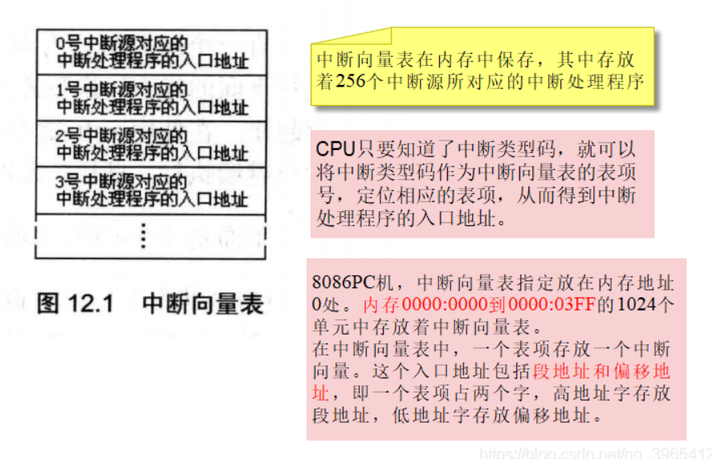
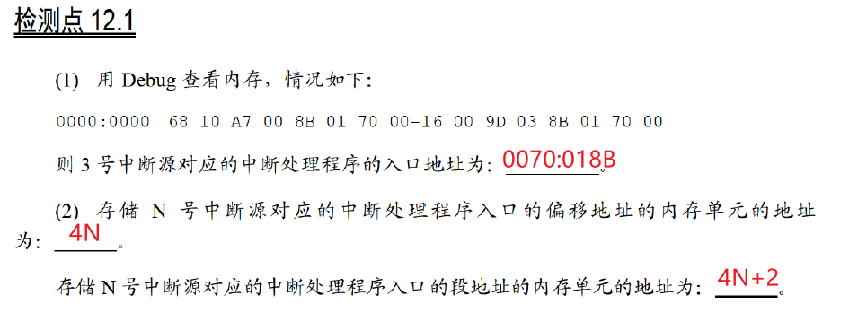

## 0x36：内中断的产生

<!--more-->

任何一个通用的CPU，都具备一种能力，可以在执行完当前正在执行的指令之后，检测到从CPU外部发送过来的或内部产生的一种特殊信息，并且可以立即对所接收到的信息进行处理。这种特殊的信息，我们可以称其为：中断信息。

**中断的意思是指，CPU不再接着（刚执行完的指令）向下执行，而是转去处理这个特殊信息。**

中断信息可以来自CPU的内部和外部（内中断，外中断）

内中断：当CPU的内部有需要处理的事情发生的时候，将产生中断信息，引发中断过程。

8086CPU的内中断（下面四种情况将产生中断信息，四种中断源）

- 除法错误，比如，执行div指令产生的除法溢出；
- 单步执行；
- 执行 into指令；
- 执行 int指令。

中断信息中包含**中断类型码**，中断类型码为一个字节型数据，可以表示256种中断信息的来源（**中断源**）

上述的4种中断源，在8086CPU中的中断类型码如下。

- 除法错误：0
- 单步执行：1
- 执行into指令：4
- 执行int指令，该指令的格式为int n，指令中的n为字节型立即数，是提供给CPU的中断类型码。

**中断处理程序**

用来处理中断信息的程序被称为中断处理程序。

根据CPU的设计，中断类型码的作用就是用来定位中断处理程序。比如CPU根据中断类型码4，就可以找到4号中断的处理程序。

那么如何根据8位的中断类型码得到中断处理程序的段地址和偏移地址呢？

**中断向量表**

**中断向量就是中断处理程序的入口地址。中断向量表就是中断处理程序入口地址的列表。**

中断向量表在内存中存在，其中存放着256个中断源所对应的中断处理程序的入口地址。（0号到255号）

CPU用8位的**中断类型码通过中断向量表找到相应的中断处理程序的入口地址**。



每个表项由段地址和偏移地址组成，一共占2个字。



**中断过程**

中断过程的主要任务就是用中断类型码在中断向量表中找到中断处理程序的入口地址，设置CS和IP。

简要描述如下：

1. 从中断信息取得中断类型码N；
2. pushf（标志寄存器的值入栈，因为中断过程要改变寄存器的值，先用栈保存）
3. TF=0，IF=0 （为什么这样参考单步中断）
4. push CS , push IP
5. （IP）=（N * 4），（CS）=（N * 4 + 2）   看上面检测点

硬件在完成中断过程后，CS:IP将指向中断处理程序的入口，CPU开始执行中断处理程序。

## 0x37：iret指令

CPU随时都可能执行中断处理程序，中断处理程序必须一直存储在内存某段空间之中而中断处理程序的入口地址，即中断向量，必须存储在对应的中断向量表表项中。

中断处理程序的常规编写步骤：

1. 保存用到的寄存器；
2. 处理中断；
3. 恢复用到的寄存器；
4. 用`iret`指令返回。

iret 指令描述为：`pop IP` `pop CS` `popf`（和入栈顺序相反，恢复现场）

iret指令执行后，CPU回到执行中断处理程序前的执行点继续执行程序。

iret指令通常和硬件自动完成的中断过程配合使用。

## 0x38：除法错误中断的处理

除法错误是0号中断。 

```assembly
mov ax, 1000h 
mov bh, 1
div bh ;除法溢出错误
; bh表示除数为8位，被除数应该为16位，存在ax中
; div bh计算1000h / 1h , 余数为0，商为1000h存在al中，发生溢出
```

1、当CPU执行div bh时，发生了除法溢出错误，产生0号中断信息，从而引发中断过程，

2、CPU执行0号中断处理程序

3、系统中的0号中断处理程序的功能：显示提示信息“Divide overflow”后，返回到操作系统中。

## 0x39：单步中断

CPU在执行完一条指令之后，如果检测到标志寄存器的TF位为1，则产生单步中断，引发中断过程。单步中断的中断类型码为1。

Debug是如何利用CPU所提供的单步中断的功能进行调试？如使用t命令查看寄存器状态。

在使用t命令执行指令时，Debug将TF设置为1，在CPU执行完这条指令后就引发单步中断，执行单步中断的中断处理程序，所有寄存器中的内容被显示在屏幕上，并且等待输入命令。

在进入中断处理程序之前，设置TF=0。从而避免CPU在执行中断处理程序的时候发生单步中断。

## 0x40：int指令

int指令的格式为：`int n` ，n为中断类型码，它的功能是**引发中断过程**。

CPU执行int n指令，相当于引发一个n号中断的中断过程。

在程序中使用int指令调用任何一个中断的中断处理程序(中断例程)。

**实验1**

```assembly
;求2 * 3456^2
assume cs:code

code segment

start: 
     mov ax, 3456 ;(ax)=3456
     int 7ch  ; 调用中断7ch的中断例程，计算ax中的数据的平方
     add ax, ax  
     adc dx, dx  ;存放结果，将结果乘以2

     mov ax,4c00h
     int 21h
code ends
end start 
```

```assembly
;编程：安装中断7ch的中断例程
;功能：求一word型数据的平方。
;参数：(ax) = 要计算的数据。
;返回值：dx、ax中存放结果的高16位和低16位。

assume cs:code

code segment
start:
		mov ax,cs
		mov ds,ax
		mov si,offset sqr					;设置ds:si指向源地址
		mov ax,0
		mov es,ax
		mov di,200h							;设置es:di指向目的地址
		mov cx,offset sqrend - offset sqr	;设置cx为传输长度
		cld									;设置传输方向为正
		rep movsb

		mov ax,0
		mov es,ax
		mov word ptr es:[7ch*4], 200h
		mov word ptr es:[7ch*4+2], 0

		mov ax,4c00h
		int 21h

  sqr:  
		mul ax
		iret  ;CPU执行int 7ch指令进入中断例程之前，标志寄存器、当前的CS和IP被压入栈
		      ;在执行完中断例程后，应该用iret 指令恢复int 7ch执行前的标志寄存器和CS、IP的
sqrend:	nop

code ends
end start
```

**实验2**

```assembly
;功能：将一个全是字母，以0结尾的字符串，转化为大写。
;参数：ds:si指向字符串的首地址。
;应用举例：将data段中的字符串转化为大写。
assume cs:code

data segment
	db 'conversation',0
data ends

code segment
start:  mov ax, data
		mov ds, ax
		mov si, 0
		int 7ch
		
		mov ax,4c00h
		int 21h
code ends
end start   
```

```assembly

assume cs:code
code segment

start:
		mov ax,cs
		mov ds,ax
		mov si,offset capital
		mov ax,0
		mov es,ax
		mov di,200h
		mov cx,offset capitalend - offset capital
		cld
		rep movsb

		mov ax,0
		mov es,ax
		mov word ptr es:[7ch*4],200h
		mov word ptr es:[7ch*4+2],0

		mov ax,4c00h
		int 21h

capital:
		push cx
		push si
		
change: 
		mov cl,[si]
		mov ch,0
		jcxz ok
		and byte ptr [si],11011111b
		inc si
		jmp short change
ok:	
		pop si
		pop cx
		iret
		
capitalend:nop

code ends

end start
```

