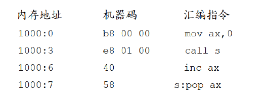

## 0x29：call 和 ret 指令

call和ret指令都是转移指令，它们都修改IP，或同时修改CS和IP。

<!--more-->

### ret 和 retf

- ret指令用栈中的数据，**修改IP**的内容，从而实现**近转移**；
- retf指令用栈中的数据，**修改CS和IP**的内容，从而实现**远转移**。

CPU执行ret指令时，相当于进行： `pop IP`：

（1）(IP) = ( (ss) * 16 + (sp) )

（2）(sp) = (sp) + 2

CPU执行retf指令时，相当于进行：`pop IP, pop CS`：

（1）(IP) = ( (ss) * 16 + (sp) )

（2）(sp) = (sp) + 2

（3）(CS) = ( (ss) * 16 + (sp) )

（4）(sp) = (sp) + 2

```assembly
assume cs:code 
stack seqment
	db 16 dup (0)
stack ends 

code segment
		mov ax, 4c00h
		int 21h 
 start:	mov ax, stack 
 		mov ss, ax
 		mov sp, 16
		mov ax, 0
		push ax ;ax入栈
		mov bx, 0
		ret ;ret指令执行后，(IP)=0，CS:IP指向代码段的第一条指令。可以push cs  push ax  retf
code ends
end start
```

### call 指令

call指令经常跟ret指令配合使用，因此CPU执行call指令，进行两步操作：

（1）将当前的 IP 或 CS和IP **压入栈中**；

（2）**转移**（jmp）。

**call指令不能实现短转移，除此之外，call指令实现转移的方法和 jmp 指令的原理相同。**

`call 标号`（近转移）

CPU执行此种格式的call指令时，相当于进行 `push IP` `jmp near ptr 标号`

`call far ptr 标号`（段间转移）

CPU执行此种格式的call指令时，相当于进行：`push CS，push IP` `jmp far ptr 标号`

`call 16位寄存器`

CPU执行此种格式的call指令时，相当于进行： `push IP` `jmp 16位寄存器`

`call word ptr 内存单元地址`

CPU执行此种格式的call指令时，相当于进行：`push IP` `jmp word ptr 内存单元地址`

---

练习1：下面程序执行后 ax 的值为多少？



运行到`call s`时，指令结束`ip = 6`，相当于`push [6]`，然后`jmp near ptr s`，转到 s ，`ax = 6`。

练习2：下面程序执行后 ax 的值为多少？


练习3：


bp 寄存器作用类似 bx，它的默认段寄存器是 ss，当执行`call ax`时，`ip = 5`入栈，`jmp ax`，  `ss:sp`的内容是5，然后`mov bp,sp`，此时`[bp] = ss:sp = 5`，最后一步执行完`ax = 6h+5h = 0bh `。

---

### call 和 ret 的配合使用

分析下面程序返回前 bx 中的值是多少？

```assembly
assume cs:code
code segment
start:	mov ax,1
	    mov cx,3
     	call s ;（1）CPU指令缓冲器存放call指令，IP指向下一条指令（mov bx, ax），执行call指令，IP入栈，jmp
     	
	    mov bx,ax	;（4）IP重新指向这里  bx = 8
     	mov ax,4c00h
     	int 21h
     s: add ax,ax
     	loop s;（2）循环3次ax = 8
	    ret;（3）return : pop IP
code ends
end start
```

我们利用 call 和 ret 可以实现函数的子程序。（一个入栈，一个出栈）

## 0x30：标志寄存器

CPU内部的寄存器中，有一种特殊的寄存器（对于不同的处理机，个数和结构都可能不同）具有以下3种作用。

（1）用来存储相关指令的某些执行结果；

（2）用来为CPU执行相关指令提供行为依据；

（3）用来控制CPU的相关工作方式。

这种特殊的寄存器在8086CPU中，被称为**标志寄存器**（flag）。

8086CPU的标志寄存器有16位，其中存储的信息通常被称为程序状态字（PSW-Program Status Word）。

flag寄存器是按位起作用的，它的每一位都有专门的含义，记录特定的信息。


在8086CPU的指令集中，有的指令的执行是影响标志寄存器的，比如，add、sub、mul、div、inc、or、and等，它们大都是运算指令（进行逻辑或算术运算）；有的指令的执行对标志寄存器没有影响，比如，mov、push、pop等，它们大都是传送指令。

### 零标志位 (ZF)

零标志位（Zero Flag）。它记录相关指令执行后，其结果是否为0。

如果结果为0，那么zf = 1(表示结果是0)；如果结果不为0，那么zf = 0。

```assembly
mov ax, 1
sub ax, 1 ;执行后，结果为0，则zf = 1

mov ax, 2
sub ax, 1 ;执行后，结果不为0，则zf = 0
```

### 奇偶标志位 (PF)

奇偶标志位（Parity Flag）。它记录相关指令执行后，其结果的所有bit位中1的个数是否为偶数。

如果1的个数为偶数，pf = 1，如果为奇数，那么pf = 0。

```assembly
mov al, 1
add al, 10 ;执行后，结果为00001011B，其中有3（奇数）个1，则pf = 0；

mov al, 1
or al, 2  ;执行后，结果为00000011B，其中有2（偶数）个1，则pf = 1；
```

### 符号标志位(SF)

符号标志位(Symbol Flag)。它记录相关指令执行后，其结果是否为负。

如果结果为负，sf = 1；如果非负，sf = 0。

计算机中通常用补码来表示有符号数据。计算机中的一个数据可以看作是有符号数，也可以看成是无符号数。

`00000001B`，可以看作为无符号数1，或有符号数+1；

`10000001B`，可以看作为无符号数129，也可以看作有符号数-127。

SF标志，就是CPU对有符号数运算结果的一种记录，它记录数据的正负。在我们将数据当作有符号数来运算的时候，可以通过它来得知结果的正负。如果我们将数据当作无符号数来运算，SF的值则没有意义。

```assembly
mov al, 10000001B 
add al, 1   ;执行后，结果为10000010B，sf = 1，表示：如果指令进行的是有符号数运算，那么结果为负；

mov al, 10000001B
add al, 01111111B   ;执行后，结果为0，sf = 0，表示：如果指令进行的是有符号数运算，那么结果为非负
```

### 进位标志位(CF)

进位标志位(Carry Flag)。一般情况下，在进行无符号数运算的时候，它记录了运算结果的最高有效位向更高位的进位值，或从更高位的借位值。


当两个8位数据相加进位时，多出来的进位值并不会丢失，而是存在flag寄存器的CF标志上。

### 溢出标志位(OF)

溢出标志位(Overflow Flag)。一般情况下，OF记录了有符号数运算的结果是否发生了溢出。

如果发生溢出，OF = 1；如果没有，OF = 0。

**CF和OF的区别：CF是对无符号数运算有意义的标志位，而OF是对有符号数运算有意义的标志位**

CPU在执行add等指令的时候，就包含了两种含义：无符号数运算和有符号数运算。

- 对于无符号数运算，CPU用CF位来记录是否产生了进位；
- 对于有符号数运算，CPU用OF位来记录是否产生了溢出，当然，还要用SF位来记录结果的符号。

```assembly
mov al, 98
add al, 99   ;执行后将产生溢出。因为进行的"有符号数"运算是：（al）=（al）+ 99 = 98 + 99=197 = C5H 为-59的补码
             ;而结果197超出了机器所能表示的8位有符号数的范围：-128-127。
             ;add 指令执行后：无符号运算没有进位CF=0，有符号运算溢出OF=1
             ;当取出的数据C5H按无符号解析C5H = 197, 当按有符号解析通过SP得知数据为负,即C5H为-59补码存储，
             
mov al，0F0H  ;F0H，为有符号数-16的补码   -Not(F0 - 1)
add al，088H  ;88H，为有符号数-120的补码   -Not(88- 1)
              ;执行后，将产生溢出。因为add al, 088H进行的有符号数运算结果是：（al）= -136 
              ;而结果-136超出了机器所能表示的8位有符号数的范围：-128-127。
              ;add 指令执行后：无符号运算有进位CF=1，有符号运算溢出OF=1
```

对于每个add指令，有两种解读方式。

