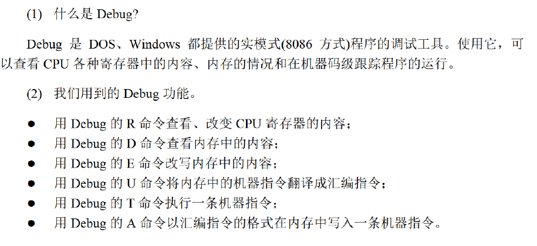
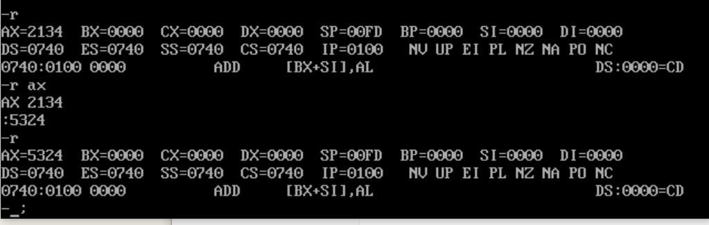
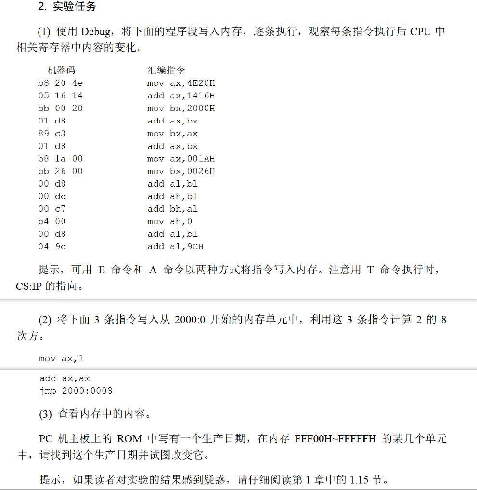
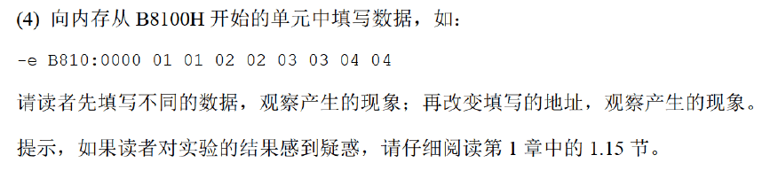
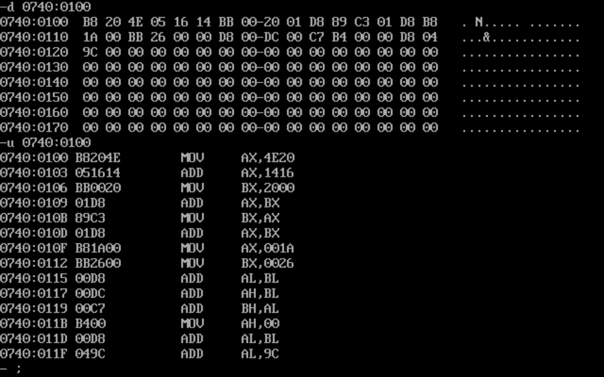
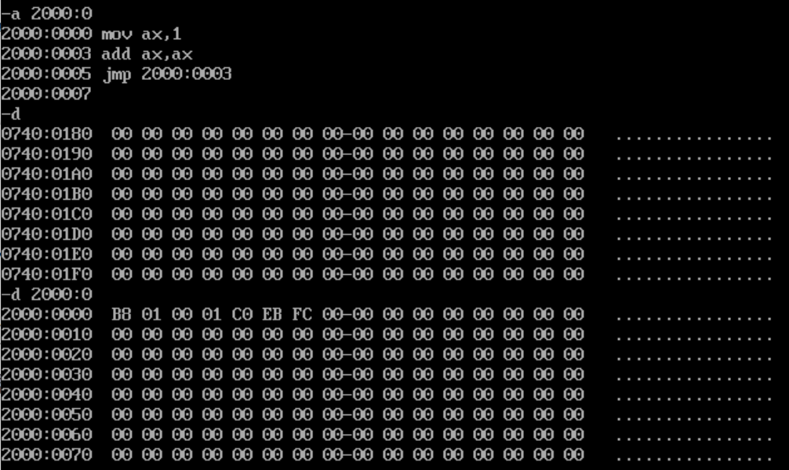
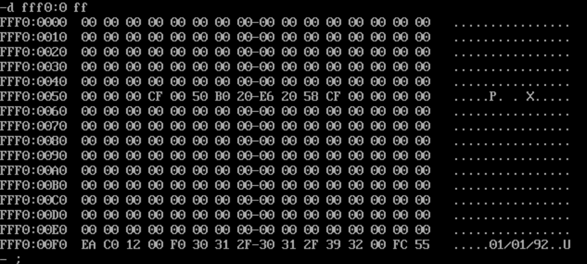
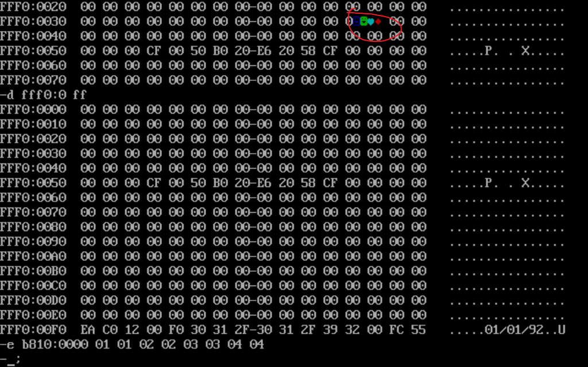

## 实验1

<!--more-->

本实验说明请在《汇编语言》第四版 P35 查看。

首先得配置DOS环境和Debug工具。

在Vscode插件中搜索MASM/TASM下载。（已配置好环境）

实验配套教程： https://blog.csdn.net/orangehap/category_8914680.html。

新建一个`test.asm`汇编文件，右键打开DOS环境。

在命令行中输入`debug`，使用debug工具。



`r`命令可以查看、改变寄存器内容。

```shell
r # 查看所有寄存器的内容
r ax # 查看指定寄存器内容并可以在:后输入要修改的数据，十六进制形式
```



`d`命令可以查看内存中的内容。

`e`命令以机器指令格式改写内存内容，`a`命令以汇编指令格式向内存内容写入一条机器指令。

实验任务：





参考答案：

（1）用`a`命令以汇编指令写入内存，**记住起始的内存地址**。

然后把命令抄进去就行，指令不区分大小写，数据最后表示十六进制的`h`不用加上。

连续回车就退出了输入模式，然后`d 起始内存地址`查看内存内容。

注意：历史命令是看不到的，不能回退！

`d 起始内存地址`将内存中的机器指令翻译成汇编指令。



`r`命令查看寄存器内容，看看`cs:ip`是否对应起始内存地址，如果不对需要修改。

用`t`命令执行当前地址的一条机器指令。

退出：`quit`命令。

（2）输入：`a 2000:0`，抄入指令。



然后输入`r 2000:0`命令，输入`t`命令一条一条执行。

`jmp`指令用于跳转地址。在这相当于循环八次，然后`ax`寄存器中存的就是2^8。

（3）输入`d fff0:0 ff`命令，查看一段内存区间的内容。DOS窗口右侧就是对应的ASCII码。

虚拟环境下的值不是真实的生产日期：



（4）按照要求填写数据，会显示笑脸符号，向显卡写入信息，没有显示可能是因为虚拟系统。

