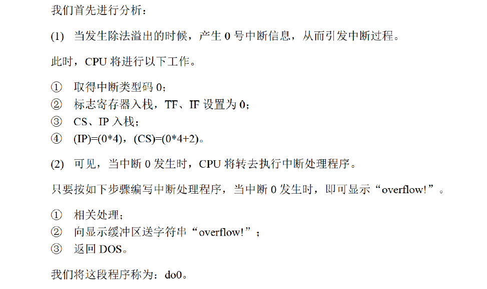
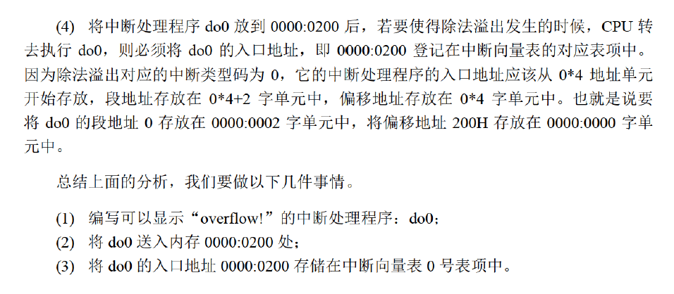
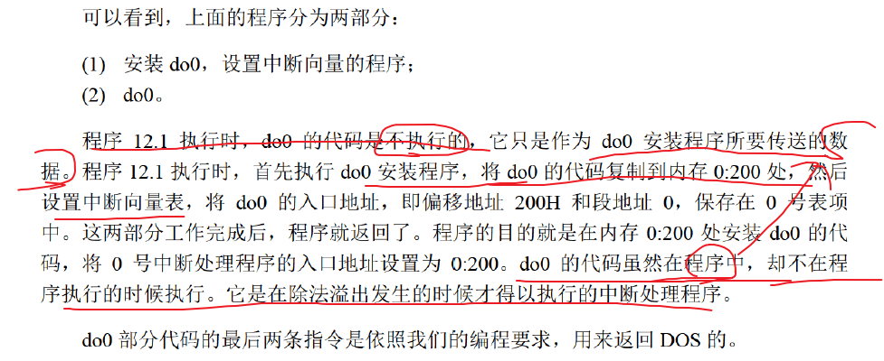
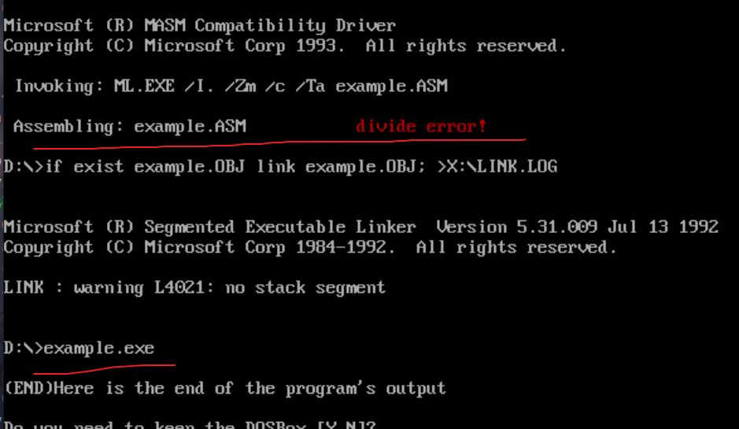

## 实验12

<!--more-->

首先得配置DOS环境和Debug工具。

在Vscode插件中搜索MASM/TASM下载。（已配置好环境）

实验配套教程： https://blog.csdn.net/orangehap/category_8914680.html。

---

参考教材：《汇编语言》第四版P240。

编程：编写0号中断处理程序do0，当发生除法溢出时，在屏幕中间显示“overflow！”，返回DOS。

```assembly
mov ax, 1000h 
mov bh, 1
div bh ;除法溢出错误
```

当CPU执行`div bh`时，产生0号中断信息，从而引发中断过程，CPU执行0号中断处理程序。

本次实验将自己实现0号中断程序的功能，在屏幕中间显示“overflow!”，然后返回DOS。



1、0000:0200至0000:02FF的256个字节的空间所对应的中断向量表项都是空的，可以将中断处理程序do0传送到内存0000:0200处。

2、中断处理程序do0放到`0000:0200`,再将其地址登记在中断向量表对应表项

- 0号表项的地址`0:0`。`0:0`字单元存放偏移地址，`0:2`字单元存放段地址
- 将do0的段地址0存放在`0000:0002`字单元中，将偏移地址200H存放在`0000:0000`字单元



```assembly
assume cs:codesg

codesg segment
    start:  ;do0 安装程序
            ;设置中断向量表
            mov ax,4c00h
            int 21h
    do0:    ;在屏幕上显示字符串“overflow!”
            mov ax,4c00h
            int 21h
codesg ends

end start
```



先来看如何安装do0？

显然串传送指令（movsb）很适合一段连续空间的复制操作。

安装程序如下：

进行串传送时需要知道循环次数，也就是do0程序的长度。

下面直接给出编译器计算do0长度的方法。

```assembly
mov ax,0
mov es,ax
mov di,200h ;设置es:di指向目标地址
mov ax,cs
mov ds,ax  ;设置ds:si指向源地址
mov si,offset do0 ;offset 拿到do0的偏移地址，do0是它的段地址
mov cx,offset do0end-offset do0 ;设置cx为do0的长度，中间的"-"是编译器识别的减号
cld
rep movsb
  xxx
do0:
  xxx
do0end: nop
```

然后开始编写do0程序：

```assembly
do0:    ;在屏幕上显示字符串“overflow!”
            jmp short do0start ;段内短转移
            db "divide error!" ;程序加载时开辟一块空间存放字符串，否则一直放在内存中可能被覆盖
    do0start:  ;将字符串从db定义的位置复制到“屏幕”上
            mov ax,0b800h
            mov es,ax   ;设置es:di指向目标地址，显存空间位置
            mov ax,cs   ;不要写成mov ax,do0，这里的do0不会运行，只作为数据，此时的段地址没用
            mov ds,ax
            mov si,202h ;设置ds:si指向源地址，字符串位置，字符串段地址和do0一样，偏移地址从200h开始，jmp short xxx占2字节
            mov di,12*160+35*2 ;运算表达式会由编译器在编译时计算出来

            mov cx,13
            mov ah,00000100b ;将白色的提示信息变成红色
            s:	mov al, ds:[si]
            mov es:[di], ax
            inc si
            add di, 2
            loop s

            mov ax,4c00h
            int 21h
    do0end: nop
```

最后设置中断向量：

```assembly
;将do0的入口地址0:200写入中断向量表的0号表项中
;0号表项，0:0字单元存放偏移地址，0:2字单元存放段地址
mov ax,0
mov es,ax
mov word ptr es:[0*4],200h
mov word ptr es:[0*4+2],0
```

完整程序：

```assembly
assume cs:codesg

codesg segment
    start:  ;do0 安装程序
            mov ax,0
            mov es,ax
            mov di,200h ;设置es:di指向目标地址
            mov ax,cs
            mov ds,ax  ;设置ds:si指向源地址
            mov si,offset do0 ;offset 拿到do0的偏移地址，do0是它的段地址
            mov cx,offset do0end - offset do0 ;设置cx为do0的长度，中间的"-"是编译器识别的减号
            cld
            rep movsb
            ;设置中断向量表
            ;将do0的入口地址0:200写入中断向量表的0号表项中
            ;0号表项，0:0字单元存放偏移地址，0:2字单元存放段地址
            mov ax,0
            mov es,ax
            mov word ptr es:[0*4],200h
            mov word ptr es:[0*4+2],0

            mov ax,1000h		;测试中断程序的样例
            mov bx,0			;故意写成溢出的样例，检测中断例程是否正确运行
            mov bl,1
            div bl

            mov ax,4c00h
            int 21h
    do0:    ;在屏幕上显示字符串“overflow!”
            jmp short do0start ;段内短转移
            db "divide error!" ;程序加载时开辟一块空间存放字符串，否则一直放在内存中可能被覆盖
    do0start:  ;将字符串从db定义的位置复制到“屏幕”上
            mov ax,0b800h
            mov es,ax   ;设置es:di指向目标地址，显存空间位置
            mov ax,cs   ;不要写成mov ax,do0，这里的do0不会运行，只作为数据，此时的段地址没用
            mov ds,ax
            mov si,202h ;设置ds:si指向源地址，字符串位置，字符串段地址和do0一样，偏移地址从200h开始，jmp short xxx占2字节
            mov di,12*160+35*2 ;运算表达式会由编译器在编译时计算出来

            mov cx,13
            mov ah,00000100b ;将白色的提示信息变成红色
            s:	mov al, ds:[si]
            mov es:[di], ax
            inc si
            add di, 2
            loop s

            mov ax,4c00h
            int 21h
    do0end: nop
codesg ends

end start
```

测试结果：



汇编语言实验系列正式完结。