## 实验5

<!--more-->

首先得配置DOS环境和Debug工具。

在Vscode插件中搜索MASM/TASM下载。（已配置好环境）

实验配套教程： https://blog.csdn.net/orangehap/category_8914680.html。

实验三和四跳过了。

---

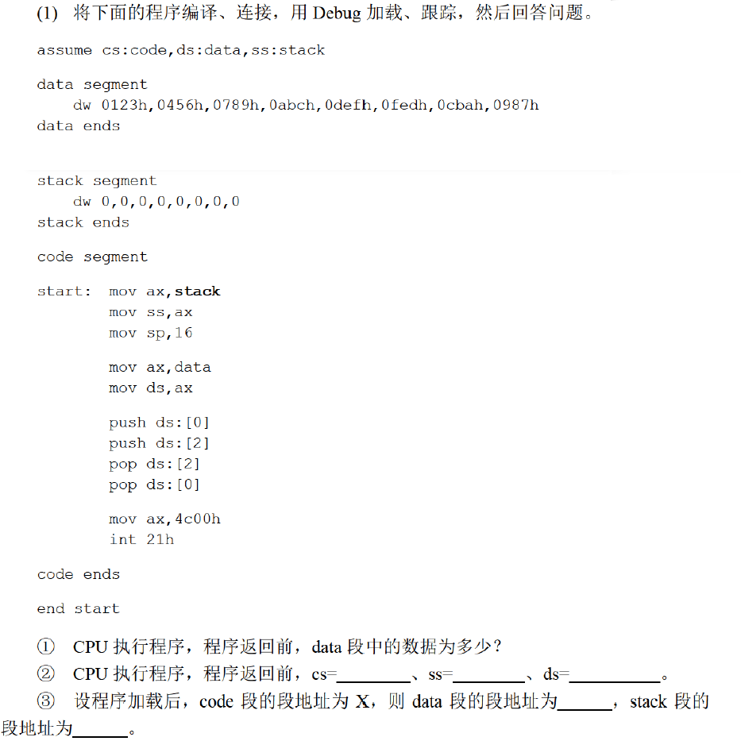

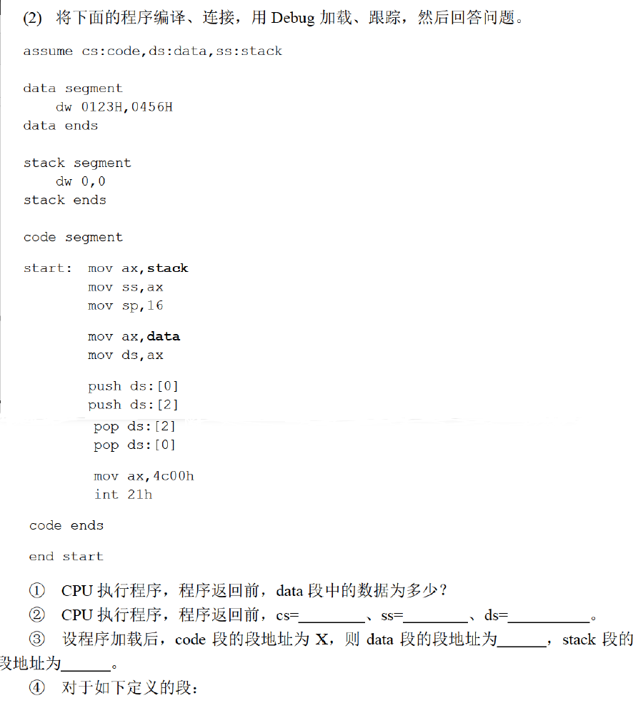

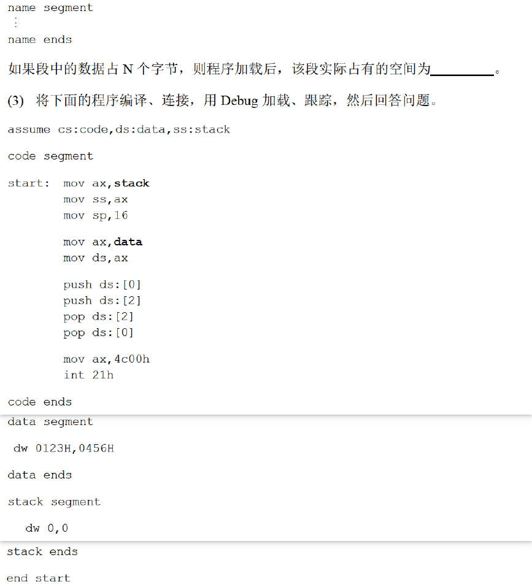

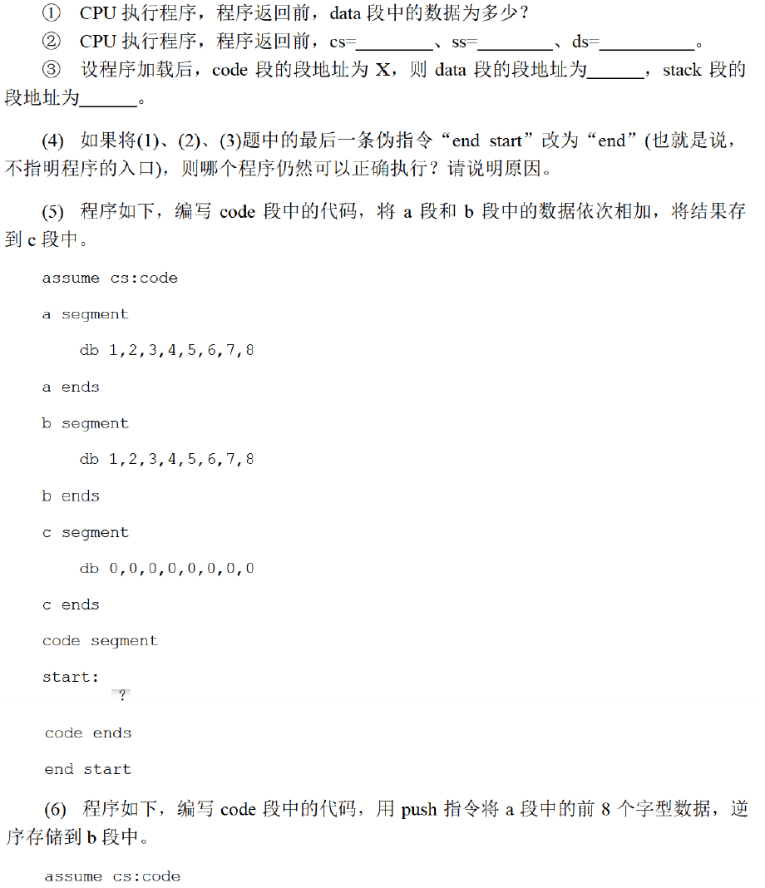

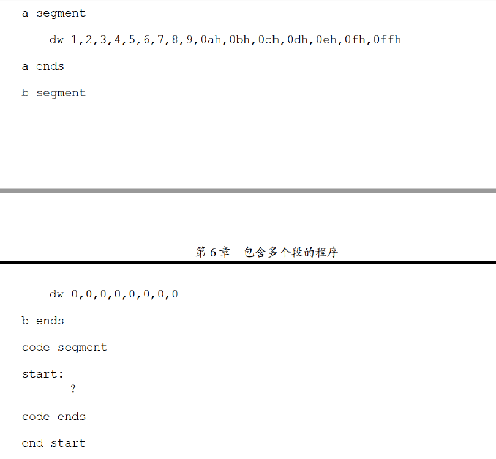

参考答案：

（1）新建 `5.asm` ，

```assembly
assume cs:code,ds:data,ss:stack

data segment
    dw 0123h,0456h,0789h,0abch,0defh,0fedh,0cbah,0987h
data ends

stack segment
    dw 0,0,0,0,0,0,0,0
stack ends
code segment

    start:  mov ax,stack
            mov ss,ax
            mov sp,16

            mov ax,data
            mov ds,ax

            push ds:[0]
            push ds:[2]
            pop ds:[2]
            pop ds:[0]

            mov ax,4c00h
            int 21h
code ends

end start
```

编译、连接后用debug加载、跟踪：

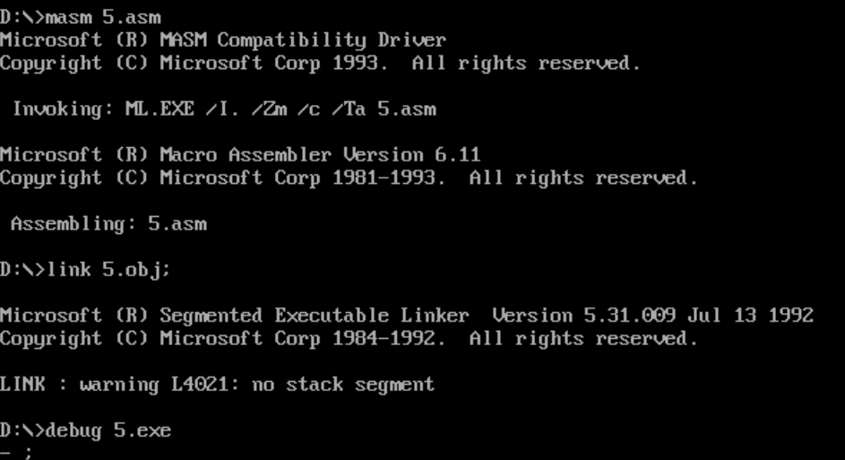

然后填空：

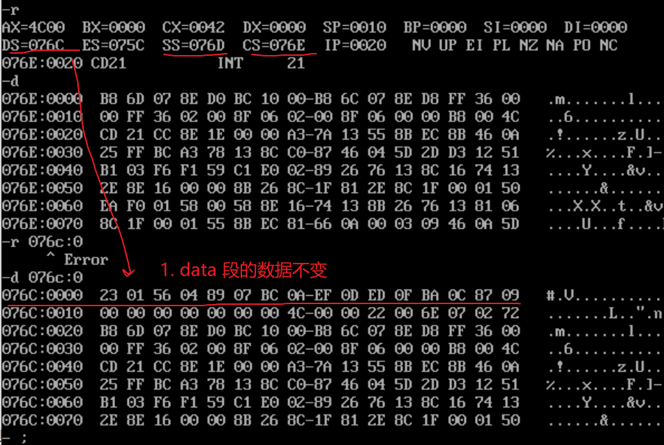

1,2问的答案都在图中。

3：若code段的段地址为x，那么data段的段地址为x-2，stack段的段地址为x-1，看上图红线。

（2）修改 `5.asm` ，

```assembly
assume cs:code,ds:data,ss:stack

data segment
    dw 0123h,0456h
data ends

stack segment
    dw 0,0
stack ends
code segment

    start:  mov ax,stack
            mov ss,ax
            mov sp,16

            mov ax,data
            mov ds,ax

            push ds:[0]
            push ds:[2]
            pop ds:[2]
            pop ds:[0]

            mov ax,4c00h
            int 21h
code ends

end start
```

操作和（1）一样：

前三问和（1）一样。

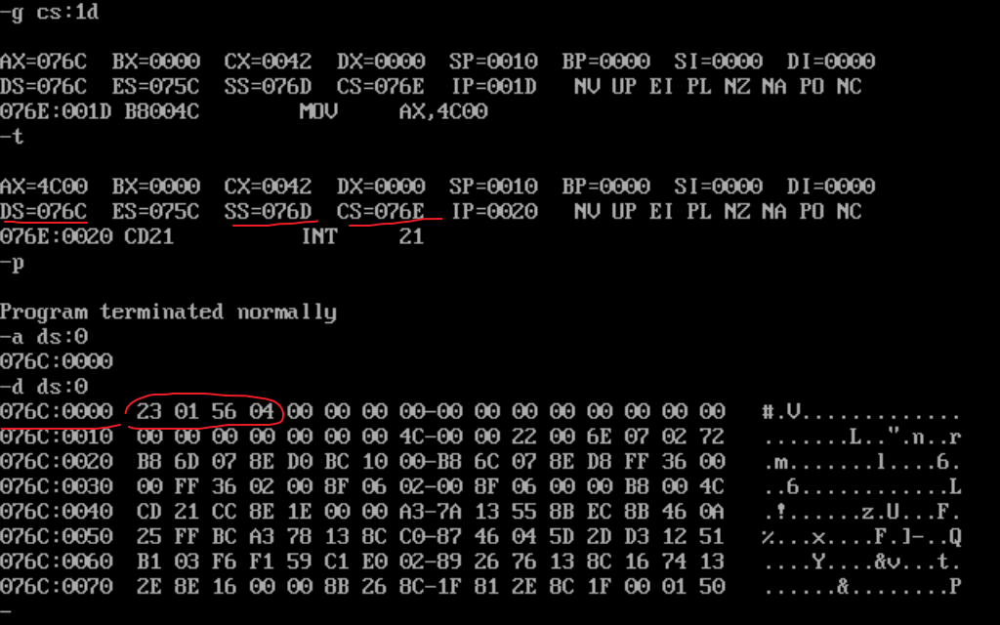

4：$\lceil \frac N {16} \rceil *16$ 字节。按照（1）和（2）的程序可以推测 <= 16 字节都会让段填满整个16字节的空间。事实也确实如此。

（3）修改 `5.asm` ，

```assembly
assume cs:code,ds:data,ss:stack

code segment

    start:  mov ax,stack
            mov ss,ax
            mov sp,16

            mov ax,data
            mov ds,ax

            push ds:[0]
            push ds:[2]
            pop ds:[2]
            pop ds:[0]

            mov ax,4c00h
            int 21h
code ends

data segment
    dw 0123h,0456h
data ends

stack segment
    dw 0,0
stack ends
end start
```

操作和（1）一样：

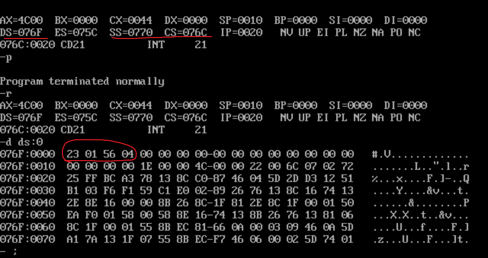

1：数据没变，2：看上图。

3：若code段的段地址为x，那么data段的段地址为x+3，stack段的段地址为x+4，看上图红线。

（4）第3个程序仍然可以正确执行，因为当exe文件被加载进内存中，首先将cs：ip指向程序的首地址，而第3个程序的程序中一开始定义的是代码段，所以cs：ip也就自然的指向了指令的首地址。第1和第2个程序的程序中一开始定义的是数据段，所以cs：ip自然指向了数据的首地址而非指令，数据段反汇编出来的是一堆杂乱的指令，所以不可执行。

（5）补充程序：

```asm
assume cs:code

a segment
    db 1,2,3,4,5,6,7,8
a ends

b segment
    db 1,2,3,4,5,6,7,8
b ends

d segment
    db 0,0,0,0,0,0,0,0
d ends

code segment

start:  mov bx,0
        mov cx,8
        mov ax,a
        mov ds,ax
        mov ax,0

s:      mov al,ds:[bx]
        add al,ds:[bx+16]
        mov ds:[bx+32],al
        inc bx
        loop s

        mov ax,4c00h
        int 21h

code ends
end start
```

出现error A2008: ression : c可能是因为“c“是关键字，不能作为段名，要改掉。

执行成功：

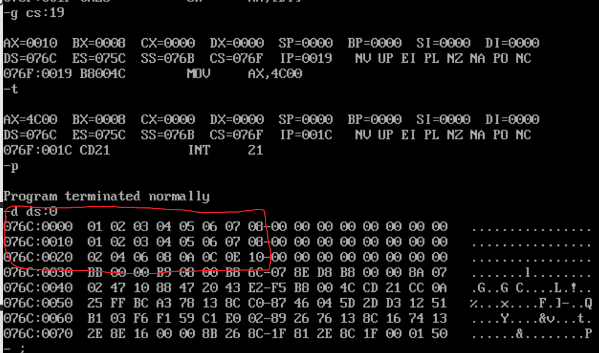

（6）补充程序：

```assembly
assume cs:code

a segment
    dw 1,2,3,4,5,6,7,8,9,0ah,0bh,0ch,0dh,0eh,0fh,0ffh
a ends

b segment
    dw 0,0,0,0,0,0,0,0
b ends

code segment

start:  mov ax,b;用push指令将a段中的前8个字型数据，逆序存储到b段中
        mov ss,ax
        mov sp,16
        mov ax,a
        mov ds,ax

        mov bx,0
        mov cx,8
s:      push ds:[bx]
        add bx,2
        loop s

        mov ax,4c00h
        int 21h

code ends
end start
```

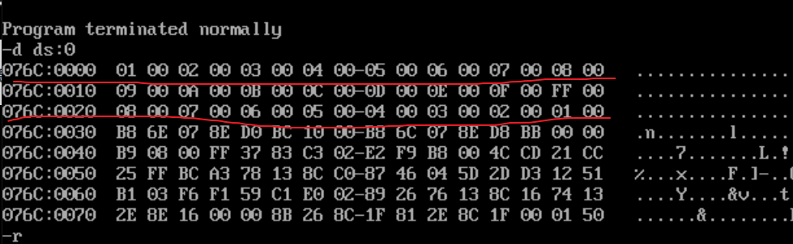

最后两题很有收获！