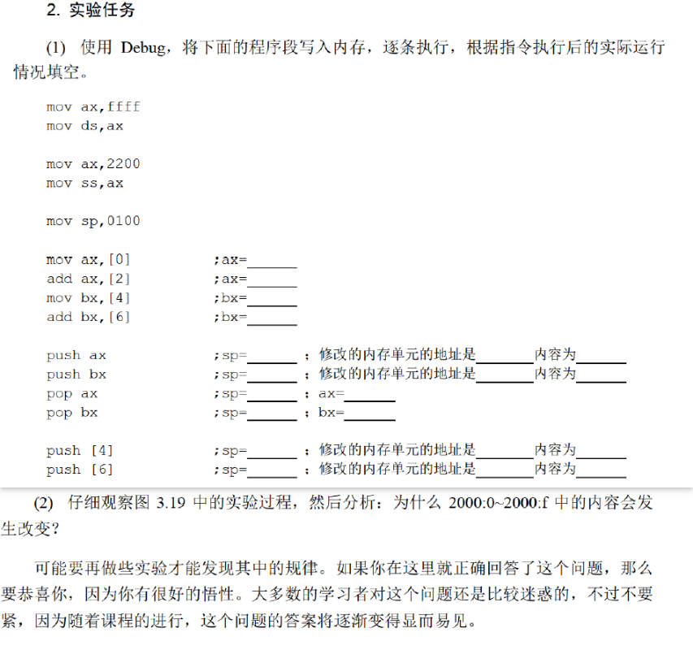
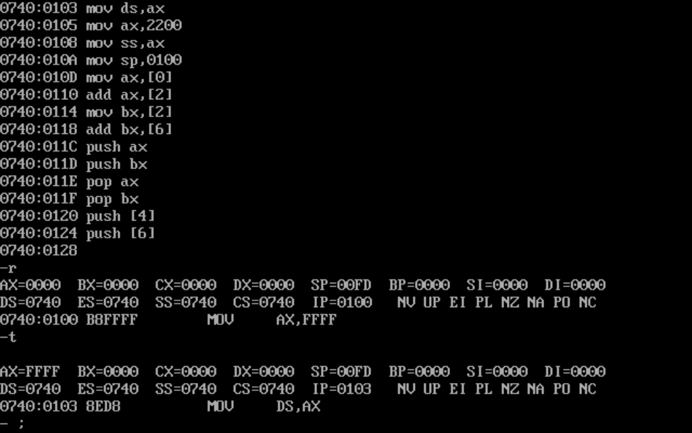
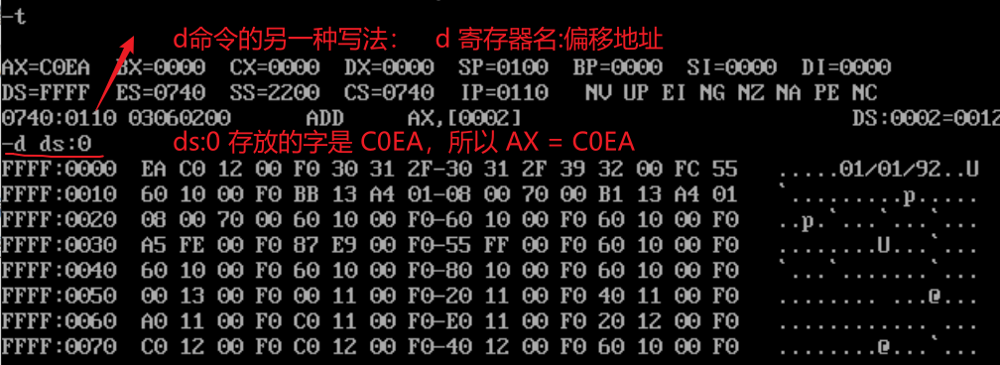
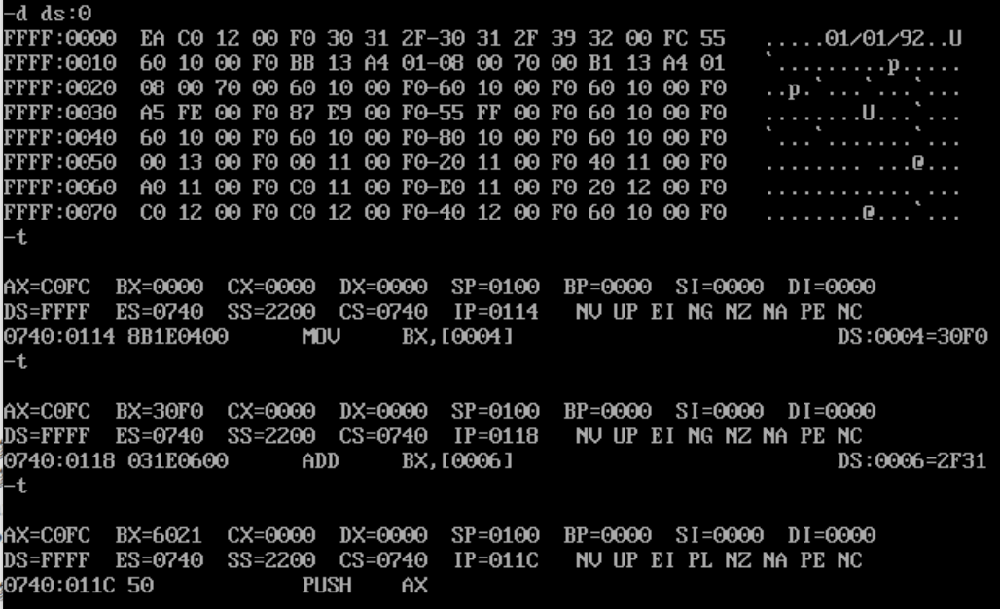
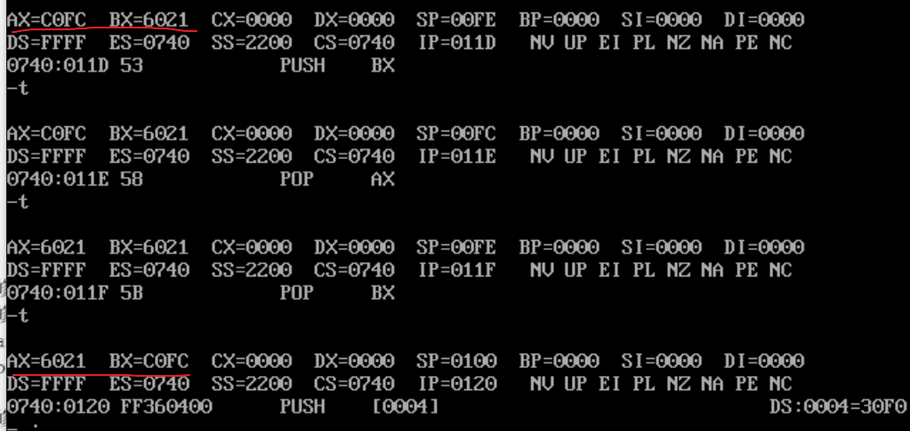
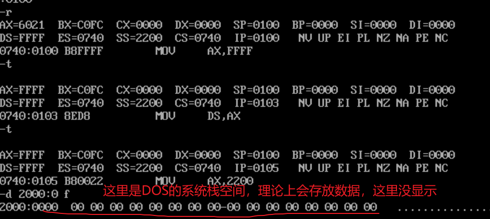

## 实验2

<!--more-->

首先得配置DOS环境和Debug工具。

在Vscode插件中搜索MASM/TASM下载。（已配置好环境）

实验配套教程： https://blog.csdn.net/orangehap/category_8914680.html。

参考答案：

（1）按照题目要求输入指令：

注意不要抄错，上图有一处错误，通过`a`命令找到地址修正。

（2）用`t`命令开始单步执行，用`r`命令观察寄存器状态。

第一处填空：

后面几空执行命令就完事了：

通过两次入栈和两次出栈操作，发现 ax 和 bx 寄存器的内容交换了。

要强调的一点：debug的`t`命令在执行修改寄存器 ss 的指令时，下一条指令也紧跟着执行。

为什么 2000:0~2000:f 的内容会发生改变？
		